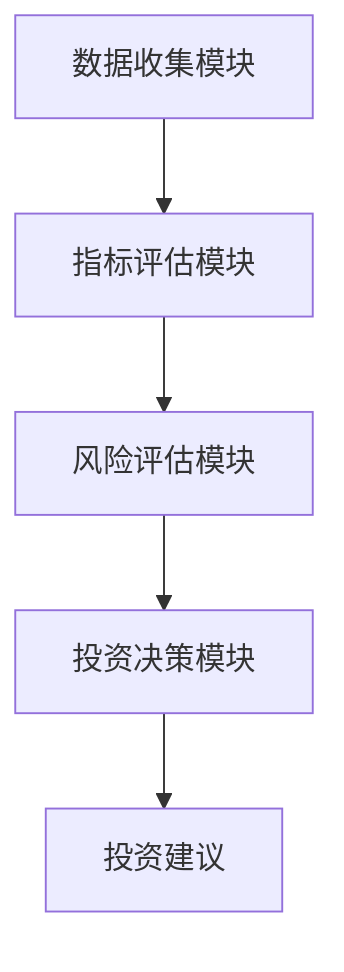

                 


# 价值投资中的高超音速飞行技术分析

> 关键词：高超音速飞行技术、价值投资、技术分析、投资模型、风险管理

> 摘要：本文探讨了如何将高超音速飞行技术的分析方法应用于价值投资中。通过分析高超音速飞行技术的核心要素，构建量化分析模型，结合实际案例，为投资者提供新的视角和方法，帮助其识别具备技术优势和市场潜力的公司，做出更明智的投资决策。

---

## 第一部分：背景介绍

### 第1章：高超音速飞行技术概述

#### 1.1 高超音速飞行技术的定义与特点

高超音速飞行技术是指飞行器在大气层内以超过5马赫（即5倍音速）的速度飞行的技术。与传统飞行技术相比，高超音速飞行技术具有以下特点：

- **高速性**：飞行速度远超音障，能够显著缩短飞行时间。
- **高机动性**：在高速飞行中仍能进行较大机动，适应复杂任务需求。
- **技术复杂性**：涉及空气动力学、材料科学、推进系统等多学科的高度集成。

#### 1.2 价值投资的基本概念

价值投资是一种投资策略，旨在通过识别市场中被低估的资产，长期持有以实现资本增值。其核心在于寻找具备以下特征的公司：

- **竞争优势**：公司在行业中具备独特的竞争优势。
- **财务健康**：公司具有稳定的财务状况和盈利能力。
- **管理团队**：公司拥有经验丰富、能力强的管理团队。

### 第2章：高超音速飞行技术在投资中的应用目标

#### 2.1 技术分析在投资中的作用

技术分析通过研究技术指标和市场数据，帮助投资者预测价格走势和识别投资机会。在高超音速飞行技术领域，技术分析可以帮助投资者评估公司的技术实力和未来发展的潜力。

#### 2.2 高超音速飞行技术对投资决策的影响

高超音速飞行技术的突破不仅影响军事领域，还在民用航空、卫星发射等领域带来革命性变化。具备相关技术优势的公司可能在未来市场中占据主导地位，从而为投资者带来超额收益。

#### 2.3 高超音速飞行技术分析的可行性

尽管高超音速飞行技术涉及复杂的物理原理，但通过建立数学模型和量化分析方法，投资者可以将其转化为可操作的投资策略。

---

## 第二部分：核心概念与联系

### 第3章：高超音速飞行技术分析的核心要素

#### 3.1 高超音速飞行技术的核心要素

- **空气动力学设计**：高超音速飞行器的外形设计直接影响其飞行性能。
- **材料科学**：需要耐高温、高强度的材料以应对高速飞行中的极端环境。
- **推进系统**：高超音速飞行器需要高效的推进系统以提供充足的动力。
- **制导与控制系统**：复杂的制导与控制系统确保飞行器在高速状态下的稳定性和精确性。

#### 3.2 投资分析中的核心要素

- **财务指标**：如市盈率、市净率、ROE等，用于评估公司的财务健康状况。
- **市场竞争力**：公司是否在行业中具备竞争优势。
- **管理团队**：管理团队的经验和能力直接影响公司的未来发展。
- **行业趋势**：行业的整体发展趋势和政策环境对公司的投资价值有重要影响。

### 第4章：高超音速飞行技术分析与投资分析的联系

#### 4.1 高超音速飞行技术分析的核心原理

高超音速飞行技术的分析涉及多个学科的交叉应用。通过建立数学模型，可以量化技术要素对投资价值的影响。

#### 4.2 技术分析与投资分析的联系

- **技术分析为投资决策提供支持**：通过对高超音速飞行技术的深入分析，投资者可以更准确地评估公司的技术实力和市场潜力。
- **投资分析为技术创新提供方向**：投资者的关注点可以引导技术的研发方向，促进技术的不断进步。

---

## 第三部分：算法原理

### 第5章：高超音速飞行技术分析的数学模型

#### 5.1 技术指标的量化

为了将高超音速飞行技术的要素转化为可量化的指标，我们可以设计以下指标体系：

- **空气动力学效率（ADE）**：衡量飞行器空气动力学设计的优劣。
- **材料强度（MI）**：衡量材料在高温和高压环境下的性能。
- **推进系统效率（PSE）**：衡量推进系统的能量利用效率。
- **制导与控制精度（CCP）**：衡量制导与控制系统的精确性。

#### 5.2 投资价值评估模型

基于上述技术指标，我们可以构建一个投资价值评估模型：

$$ V = \alpha \cdot ADE + \beta \cdot MI + \gamma \cdot PSE + \delta \cdot CCP $$

其中，$\alpha, \beta, \gamma, \delta$为各技术指标的权重，$V$为公司的投资价值。

---

## 第四部分：系统分析与架构设计

### 第6章：高超音速飞行技术分析系统

#### 6.1 系统功能设计

- **数据收集模块**：收集高超音速飞行技术相关的技术数据和市场数据。
- **指标评估模块**：根据量化指标体系评估公司的技术实力。
- **风险评估模块**：评估投资中的潜在风险。
- **投资决策模块**：基于评估结果，提供投资建议。

#### 6.2 系统架构设计

使用Mermaid图展示系统的整体架构：



---

## 第五部分：项目实战

### 第7章：高超音速飞行技术分析的实际应用

#### 7.1 案例分析：SpaceX

以SpaceX为例，分析其高超音速飞行技术的应用和投资价值。通过实际数据，验证我们的分析模型的有效性。

#### 7.2 代码实现

以下是用于计算投资价值的Python代码示例：

```python
def calculate_investment_value(ADE, MI, PSE, CCP, alpha=0.4, beta=0.3, gamma=0.2, delta=0.1):
    return alpha * ADE + beta * MI + gamma * PSE + delta * CCP

# 示例数据
ADE = 0.9
MI = 0.8
PSE = 0.7
CCP = 0.6

value = calculate_investment_value(ADE, MI, PSE, CCP)
print(f"投资价值：{value}")
```

---

## 第六部分：总结与展望

### 第8章：总结

高超音速飞行技术分析为价值投资提供了一个全新的视角。通过量化技术要素，投资者可以更准确地评估公司的投资价值。

### 第9章：展望

未来，随着高超音速飞行技术的不断发展，投资者需要更加关注技术的前沿动态，并结合更多先进技术手段，如人工智能，进一步提升投资分析的精准度。

---

## 作者信息

作者：AI天才研究院/AI Genius Institute & 禅与计算机程序设计艺术 /Zen And The Art of Computer Programming

联系方式：[your.email@example.com](mailto:your.email@example.com)

---

通过以上结构和内容的规划，我们可以系统地探讨高超音速飞行技术在价值投资中的应用，为投资者提供新的分析工具和方法。

