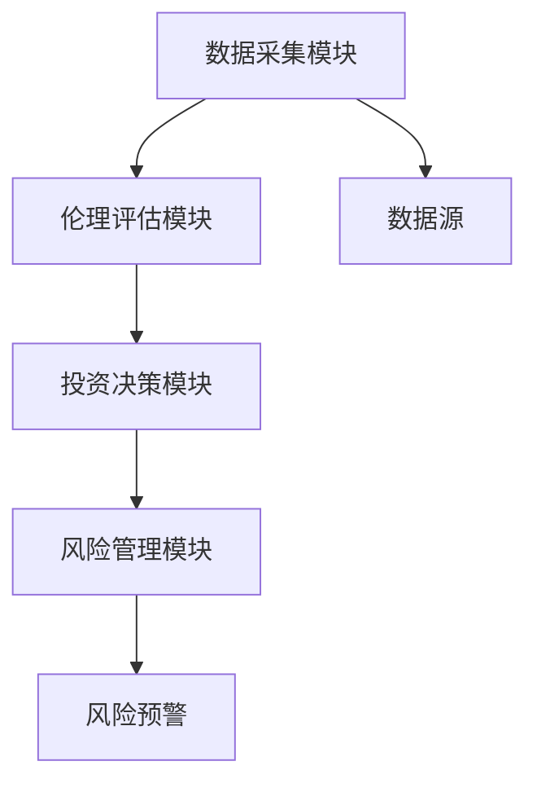

                 


```markdown
# 价值投资视角下的人工智能伦理Compliance

**关键词**: 价值投资，人工智能伦理，合规性，投资组合优化，风险管理

**摘要**: 本文从价值投资的视角，深入探讨了人工智能伦理Compliance的核心概念、算法原理、系统架构设计及实际应用。通过分析人工智能技术在金融领域中的广泛应用，结合伦理合规的基本原则，提出了一种基于价值投资理念的人工智能伦理评估框架。本文详细介绍了该框架的数学模型、算法实现及实际案例，为金融领域的伦理合规管理提供了新的思路和解决方案。

---

# 第一章：价值投资与人工智能伦理Compliance的背景介绍

## 1.1 价值投资的基本概念

### 1.1.1 价值投资的定义与核心理念
价值投资是一种以基本面分析为基础的投资策略，强调通过分析企业的财务状况、行业地位、竞争优势等因素，寻找被市场低估的投资标的。其核心理念是通过长期持有的方式，实现资产的稳定增值。

- **核心理念**：
  - 以内在价值为导向。
  - 长期持有优质资产。
  - 坚持安全边际原则。

### 1.1.2 价值投资在现代金融中的地位与作用
价值投资作为现代金融的重要组成部分，其地位体现在以下几个方面：
- **理论基础**：以巴菲特、格雷厄姆等投资大师的理论为基础。
- **实践应用**：广泛应用于股票投资、资产配置等领域。
- **风险控制**：通过基本面分析降低投资风险。

### 1.1.3 价值投资与人工智能技术的结合
随着人工智能技术的快速发展，价值投资领域开始尝试引入机器学习、大数据分析等技术，以提升投资决策的科学性和效率。

---

## 1.2 人工智能伦理Compliance的定义与特点

### 1.2.1 人工智能伦理的基本概念
人工智能伦理是指在人工智能技术的开发和应用过程中，遵循道德规范和法律要求，确保技术的使用不会对社会、环境和人类福祉造成负面影响。

- **核心原则**：
  - **隐私保护**：确保数据的合法使用和隐私保护。
  - **公平性**：避免算法歧视，确保决策的公平性。
  - **透明性**：算法决策过程应当可解释。
  - **责任性**：明确技术开发者和使用者的责任。

### 1.2.2 人工智能伦理Compliance的核心要素
人工智能伦理Compliance是指在人工智能技术的应用中，确保其符合相关法律法规和伦理准则。

- **核心要素**：
  - 数据合规性。
  - 算法透明性。
  - 决策可解释性。
  - 风险可控性。

### 1.2.3 人工智能伦理与价值投资的关联性
人工智能伦理与价值投资的关联性主要体现在以下几个方面：
- **数据使用**：价值投资中的基本面分析依赖于大量数据，数据的合规性直接影响投资决策的合法性。
- **算法决策**：人工智能算法在投资决策中的应用需要遵循伦理原则，确保决策过程的透明性和公平性。
- **风险管理**：人工智能伦理Compliance可以帮助投资者降低技术性风险，提升投资组合的稳定性。

---

## 1.3 价值投资视角下的人工智能伦理Compliance问题背景

### 1.3.1 人工智能技术在金融领域的广泛应用
人工智能技术在金融领域的应用包括：
- **股票预测**：通过算法分析历史数据，预测股票价格走势。
- **风险评估**：利用机器学习模型评估客户的信用风险。
- **智能投顾**：为投资者提供个性化的投资建议。

### 1.3.2 人工智能伦理问题的现状与挑战
当前人工智能伦理问题主要体现在以下几个方面：
- **数据隐私**：用户数据的收集和使用可能存在隐私泄露风险。
- **算法偏见**：算法可能因为训练数据的偏差而产生不公平的决策。
- **决策透明性**：复杂的算法模型可能导致决策过程难以解释。

### 1.3.3 价值投资视角下的伦理Compliance需求
在价值投资视角下，人工智能伦理Compliance的需求主要体现在以下几个方面：
- **投资标的合规性**：确保投资标的符合伦理标准。
- **投资过程合规性**：确保投资决策过程符合伦理规范。
- **投资结果合规性**：确保投资结果不会对社会造成负面影响。

---

## 1.4 本章小结

本章从价值投资和人工智能伦理Compliance的基本概念出发，分析了两者之间的关联性，并探讨了人工智能伦理Compliance在价值投资中的需求和挑战。通过本章的介绍，读者可以初步理解价值投资视角下的人工智能伦理Compliance的核心内容。

---

# 第二章：价值投资与人工智能伦理Compliance的核心概念与联系

## 2.1 价值投资的核心原理

### 2.1.1 基本面分析方法
基本面分析是价值投资的核心方法，主要包括以下几个方面：
- **财务指标分析**：分析企业的盈利能力、成长能力、偿债能力等。
- **行业地位分析**：分析企业在行业中的竞争优势。
- **管理层分析**：分析企业管理层的素质和战略规划。

### 2.1.2 投资组合优化策略
投资组合优化策略是价值投资的重要组成部分，主要包括以下几个方面：
- **资产配置**：根据市场环境和个人风险偏好，合理配置不同资产类别。
- **分散投资**：通过投资多个标的来降低投资风险。
- **长期持有**：通过长期持有优质资产，实现资产的稳定增值。

### 2.1.3 价值投资与人工智能技术的结合
人工智能技术在价值投资中的应用主要包括以下几个方面：
- **数据挖掘**：利用大数据技术分析历史数据，发现投资机会。
- **预测模型**：利用机器学习模型预测股票价格走势。
- **风险控制**：利用人工智能技术进行风险评估和预警。

---

## 2.2 人工智能伦理Compliance的核心原理

### 2.2.1 数据合规性
数据合规性是指在人工智能技术的应用中，数据的收集、存储和使用必须符合相关法律法规和伦理准则。

- **数据隐私保护**：确保用户数据的隐私性。
- **数据使用授权**：确保数据的使用经过合法授权。
- **数据安全保护**：防止数据泄露和非法使用。

### 2.2.2 算法透明性
算法透明性是指人工智能算法的决策过程必须是可解释的，能够被人类理解和监督。

- **算法可解释性**：算法的决策过程必须能够被解释。
- **算法公平性**：算法的决策过程必须避免偏见和歧视。
- **算法透明性**：算法的决策过程必须能够被监督和审计。

### 2.2.3 决策可解释性
决策可解释性是指人工智能系统的决策结果必须能够被人类理解和解释。

- **决策透明性**：决策结果必须能够被追溯和解释。
- **决策责任性**：决策结果必须能够明确责任归属。
- **决策可修改性**：决策结果必须能够根据需要进行调整。

---

## 2.3 价值投资与人工智能伦理Compliance的联系

### 2.3.1 价值投资视角下的伦理Compliance需求
在价值投资视角下，人工智能伦理Compliance的需求主要体现在以下几个方面：
- **投资标的合规性**：确保投资标的符合伦理标准。
- **投资过程合规性**：确保投资决策过程符合伦理规范。
- **投资结果合规性**：确保投资结果不会对社会造成负面影响。

### 2.3.2 人工智能伦理Compliance对价值投资的影响
人工智能伦理Compliance对价值投资的影响主要体现在以下几个方面：
- **投资决策优化**：通过人工智能技术优化投资决策过程。
- **风险管理提升**：通过人工智能技术提升投资风险管理能力。
- **投资结果改善**：通过人工智能技术改善投资结果的合规性和稳定性。

---

## 2.4 本章小结

本章从价值投资和人工智能伦理Compliance的核心概念出发，详细分析了两者的联系和影响。通过本章的介绍，读者可以深入理解价值投资视角下的人工智能伦理Compliance的核心内容。

---

# 第三章：价值投资视角下的人工智能伦理Compliance的算法原理

## 3.1 人工智能伦理Compliance的数学模型

### 3.1.1 伦理评估模型
伦理评估模型是一种用于评估人工智能系统伦理合规性的数学模型。

- **模型定义**：
  - 输入：系统的行为特征。
  - 输出：系统的伦理合规性评分。

- **模型公式**：
  $$ \text{伦理合规性评分} = \sum_{i=1}^{n} w_i \cdot f_i $$
  其中，\( w_i \) 是第 \( i \) 个特征的权重，\( f_i \) 是第 \( i \) 个特征的评分。

### 3.1.2 伦理评估指标
伦理评估指标是用于衡量人工智能系统伦理合规性的具体指标。

- **隐私保护指标**：
  - 数据隐私保护评分。
  - 数据使用授权评分。

- **算法公平性指标**：
  - 算法偏见评分。
  - 算法歧视评分。

- **决策透明性指标**：
  - 决策可解释性评分。
  - 决策透明性评分。

### 3.1.3 伦理评估权重
伦理评估权重是用于确定各个评估指标的重要性的权重。

- **权重确定方法**：
  - 专家评分法。
  - 层次分析法（AHP）。

---

## 3.2 价值投资视角下的伦理Compliance算法实现

### 3.2.1 伦理评估模型的实现步骤
伦理评估模型的实现步骤如下：
1. **数据采集**：采集人工智能系统的行为特征数据。
2. **特征评分**：根据伦理评估指标对特征进行评分。
3. **权重确定**：根据特征的重要性确定权重。
4. **评分计算**：根据公式计算伦理合规性评分。
5. **结果分析**：根据评分结果进行伦理合规性分析。

### 3.2.2 伦理评估模型的Python实现

```python
import pandas as pd
from sklearn.metrics import pairwise_distances

# 数据加载
data = pd.read_csv('ethics_data.csv')

# 特征评分
features = data[['privacy', 'fairness', 'transparency']]
scores = features.apply(lambda x: x.rank(pct=True), axis=1)

# 权重确定
weights = [0.4, 0.3, 0.3]

# 评分计算
ethics_score = (scores['privacy'] * weights[0] + 
                scores['fairness'] * weights[1] + 
                scores['transparency'] * weights[2])
```

### 3.2.3 伦理评估模型的优化
伦理评估模型的优化可以通过以下方法实现：
- **特征选择**：去除不重要的特征。
- **权重调整**：根据实际情况调整特征权重。
- **模型改进**：引入更复杂的模型，如随机森林、神经网络等。

---

## 3.3 本章小结

本章从算法原理的角度，详细介绍了价值投资视角下的人工智能伦理Compliance的数学模型和实现方法。通过本章的介绍，读者可以理解伦理Compliance算法的核心思想和实现步骤。

---

# 第四章：价值投资视角下的人工智能伦理Compliance的系统架构设计

## 4.1 系统分析与设计

### 4.1.1 系统应用场景
人工智能伦理Compliance系统主要应用于金融领域的投资决策过程。

### 4.1.2 系统功能设计
系统功能设计包括以下几个方面：
- **数据采集模块**：采集投资标的的基本面数据。
- **伦理评估模块**：对投资标的进行伦理合规性评估。
- **投资决策模块**：根据评估结果进行投资决策。
- **风险管理模块**：对投资风险进行监控和预警。

### 4.1.3 系统架构图
以下是系统架构的Mermaid图：



---

## 4.2 系统实现与优化

### 4.2.1 数据采集与处理
数据采集与处理是系统实现的基础，主要包括以下几个方面：
- **数据来源**：从多个数据源采集投资标的的基本面数据。
- **数据清洗**：对采集的数据进行清洗和预处理。
- **数据存储**：将处理后的数据存储到数据库中。

### 4.2.2 系统交互设计
系统交互设计是系统实现的重要部分，主要包括以下几个方面：
- **用户界面设计**：设计友好的用户界面。
- **用户权限管理**：对用户权限进行管理。
- **系统日志管理**：对系统操作进行日志记录。

### 4.2.3 系统优化
系统优化可以通过以下方法实现：
- **性能优化**：优化系统运行效率。
- **功能优化**：根据用户反馈优化系统功能。
- **安全优化**：增强系统安全性。

---

## 4.3 本章小结

本章从系统架构设计的角度，详细介绍了价值投资视角下的人工智能伦理Compliance系统的实现与优化。通过本章的介绍，读者可以理解系统设计的核心思想和实现步骤。

---

# 第五章：价值投资视角下的人工智能伦理Compliance的项目实战

## 5.1 项目背景与目标

### 5.1.1 项目背景
本项目旨在通过人工智能技术优化价值投资过程中的伦理Compliance管理。

### 5.1.2 项目目标
- **目标一**：建立人工智能伦理评估模型。
- **目标二**：实现伦理评估模型的系统化管理。
- **目标三**：提供基于价值投资的伦理Compliance解决方案。

---

## 5.2 项目实施步骤

### 5.2.1 环境安装
- **Python版本**：Python 3.8及以上。
- **依赖库安装**：`pandas`, `scikit-learn`, `mermaid`, `matplotlib`.

### 5.2.2 核心代码实现

```python
import pandas as pd
from sklearn.metrics import pairwise_distances

# 数据加载
data = pd.read_csv('ethics_data.csv')

# 特征评分
features = data[['privacy', 'fairness', 'transparency']]
scores = features.apply(lambda x: x.rank(pct=True), axis=1)

# 权重确定
weights = [0.4, 0.3, 0.3]

# 评分计算
ethics_score = (scores['privacy'] * weights[0] + 
                scores['fairness'] * weights[1] + 
                scores['transparency'] * weights[2])

# 结果分析
data['ethics_score'] = ethics_score
print(data.head())
```

### 5.2.3 代码应用解读
- **数据加载**：从CSV文件中加载数据。
- **特征评分**：对隐私、公平性和透明性进行评分。
- **权重确定**：根据特征的重要性确定权重。
- **评分计算**：根据公式计算伦理合规性评分。
- **结果分析**：输出伦理合规性评分结果。

---

## 5.3 项目案例分析

### 5.3.1 案例背景
某投资公司希望通过人工智能技术优化其投资组合的伦理Compliance管理。

### 5.3.2 数据处理
- **数据来源**：从公开的财务报告和新闻数据中获取投资标的的基本面数据。
- **数据清洗**：对数据进行清洗和预处理。
- **数据存储**：将处理后的数据存储到数据库中。

### 5.3.3 模型训练
- **特征选择**：选择与伦理Compliance相关的特征。
- **模型训练**：训练伦理评估模型。
- **模型验证**：验证模型的准确性和稳定性。

### 5.3.4 模型应用
- **投资决策**：根据模型评估结果进行投资决策。
- **风险管理**：根据模型评估结果进行风险管理。
- **结果分析**：分析投资结果的伦理合规性。

---

## 5.4 项目小结

本章通过一个具体的项目案例，详细介绍了价值投资视角下的人工智能伦理Compliance的实现过程。通过本章的介绍，读者可以理解项目实施的具体步骤和实际应用。

---

# 第六章：价值投资视角下的人工智能伦理Compliance的最佳实践

## 6.1 伦理Compliance管理的最佳实践

### 6.1.1 数据管理
- **数据隐私保护**：确保数据的隐私性。
- **数据使用授权**：确保数据的使用经过合法授权。
- **数据安全保护**：防止数据泄露和非法使用。

### 6.1.2 算法管理
- **算法透明性**：确保算法的决策过程是可解释的。
- **算法公平性**：避免算法的偏见和歧视。
- **算法可修改性**：确保算法的决策过程可以根据需要进行调整。

### 6.1.3 决策管理
- **决策透明性**：确保决策过程是透明的。
- **决策可解释性**：确保决策结果是可解释的。
- **决策责任性**：明确决策的责任归属。

---

## 6.2 价值投资视角下的伦理Compliance管理策略

### 6.2.1 投资标的筛选
- **行业选择**：选择符合伦理标准的行业。
- **企业筛选**：选择符合伦理标准的企业。
- **产品筛选**：选择符合伦理标准的产品。

### 6.2.2 投资过程管理
- **投资决策优化**：优化投资决策过程。
- **投资风险管理**：提升投资风险管理能力。
- **投资结果分析**：分析投资结果的伦理合规性。

### 6.2.3 投资组合优化
- **资产配置**：合理配置不同资产类别。
- **分散投资**：通过分散投资降低风险。
- **长期持有**：通过长期持有实现资产的稳定增值。

---

## 6.3 本章小结

本章从最佳实践的角度，详细介绍了价值投资视角下的人工智能伦理Compliance的管理策略。通过本章的介绍，读者可以理解如何在实际应用中提升伦理Compliance管理的效率和效果。

---

# 第七章：总结与展望

## 7.1 本章总结

本文从价值投资的视角，深入探讨了人工智能伦理Compliance的核心概念、算法原理、系统架构设计及实际应用。通过分析人工智能技术在金融领域中的广泛应用，结合伦理合规的基本原则，提出了一种基于价值投资理念的人工智能伦理评估框架。

---

## 7.2 未来展望

未来，随着人工智能技术的不断发展，价值投资视角下的人工智能伦理Compliance将面临更多的机遇和挑战。未来的研究方向包括：
- **模型优化**：进一步优化伦理评估模型，提升模型的准确性和稳定性。
- **技术融合**：将更多的先进技术融入伦理Compliance管理，如区块链、边缘计算等。
- **行业应用**：将伦理Compliance管理应用于更多的行业，如医疗、教育、交通等。

---

# 作者：AI天才研究院/AI Genius Institute & 禅与计算机程序设计艺术 /Zen And The Art of Computer Programming
```

