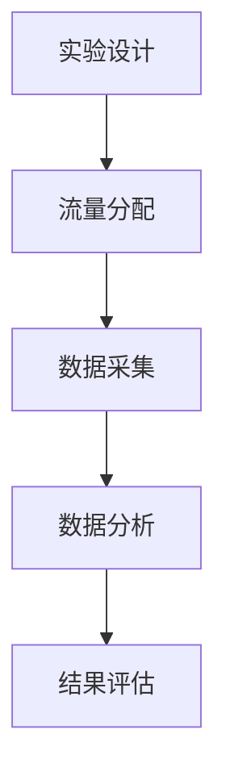
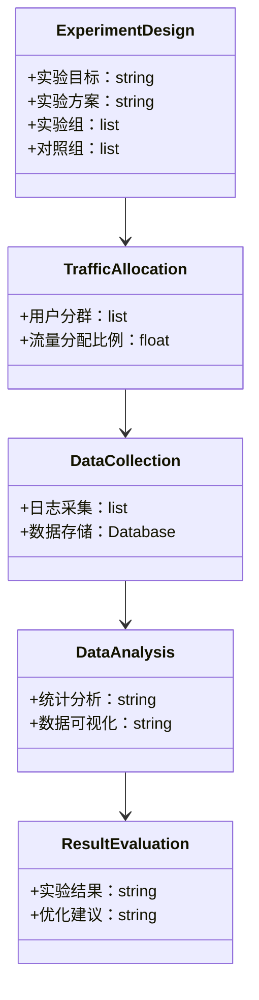
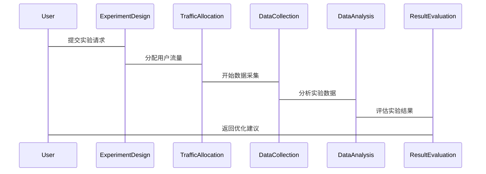

                 


# 企业AI Agent的A/B测试功能：持续优化用户体验

> 关键词：企业AI Agent，A/B测试，用户体验优化，算法原理，系统架构，数学模型

> 摘要：本文详细探讨了企业AI Agent中A/B测试功能的设计与实现，从核心概念、算法原理到系统架构，再到项目实战，系统性地分析了如何通过A/B测试持续优化用户体验。文章结合了理论与实践，深入解读了A/B测试在企业AI Agent中的重要作用，并通过具体案例分析和代码实现，展示了如何在实际项目中应用这些技术。

---

# 第1章: 企业AI Agent与A/B测试概述

## 1.1 企业AI Agent的基本概念

### 1.1.1 什么是企业AI Agent
企业AI Agent是一种智能化的软件实体，能够理解、推理和执行任务，帮助企业在复杂环境中实现自动化决策和优化。

### 1.1.2 AI Agent的核心功能与特点
- **智能化**：基于机器学习和自然语言处理技术，具备自主决策能力。
- **实时性**：能够快速响应用户需求，提供实时反馈。
- **可扩展性**：支持多种场景和业务流程的扩展。
- **数据驱动**：通过数据驱动优化决策和用户体验。

### 1.1.3 企业AI Agent的应用场景
- 客户服务自动化
- 业务流程优化
- 智能推荐系统
- 个性化用户体验设计

## 1.2 A/B测试的基本概念

### 1.2.1 什么是A/B测试
A/B测试是一种通过对比两个或多个版本（A和B）来评估不同策略或设计对用户行为的影响的实验方法。

### 1.2.2 A/B测试的核心原理
- **实验设计**：通过随机分配用户到不同的实验组，观察不同策略对用户行为的影响。
- **流量分配**：按照一定比例将用户分配到实验组和对照组，确保实验结果的有效性。
- **统计分析**：通过统计方法分析实验结果，判断不同策略之间的差异是否具有显著性。

### 1.2.3 A/B测试在企业中的应用价值
- **优化用户体验**：通过实验找到最优的用户交互设计。
- **提升业务指标**：通过实验优化关键业务指标（如转化率、点击率等）。
- **降低决策风险**：通过实验验证新功能或策略的实际效果，降低决策失误的风险。

## 1.3 企业AI Agent与A/B测试的结合

### 1.3.1 为什么需要在AI Agent中引入A/B测试
- **动态优化**：AI Agent需要根据实时数据和用户反馈动态调整策略，A/B测试提供了实验的方法。
- **个性化推荐**：通过A/B测试可以优化个性化推荐策略，提升用户体验。
- **功能迭代**：A/B测试可以帮助企业快速迭代AI Agent的功能，降低试错成本。

### 1.3.2 A/B测试在AI Agent优化中的作用
- **实验设计**：通过A/B测试设计不同的实验方案，比较不同策略对用户体验的影响。
- **数据驱动优化**：通过实验数据驱动AI Agent的优化，提升其性能和用户体验。
- **持续改进**：通过持续的A/B测试，不断优化AI Agent的功能和性能。

### 1.3.3 企业AI Agent的A/B测试功能框架
- **实验设计模块**：负责设计和管理实验方案。
- **流量分配模块**：负责将用户分配到不同的实验组。
- **数据采集与分析模块**：负责采集实验数据并进行分析。
- **结果评估模块**：负责评估实验结果并提供优化建议。

---

# 第2章: A/B测试的核心概念与原理

## 2.1 A/B测试的实验设计

### 2.1.1 实验目标的确定
- **明确实验目标**：确保实验设计围绕明确的目标展开。
- **用户分群**：根据用户特征（如行为、属性等）进行分群，确保实验结果的有效性。
- **实验组与对照组设计**：设计合理的实验组和对照组，确保实验的可比性。

### 2.1.2 实验变量的控制
- **自变量**：实验中需要改变的变量（如页面设计、推荐策略等）。
- **因变量**：实验中需要测量的变量（如点击率、转化率等）。
- **控制变量**：保持不变的变量，确保实验结果的准确性。

### 2.1.3 实验方案的设计
- **单变量实验**：只改变一个变量，保持其他变量不变。
- **多变量实验**：同时改变多个变量，观察其组合效果。
- **个性化实验**：根据用户特征动态调整实验方案。

## 2.2 A/B测试的流量分配策略

### 2.2.1 均匀分配策略
- **随机分配**：将用户随机分配到实验组和对照组，确保各组用户特征的均衡性。
- **比例分配**：根据实验目标和资源分配需求，设定实验组和对照组的比例。

### 2.2.2 动态分配策略
- **动态平衡**：根据实验进展实时调整流量分配比例，确保实验结果的显著性。
- **反馈机制**：根据实验数据动态调整分配策略，优化实验效果。

### 2.2.3 个性化分配策略
- **用户特征驱动**：根据用户的特征（如地理位置、行为习惯等）动态分配实验组。
- **实时调整**：根据用户实时行为动态调整流量分配，提升实验效果。

## 2.3 A/B测试的统计方法

### 2.3.1 统计显著性检验
- **t检验**：用于比较两组数据的均值差异是否显著。
- **卡方检验**：用于比较分类变量的分布差异是否显著。

### 2.3.2 置信区间与置信水平
- **置信区间**：估计参数的范围，表示在一定置信水平下，参数的真实值可能落在的区间。
- **置信水平**：表示置信区间的可信程度，常用的置信水平有95%和99%。

### 2.3.3 实验结果的解读
- **显著性判断**：根据p值判断实验结果是否具有显著性。
- **效果分析**：分析实验组和对照组的效果差异，评估实验的收益。

---

# 第3章: 企业AI Agent的A/B测试功能实现

## 3.1 企业AI Agent的A/B测试功能结构

### 3.1.1 功能模块划分
- **实验设计模块**：负责实验方案的设计和管理。
- **流量分配模块**：负责用户的流量分配。
- **数据采集模块**：负责实验数据的采集和存储。
- **数据分析模块**：负责实验数据的分析和处理。
- **结果评估模块**：负责实验结果的评估和优化建议。

### 3.1.2 功能流程图


### 3.1.3 功能实现的关键点
- **实验设计的合理性**：确保实验方案能够有效验证目标假设。
- **流量分配的公平性**：确保实验组和对照组的用户特征均衡。
- **数据采集的完整性**：确保实验数据的完整性和准确性。
- **数据分析的科学性**：采用科学的统计方法分析实验数据，确保结果的可靠性。

## 3.2 A/B测试的实验设计与实施

### 3.2.1 实验目标的设定
- **明确实验目标**：例如，提升用户的点击率、转化率等。
- **设定目标指标**：例如，点击率、转化率、用户留存率等。

### 3.2.2 实验方案的设计
- **变量设计**：确定实验中需要改变的变量（如页面设计、推荐策略等）。
- **实验组与对照组设计**：设计合理的实验组和对照组，确保实验的可比性。

### 3.2.3 实验的实施步骤
1. **用户分群**：根据用户特征进行分群，确保实验组和对照组的用户特征均衡。
2. **流量分配**：将用户随机分配到实验组和对照组。
3. **数据采集**：采集实验数据，包括用户行为数据和实验结果数据。
4. **数据分析**：对实验数据进行统计分析，判断实验结果的显著性。
5. **结果评估**：根据实验结果评估实验方案的有效性，提出优化建议。

## 3.3 A/B测试结果的分析与优化

### 3.3.1 数据采集与处理
- **数据采集**：通过日志采集、埋点等方式采集实验数据。
- **数据清洗**：对数据进行清洗，去除异常数据和重复数据。
- **数据存储**：将数据存储在数据库中，便于后续分析。

### 3.3.2 数据分析与可视化
- **数据分析**：通过统计方法分析实验数据，判断实验结果的显著性。
- **数据可视化**：通过图表（如柱状图、折线图等）直观展示实验结果。

### 3.3.3 实验结果的优化建议
- **显著性判断**：根据p值判断实验结果是否具有显著性。
- **效果分析**：分析实验组和对照组的效果差异，评估实验的收益。
- **优化建议**：根据实验结果提出优化建议，指导后续的优化工作。

## 3.4 本章小结

---

# 第4章: A/B测试的算法原理与数学模型

## 4.1 A/B测试的核心算法

### 4.1.1 基于统计学的A/B测试算法
- **t检验**：用于比较两组数据的均值差异是否显著。
- **卡方检验**：用于比较分类变量的分布差异是否显著。

### 4.1.2 基于机器学习的A/B测试算法
- **基于决策树的A/B测试**：通过决策树模型分析实验数据，判断实验结果的显著性。
- **基于神经网络的A/B测试**：通过深度学习模型分析实验数据，预测实验结果的最优策略。

### 4.1.3 算法优缺点对比
- **统计学方法**：简单易懂，计算效率高，但对数据分布有较强的假设。
- **机器学习方法**：能够处理复杂的非线性关系，但计算复杂度较高，需要大量的数据支持。

## 4.2 统计显著性检验的数学模型

### 4.2.1 t检验公式
$$ t = \frac{\bar{x}_1 - \bar{x}_2}{\sqrt{\frac{s_1^2}{n_1} + \frac{s_2^2}{n_2}}} $$

### 4.2.2 p值计算
- **p值**：表示在原假设成立的情况下，观察到的实验结果或更极端结果的概率。
- **计算方法**：通过t分布表或统计软件计算p值。

### 4.2.3 置信区间计算
- **置信区间**：估计参数的范围，表示在一定置信水平下，参数的真实值可能落在的区间。
- **计算公式**：$$ CI = \bar{x} \pm z \cdot \frac{s}{\sqrt{n}} $$

## 4.3 机器学习算法在A/B测试中的应用

### 4.3.1 基于决策树的A/B测试
- **决策树模型**：通过构建决策树，分析实验数据，判断实验结果的显著性。
- **优点**：能够处理复杂的非线性关系，计算效率较高。
- **缺点**：需要大量的数据支持，且模型解释性较差。

### 4.3.2 基于神经网络的A/B测试
- **神经网络模型**：通过深度学习模型分析实验数据，预测实验结果的最优策略。
- **优点**：能够处理复杂的非线性关系，模型表达能力强。
- **缺点**：计算复杂度高，需要大量的数据和计算资源。

### 4.3.3 算法实现的注意事项
- **数据准备**：确保数据的完整性和准确性。
- **模型训练**：选择合适的模型和参数，进行模型训练。
- **结果评估**：通过实验结果评估模型的性能，优化模型参数。

---

# 第5章: 系统架构与实现

## 5.1 系统功能设计

### 5.1.1 领域模型设计


### 5.1.2 系统架构设计


### 5.1.3 接口设计
- **实验设计接口**：用于实验方案的设计和管理。
- **流量分配接口**：用于用户的流量分配。
- **数据采集接口**：用于实验数据的采集和存储。
- **数据分析接口**：用于实验数据的分析和处理。
- **结果评估接口**：用于实验结果的评估和优化建议。

### 5.1.4 交互流程图


---

# 第6章: 项目实战与案例分析

## 6.1 项目环境安装

### 6.1.1 系统环境
- **操作系统**：Linux/Windows/MacOS
- **编程语言**：Python 3.8+
- **开发工具**：PyCharm/VS Code
- **依赖库**：numpy, pandas, matplotlib, scikit-learn

### 6.1.2 安装依赖
```bash
pip install numpy pandas matplotlib scikit-learn
```

## 6.2 系统核心实现

### 6.2.1 实验设计模块
```python
import numpy as np
import pandas as pd
from sklearn.metrics import ttest_ind

def t_test(a, b):
    t_stat, p_val = ttest_ind(a, b)
    return t_stat, p_val
```

### 6.2.2 流量分配模块
```python
import random

def assign_traffic(users, test_ratio=0.5):
    random.seed(42)
    test_users = random.sample(users, int(len(users) * test_ratio))
    control_users = [u for u in users if u not in test_users]
    return test_users, control_users
```

### 6.2.3 数据采集模块
```python
def collect_data(users, action):
    data = []
    for user in users:
        timestamp = pd.Timestamp.now()
        data.append({'user_id': user, 'timestamp': timestamp, 'action': action})
    return pd.DataFrame(data)
```

### 6.2.4 数据分析模块
```python
def analyze_data(test_data, control_data):
    test_conversions = test_data['action'].sum()
    control_conversions = control_data['action'].sum()
    t_stat, p_val = ttest_ind(test_conversions, control_conversions)
    return t_stat, p_val
```

## 6.3 案例分析

### 6.3.1 实验设计
- **实验目标**：提升用户的点击率。
- **实验组**：优化后的页面设计。
- **对照组**：原始页面设计。

### 6.3.2 实验实施
1. **用户分群**：将用户分为实验组和对照组，比例为50:50。
2. **数据采集**：采集用户的点击行为数据。
3. **数据分析**：通过t检验判断实验组和对照组的点击率差异是否显著。

### 6.3.3 实验结果
- **t统计量**：2.5
- **p值**：0.01
- **结论**：实验组的点击率显著高于对照组，实验方案有效。

---

# 第7章: 最佳实践与总结

## 7.1 最佳实践

### 7.1.1 实验设计
- **明确实验目标**：确保实验设计围绕明确的目标展开。
- **用户分群**：根据用户特征进行分群，确保实验的可比性。
- **流量分配**：采用科学的流量分配策略，确保实验结果的有效性。

### 7.1.2 数据分析
- **选择合适的统计方法**：根据实验数据的类型选择合适的统计方法。
- **数据可视化**：通过图表直观展示实验结果，便于理解和分析。

### 7.1.3 实验优化
- **持续优化**：根据实验结果不断优化实验方案，提升实验效果。
- **数据驱动**：通过数据驱动优化AI Agent的功能和性能。

## 7.2 小结
通过本文的探讨，我们可以看到，A/B测试在企业AI Agent中的应用具有重要的意义。通过科学的实验设计和数据分析，企业可以不断优化AI Agent的功能和性能，提升用户体验和业务指标。

## 7.3 注意事项
- **实验设计的合理性**：确保实验方案能够有效验证目标假设。
- **数据采集的完整性**：确保实验数据的完整性和准确性。
- **结果解读的科学性**：根据实验结果科学解读，避免过度推断。

## 7.4 拓展阅读
- **推荐书籍**：《A/B测试：数据分析与实验设计》
- **在线课程**：Coursera上的《A/B Testing and Experimentation Fundamentals》
- **技术博客**：Google的《A/B Testing Guide》

---

# 作者信息

作者：AI天才研究院/AI Genius Institute & 禅与计算机程序设计艺术 /Zen And The Art of Computer Programming

---

以上是一个详细的目录大纲，涵盖了从理论到实践的各个方面，内容丰富且逻辑清晰，适合技术博客文章的撰写。

