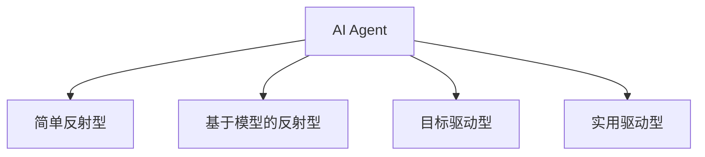
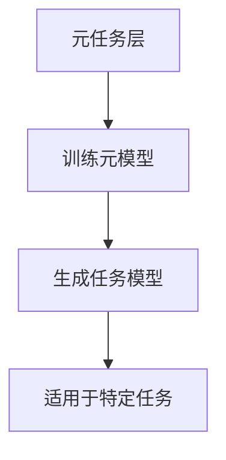
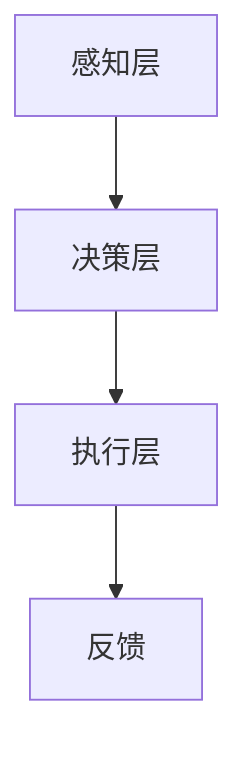
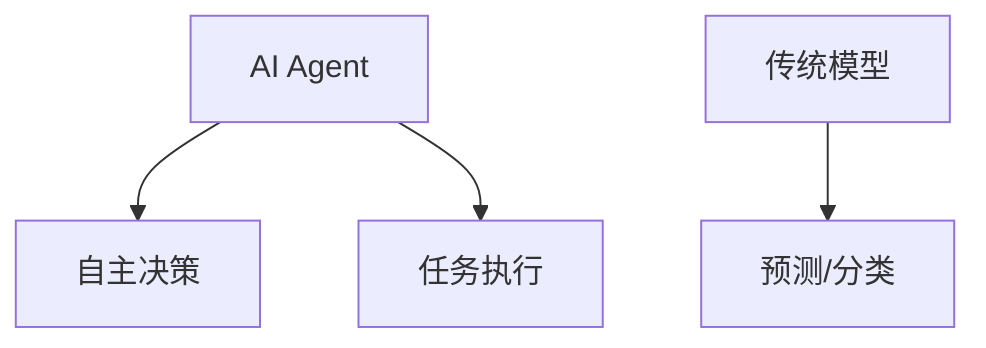
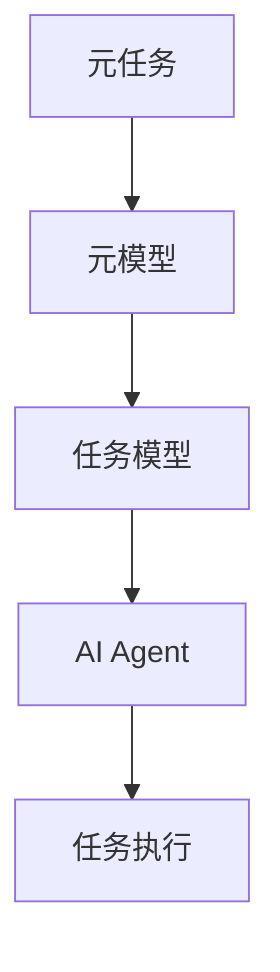
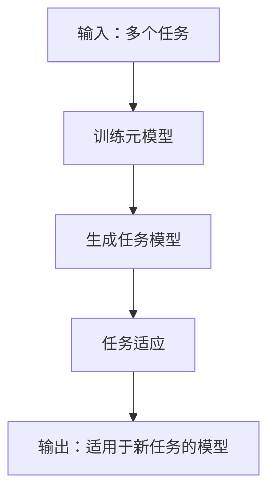
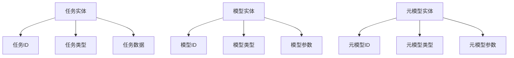
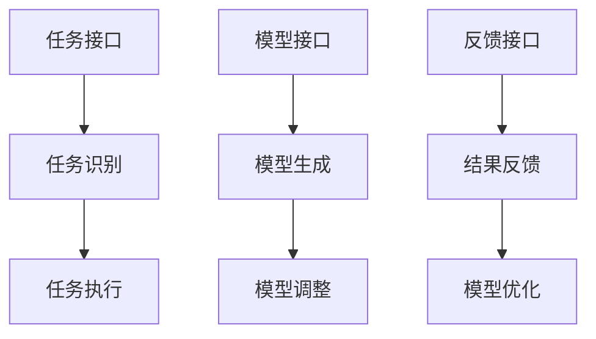
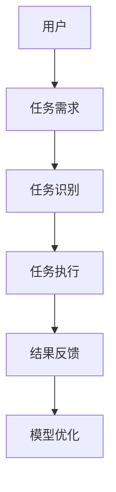

                 


# 企业AI Agent的元学习应用：快速适应新任务

> 关键词：元学习，AI Agent，快速适应，企业应用，算法原理

> 摘要：本文探讨了企业在AI Agent中应用元学习的策略，分析了元学习如何帮助AI Agent快速适应新任务。文章详细讲解了元学习的核心原理、算法实现、系统架构设计，并通过项目实战展示了如何在企业环境中应用这些技术，最后总结了最佳实践和未来趋势。

---

## 第1章: 企业AI Agent的背景与问题背景

### 1.1 元学习与AI Agent的定义

#### 1.1.1 元学习的定义与核心概念

元学习（Meta Learning）是一种机器学习方法，旨在通过学习如何学习，使模型能够快速适应新任务。其核心概念包括：

- **元任务**：一组相关任务的集合，用于训练元学习模型。
- **元模型**：用于在元任务上进行训练，生成适用于特定任务的模型。
- **任务适应**：元学习模型在新任务上的调整和优化能力。

**表格：元学习与传统学习的对比**

| 比较维度       | 元学习                          | 传统学习                          |
|----------------|---------------------------------|------------------------------------|
| 数据需求       | 较少，利用多个任务的数据        | 较多，专注于单任务数据              |
| 适应性         | 高，能够快速适应新任务          | 低，需要重新训练                   |
| 应用场景       | 多任务学习，零样本学习          | 单任务学习                        |

#### 1.1.2 AI Agent的基本概念与分类

AI Agent是一种智能代理，能够感知环境、自主决策并执行任务。根据应用场景，AI Agent可以分为：

- **简单反射型Agent**：基于当前感知做出反应。
- **基于模型的反射型Agent**：使用内部模型进行决策。
- **目标驱动型Agent**：根据目标选择最优行动。
- **实用驱动型Agent**：通过效用函数优化决策。

**Mermaid图：AI Agent分类**



#### 1.1.3 企业AI Agent的特殊需求与挑战

企业在使用AI Agent时，通常面临以下挑战：

- **快速适应**：企业环境变化快，AI Agent需要快速适应新任务。
- **多任务处理**：企业任务多样，AI Agent需同时处理多个任务。
- **数据隐私**：企业数据敏感，需确保数据安全和隐私保护。

### 1.2 问题背景与问题描述

#### 1.2.1 传统AI Agent的局限性

传统AI Agent依赖大量任务特定数据，适应新任务时需要重新训练，导致：

- **适应成本高**：每次新任务都需要重新训练模型。
- **效率低**：处理新任务时耗时长，影响企业效率。
- **灵活性差**：难以应对快速变化的业务需求。

#### 1.2.2 企业任务快速适应的需求

企业在数字化转型中，需要AI Agent能够快速适应新任务，如：

- **客户服务**：处理不同客户咨询。
- **流程优化**：优化企业内部流程。
- **决策支持**：辅助高层决策。

#### 1.2.3 元学习在企业AI Agent中的应用价值

元学习通过以下方式提升企业AI Agent的适应能力：

- **快速学习**：利用元学习，AI Agent可以在少量数据上快速适应新任务。
- **多任务处理**：元学习模型可以同时处理多个相关任务，提升任务处理效率。
- **灵活性增强**：元学习使AI Agent能够快速调整策略，适应业务变化。

---

## 第2章: 元学习与AI Agent的核心概念

### 2.1 元学习的核心原理

#### 2.1.1 元学习的层级结构

元学习模型通常包括两个层次：

- **元任务层**：训练元模型，使其能够泛化到新任务。
- **任务层**：在特定任务上进行优化，生成适用于该任务的模型。

**Mermaid图：元学习层级结构**



#### 2.1.2 元学习的数学模型

元学习的目标函数通常包括两部分：

- **元任务损失**：衡量元模型在元任务上的表现。
- **任务损失**：衡量生成的任务模型在特定任务上的表现。

**公式：元学习的目标函数**

$$ \mathcal{L}_{meta} = \sum_{i=1}^{N} \mathcal{L}_{task}(f_{\theta}(x_i), y_i) + \lambda \mathcal{L}_{meta}(f_{\theta}) $$

其中，$N$ 是元任务的数量，$\lambda$ 是调节参数。

#### 2.1.3 元学习的核心思想

元学习的核心思想是通过学习如何学习，使模型具备快速适应新任务的能力。其主要步骤包括：

1. **元任务训练**：在多个任务上训练元模型。
2. **任务模型生成**：利用元模型生成适用于特定任务的模型。
3. **任务适应**：在新任务上微调任务模型。

### 2.2 AI Agent的元学习框架

#### 2.2.1 元学习驱动的AI Agent架构

元学习驱动的AI Agent架构包括：

- **感知层**：负责环境感知和数据收集。
- **决策层**：基于元学习模型进行决策。
- **执行层**：执行决策并反馈结果。

**Mermaid图：元学习驱动的AI Agent架构**



#### 2.2.2 元学习在任务适应中的作用

元学习通过以下方式在AI Agent的任务适应中发挥作用：

- **任务迁移**：利用元学习模型将知识迁移到新任务。
- **快速微调**：在新任务上进行少量数据的微调，提升任务适应性。
- **多任务处理**：同时处理多个相关任务，提升任务处理效率。

#### 2.2.3 元学习与强化学习的结合

元学习与强化学习的结合可以使AI Agent具备更强的自主决策能力：

- **元强化学习**：通过元学习优化强化学习策略。
- **任务间迁移**：利用元学习进行任务间的知识迁移。

### 2.3 核心概念对比与联系

#### 2.3.1 元学习与迁移学习的对比

- **迁移学习**：将一个任务上的知识迁移到另一个任务。
- **元学习**：学习如何进行迁移，适用于多个任务的快速适应。

**表格：元学习与迁移学习的对比**

| 比较维度       | 元学习                          | 迁移学习                          |
|----------------|---------------------------------|------------------------------------|
| 适应性         | 高，适用于多个任务快速适应      | 中，适用于单个任务的迁移           |
| 数据需求       | 较少，利用多个任务的数据        | 较多，专注于单任务数据              |
| 应用场景       | 多任务学习，零样本学习          | 单任务学习                        |

#### 2.3.2 AI Agent与传统机器学习模型的对比

- **AI Agent**：具备自主决策和任务执行能力。
- **传统机器学习模型**：不具备自主决策能力，仅能进行预测或分类。

**Mermaid图：AI Agent与传统机器学习模型的对比**



#### 2.3.3 ER实体关系图中的核心概念联系

在企业AI Agent的元学习应用中，核心实体包括：

- **元任务**：多个相关任务的集合。
- **任务模型**：适用于特定任务的模型。
- **元模型**：生成任务模型的元学习模型。
- **AI Agent**：使用任务模型进行任务执行。

**Mermaid图：核心概念联系**



---

## 第3章: 元学习算法原理与实现

### 3.1 元学习算法的核心原理

#### 3.1.1 Meta Learning的基本框架

元学习的基本框架包括：

1. **元任务训练**：在多个任务上训练元模型。
2. **任务模型生成**：利用元模型生成适用于特定任务的模型。
3. **任务适应**：在新任务上微调任务模型。

**Mermaid图：元学习算法流程**



#### 3.1.2 元学习的数学模型

元学习的数学模型通常包括：

- **元任务损失**：衡量元模型在元任务上的表现。
- **任务损失**：衡量生成的任务模型在特定任务上的表现。

**公式：元学习的目标函数**

$$ \mathcal{L}_{meta} = \sum_{i=1}^{N} \mathcal{L}_{task}(f_{\theta}(x_i), y_i) + \lambda \mathcal{L}_{meta}(f_{\theta}) $$

其中，$N$ 是元任务的数量，$\lambda$ 是调节参数。

#### 3.1.3 元学习的优化目标

元学习的优化目标是通过训练元模型，使得生成的任务模型在新任务上的表现最优。

### 3.2 元学习算法的实现步骤

#### 3.2.1 算法输入与输出

- **输入**：多个任务的数据集，元学习的超参数。
- **输出**：适用于新任务的模型或策略。

#### 3.2.2 元学习的训练过程

元学习的训练过程包括：

1. **初始化**：初始化元模型的参数。
2. **元任务训练**：在多个任务上训练元模型。
3. **任务模型生成**：利用元模型生成适用于特定任务的模型。
4. **任务适应**：在新任务上微调任务模型。

#### 3.2.3 元学习的推理过程

元学习的推理过程包括：

1. **任务识别**：识别新任务的需求。
2. **任务模型选择**：选择适用于该任务的模型。
3. **任务执行**：执行任务并返回结果。

### 3.3 元学习算法的数学公式

#### 3.3.1 Meta Learning的数学表达

元学习的数学表达通常包括：

- **优化目标**：最小化元任务损失和任务损失的加权和。
- **梯度计算**：计算元模型和任务模型的梯度。
- **参数更新**：更新元模型和任务模型的参数。

**公式：元学习的优化目标**

$$ \min_{\theta} \sum_{i=1}^{N} \mathcal{L}_{task}(f_{\theta}(x_i), y_i) + \lambda \mathcal{L}_{meta}(f_{\theta}) $$

其中，$\theta$ 是元模型的参数，$\lambda$ 是调节参数。

#### 3.3.2 优化目标的数学推导

元学习的优化目标可以通过以下步骤推导：

1. **定义元任务损失**：$\mathcal{L}_{meta}(f_{\theta})$。
2. **定义任务损失**：$\mathcal{L}_{task}(f_{\theta}(x_i), y_i)$。
3. **加权求和**：$\sum_{i=1}^{N} \mathcal{L}_{task}(f_{\theta}(x_i), y_i) + \lambda \mathcal{L}_{meta}(f_{\theta})$。
4. **求导优化**：对$\theta$求导并优化。

#### 3.3.3 算法收敛性的分析

元学习算法的收敛性分析通常包括：

- **梯度下降**：通过梯度下降优化元模型的参数。
- **学习率调整**：调整学习率以加快收敛。
- **正则化**：通过正则化技术防止过拟合。

---

## 第4章: 企业AI Agent的系统架构设计

### 4.1 系统分析与需求分析

#### 4.1.1 问题场景介绍

企业在使用AI Agent时，通常面临以下问题：

- **快速适应**：企业环境变化快，AI Agent需要快速适应新任务。
- **多任务处理**：企业任务多样，AI Agent需同时处理多个任务。
- **数据隐私**：企业数据敏感，需确保数据安全和隐私保护。

#### 4.1.2 项目目标与范围

项目的总体目标是设计一个基于元学习的AI Agent系统，使其能够快速适应新任务。项目的范围包括：

- **系统设计**：设计系统的功能模块和架构。
- **算法实现**：实现元学习算法并集成到AI Agent中。
- **测试验证**：通过实验验证系统的性能和效果。

#### 4.1.3 系统功能需求

系统的功能需求包括：

- **任务识别**：识别新任务的需求。
- **任务模型生成**：生成适用于特定任务的模型。
- **任务执行**：执行任务并返回结果。
- **任务适应**：在新任务上微调任务模型。

### 4.2 系统功能设计

#### 4.2.1 领域模型设计

领域模型设计包括：

- **任务实体**：包括任务ID、任务类型、任务数据等。
- **模型实体**：包括模型ID、模型类型、模型参数等。
- **元模型实体**：包括元模型ID、元模型类型、元模型参数等。

**Mermaid图：领域模型设计**



#### 4.2.2 系统架构设计

系统的架构设计包括：

- **感知层**：负责环境感知和数据收集。
- **决策层**：基于元学习模型进行决策。
- **执行层**：执行决策并反馈结果。

**Mermaid图：系统架构设计**


#### 4.2.3 系统接口设计

系统的接口设计包括：

- **任务接口**：用于任务的识别和执行。
- **模型接口**：用于模型的生成和调整。
- **反馈接口**：用于反馈结果和优化模型。

**Mermaid图：系统接口设计**



#### 4.2.4 系统交互设计

系统的交互设计包括：

- **用户输入**：用户输入任务需求。
- **任务识别**：系统识别任务类型。
- **任务执行**：系统执行任务并返回结果。
- **反馈优化**：系统根据反馈优化模型。

**Mermaid图：系统交互设计**



---

## 第5章: 项目实战

### 5.1 项目环境安装

项目实战需要以下环境：

- **Python**：3.6及以上版本。
- **深度学习框架**：如TensorFlow或PyTorch。
- **元学习库**：如Meta-Learner或FastMeta。

安装命令：

```bash
pip install numpy
pip install tensorflow
pip install meta-learner
```

### 5.2 系统核心实现源代码

以下是元学习驱动的AI Agent的核心代码示例：

```python
import numpy as np
import tensorflow as tf
from meta_learner import MetaLearner

# 初始化元模型
meta_model = MetaLearner(num_tasks=N, task_loss_function=task_loss)

# 元任务训练
meta_model.train()

# 生成任务模型
task_model = meta_model.generate_task_model(task_id)

# 任务适应
task_model.adapt(task_data, task_labels)

# 执行任务
result = task_model.predict(new_task_data)
```

### 5.3 代码应用解读与分析

代码解读：

- **初始化元模型**：创建一个MetaLearner实例，指定任务数量和任务损失函数。
- **元任务训练**：在多个任务上训练元模型。
- **生成任务模型**：利用元模型生成适用于特定任务的模型。
- **任务适应**：在新任务上微调任务模型。
- **执行任务**：执行任务并返回结果。

### 5.4 实际案例分析和详细讲解剖析

以客户服务场景为例，假设企业需要处理多种类型的客户咨询，AI Agent需要快速适应不同类型的咨询任务。

1. **任务识别**：识别客户咨询类型。
2. **任务模型生成**：生成适用于特定咨询类型的模型。
3. **任务执行**：处理客户咨询并返回结果。
4. **任务适应**：根据反馈优化模型。

### 5.5 项目小结

通过项目实战，我们可以看到元学习在企业AI Agent中的实际应用价值。通过元学习，AI Agent可以在少量数据上快速适应新任务，提升企业的效率和灵活性。

---

## 第6章: 最佳实践、小结与注意事项

### 6.1 最佳实践 tips

- **数据质量**：确保元任务数据的质量和多样性。
- **任务相关性**：选择相关性较高的任务进行元任务训练。
- **模型选择**：根据任务需求选择合适的元学习算法。
- **持续优化**：定期更新元模型以适应新任务。

### 6.2 小结

本文详细探讨了企业AI Agent的元学习应用，分析了元学习的核心原理和算法实现，设计了系统的架构，并通过项目实战展示了元学习在企业环境中的应用价值。

### 6.3 注意事项

- **数据隐私**：企业数据敏感，需确保数据安全和隐私保护。
- **模型解释性**：元学习模型通常缺乏解释性，需注意模型的可解释性。
- **计算资源**：元学习需要大量计算资源，需确保硬件配置。

### 6.4 拓展阅读

- **Meta Learning文献**：阅读相关Meta Learning的论文和书籍。
- **AI Agent应用案例**：研究其他企业中AI Agent的应用案例。
- **算法优化**：探索元学习算法的优化方法。

---

## 第7章: 作者简介

作者：AI天才研究院/AI Genius Institute & 禅与计算机程序设计艺术 /Zen And The Art of Computer Programming

---

这篇文章通过系统地分析和详细讲解，展示了企业AI Agent在元学习中的应用。通过理论与实践相结合，帮助读者理解如何利用元学习快速适应新任务，提升企业的效率和灵活性。

