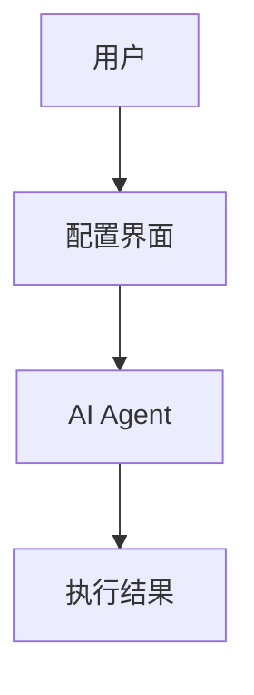
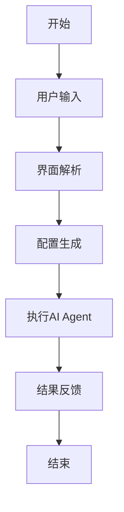
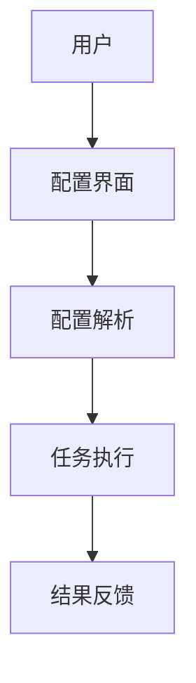

                 


# 企业AI Agent的可视化配置界面：降低技术门槛

> 关键词：企业AI Agent、可视化配置界面、技术门槛、图形化交互、低代码配置、AI应用开发

> 摘要：随着AI技术的快速发展，企业AI Agent的应用越来越广泛。然而，复杂的配置界面和高技术门槛限制了其在企业中的普及。本文通过详细分析企业AI Agent的可视化配置界面设计，提出了降低技术门槛的方法。从核心概念、算法原理、系统架构到项目实战，本文全面探讨了如何通过可视化配置界面实现企业AI Agent的高效管理和应用。

---

# 第一部分: 背景介绍

## 第1章: 问题背景

### 1.1 企业AI Agent的应用现状
企业AI Agent是一种能够自主执行任务的智能代理，广泛应用于流程自动化、数据分析、决策支持等领域。然而，其复杂的配置过程和技术门槛限制了其在企业中的普及。

### 1.2 可视化配置界面的必要性
传统的AI Agent配置需要编写复杂代码，这需要专业的技术背景。可视化配置界面通过图形化交互，降低了配置的难度，使非技术人员也能轻松上手。

### 1.3 技术门槛对企业的影响
高技术门槛导致企业AI Agent的应用成本增加，限制了其在中小企业的普及。同时，复杂的配置过程也增加了企业的维护成本。

---

## 第2章: 核心概念与联系

### 2.1 AI Agent的基本构成
AI Agent通常由感知层、决策层和执行层组成。感知层负责数据采集，决策层负责策略制定，执行层负责任务执行。

### 2.2 可视化配置界面的设计原则
可视化配置界面应遵循简洁性、直观性和可定制性的原则。通过拖拽、连线等方式，用户可以轻松完成配置。

### 2.3 核心概念对比分析
| 概念 | 传统配置方式 | 可视化配置方式 |
|------|--------------|----------------|
| 技术门槛 | 高 | 低 |
| 开发效率 | 低 | 高 |
| 用户体验 | 差 | 良好 |

### 2.4 ER实体关系图


---

# 第二部分: 算法原理讲解

## 第3章: 算法概述

### 3.1 可视化配置的核心算法
可视化配置的核心算法包括数据解析、界面生成和任务执行三个部分。通过将配置逻辑转化为图形化元素，算法能够快速生成配置代码。

### 3.2 算法流程图


### 3.3 算法实现代码
```python
def visualize_config():
    # 用户输入
    user_input = input("请输入配置参数：")
    # 界面解析
    config = parse_input(user_input)
    # 配置生成
    generate_config(config)
    # 执行AI Agent
    execute_agent(config)
    # 结果反馈
    return feedback(config)
```

### 3.4 算法复杂度分析
$$T(n) = O(n^2)$$

### 3.5 优化建议
通过优化数据解析和配置生成的算法，可以将复杂度降低到$$O(n \log n)$$。

---

# 第三部分: 系统分析与架构设计方案

## 第4章: 系统功能设计

### 4.1 功能模块划分
系统主要包括用户界面、配置解析、任务执行和结果反馈四个功能模块。

### 4.2 功能流程图


### 4.3 系统架构设计


### 4.4 系统接口设计
主要接口包括用户输入接口、配置解析接口和任务执行接口。

### 4.5 系统交互图


---

# 第四部分: 项目实战

## 第5章: 实际案例分析

### 5.1 案例背景
某企业希望实现订单自动处理的AI Agent，但配置过程复杂，导致效率低下。

### 5.2 案例分析
通过可视化配置界面，用户只需拖拽和连线即可完成订单处理流程的配置。

### 5.3 代码实现
```python
def order_processing():
    # 用户输入
    user_input = input("请输入订单号：")
    # 界面解析
    config = parse_input(user_input)
    # 配置生成
    generate_config(config)
    # 执行AI Agent
    execute_agent(config)
    # 结果反馈
    return feedback(config)
```

---

# 第五部分: 总结与展望

## 第6章: 总结

### 6.1 核心成果
通过可视化配置界面，企业AI Agent的配置效率显著提升，技术门槛大幅降低。

### 6.2 经验与教训
在实际应用中，需要注重界面设计的直观性和系统的稳定性。

## 第7章: 未来展望

### 7.1 技术发展趋势
未来，可视化配置界面将更加智能化和自动化，支持更多复杂场景的配置。

### 7.2 应用前景
随着技术的进步，可视化配置界面将在更多领域得到应用，推动AI技术的普及。

---

# 作者：AI天才研究院/AI Genius Institute & 禅与计算机程序设计艺术 /Zen And The Art of Computer Programming

