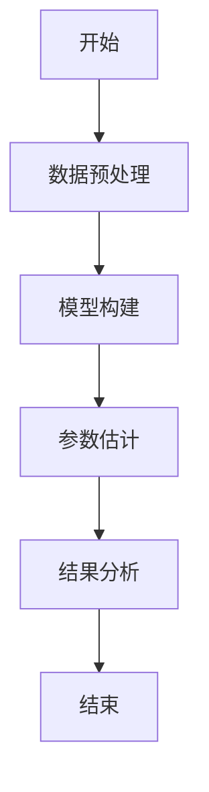
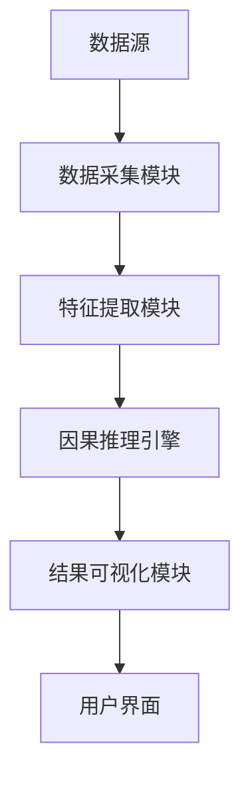

                 


# 企业AI Agent的因果推理在客户行为分析中的应用

## 关键词：企业AI Agent，因果推理，客户行为分析，机器学习，数据科学

## 摘要：  
本文探讨了企业AI Agent如何通过因果推理技术进行客户行为分析。从理论基础到实际应用，详细分析了因果推理在客户行为预测和决策中的重要性，并结合实际案例展示了如何构建和实现基于因果推理的企业AI Agent系统。通过本文，读者将深入了解因果推理的核心原理、算法实现以及在实际业务中的应用价值。

---

# 第一部分：企业AI Agent的因果推理基础

## 第1章：企业AI Agent与因果推理概述

### 1.1 企业AI Agent的定义与特点

#### 1.1.1 什么是企业AI Agent  
企业AI Agent（Artificial Intelligence Agent）是指具备自主决策、问题解决和目标导向能力的智能实体，能够根据环境信息和业务目标执行任务。与传统算法不同，AI Agent强调动态交互和目标导向性。

#### 1.1.2 AI Agent的核心特点  
- **自主性**：无需外部干预，自主决策。  
- **反应性**：能实时感知环境并做出反应。  
- **目标导向性**：基于目标优化行为。  
- **学习能力**：通过数据和经验提升性能。

#### 1.1.3 企业AI Agent的应用场景  
- 客户行为预测  
- 业务流程优化  
- 风险管理  
- 营销自动化  

---

### 1.2 因果推理的基本概念  

#### 1.2.1 因果关系的定义  
因果关系是指一个事件（原因）导致另一个事件（结果）发生的确定性关系。因果推理的目标是识别和量化这些因果关系，从而理解事件之间的内在联系。

#### 1.2.2 因果推理与相关概念的区别  

| 概念         | 描述                                                                 |
|--------------|----------------------------------------------------------------------|
| 相关性       | 两个变量之间存在统计关联，但不一定存在因果关系。                   |
| 因果关系     | 一个变量的变化是另一个变量变化的直接原因。                         |
| 预测模型     | 基于数据模式进行预测，不关注因果关系。                               |

#### 1.2.3 因果推理在企业分析中的重要性  
- 帮助企业从相关性分析升级到因果关系分析。  
- 提高决策的准确性和可靠性。  
- 支持反事实推理，优化策略制定。

---

## 第2章：客户行为分析的背景与挑战  

### 2.1 客户行为分析的定义  
客户行为分析是指通过收集和分析客户的交互数据，理解客户行为模式，从而预测和影响客户决策的过程。

### 2.2 传统客户行为分析方法的局限性  

| 问题         | 描述                                                                 |
|--------------|----------------------------------------------------------------------|
| 单一维度分析 | 只关注某一行为，忽视整体行为链路。                                     |
| 相关性偏差   | 误将相关性当作因果关系。                                               |
| 数据孤岛     | 数据分散，难以形成完整的客户行为画像。                                 |

### 2.3 企业AI Agent在客户行为分析中的优势  
- **全局视角**：整合多维度数据，形成完整的客户行为画像。  
- **动态适应**：实时响应客户行为变化，优化决策策略。  
- **因果推理**：识别因果关系，提升决策的准确性。

---

## 第3章：企业AI Agent的因果推理模型  

### 3.1 因果图模型  

#### 3.1.1 有向无环图（DAG）的定义  
DAG是一种有向图，用于表示变量之间的因果关系。节点代表变量，边代表因果关系。

#### 3.1.2 贝叶斯网络与因果图的关系  
贝叶斯网络是概率图模型，而因果图是其特例，用于表示因果关系。

#### 3.1.3 结构方程模型（SEM）  
SEM是一种用于估计变量之间因果关系的统计方法，适用于多变量复杂场景。

---

### 3.2 银行卡交易案例分析  

#### 3.2.1 案例背景  
某银行希望通过分析客户的交易数据，识别欺诈交易。

#### 3.2.2 数据特征提取  
- 交易时间、金额、地点等。  
- 用户行为模式，如登录频率、交易间隔等。

#### 3.2.3 因果关系建模  
通过因果图识别关键变量，如“用户登录频率”→“交易金额”→“欺诈风险”。

---

# 第二部分：因果推理算法实现

## 第4章：因果推理算法实现  

### 4.1 结构方程模型（SEM）  

#### 4.1.1 SEM的数学模型  
$$ Y = \beta X + \gamma Z + \epsilon $$  
其中，$Y$是结果变量，$X$是原因变量，$Z$是控制变量，$\epsilon$是误差项。

#### 4.1.2 SEM的实现步骤  



#### 4.1.3 SEM的优缺点  
- 优点：适合多变量场景。  
- 缺点：计算复杂，对数据依赖性强。

### 4.2 随机森林因果推理  

#### 4.2.1 随机森林算法简介  
随机森林是一种基于树的集成学习方法，常用于分类和回归任务。

#### 4.2.2 随机森林因果推理的实现  

```python
import numpy as np
from sklearn.ensemble import RandomForestRegressor

# 示例数据
X = np.random.rand(100, 5)
y = np.random.rand(100)

# 训练模型
model = RandomForestRegressor()
model.fit(X, y)

# 预测结果
print(model.predict(X))
```

#### 4.2.3 随机森林因果推理的应用  
- 适用于非线性关系。  
- 可解释性较差，但计算效率高。

---

## 第5章：系统架构与实现  

### 5.1 系统架构设计  

#### 5.1.1 系统功能模块划分  

| 模块         | 描述                                                                 |
|--------------|----------------------------------------------------------------------|
| 数据采集模块 | 采集客户行为数据。                                                   |
| 特征提取模块 | 提取特征，如时间、地点、金额等。                                     |
| 因果推理引擎 | 实现因果推理算法，识别因果关系。                                     |
| 结果可视化模块 | 可视化分析结果，便于用户理解。                                       |

#### 5.1.2 系统架构图  



#### 5.1.3 系统接口设计  
- 数据接口：REST API，提供数据采集和处理接口。  
- 模型接口：提供因果推理模型的调用接口。

### 5.2 系统实现细节  

#### 5.2.1 数据预处理模块  
- 数据清洗：处理缺失值、异常值。  
- 数据转换：将数据转换为模型输入格式。

#### 5.2.2 因果推理引擎  
- 接收特征数据，运行因果推理算法，输出因果关系结果。

#### 5.2.3 结果可视化模块  
- 将因果关系结果可视化，生成图表和报告。

---

## 第6章：项目实战与案例分析  

### 6.1 项目环境搭建  

#### 6.1.1 Python环境安装  
```bash
python --version
pip install numpy scikit-learn
```

#### 6.1.2 必要库的安装  
```bash
pip install pandas matplotlib
pip install causalnex
```

### 6.2 核心代码实现  

#### 6.2.1 数据预处理代码  

```python
import pandas as pd
import numpy as np

# 创建示例数据
data = {
    '用户ID': [1, 2, 3, 4, 5],
    '交易金额': [100, 200, 300, 400, 500],
    '交易时间': ['2023-01-01', '2023-01-02', '2023-01-03', '2023-01-04', '2023-01-05']
}
df = pd.DataFrame(data)
print(df)
```

#### 6.2.2 因果推理模型代码  

```python
from causalnex.structure import StructuralModel
from causalnex.dag import DAG

# 定义因果图
model = DAG()
model.add_edge('用户ID', '交易金额')
model.add_edge('交易时间', '交易金额')

# 可视化因果图
model.view_model()
```

#### 6.2.3 结果可视化代码  

```python
import matplotlib.pyplot as plt

# 绘制交易金额分布图
plt.hist(df['交易金额'], bins=5)
plt.title('交易金额分布')
plt.xlabel('金额')
plt.ylabel('频率')
plt.show()
```

### 6.3 案例分析  

#### 6.3.1 案例背景  
某电商平台希望通过分析客户的购买行为，预测客户的复购率。

#### 6.3.2 数据分析与建模  
- 数据预处理：清洗和转换数据。  
- 因果推理：识别因果关系，如“广告点击”→“购买行为”。

#### 6.3.3 模型结果解读  
- 广告点击率与购买行为高度相关，因果关系显著。  
- 提高广告投放精准度，可以有效提升复购率。

---

## 第7章：最佳实践与总结  

### 7.1 小结  
本文详细探讨了企业AI Agent在客户行为分析中的应用，重点介绍了因果推理的核心原理、算法实现和系统设计。通过实际案例展示了如何利用因果推理技术提升企业的决策能力。

### 7.2 注意事项  
- 数据质量是关键，需确保数据的完整性和准确性。  
- 因果推理模型的解释性可能较差，需结合业务背景进行分析。  
- 模型需定期更新，以适应业务变化。

### 7.3 拓展阅读  
- 《因果推断入门》  
- 《机器学习实战》  
- 《贝叶斯网络与因果推理》  

---

# 作者：AI天才研究院/AI Genius Institute & 禅与计算机程序设计艺术 /Zen And The Art of Computer Programming

