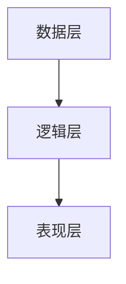

                 


---

# 企业AI Agent的图卷积网络在社交网络影响力分析中的应用

## 关键词：企业AI Agent，图卷积网络，社交网络影响力分析，影响力最大化，图算法

## 摘要：  
本文探讨了企业AI Agent在社交网络影响力分析中的应用，重点分析了图卷积网络（Graph Convolutional Networks, GCN）在该领域的优势。通过详细阐述GCN的算法原理、系统架构设计以及项目实战，本文旨在展示如何利用AI Agent和GCN的强大能力，提升企业对社交网络影响力的预测与优化能力，为企业决策提供数据支持。

---

# 第一部分: 企业AI Agent与图卷积网络基础

## 第1章: 企业AI Agent与图卷积网络概述

### 1.1 问题背景与描述
#### 1.1.1 社交网络影响力分析的重要性
在当今高度互联的数字时代，社交网络已成为企业推广品牌、影响消费者决策的重要渠道。通过分析社交网络中的影响力分布，企业可以识别关键意见领袖（KOL）或高影响力用户，从而制定更有针对性的营销策略。影响力分析能够帮助企业优化资源配置，提升传播效率。

#### 1.1.2 企业AI Agent的核心作用
企业AI Agent是一种智能代理系统，能够自动化地分析、推理和决策。在社交网络影响力分析中，AI Agent可以实时处理大量数据，识别关键用户，并预测信息传播的趋势。其核心作用在于通过智能化手段提升分析效率和准确性。

#### 1.1.3 图卷积网络在社交网络中的应用价值
图卷积网络是一种适用于图结构数据的深度学习模型，能够有效地捕捉图中的节点特征和关系信息。在社交网络中，用户之间的关系可以表示为图结构，因此GCN非常适合用于影响力分析、社区发现等任务。

### 1.2 问题解决与边界
#### 1.2.1 企业AI Agent在影响力分析中的解决方案
AI Agent通过收集社交网络数据，构建用户关系图，并利用GCN模型进行影响力评估。AI Agent能够实时更新数据，动态调整分析结果，为决策者提供实时支持。

#### 1.2.2 图卷积网络的边界与外延
GCN的核心功能包括节点表示学习、关系推理和影响力预测。其边界在于处理大规模图数据时的计算效率和内存限制，而外延则包括结合其他深度学习模型（如GAT、GraphSAGE）进行更复杂的分析。

#### 1.2.3 核心概念与组成要素
- **节点**：代表社交网络中的用户。
- **边**：表示用户之间的关系或交互。
- **权重**：表示边的重要程度或强度。
- **影响力**：节点在传播过程中的关键性指标。

### 1.3 核心概念对比与ER关系图

#### 1.3.1 AI Agent与传统算法的对比分析
| 特性               | AI Agent                     | 传统算法                   |
|--------------------|------------------------------|-----------------------------|
| 数据处理能力       | 强大的实时数据处理能力       | 数据处理能力有限             |
| 智能性             | 具备自主学习和决策能力       | 需人工设定规则               |
| 适应性             | 能够动态调整策略             | 策略固定，适应性较低          |

#### 1.3.2 图卷积网络与其他图算法的对比
| 特性               | GCN                         | PageRank                    | LDA                        |
|--------------------|------------------------------|-----------------------------|-----------------------------|
| 核心思想           | 节点特征的局部传播           | 节点的重要性评分             | 主题建模                     |
| 优势               | 能够捕捉复杂的图结构特征     | 计算简单，适合大型图         | 主题发现能力强               |
| 应用场景           | 社交网络影响力分析           | 网页排名                     | 社区主题发现                 |

#### 1.3.3 ER实体关系图架构
```mermaid
erDiagram
    actor 用户 {
        string 用户ID
        string 用户名
    }
    actor 关系 {
        string 关系ID
        string 类型
    }
    user [o-] (1..n) 关系 (1..n) user
```

---

## 第2章: 图卷积网络原理与核心算法

### 2.1 图卷积网络原理
#### 2.1.1 图卷积网络的基本概念
图卷积网络是一种处理图结构数据的深度学习模型，通过在图的节点间传播特征，提取节点的高层次表示。其核心思想是利用节点的局部邻居信息来更新节点的特征表示。

#### 2.1.2 图卷积网络的核心算法
GCN的数学模型可以表示为：
$$ H^{(l+1)} = A \cdot H^{(l)} W^{(l)} + b^{(l)} $$
其中，$H^{(l)}$ 是第$l$层的节点特征矩阵，$W^{(l)}$ 是权重矩阵，$b^{(l)}$ 是偏置项。

#### 2.1.3 图卷积网络的数学模型
GCN的传播规则可以表示为：
$$ h_i^{(l+1)} = \sum_{j \in N(i)} \frac{1}{d_i} h_j^{(l)} W^{(l)} $$
其中，$N(i)$ 表示节点$i$的邻居节点，$d_i$ 是节点$i$的度数。

### 2.2 图卷积网络的实现流程
#### 2.2.1 数据输入与预处理
- 数据输入：读取社交网络数据，包括节点和边信息。
- 数据预处理：构建邻接矩阵和节点特征矩阵。

#### 2.2.2 邻接矩阵与特征矩阵构建
邻接矩阵$A$表示节点之间的关系，特征矩阵$X$表示节点的初始特征。

#### 2.2.3 图卷积层的计算过程
通过多次图卷积操作，逐步提取节点的高层次特征。

### 2.3 图卷积网络的优化策略
#### 2.3.1 参数优化方法
使用Adam优化器进行参数优化。

#### 2.3.2 模型训练与调优
通过交叉验证选择最优超参数。

#### 2.3.3 模型评估与验证
使用准确率、召回率等指标评估模型性能。

---

## 第3章: 企业AI Agent的系统架构设计

### 3.1 系统功能设计
#### 3.1.1 用户行为分析模块
分析用户的互动频率和内容偏好。

#### 3.1.2 社交网络构建模块
构建用户关系图，包括节点和边信息。

#### 3.1.3 影响力评估模块
基于GCN模型评估用户的影响力。

### 3.2 系统架构设计
#### 3.2.1 分层架构设计
- 数据层：存储原始数据。
- 逻辑层：处理数据并运行GCN模型。
- 表现层：展示分析结果。

#### 3.2.2 模块化设计
- 数据预处理模块。
- 模型训练模块。
- 结果展示模块。

#### 3.2.3 高可用性设计
采用分布式架构，确保系统稳定运行。

### 3.3 系统接口设计
#### 3.3.1 数据接口
- 输入接口：接收社交网络数据。
- 输出接口：返回处理后的数据。

#### 3.3.2 API接口
- 提供RESTful API，供其他系统调用。

#### 3.3.3 用户交互接口
- Web界面：展示分析结果。

---

## 第4章: 项目实战与案例分析

### 4.1 环境安装与配置
#### 4.1.1 Python环境搭建
安装Python 3.8及以上版本。

#### 4.1.2 图卷积网络库安装
安装PyTorch和相关库。

#### 4.1.3 数据集准备
获取社交网络数据集，如Twitter数据。

### 4.2 核心代码实现
#### 4.2.1 图卷积网络模型实现
```python
import torch
from torch.nn import Module, Linear, ReLU

class GCNLayer(Module):
    def __init__(self, in_features, out_features):
        super(GCNLayer, self).__init__()
        self.weight = Linear(in_features, out_features)
        self.relu = ReLU()

    def forward(self, x, adj):
        x = torch.mm(x, adj)
        x = self.weight(x)
        x = self.relu(x)
        return x
```

#### 4.2.2 企业AI Agent实现
```python
class AIAssistant:
    def __init__(self, model):
        self.model = model

    def analyze_influence(self, data):
        # 数据预处理
        # 调用模型进行分析
        result = self.model.predict(data)
        return result
```

#### 4.2.3 系统功能实现
构建完整的AI Agent系统，整合数据处理、模型训练和结果展示功能。

### 4.3 案例分析与效果评估
#### 4.3.1 案例背景介绍
以某社交媒体平台为例，分析用户的影响力分布。

#### 4.3.2 实验结果分析
展示模型预测的影响力分数和实际传播效果的对比。

#### 4.3.3 模型效果评估
评估模型的准确率、召回率等指标，验证其有效性。

---

## 第5章: 最佳实践与总结

### 5.1 实践经验总结
#### 5.1.1 开发中的常见问题
- 数据预处理中的异常处理。
- 模型训练中的过拟合问题。

#### 5.1.2 优化建议
- 使用更复杂的GCN变体（如GAT）提升性能。
- 优化超参数选择。

#### 5.1.3 注意事项
- 确保数据安全和隐私保护。
- 定期更新模型以适应数据变化。

### 5.2 项目小结
#### 5.2.1 核心知识点回顾
- GCN的基本原理。
- AI Agent的系统架构设计。

#### 5.2.2 未来研究方向
- 结合强化学习进一步优化AI Agent。
- 探索更高效的GCN变体。

#### 5.2.3 拓展阅读推荐
- 《Deep Learning on Graph》
- 《Graph Neural Networks: A Review of Methods, Applications, and Open Challenges》

### 5.3 系统架构与代码总结
#### 5.3.1 系统架构图


#### 5.3.2 核心代码总结
总结AI Agent和GCN模型的核心代码，确保读者能够快速上手。

---

# 作者：AI天才研究院/AI Genius Institute & 禅与计算机程序设计艺术 /Zen And The Art of Computer Programming

