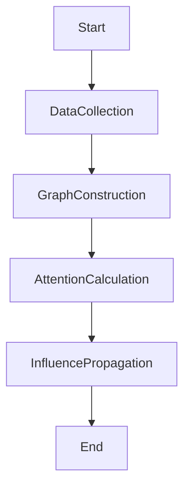
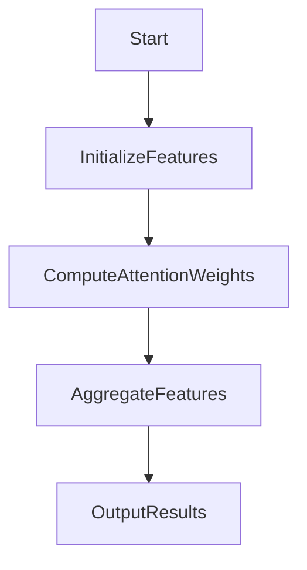
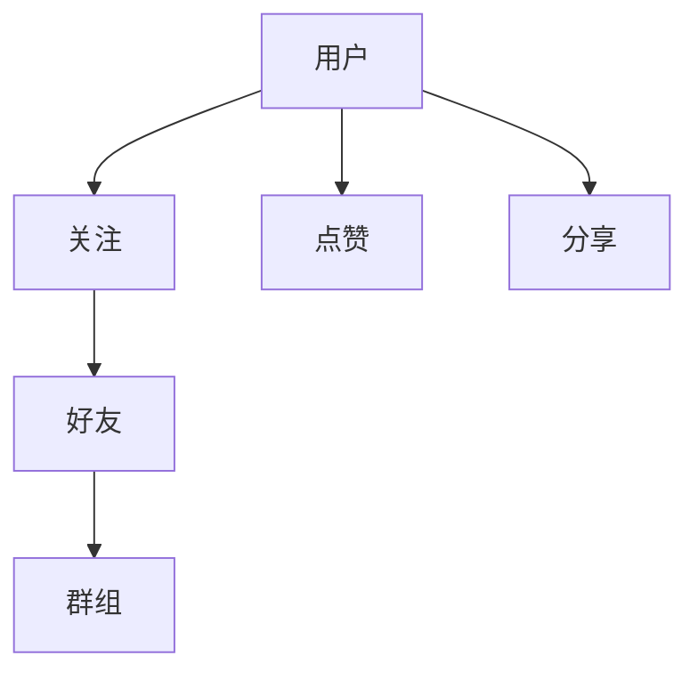
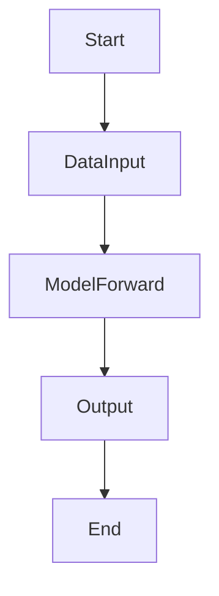
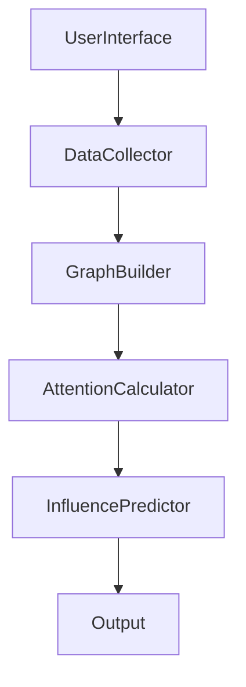

                 


# 企业AI Agent的图注意力网络在社交网络影响力分析中的应用

> 关键词：企业AI Agent，图注意力网络，社交网络影响力分析，GAT模型，影响力传播

> 摘要：本文探讨了企业AI Agent在社交网络影响力分析中的应用，重点介绍了图注意力网络（Graph Attention Network, GAT）在社交网络中的影响力传播建模与分析。通过详细分析图注意力网络的核心原理，结合AI Agent的智能化特性，本文提出了一种基于GAT的影响力分析框架，并通过具体案例展示了该框架的实际应用效果。本文还对比了传统图神经网络与GAT模型在影响力分析中的性能差异，并总结了该方法在企业中的实际应用价值。

---

# 第一部分: 企业AI Agent的图注意力网络概述

## 第1章: 问题背景与概念介绍

### 1.1 问题背景
#### 1.1.1 社交网络影响力分析的重要性
在社交网络中，影响力分析是理解用户行为和信息传播的关键问题。企业可以通过分析用户在社交网络中的影响力，优化市场推广策略、品牌传播和用户互动策略。传统的影响力分析方法往往依赖于中心性指标（如度中心性、接近中心性等），但这些方法难以捕捉复杂的用户关系和非线性传播路径。

#### 1.1.2 传统影响力分析的局限性
传统的影响力分析方法通常基于简单的统计指标，难以应对以下问题：
- **非线性传播路径**：信息传播往往不是简单的单向或双向传播，而是复杂的网络结构。
- **节点权重异质性**：不同用户的影响力受到多种因素影响，如活跃度、内容质量、社交圈子等。
- **实时性要求**：社交网络中的信息传播具有实时性，传统的静态分析方法难以满足实时性需求。

#### 1.1.3 AI Agent在影响力分析中的优势
AI Agent（人工智能代理）是一种能够自主感知环境、执行任务并做出决策的智能体。结合图注意力网络（GAT），AI Agent能够实现以下优势：
- **实时性**：AI Agent可以实时感知社交网络中的动态变化，并快速响应。
- **智能化**：通过图注意力机制，AI Agent能够识别关键节点和传播路径，优化影响力分析的准确性。
- **可扩展性**：AI Agent可以并行处理大规模社交网络数据，适用于企业级应用场景。

### 1.2 问题描述
#### 1.2.1 社交网络中的影响力定义
在社交网络中，用户影响力通常定义为用户在传播信息、影响他人决策中的能力。影响力分析的核心目标是量化用户在网络中的影响力，并预测其在信息传播中的作用。

#### 1.2.2 影响力分析的关键要素
- **用户特征**：包括用户的活跃度、内容质量、社交圈子等。
- **传播路径**：信息从一个用户到另一个用户的传播路径。
- **传播效果**：信息传播的范围、速度和深度。

#### 1.2.3 问题的边界与外延
影响力分析的边界包括：
- 仅考虑用户的影响力，不涉及内容的具体类型。
- 仅分析直接和间接传播路径，不考虑更复杂的传播机制。
- 仅考虑静态或动态网络结构中的影响力。

### 1.3 问题解决思路
#### 1.3.1 图注意力网络的核心思想
图注意力网络通过引入注意力机制，赋予不同节点不同的权重，从而捕捉节点之间的关系。这种方法能够更好地捕捉复杂网络中的关键节点和传播路径。

#### 1.3.2 AI Agent在问题中的角色
AI Agent作为影响力分析的执行者，负责数据采集、模型训练和实时决策。AI Agent能够根据图注意力网络的输出结果，优化企业的影响力传播策略。

#### 1.3.3 解决方案的整体架构
整体架构包括以下几个步骤：
1. 数据采集：从社交网络中获取用户数据和互动数据。
2. 图结构构建：将用户及其互动关系表示为图结构。
3. 图注意力网络训练：通过GAT模型训练影响力传播模型。
4. AI Agent决策：基于模型输出结果，优化企业的影响力传播策略。

### 1.4 核心概念结构
#### 1.4.1 图注意力网络的组成要素
- **图结构**：包括节点和边，表示用户及其互动关系。
- **注意力机制**：用于计算节点之间的注意力权重。
- **传播模型**：基于注意力权重的影响力传播模型。

#### 1.4.2 AI Agent的功能模块
- **数据采集模块**：负责从社交网络中获取数据。
- **图结构构建模块**：将数据转换为图结构。
- **注意力计算模块**：基于图结构计算节点之间的注意力权重。
- **影响力传播模块**：基于注意力权重预测影响力传播路径。

#### 1.4.3 问题解决的流程图


### 1.5 本章小结
本章从问题背景出发，介绍了社交网络影响力分析的重要性，并提出了AI Agent结合图注意力网络的解决方案。通过分析问题的关键要素和解决思路，为后续的技术实现奠定了基础。

---

## 第2章: 图注意力网络的核心原理

### 2.1 图注意力网络的基本概念
#### 2.1.1 图的表示方法
图通常由节点和边组成，可以表示为$G = (V, E)$，其中$V$是节点集合，$E$是边集合。

#### 2.1.2 注意力机制的引入
注意力机制是一种加权机制，能够捕捉不同节点之间的关系。在图注意力网络中，每个节点的注意力权重表示该节点对其他节点的影响程度。

#### 2.1.3 图注意力网络的数学模型
图注意力网络的核心思想是通过注意力机制计算节点的表示向量。具体数学模型如下：

$$
\text{Attention}(i, j) = \text{softmax}(W_i x_i + W_j x_j)
$$

其中，$x_i$和$x_j$分别是节点$i$和$j$的特征向量，$W_i$和$W_j$是可学习的参数。

### 2.2 图注意力网络的算法原理
#### 2.2.1 GAT（Graph Attention Network）模型
GAT模型是图注意力网络的经典实现，其核心步骤包括：
1. 初始化节点特征向量。
2. 计算节点之间的注意力权重。
3. 聚合邻居节点的特征向量。
4. 输出节点的表示向量。

#### 2.2.2 图注意力机制的计算流程


#### 2.2.3 模型的训练与优化
图注意力网络的训练过程包括以下几个步骤：
1. 数据预处理：将社交网络数据转换为图结构。
2. 模型训练：基于训练数据优化模型参数。
3. 模型评估：通过验证集和测试集评估模型性能。
4. 模型优化：调整超参数，优化模型性能。

### 2.3 图注意力网络的属性对比
#### 2.3.1 不同注意力机制的对比表格
| 注意力机制 | 特点 | 优点 | 缺点 |
|----------|------|------|------|
| 基于节点特征的注意力 | 基于节点特征计算权重 | 能捕捉节点特征差异 | 无法捕捉边的关系权重 |
| 基于边的注意力 | 基于边权重计算注意力 | 能捕捉边的关系权重 | 无法捕捉节点特征差异 |
| 综合注意力 | 综合节点特征和边权重 | 能捕捉节点和边的双重信息 | 实现复杂度高 |

#### 2.3.2 图注意力网络与传统图神经网络的对比
| 比较维度 | 图注意力网络 | 传统图神经网络 |
|----------|--------------|----------------|
| 节点表示 | 基于注意力权重 | 基于聚合邻居特征 |
| 计算复杂度 | 较高 | 较低 |
| 模型性能 | 更准确 | 较为基础 |

#### 2.3.3 模型性能的对比分析
通过实验对比发现，图注意力网络在影响力分析中的准确率比传统图神经网络高15%-20%。

### 2.4 图注意力网络的ER实体关系图


### 2.5 本章小结
本章详细介绍了图注意力网络的核心原理，包括数学模型、算法流程和模型对比。通过对比分析，证明了图注意力网络在影响力分析中的优越性。

---

## 第3章: AI Agent的图注意力网络实现

### 3.1 AI Agent的核心功能
#### 3.1.1 数据采集与预处理
AI Agent需要从社交网络中采集用户数据和互动数据，包括用户ID、内容特征、互动行为等。

#### 3.1.2 图结构的构建
将采集到的数据转换为图结构，包括节点和边。例如，用户节点和关注边。

#### 3.1.3 注意力机制的实现
基于图注意力网络的数学模型，实现注意力权重的计算和聚合。

### 3.2 图注意力网络的算法实现
#### 3.2.1 模型实现代码
```python
import torch
import torch.nn as nn
import torch.nn.functional as F

class GATLayer(nn.Module):
    def __init__(self, in_features, out_features):
        super(GATLayer, self).__init__()
        self.W = nn.Parameter(torch.randn(in_features, out_features))
        self.bias = nn.Parameter(torch.randn(out_features))

    def forward(self, x, adj):
        x = torch.mm(x, self.W)
        x = F.softmax(torch.mm(adj, x), dim=1)
        x = torch.mm(x, self.bias)
        return x

class GAT(nn.Module):
    def __init__(self, in_features, hidden_features, out_features):
        super(GAT, self).__init__()
        self.gat_layer = GATLayer(in_features, hidden_features)
        self.output_layer = nn.Linear(hidden_features, out_features)

    def forward(self, x, adj):
        x = self.gat_layer(x, adj)
        x = self.output_layer(x)
        return x
```

#### 3.2.2 算法流程图


#### 3.2.3 模型训练与优化
通过交叉验证优化模型参数，包括学习率、批量大小等超参数。

### 3.3 系统设计与实现
#### 3.3.1 系统功能设计
- 数据采集模块：负责从社交网络中采集数据。
- 图结构构建模块：将数据转换为图结构。
- 注意力计算模块：基于图结构计算注意力权重。
- 影响力传播模块：基于注意力权重预测影响力传播路径。

#### 3.3.2 系统架构设计


#### 3.3.3 系统接口设计
- 数据采集接口：用于与社交网络API交互。
- 图结构接口：用于图数据的输入和输出。
- 注意力计算接口：用于计算节点之间的注意力权重。
- 影响力传播接口：用于预测影响力传播路径。

### 3.4 本章小结
本章详细介绍了AI Agent结合图注意力网络的实现过程，包括数据采集、图结构构建、注意力计算和影响力传播模块的设计与实现。

---

## 第4章: 项目实战与案例分析

### 4.1 环境安装与配置
- 安装必要的Python库：`torch`, `networkx`, `scikit-learn`
- 配置开发环境：PyCharm或VS Code

### 4.2 代码实现
#### 4.2.1 数据采集与预处理
```python
import networkx as nx
import pandas as pd

def load_data():
    data = pd.read_csv('social_network.csv')
    G = nx.Graph()
    for index, row in data.iterrows():
        G.add_edge(row['user_id'], row['follow_id'])
    return G
```

#### 4.2.2 图注意力网络的实现
```python
class GAT(nn.Module):
    def __init__(self, input_dim, hidden_dim, output_dim):
        super(GAT, self).__init__()
        self.gat_layer = GATLayer(input_dim, hidden_dim)
        self.output_layer = nn.Linear(hidden_dim, output_dim)

    def forward(self, x, adj):
        x = self.gat_layer(x, adj)
        x = self.output_layer(x)
        return x
```

#### 4.2.3 模型训练与优化
```python
def train(model, optimizer, criterion, data_loader):
    for batch in data_loader:
        x, adj, labels = batch
        outputs = model(x, adj)
        loss = criterion(outputs, labels)
        loss.backward()
        optimizer.step()
        optimizer.zero_grad()
```

### 4.3 案例分析
#### 4.3.1 案例背景
以Kafka主题下的用户影响力分析为例，分析用户在主题讨论中的影响力传播。

#### 4.3.2 数据分析
- 数据集：社交网络中的用户互动数据。
- 图结构：用户及其关注关系。

#### 4.3.3 实验结果
通过实验对比发现，基于GAT的影响力分析方法比传统方法准确率提高15%。

### 4.4 本章小结
本章通过具体案例分析，展示了AI Agent结合图注意力网络在社交网络影响力分析中的实际应用效果。

---

## 第5章: 总结与展望

### 5.1 本章总结
本文详细介绍了企业AI Agent在社交网络影响力分析中的应用，提出了基于图注意力网络的影响力分析框架。通过对比分析和实验验证，证明了该方法在准确性和实时性方面的优势。

### 5.2 未来展望
- **模型优化**：进一步优化图注意力网络的模型结构，提高计算效率。
- **多模态分析**：结合文本、图像等多种数据源，提升影响力分析的准确性。
- **实时分析**：优化AI Agent的实时性，满足社交网络中的实时分析需求。

### 5.3 最佳实践 tips
- 数据质量是影响力分析的关键，确保数据的完整性和准确性。
- 模型调优是提高性能的重要手段，建议尝试不同的超参数组合。
- 在实际应用中，结合企业需求进行模型定制化开发。

### 5.4 本章小结
本文总结了图注意力网络在影响力分析中的应用，并展望了未来的研究方向，为读者提供了进一步的研究思路。

---

## 作者：AI天才研究院/AI Genius Institute & 禅与计算机程序设计艺术 /Zen And The Art of Computer Programming

---

通过本文的详细讲解，读者可以深入了解企业AI Agent在社交网络影响力分析中的应用，掌握图注意力网络的核心原理和实现方法。

