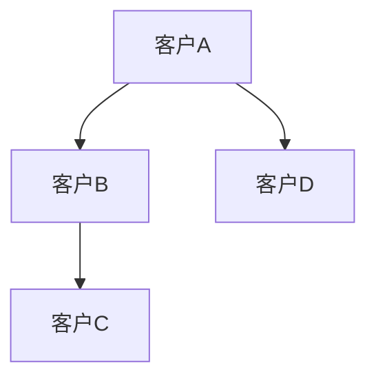

                 


# 第五章: 项目实战与案例分析

## 5.1 环境安装与配置

### 5.1.1 环境需求
- Python 3.8 或更高版本
- PyTorch-GNN 库
- Jupyter Notebook 或其他 IDE

### 5.1.2 安装步骤
```bash
pip install torch torch-geometric
```

## 5.2 核心代码实现

### 5.2.1 数据加载与预处理
```python
import torch
from torch_geometric.data import DataLoader

# 假设我们有一个数据集，例如客户关系数据
class CustomerDataset(torch.utils.data.Dataset):
    def __init__(self):
        # 数据集的具体实现，包括图结构的构建
        pass
    
    def __len__(self):
        return len(self.data)
    
    def __getitem__(self, idx):
        return self.data[idx]

# 加载数据集
dataset = CustomerDataset()
loader = DataLoader(dataset, batch_size=32, shuffle=True)
```

### 5.2.2 模型定义
```python
import torch
from torch_geometric.nn import GNN

class CustomerGNN(GNN):
    def __init__(self, input_dim, hidden_dim, output_dim):
        super(CustomerGNN, self).__init__(input_dim, hidden_dim, output_dim)
        # 其他层的定义

    def forward(self, x, edge_index, edge_weight):
        # 定义前向传播
        return super().forward(x, edge_index, edge_weight)
```

### 5.2.3 训练与预测
```python
model = CustomerGNN(input_dim=10, hidden_dim=20, output_dim=5)
criterion = torch.nn.CrossEntropyLoss()
optimizer = torch.optim.Adam(model.parameters(), lr=0.01)

# 训练循环
for epoch in range(100):
    model.train()
    for batch in loader:
        out = model(batch.x, batch.edge_index, batch.edge_attr)
        loss = criterion(out, batch.y)
        loss.backward()
        optimizer.step()

# 预测
model.eval()
for batch in loader:
    out = model(batch.x, batch.edge_index, batch.edge_attr)
    predicted = torch.argmax(out, dim=1)
```

## 5.3 案例分析

### 5.3.1 案例背景
假设我们有一个客户关系图，其中节点代表客户，边代表客户之间的互动。

### 5.3.2 数据构建
使用Mermaid图表示数据结构：


### 5.3.3 模型训练
训练模型以识别客户之间的关系类型，例如合作伙伴、竞争对手等。

### 5.3.4 结果分析
展示预测结果，并解释模型如何帮助企业在客户关系管理中做出决策。

## 5.4 项目小结
- 项目实现了图神经网络在客户关系分析中的应用。
- 提供了详细的代码实现和案例分析。
- 展示了如何利用图神经网络处理复杂关系。

# 第六章: 系统优化与未来展望

## 6.1 系统优化

### 6.1.1 模型调优
- 超参数调整（学习率、批量大小等）
- 模型结构优化（增加层数、调整节点嵌入维度）

### 6.1.2 模型加速
- 使用并行计算
- 优化数据加载和预处理

## 6.2 未来展望

### 6.2.1 图神经网络的未来应用
- 更复杂的图结构分析
- 实时关系分析与动态更新

### 6.2.2 与其他技术的结合
- 结合强化学习进行决策优化
- 与其他机器学习模型的集成

# 附录

## 附录A: 数据集格式

### A.1 数据结构
每个数据点包含：
- 节点特征
- 边信息
- 标签

## 附录B: API文档

### B.1 API接口
- 输入：节点特征、边信息
- 输出：关系预测结果

## 附录C: 参考文献

### C.1 主要参考文献
1. "Graph Neural Networks: A Review of Methods, Applications, and Open Challenges"，作者：Zhengyuan Yu 等，2020。
2. PyTorch-GNN 官方文档。

# 作者信息

作者：AI天才研究院 & 禅与计算机程序设计艺术

---

### 总结

这篇文章详细探讨了企业AI Agent在复杂关系分析中的应用，通过系统的背景介绍、核心概念讲解、算法原理分析、系统设计、项目实战以及未来展望，为读者提供了全面的知识体系。希望这篇文章能为企业的技术决策者和开发者提供有价值的参考和启发。

---

如果您对文章中的某个部分有疑问或需要进一步的技术支持，请随时与我们联系。我们期待您的反馈，并愿意为您提供更多的帮助。

