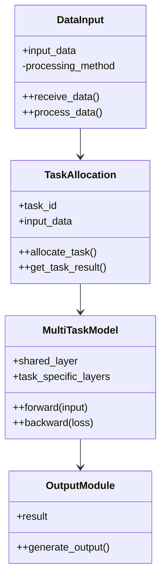
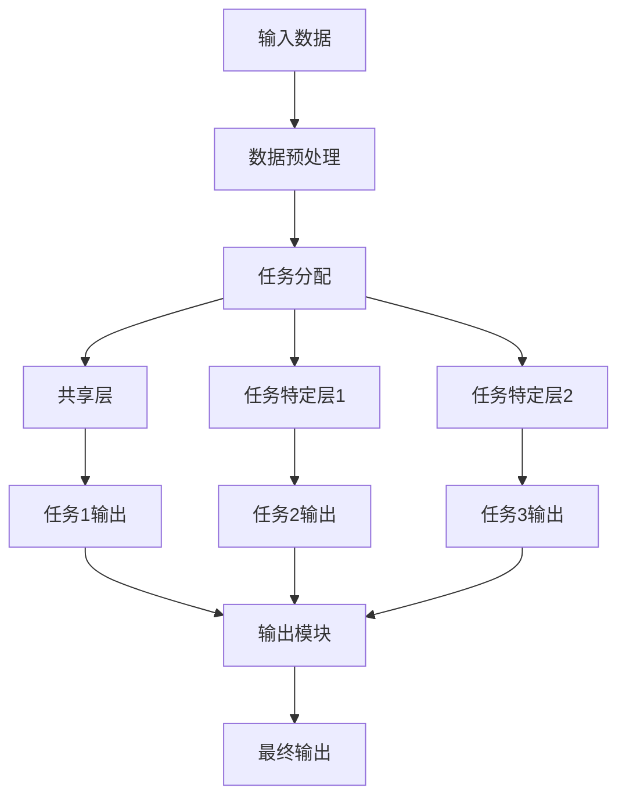

                 


# 企业AI Agent的多任务学习架构：提升效率与通用性

**关键词**：企业AI Agent、多任务学习、AI架构、机器学习、深度学习

**摘要**：  
本文深入探讨了企业AI Agent的多任务学习架构，分析了其在提升效率和通用性方面的优势。从核心概念、算法原理到系统架构设计，结合实际案例，详细阐述了如何通过多任务学习提升企业AI Agent的性能与应用场景。文章旨在为企业技术决策者和开发者提供理论支持和实践指导，帮助他们在复杂的企业环境中更高效地部署和优化AI Agent系统。

---

## 第一部分：企业AI Agent与多任务学习概述

### 第1章：企业AI Agent与多任务学习概述

#### 1.1 什么是企业AI Agent
企业AI Agent（Artificial Intelligence Agent）是一种能够感知环境、自主决策并执行任务的智能实体。它结合了人工智能、机器学习和自然语言处理等多种技术，旨在为企业提供智能化的解决方案。企业AI Agent的核心目标是通过自动化处理多个任务，提高企业的运营效率和决策能力。

**核心概念与特点**：  
- **自主性**：能够在没有人工干预的情况下独立完成任务。  
- **反应性**：能够实时感知环境并做出响应。  
- **学习能力**：通过数据和经验不断优化自身的决策能力。  
- **多任务性**：能够同时处理多种任务，并在任务之间共享知识和资源。

**应用场景**：  
企业AI Agent广泛应用于客服、供应链管理、数据分析、智能助手等领域。例如，在客服系统中，AI Agent可以同时处理多个客户的咨询请求，并根据客户的历史数据提供个性化的解决方案。

#### 1.2 多任务学习的基本概念
多任务学习（Multi-Task Learning, MTL）是一种机器学习范式，旨在通过同时学习多个相关任务来提升模型的泛化能力和效率。与单任务学习相比，多任务学习能够更好地利用任务之间的共享特征，减少数据需求，并提高模型的鲁棒性。

**多任务学习的特点**：  
- **任务共享性**：多个任务之间存在共享的特征和参数。  
- **联合优化**：通过同时优化多个任务的损失函数，提高整体性能。  
- **数据效率**：利用任务之间的共享信息，减少对每个任务独立数据的需求。

**主流多任务学习模型**：  
- **共享基模型**：所有任务共享一个基模型，每个任务在基模型的基础上添加任务特定的模块。  
- **层次化模型**：通过层次化的结构（如共享层和任务特定层）来实现任务之间的信息共享。  
- **专家网络**：多个专家模型分别处理不同的任务，通过协调机制实现任务间的协作。

#### 1.3 企业AI Agent的多任务学习架构
企业AI Agent的多任务学习架构是一种结合了多任务学习和企业应用场景的系统设计。该架构通过同时处理多个相关任务，提升了AI Agent的效率和通用性。

**架构组成**：  
- **感知层**：负责感知环境信息，包括数据输入和任务请求。  
- **决策层**：通过多任务学习模型进行任务分析和决策。  
- **执行层**：根据决策结果执行具体任务，并输出结果。  

**优势与挑战**：  
- **优势**：  
  - 提高模型的通用性和泛化能力。  
  - 通过任务共享减少数据需求和计算成本。  
  - 提升企业AI Agent的多任务处理能力。  
- **挑战**：  
  - 如何平衡不同任务之间的资源分配。  
  - 处理任务之间的冲突和协调问题。  
  - 模型的可解释性和可扩展性问题。

---

## 第二部分：企业AI Agent的多任务学习核心概念与联系

### 第2章：多任务学习的核心概念与原理

#### 2.1 多任务学习的原理
多任务学习的核心在于通过共享特征和参数来实现多个任务的联合优化。其基本原理是通过一个统一的损失函数来同时优化多个任务的目标函数。

**数学模型**：  
多任务学习的损失函数可以表示为：  
$$ L = \lambda_1 L_1 + \lambda_2 L_2 + \dots + \lambda_n L_n $$  
其中，$L_i$ 是第 $i$ 个任务的损失函数，$\lambda_i$ 是对应的权重系数。

**任务之间的关系**：  
- **正相关任务**：任务之间存在相似性，可以共享特征和参数。  
- **负相关任务**：任务之间存在冲突，需要通过协调机制来平衡。  

#### 2.2 多任务学习中的任务关联性分析
任务之间的关联性是多任务学习的关键因素。通过分析任务之间的依赖关系，可以更好地设计模型架构和优化策略。

**任务依赖关系**：  
- **并行任务**：任务之间相互独立，可以同时处理。  
- **串行任务**：任务之间存在顺序依赖，需要按顺序处理。  

**任务协同机制**：  
- **权重共享**：通过共享模型参数来实现任务之间的协同。  
- **任务门控机制**：通过门控网络来动态调整任务之间的信息共享。  

#### 2.3 多任务学习中的模型架构设计
多任务学习的模型架构设计需要考虑任务之间的共享与区分。常见的模型架构包括：

**共享基模型**：  
所有任务共享一个基模型，每个任务在基模型的基础上添加任务特定的模块。  
$$ f_i(x) = g(x) + h_i(x) $$  
其中，$g(x)$ 是基模型，$h_i(x)$ 是任务 $i$ 的特定模块。

**层次化模型**：  
通过层次化的结构来实现任务之间的信息共享。  
$$ f_i(x) = f(x) + g_i(x) $$  
其中，$f(x)$ 是共享层，$g_i(x)$ 是任务特定层。

---

## 第三部分：企业AI Agent多任务学习的算法原理与数学模型

### 第3章：多任务学习的算法原理

#### 3.1 多任务学习的数学模型
多任务学习的数学模型可以通过一个统一的优化目标来表示：  
$$ \min_{\theta} \sum_{i=1}^n \lambda_i L_i(\theta) $$  
其中，$\theta$ 是模型参数，$L_i(\theta)$ 是第 $i$ 个任务的损失函数，$\lambda_i$ 是权重系数。

**优化算法**：  
多任务学习的优化可以通过梯度下降方法实现：  
$$ \theta_{t+1} = \theta_t - \eta \sum_{i=1}^n \lambda_i \frac{\partial L_i}{\partial \theta} $$  
其中，$\eta$ 是学习率。

#### 3.2 多任务学习中的任务门控机制
任务门控机制是一种通过门控网络来动态调整任务之间信息共享的方法。其核心思想是为每个任务分配一个门控权重，以控制共享信息的流动。

**门控机制模型**：  
$$ g_i(x) = \sigma(W_g x + b_g) $$  
其中，$\sigma$ 是sigmoid函数，$W_g$ 和 $b_g$ 是门控网络的参数。

**任务输出**：  
$$ f_i(x) = g_i(x) \cdot f(x) + (1 - g_i(x)) \cdot h_i(x) $$  
其中，$f(x)$ 是共享基模型，$h_i(x)$ 是任务特定模型。

#### 3.3 多任务学习的实现代码
以下是一个简单的多任务学习实现代码示例：

```python
import torch
import torch.nn as nn

class MultiTaskModel(nn.Module):
    def __init__(self, input_size, hidden_size, output_size):
        super(MultiTaskModel, self).__init__()
        self.shared_layer = nn.Linear(input_size, hidden_size)
        self.task_specific_layers = nn.ModuleList([
            nn.Linear(hidden_size, output_size) for _ in range(num_tasks)
        ])
    
    def forward(self, x):
        x = self.shared_layer(x)
        outputs = []
        for i in range(num_tasks):
            outputs.append(self.task_specific_layers[i](x))
        return outputs

# 初始化模型和优化器
model = MultiTaskModel(input_size=10, hidden_size=20, output_size=5)
optimizer = torch.optim.Adam(model.parameters(), lr=0.001)

# 多任务损失函数
criterion = nn.CrossEntropyLoss()

# 假设输入数据为batch_size=32，输入特征为10维
x = torch.randn(32, 10)
y = torch.randint(0, 5, (32,))

# 前向传播
outputs = model(x)

# 计算损失
losses = []
for i in range(num_tasks):
    loss = criterion(outputs[i], y)
    losses.append(loss)

# 反向传播和优化
total_loss = sum(losses) / num_tasks
total_loss.backward()
optimizer.step()
```

---

## 第四部分：企业AI Agent多任务学习的系统架构设计

### 第4章：多任务学习的系统架构设计

#### 4.1 系统功能设计
企业AI Agent的多任务学习系统需要具备以下功能模块：

**功能模块**：  
- 数据输入模块：负责接收输入数据。  
- 任务分配模块：根据输入数据分配任务。  
- 多任务学习模型：负责处理多个任务。  
- 输出模块：返回处理结果。  

**领域模型（Mermaid 类图）**：



#### 4.2 系统架构设计
多任务学习的系统架构设计需要考虑任务之间的共享与区分。以下是一个可能的架构图：



---

## 第五部分：企业AI Agent多任务学习的项目实战

### 第5章：项目实战

#### 5.1 环境安装与配置
以下是项目实战所需的环境安装步骤：

**安装依赖**：  
```bash
pip install torch numpy matplotlib
```

**代码实现**：
```python
import torch
import torch.nn as nn
import torch.optim as optim
import numpy as np

# 数据生成
num_tasks = 3
batch_size = 32
input_size = 10
output_size = 5

# 定义模型
class MultiTaskModel(nn.Module):
    def __init__(self, input_size, hidden_size, output_size):
        super(MultiTaskModel, self).__init__()
        self.shared_layer = nn.Linear(input_size, hidden_size)
        self.task_specific_layers = nn.ModuleList([
            nn.Linear(hidden_size, output_size) for _ in range(num_tasks)
        ])
    
    def forward(self, x):
        x = self.shared_layer(x)
        outputs = []
        for i in range(num_tasks):
            outputs.append(self.task_specific_layers[i](x))
        return outputs

# 初始化模型和优化器
model = MultiTaskModel(input_size=10, hidden_size=20, output_size=5)
optimizer = optim.Adam(model.parameters(), lr=0.001)
criterion = nn.CrossEntropyLoss()

# 训练过程
for epoch in range(100):
    # 生成随机输入数据
    x = torch.randn(batch_size, input_size)
    y = torch.randint(0, output_size, (batch_size,))

    # 前向传播
    outputs = model(x)
    # 计算损失
    losses = []
    for i in range(num_tasks):
        loss = criterion(outputs[i], y)
        losses.append(loss)
    total_loss = sum(losses) / num_tasks
    # 反向传播和优化
    total_loss.backward()
    optimizer.step()

print("训练完成！")
```

#### 5.2 代码解读与分析
上述代码实现了一个简单的多任务学习模型，包含共享层和任务特定层。通过共享层提取输入数据的特征，并在任务特定层对每个任务进行独立的预测。

**代码解读**：  
- **模型定义**：通过`MultiTaskModel`类定义了共享层和任务特定层。  
- **前向传播**：共享层提取特征后，任务特定层分别对每个任务进行预测。  
- **损失计算**：通过多个任务的损失函数之和进行优化。  
- **优化过程**：使用Adam优化器进行反向传播和参数更新。

---

## 第六部分：企业AI Agent多任务学习的最佳实践与总结

### 第6章：最佳实践与总结

#### 6.1 小结
企业AI Agent的多任务学习架构通过共享特征和参数，提高了模型的效率和通用性。多任务学习在企业应用场景中具有广泛的应用潜力，但也面临任务协调和模型可解释性等挑战。

#### 6.2 最佳实践
- **任务关联性分析**：在设计多任务学习系统时，首先需要分析任务之间的关联性。  
- **模型架构设计**：根据任务的共享程度选择合适的模型架构。  
- **任务协调机制**：通过门控机制或权重分配等方法平衡任务之间的资源分配。  
- **模型优化**：合理设置任务权重和学习率，避免任务之间的冲突。  

#### 6.3 注意事项
- **数据质量**：确保任务之间的数据具有足够的相关性和多样性。  
- **模型可解释性**：多任务学习模型通常较为复杂，需要关注模型的可解释性。  
- **计算资源**：多任务学习需要较高的计算资源，需要合理配置硬件资源。  

#### 6.4 拓展阅读
- [《Multi-Task Learning: A Review》](https://ieeexplore.ieee.org/document/9092902)  
- [《Deep Multi-Task Learning》](https://arxiv.org/abs/1605.09333)  

---

**作者**：AI天才研究院（AI Genius Institute） & 禅与计算机程序设计艺术（Zen And The Art of Computer Programming）

