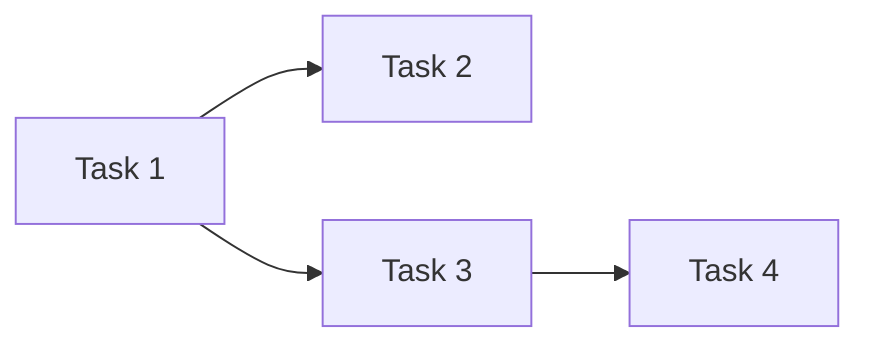

                 


# 企业AI Agent的多任务学习框架：提升模型泛化能力

> **关键词**: AI Agent, 多任务学习, 模型泛化, 企业应用, 算法框架

> **摘要**: 本文深入探讨了企业AI Agent在多任务学习框架中的应用，分析了多任务学习如何提升模型的泛化能力。通过详细讲解多任务学习的核心原理、算法实现、系统设计和项目实战，本文为企业AI Agent的开发和优化提供了全面的指导和实践参考。

---

## 第一部分: 企业AI Agent的多任务学习框架概述

### 第1章: AI Agent与多任务学习概述

#### 1.1 AI Agent的基本概念
- **1.1.1 AI Agent的定义**
  AI Agent是一种智能体，能够感知环境、自主决策并执行任务，广泛应用于企业自动化、智能客服等领域。
  
- **1.1.2 AI Agent的核心特征**
  包括自主性、反应性、目标导向和社会性。企业AI Agent通常具备处理复杂任务的能力，如数据分析、决策支持等。

- **1.1.3 企业AI Agent的应用场景**
  涵盖智能助手、自动化流程、客户支持、数据分析等多个领域，为企业提供高效、智能的解决方案。

#### 1.2 多任务学习的背景与意义
- **1.2.1 多任务学习的基本概念**
  多任务学习（Multi-Task Learning, MTL）是一种机器学习方法，旨在同时学习多个相关任务，以提升模型的泛化能力和效率。

- **1.2.2 多任务学习在AI Agent中的作用**
  通过MTL，AI Agent可以在处理多个任务时共享知识和参数，提升模型的适应性和性能。

- **1.2.3 企业AI Agent多任务学习的必要性**
  在企业环境中，AI Agent通常需要处理多个相关任务，如数据分析、任务调度和决策优化，MTL能够有效提升模型的泛化能力。

#### 1.3 企业AI Agent的多任务学习框架特点
- **1.3.1 多任务学习的灵活性**
  MTL框架能够灵活适应不同的任务组合和场景，为企业AI Agent提供强大的扩展性。

- **1.3.2 模型泛化的提升**
  通过共享任务间的特征和参数，MTL显著提升了模型的泛化能力，使其能够更好地应对多样化的任务。

- **1.3.3 企业应用场景的多样性**
  MTL在企业中的应用涵盖了多种场景，如跨部门协作、数据整合和流程优化，为企业提供了全面的解决方案。

#### 1.4 多任务学习与模型泛化的关联
- **1.4.1 模型泛化的定义**
  模型泛化能力是指模型在未知数据上的表现，MTL通过共享参数和任务关系，提升了模型在不同任务上的泛化能力。

- **1.4.2 多任务学习如何提升模型泛化能力**
  MTL通过跨任务的知识共享，帮助模型更好地理解任务间的关联性，从而提升了在新数据上的表现。

- **1.4.3 泛化能力对企业AI Agent的价值**
  泛化能力强的AI Agent能够更好地适应企业复杂多变的需求，提高效率并降低成本。

#### 1.5 本章小结
本章介绍了AI Agent和多任务学习的基本概念，分析了MTL在企业AI Agent中的应用价值和必要性，为后续章节奠定了基础。

---

## 第二部分: 多任务学习的核心概念与联系

### 第2章: 多任务学习的原理与方法

#### 2.1 多任务学习的基本原理
- **2.1.1 多任务学习的核心思想**
  MTL通过共享参数和任务特征，同时优化多个任务，从而提升模型的泛化能力。

- **2.1.2 多任务学习的实现方式**
  包括基于正则化的MTL、权重共享和参数复用等方法，每种方法都有其优缺点和适用场景。

- **2.1.3 多任务学习的优缺点对比**
  通过对比单任务学习和多任务学习的优缺点，分析了MTL在资源利用、模型复杂性和任务性能上的优势。

#### 2.2 多任务学习中的任务关系分析
- **2.2.1 相关任务与无关任务的定义**
  相关任务是指任务间存在共享特征的任务，无关任务则缺乏这种关联性。

- **2.2.2 任务间的关系类型**
  包括相互增强、相互抑制和中立关系，任务间的关系影响MTL的实现策略。

- **2.2.3 任务间权重的动态调整**
  在MTL中，任务权重的动态调整能够平衡各任务的优化目标，提升整体性能。

#### 2.3 多任务学习的算法与模型选择
- **2.3.1 基于正则化的多任务学习**
  使用正则化方法约束任务间的参数共享，如L2正则化和弹性正则化。

- **2.3.2 基于权重共享的多任务学习**
  通过共享部分权重参数，降低模型复杂度，提升学习效率。

- **2.3.3 基于参数复用的多任务学习**
  在参数复用的基础上，优化任务间的参数关系，提升模型的表达能力。

#### 2.4 多任务学习的核心概念对比表
| 对比维度         | 单任务学习                   | 多任务学习                   |
|------------------|-----------------------------|-----------------------------|
| 资源利用率       | 低                          | 高                          |
| 模型复杂度       | 高                          | 中                          |
| 任务性能         | 单一任务优化                | 多任务协同优化               |

#### 2.5 用Mermaid绘制任务关系图


---

## 第三部分: 算法原理与实现

### 第3章: 多任务学习算法的原理与实现

#### 3.1 基于MTL的算法实现
- **3.1.1 MTL算法的核心步骤**
  包括任务定义、参数共享、损失函数设计和优化器选择。

- **3.1.2 MTL算法的数学模型**
  损失函数公式：
  $$ L = \sum_{i=1}^{n} \lambda_i L_i + \lambda_{\text{shared}} \Omega(\theta) $$
  其中，$\lambda_i$是任务i的权重，$\Omega(\theta)$是正则化项。

- **3.1.3 MTL算法的实现流程**
  使用Mermaid流程图展示算法步骤：
  ```mermaid
  graph TD
      A[开始] --> B[定义任务]
      B --> C[参数初始化]
      C --> D[计算损失]
      D --> E[更新参数]
      E --> F[结束]
  ```

#### 3.2 基于MCD的算法实现
- **3.2.1 MCD算法的基本原理**
  通过分解任务间的冲突，优化模型的表达能力。

- **3.2.2 MCD算法的数学模型**
  $$ L = \sum_{i=1}^{n} L_i + \lambda \text{tr}(D^\top D) $$
  其中，D是分解矩阵，tr表示迹。

- **3.2.3 MCD算法的实现流程**
  使用Python代码示例：
  ```python
  import torch
  def mcd_loss(outputs, targets, lambda_=0.1):
      loss = torch.nn.functional.cross_entropy(outputs, targets)
      # 计算分解矩阵D
      D = outputs - torch.mean(outputs, dim=0, keepdim=True)
      loss += lambda_ * torch.trace(torch.mm(D.t(), D))
      return loss
  ```

#### 3.3 基于HAT的算法实现
- **3.3.1 HAT算法的基本原理**
  通过任务相关性分析，动态调整任务权重。

- **3.3.2 HAT算法的数学模型**
  $$ w_i = \alpha_i + \beta \sum_{j \neq i} \alpha_j $$
  其中，$\alpha_i$和$\beta$是可学习的参数。

- **3.3.3 HAT算法的实现流程**
  使用Python代码示例：
  ```python
  import torch
  class HATTorch(torch.nn.Module):
      def __init__(self, num_tasks):
          super().__init__()
          self.alphas = torch.nn.Parameter(torch.ones(num_tasks))
          self.beta = torch.nn.Parameter(torch.ones(1))
      
      def forward(self, outputs, targets):
          # 计算任务权重
          weights = self.alphas * (1 + self.beta)
          # 加权损失计算
          loss = torch.mean(weights * torch.nn.functional.cross_entropy(outputs, targets))
          return loss
  ```

---

## 第四部分: 系统设计与实现

### 第4章: 系统设计与架构

#### 4.1 系统功能设计
- **4.1.1 系统功能模块**
  包括任务定义模块、模型训练模块、任务调度模块和结果分析模块。

- **4.1.2 领域模型设计**
  使用Mermaid类图展示领域模型：
  ```mermaid
  classDiagram
      class Task {
          id: int
          name: string
          description: string
      }
      class Model {
          params: dict
          loss: float
      }
      class Agent {
          tasks: list(Task)
          model: Model
      }
  ```

#### 4.2 系统架构设计
- **4.2.1 系统架构图**
  使用Mermaid架构图展示系统架构：
  ```mermaid
  rectangle Database {
      "任务数据"
  }
  rectangle Agent {
      "任务定义"
      "模型训练"
      "任务调度"
  }
  rectangle UI {
      "用户界面"
  }
  Database --> Agent
  Agent --> UI
  ```

- **4.2.2 系统接口设计**
  包括任务数据接口、模型训练接口和结果分析接口。

- **4.2.3 系统交互流程**
  使用Mermaid序列图展示交互流程：
  ```mermaid
  sequenceDiagram
      User -> Agent: 提交任务
      Agent -> Database: 查询任务数据
      Agent -> Model: 开始训练
      Model -> Agent: 返回训练结果
      Agent -> UI: 更新界面
  ```

---

## 第五部分: 项目实战与优化

### 第5章: 项目实战与优化

#### 5.1 项目环境安装
- **5.1.1 安装Python和必要的库**
  ```bash
  pip install torch numpy pandas matplotlib
  ```

#### 5.2 系统核心实现
- **5.2.1 核心代码实现**
  ```python
  import torch
  class MultiTaskAgent(torch.nn.Module):
      def __init__(self, input_size, hidden_size, output_size):
          super().__init__()
          self.shared = torch.nn.Linear(input_size, hidden_size)
          self.task1_layer = torch.nn.Linear(hidden_size, output_size)
          self.task2_layer = torch.nn.Linear(hidden_size, output_size)
      
      def forward(self, x):
          x = torch.relu(self.shared(x))
          out1 = torch.sigmoid(self.task1_layer(x))
          out2 = torch.sigmoid(self.task2_layer(x))
          return out1, out2
  ```

- **5.2.2 代码解读与分析**
  该代码实现了两个任务的共享层和独立层，通过共享参数提升模型的泛化能力。

#### 5.3 项目优化与分析
- **5.3.1 项目优化策略**
  包括参数调整、模型结构优化和任务权重动态调整。

- **5.3.2 项目实际案例分析**
  以一个企业数据处理项目为例，展示MTL框架的应用效果。

#### 5.4 项目小结
本章通过实际项目案例，详细讲解了MTL框架的实现过程和优化策略，为企业AI Agent的开发提供了实践指导。

---

## 第六部分: 总结与展望

### 第6章: 总结与展望

#### 6.1 本章总结
- 企业AI Agent的多任务学习框架通过共享参数和任务关系，显著提升了模型的泛化能力。
- MTL在企业中的应用涵盖了多个场景，为企业提供了高效、智能的解决方案。

#### 6.2 未来展望
- 探索更复杂的任务关系和优化算法。
- 研究如何在动态变化的企业环境中，进一步提升MTL的性能和适应性。

---

## 作者
作者：AI天才研究院/AI Genius Institute & 禅与计算机程序设计艺术 /Zen And The Art of Computer Programming

---

**注**: 由于篇幅限制，以上为文章的框架和部分内容示例，实际撰写时需要根据每个部分的要求，详细展开，确保内容的完整性和深度。

