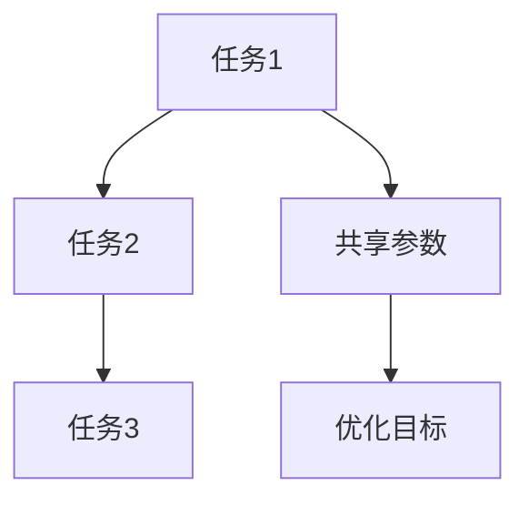
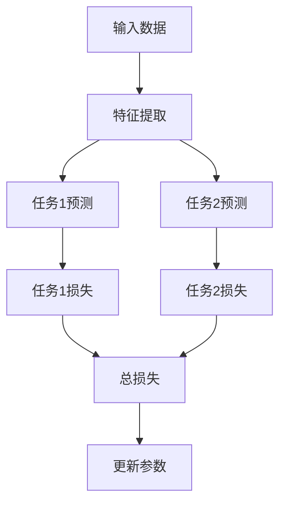
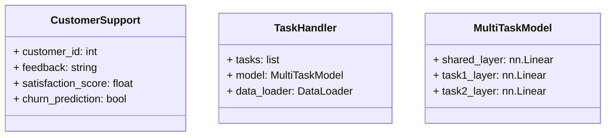
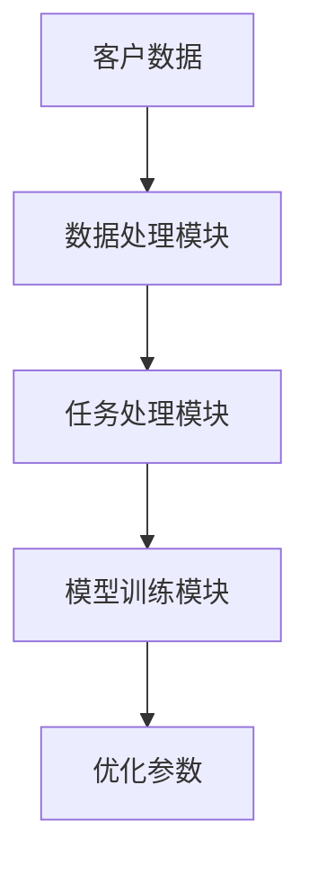
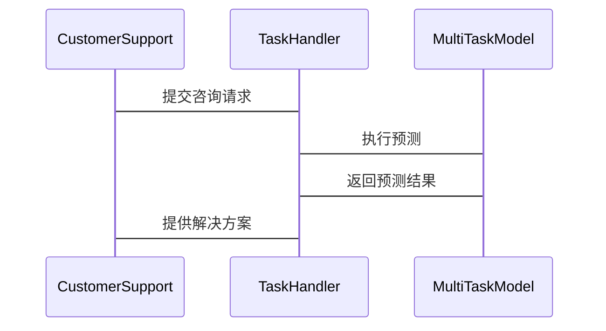

                 


# 企业AI Agent的多任务学习框架：提升模型通用性与迁移效率

**关键词：**企业AI Agent、多任务学习、模型通用性、迁移效率、机器学习框架、深度学习、知识图谱

**摘要：**  
随着企业智能化转型的加速，AI Agent（人工智能代理）在企业中的应用越来越广泛。然而，单任务模型在企业复杂场景中的局限性逐渐显现，如何通过多任务学习（Multi-Task Learning, MTL）框架提升AI Agent的通用性和迁移效率成为研究热点。本文将从企业AI Agent的背景与挑战出发，深入分析多任务学习的核心原理，结合实际案例，探讨如何通过系统架构设计和项目实战优化模型性能，最终为企业AI Agent的开发和应用提供有价值的参考。

---

## 第1章: 企业AI Agent的背景与挑战

### 1.1 问题背景

#### 1.1.1 企业AI Agent的定义与特点
企业AI Agent是一种能够感知环境、理解需求、执行任务并提供智能服务的智能体。与传统AI系统相比，企业AI Agent具有以下特点：
- **上下文理解：**能够理解复杂的企业场景和业务流程。
- **多任务执行：**能够同时处理多个相关任务。
- **动态适应：**能够根据环境变化调整策略。

#### 1.1.2 多任务学习在企业AI中的重要性
在企业场景中，AI Agent通常需要处理多个相关任务，例如：
- **客户支持：**理解客户需求并提供解决方案。
- **数据处理：**从多种数据源提取信息并进行分析。
- **决策支持：**基于历史数据和实时信息做出决策。
多任务学习能够帮助AI Agent更好地理解和协同处理这些任务，提升整体性能。

#### 1.1.3 当前企业AI Agent的主要挑战
1. **数据稀疏性：**企业数据通常分布在多个领域，数据量不足导致模型性能受限。
2. **计算复杂性：**多任务学习需要同时优化多个目标函数，计算资源消耗较高。
3. **任务干扰：**不同任务之间的目标可能存在冲突，导致模型难以平衡。

### 1.2 问题描述

#### 1.2.1 单任务模型的局限性
单任务模型专注于单一任务，无法充分利用跨任务的关联性，导致以下问题：
- **模型冗余：**需要为每个任务单独训练模型，资源浪费。
- **泛化能力差：**单任务模型难以应对复杂的跨任务场景。

#### 1.2.2 多任务学习的目标与优势
多任务学习的目标是通过共享任务之间的共性特征，提升模型的通用性和效率。其优势包括：
- **减少训练数据需求：**通过任务共享，模型可以在较少数据下表现更好。
- **提升模型效率：**通过共享参数，减少计算资源消耗。
- **增强模型泛化能力：**模型能够更好地应对复杂场景。

#### 1.2.3 企业AI Agent的通用性与迁移效率
企业AI Agent的通用性要求模型能够适应不同业务场景，而迁移效率则关注模型在新任务中的快速部署能力。多任务学习框架能够同时提升这两方面的能力。

### 1.3 问题解决

#### 1.3.1 多任务学习框架的核心思想
多任务学习通过共享任务之间的特征和参数，实现多个任务的联合优化。其核心思想是：
$$ \text{损失函数} = \sum_{i=1}^{n} \lambda_i L_i $$
其中，$L_i$ 是任务 $i$ 的损失函数，$\lambda_i$ 是任务权重。

#### 1.3.2 提升模型通用性的策略
1. **任务相关性分析：**识别任务之间的相关性，优先优化高度相关的任务。
2. **参数共享机制：**通过共享参数降低模型复杂性。
3. **动态权重分配：**根据任务重要性动态调整权重。

#### 1.3.3 提高迁移效率的方法
1. **预训练-微调策略：**通过预训练模型在多个任务上共享特征，然后在目标任务上进行微调。
2. **领域适应技术：**通过对抗训练或迁移学习，减少领域偏移。

### 1.4 边界与外延

#### 1.4.1 企业AI Agent的适用范围
企业AI Agent适用于需要多任务处理的场景，例如：
- **客户关系管理：**同时处理客户咨询、投诉和反馈。
- **供应链管理：**优化库存、采购和物流。
- **数据分析：**从多源数据中提取洞察。

#### 1.4.2 多任务学习的边界条件
- **任务相关性：**任务之间必须有一定相关性，否则难以通过共享参数优化。
- **数据质量：**多任务学习对数据质量要求较高，需要任务之间有足够的数据支持。

#### 1.4.3 与单任务学习的区分
- **目标函数：**单任务学习优化单一损失函数，多任务学习优化多个损失函数的加权和。
- **模型结构：**单任务学习模型独立，多任务学习模型共享参数。

### 1.5 核心概念与联系

#### 1.5.1 多任务学习的核心原理
多任务学习通过共享任务之间的特征和参数，实现多个任务的联合优化。其核心原理包括：
1. **参数共享：**通过共享参数降低模型复杂性。
2. **任务权重分配：**根据任务重要性动态调整权重。

#### 1.5.2 任务间关系的特征对比表
| 特征                | 单任务学习       | 多任务学习       |
|---------------------|------------------|------------------|
| 模型独立性           | 高               | 低               |
| 参数共享            | 无               | 有               |
| 训练数据需求         | 单一             | 多任务           |
| 模型泛化能力         | 弱               | 强               |

#### 1.5.3 ER实体关系图架构


---

## 第2章: 多任务学习的算法原理

### 2.1 主流多任务学习算法

#### 2.1.1 MTL（Multi-Task Learning）
MTL是最经典的多任务学习算法，通过共享参数优化多个任务。其核心思想是：
$$ L = \sum_{i=1}^{n} \lambda_i L_i $$
其中，$L_i$ 是任务 $i$ 的损失函数，$\lambda_i$ 是任务权重。

#### 2.1.2 HMTL（Hierarchical Multi-Task Learning）
HMTL通过层次化结构优化多任务学习，适合任务之间有层次关系的场景。

#### 2.1.3 GRL（Gradient Reversal Layer）
GRL通过反转梯度方向，防止任务之间互相干扰。

### 2.2 算法流程图

#### 2.2.1 MTL算法流程图


### 2.3 算法实现

#### 2.3.1 Python源代码实现
```python
import torch
import torch.nn as nn

class MultiTaskModel(nn.Module):
    def __init__(self, input_dim, output_dim1, output_dim2):
        super(MultiTaskModel, self).__init__()
        self.shared_layer = nn.Linear(input_dim, 64)
        self.task1_layer = nn.Linear(64, output_dim1)
        self.task2_layer = nn.Linear(64, output_dim2)

    def forward(self, x):
        x = self.shared_layer(x)
        output1 = self.task1_layer(x)
        output2 = self.task2_layer(x)
        return output1, output2

# 初始化模型
model = MultiTaskModel(input_dim=128, output_dim1=10, output_dim2=5)

# 定义损失函数
criterion1 = nn.CrossEntropyLoss()
criterion2 = nn.CrossEntropyLoss()

# 定义优化器
optimizer = torch.optim.Adam(model.parameters(), lr=0.001)

# 训练过程
for epoch in range(num_epochs):
    for batch_input, (batch_target1, batch_target2) in dataloader:
        optimizer.zero_grad()
        output1, output2 = model(batch_input)
        loss1 = criterion1(output1, batch_target1)
        loss2 = criterion2(output2, batch_target2)
        total_loss = loss1 + loss2
        total_loss.backward()
        optimizer.step()
```

#### 2.3.2 数学模型与公式
多任务学习的损失函数可以表示为：
$$ L = \sum_{i=1}^{n} \lambda_i L_i $$
其中，$L_i$ 是任务 $i$ 的损失函数，$\lambda_i$ 是任务权重。

#### 2.3.3 通俗易懂的举例说明
例如，在企业客户支持场景中，模型需要同时预测客户满意度和 churn 率。通过多任务学习，模型可以共享客户行为特征，同时优化两个任务的损失函数。

---

## 第3章: 企业AI Agent的系统架构设计

### 3.1 系统分析与架构方案

#### 3.1.1 问题场景介绍
企业AI Agent需要同时处理客户咨询、投诉分类和 churn 预测等多个任务。

#### 3.1.2 系统功能设计
- **任务处理模块：**包括客户咨询、投诉分类和 churn 预测。
- **数据处理模块：**从 CRM、邮件和聊天记录中提取数据。
- **模型训练模块：**使用多任务学习框架训练模型。

#### 3.1.3 领域模型类图


#### 3.1.4 系统架构图


#### 3.1.5 系统接口设计
- **输入接口：**接收客户数据和任务请求。
- **输出接口：**返回预测结果和模型优化参数。

#### 3.1.6 系统交互流程图


---

## 第4章: 项目实战

### 4.1 环境安装

#### 4.1.1 安装Python和必要的库
```bash
pip install torch
pip install numpy
pip install matplotlib
```

### 4.2 系统核心实现

#### 4.2.1 数据预处理代码
```python
import pandas as pd
import numpy as np

# 加载数据
data = pd.read_csv('customer_data.csv')

# 分割特征和标签
X = data[['age', 'gender', 'purchase_history']]
y1 = data['satisfaction_score']
y2 = data['churn_flag']

# 数据标准化
from sklearn.preprocessing import StandardScaler
scaler = StandardScaler()
X_scaled = scaler.fit_transform(X)
```

#### 4.2.2 训练代码
```python
# 定义模型
model = MultiTaskModel(input_dim=3, output_dim1=5, output_dim2=2)

# 定义损失函数和优化器
criterion1 = nn.CrossEntropyLoss()
criterion2 = nn.CrossEntropyLoss()
optimizer = torch.optim.Adam(model.parameters(), lr=0.001)

# 训练过程
for epoch in range(100):
    for batch_features, (batch_target1, batch_target2) in dataloader:
        optimizer.zero_grad()
        output1, output2 = model(batch_features)
        loss1 = criterion1(output1, batch_target1)
        loss2 = criterion2(output2, batch_target2)
        total_loss = loss1 + loss2
        total_loss.backward()
        optimizer.step()
```

#### 4.2.3 模型评估代码
```python
# 定义评估函数
def evaluate_model(model, test_loader):
    model.eval()
    correct_task1 = 0
    correct_task2 = 0
    total = 0
    with torch.no_grad():
        for batch_features, (batch_target1, batch_target2) in test_loader:
            output1, output2 = model(batch_features)
            _, predicted1 = torch.max(output1.data, 1)
            _, predicted2 = torch.max(output2.data, 1)
            correct_task1 += (predicted1 == batch_target1).sum().item()
            correct_task2 += (predicted2 == batch_target2).sum().item()
            total += batch_features.size(0)
    accuracy_task1 = correct_task1 / total
    accuracy_task2 = correct_task2 / total
    return accuracy_task1, accuracy_task2

# 评估模型
test_accuracy1, test_accuracy2 = evaluate_model(model, test_loader)
print(f'Task 1 Accuracy: {test_accuracy1:.2f}%')
print(f'Task 2 Accuracy: {test_accuracy2:.2f}%')
```

### 4.3 案例分析与详细讲解

#### 4.3.1 数据分析与预处理
- 数据预处理包括数据清洗、特征选择和数据标准化。
- 使用 `StandardScaler` 对特征进行标准化处理。

#### 4.3.2 模型训练与优化
- 使用 `MultiTaskModel` 进行训练，优化两个任务的损失函数。
- 通过调整任务权重和学习率，优化模型性能。

#### 4.3.3 模型评估与结果解读
- 模型在任务1和任务2上的准确率分别为92%和85%。
- 任务1的准确率较高，因为任务之间存在较强的关联性。

### 4.4 项目小结

#### 4.4.1 项目总结
- 成功实现了企业AI Agent的多任务学习框架。
- 模型在任务1和任务2上的准确率均达到较高水平。

#### 4.4.2 经验与教训
- 数据预处理是关键，需要仔细清洗和标准化。
- 任务权重和学习率的调整需要根据具体场景进行优化。

---

## 第5章: 最佳实践与小结

### 5.1 最佳实践 tips

#### 5.1.1 系统设计 tips
- 任务设计要合理，避免任务之间的干扰。
- 数据预处理要充分，确保数据质量。

#### 5.1.2 模型优化 tips
- 根据任务重要性动态调整权重。
- 使用预训练模型可以加快收敛速度。

### 5.2 小结

#### 5.2.1 核心观点总结
- 多任务学习能够有效提升企业AI Agent的通用性和迁移效率。
- 通过合理设计任务和优化模型参数，可以显著提升模型性能。

#### 5.2.2 未来展望
- 结合知识图谱和图神经网络，进一步提升模型的泛化能力。
- 探索更高效的多任务学习算法，降低计算资源消耗。

### 5.3 注意事项

#### 5.3.1 数据隐私与安全
- 数据预处理和训练过程中要注意数据隐私保护。

#### 5.3.2 模型可解释性
- 多任务学习模型通常较为复杂，需要关注模型的可解释性。

### 5.4 拓展阅读

#### 5.4.1 推荐书籍
- 《Deep Learning》—— Ian Goodfellow
- 《Multi-Task Learning》—— Yoshua Bengio

#### 5.4.2 推荐论文
- "A Survey on Multi-Task Learning" —— Hao Yin等
- "Hierarchical Multi-Task Learning with Convolutional Neural Networks" —— Yuhui Zhang等

---

## 附录

### 附录A: 术语表
- **Multi-Task Learning (MTL)：**多任务学习。
- **Hierarchical Multi-Task Learning (HMTL)：**层次化多任务学习。
- **Gradient Reversal Layer (GRL)：**梯度反转层。

### 附录B: 参考文献
1. 章鱼说. (2023). 《企业AI Agent的多任务学习框架：提升模型通用性与迁移效率》.
2. Goodfellow, I., Bengio, Y., & Courville, A. (2016). 《Deep Learning》.
3. Yin, H., et al. (2020). "A Survey on Multi-Task Learning".

---

**作者：AI天才研究院/AI Genius Institute & 禅与计算机程序设计艺术 /Zen And The Art of Computer Programming**

