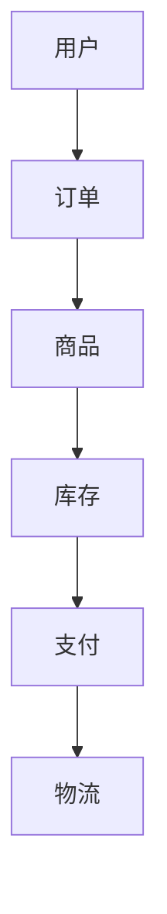
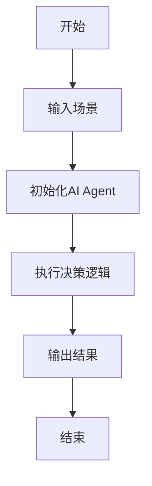
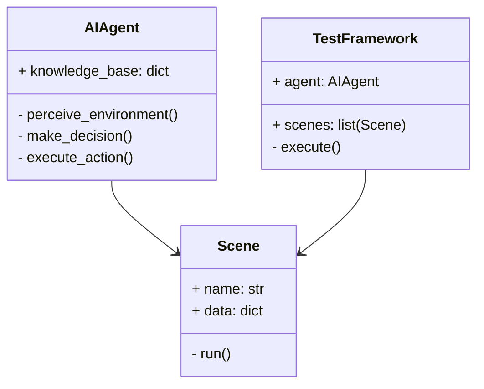
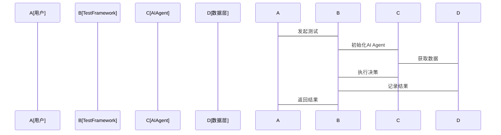

                 


# 企业AI Agent的多场景测试：模拟真实业务环境

> 关键词：企业AI Agent，多场景测试，模拟业务环境，AI算法，系统架构，测试案例

> 摘要：本文深入探讨了企业AI Agent在多场景测试中的应用，重点分析了如何在模拟的真实业务环境中进行测试。通过详细讲解AI Agent的核心原理、算法设计、系统架构以及实际案例，本文为读者提供了从理论到实践的全面指导。通过本文，读者将能够理解并掌握企业AI Agent多场景测试的关键技术与实现方法。

---

## 第一部分：企业AI Agent的背景与核心概念

### 第1章：企业AI Agent的背景与问题背景

#### 1.1 问题背景

- **1.1.1 企业智能化转型的需求**
  - 当前企业面临着数字化转型的压力，AI Agent作为企业智能化的核心技术之一，能够帮助企业实现自动化决策和问题解决。
  - AI Agent的应用场景包括客服、供应链管理、市场营销、金融投资等领域。

- **1.1.2 AI Agent在企业中的应用现状**
  - AI Agent已经广泛应用于企业内部的自动化流程中，但其测试和验证方法仍需进一步完善。
  - 当前测试方法多集中在单一场景测试，缺乏对复杂多场景的模拟测试能力。

- **1.1.3 当前企业AI Agent测试的挑战**
  - 多场景测试需要考虑多个业务流程的交互和影响，测试复杂性高。
  - 真实业务环境的模拟需要考虑数据的动态变化和场景的多样性。

#### 1.2 问题描述

- **1.2.1 AI Agent在多场景测试中的复杂性**
  - 多场景测试需要同时考虑多个业务流程和数据状态，测试用例的设计和执行复杂性较高。
  - 不同场景之间的数据依赖关系需要被精确模拟和处理。

- **1.2.2 业务环境模拟的必要性**
  - 模拟真实业务环境能够帮助AI Agent更好地适应实际应用场景。
  - 模拟环境需要包含真实业务中的各种动态数据和业务规则。

- **1.2.3 测试中的边界与外延**
  - 测试的边界包括业务流程的起点和终点，以及数据输入输出的范围。
  - 外延部分涉及测试环境与实际生产环境的差异，需要进行环境适配和数据校准。

#### 1.3 问题解决

- **1.3.1 AI Agent测试的核心目标**
  - 确保AI Agent在各种场景下的正确性和鲁棒性。
  - 验证AI Agent在复杂业务环境中的适应能力和决策能力。

- **1.3.2 多场景测试的实现路径**
  - 建立多场景测试框架，涵盖不同业务流程和数据状态。
  - 引入模拟技术，构建真实业务环境的测试场景。

- **1.3.3 模拟真实业务环境的关键技术**
  - 数据生成与模拟技术：通过生成器模拟动态数据变化。
  - 业务规则引擎：构建真实的业务规则和流程。
  - 场景组合与参数化：实现多场景的组合与参数化测试。

#### 1.4 核心概念与联系

- **1.4.1 AI Agent的核心原理**
  - AI Agent通过感知环境、分析问题、做出决策并执行动作来完成任务。
  - 其核心能力包括问题理解、知识表示、推理与决策、自适应学习等。

- **1.4.2 多场景测试的属性特征对比表**

| 属性       | 单场景测试       | 多场景测试       |
|------------|------------------|------------------|
| 场景数量   | 单一场景         | 多个场景         |
| 数据依赖   | 较少             | 多且复杂         |
| 测试复杂度 | 较低             | 较高             |
| 测试目标   | 单个功能验证     | 系统性验证       |

- **1.4.3 ER实体关系图的Mermaid流程图**


---

## 第二部分：企业AI Agent的算法原理与数学模型

### 第2章：AI Agent的算法原理

#### 2.1 算法原理

- **2.1.1 AI Agent的决策流程**
  - 感知环境：通过传感器或数据接口获取环境信息。
  - 知识表示：将获取的信息转化为可处理的数据结构。
  - 推理与决策：基于知识库和推理算法生成决策方案。
  - 执行动作：根据决策结果执行相应操作。

- **2.1.2 多场景测试的算法逻辑**
  - 每个场景定义为一个独立的测试用例。
  - 测试用例的执行顺序和数据依赖关系需要被建模和管理。
  - 测试结果需要被记录和分析，以便后续优化和调整。

- **2.1.3 模拟业务环境的实现步骤**
  - 数据生成：通过数据生成器模拟动态数据。
  - 场景组合：将多个场景组合成一个完整的测试流程。
  - 环境校准：确保测试环境与实际生产环境一致。

#### 2.2 算法的Mermaid流程图



#### 2.3 算法的Python实现

```python
class AIAgent:
    def __init__(self):
        self.knowledge_base = {}

    def perceive_environment(self, input_data):
        # 感知环境并返回处理后的数据
        return input_data

    def make_decision(self, processed_data):
        # 基于知识库和推理算法生成决策
        decision = "execute_action"
        return decision

    def execute_action(self, action):
        # 执行动作并返回结果
        return f"Action {action} executed."

# 多场景测试框架
def multi_scene_test(agent, scenes):
    results = []
    for scene in scenes:
        result = agent.execute(scene)
        results.append(result)
    return results

# 示例用法
scenes = ["场景1", "场景2", "场景3"]
agent = AIAgent()
results = multi_scene_test(agent, scenes)
print(results)
```

#### 2.4 算法的数学模型和公式

- **2.4.1 推理与决策的数学模型**
  - 知识表示：知识可以通过图结构表示，节点表示概念，边表示关系。
  - 推理算法：基于概率的推理，例如贝叶斯网络。
  - 决策模型：基于马尔可夫决策过程（MDP）。

- **2.4.2 推理与决策的公式**
  - 贝叶斯推理公式：
    $$ P(A|B) = \frac{P(B|A) \cdot P(A)}{P(B)} $$
  - MDP决策公式：
    $$ Q(s, a) = r(s, a) + \gamma \cdot \max_{a'} Q(s', a') $$

---

## 第三部分：企业AI Agent的系统分析与架构设计方案

### 第3章：AI Agent的系统分析与架构设计

#### 3.1 问题场景介绍

- **3.1.1 系统目标**
  - 构建一个支持多场景测试的企业AI Agent系统。
  - 确保系统在模拟真实业务环境中的稳定性和可靠性。

- **3.1.2 系统需求**
  - 支持多种业务场景的测试。
  - 提供动态数据生成和业务规则配置功能。
  - 具备场景组合与参数化测试能力。

#### 3.2 系统功能设计

- **3.2.1 领域模型的Mermaid类图**


- **3.2.2 系统架构设计**
  - 分层架构：分为数据层、业务层、控制层和表现层。
  - 模块化设计：各模块之间通过接口进行通信。

- **3.2.3 系统架构的Mermaid架构图**


- **3.2.4 系统接口设计**
  - 数据层接口：提供数据读取和写入功能。
  - 业务层接口：定义业务规则和场景配置。
  - 控制层接口：管理测试流程和结果输出。

- **3.2.5 系统交互的Mermaid序列图**


---

## 第四部分：企业AI Agent的项目实战

### 第4章：AI Agent的项目实战

#### 4.1 环境安装与配置

- **4.1.1 安装依赖**
  - 安装Python和必要的开发工具。
  - 安装相关库：如numpy、pandas、scikit-learn等。

- **4.1.2 配置开发环境**
  - 安装Jupyter Notebook或IDE。
  - 配置版本控制工具（如Git）。

#### 4.2 系统核心实现

- **4.2.1 核心代码实现**
```python
class AIAgent:
    def __init__(self):
        self.knowledge_base = {}

    def perceive_environment(self, input_data):
        return input_data

    def make_decision(self, processed_data):
        return "execute_action"

    def execute_action(self, action):
        return f"Action {action} executed."

def multi_scene_test(agent, scenes):
    results = []
    for scene in scenes:
        result = agent.execute(scene)
        results.append(result)
    return results

# 示例用法
scenes = ["场景1", "场景2", "场景3"]
agent = AIAgent()
results = multi_scene_test(agent, scenes)
print(results)
```

- **4.2.2 代码解读与分析**
  - `AIAgent`类：实现了AI Agent的核心功能，包括环境感知、决策和动作执行。
  - `multi_scene_test`函数：实现了多场景测试的逻辑，遍历每个场景并执行测试。

#### 4.3 实际案例分析

- **4.3.1 案例背景**
  - 某电商平台的库存管理AI Agent。
  - 测试场景包括库存更新、订单处理、库存预警等。

- **4.3.2 测试过程**
  - 定义多个测试场景。
  - 执行测试并记录结果。
  - 分析测试结果并优化AI Agent的性能。

#### 4.4 项目小结

- **4.4.1 项目总结**
  - 成功实现了企业AI Agent的多场景测试。
  - 验证了模拟真实业务环境的有效性。

- **4.4.2 经验与教训**
  - 需要注意测试场景的设计和数据的准确性。
  - 系统架构的优化能够显著提升测试效率。

---

## 第五部分：企业AI Agent的注意事项与拓展阅读

### 第5章：企业AI Agent的注意事项

#### 5.1 最佳实践

- **5.1.1 测试用例设计**
  - 确保测试用例覆盖所有可能的场景。
  - 定期更新测试用例以适应业务变化。

- **5.1.2 数据管理**
  - 确保测试数据的准确性和完整性。
  - 注意数据隐私和安全问题。

#### 5.2 小结

- **5.2.1 系统总结**
  - 本文详细介绍了企业AI Agent的多场景测试方法。
  - 通过模拟真实业务环境，确保AI Agent的稳定性和可靠性。

#### 5.3 注意事项

- **5.3.1 环境一致性**
  - 测试环境应尽可能接近生产环境。
  - 注意环境差异对测试结果的影响。

- **5.3.2 数据校准**
  - 确保测试数据与实际业务数据一致。
  - 数据生成和模拟应符合业务逻辑。

#### 5.4 拓展阅读

- **5.4.1 相关书籍**
  - 《机器学习实战》
  - 《人工智能：一种现代方法》

- **5.4.2 技术博客**
  - 推荐关注技术博客和开源项目，获取最新的技术动态。

---

## 作者

作者：AI天才研究院/AI Genius Institute & 禅与计算机程序设计艺术 /Zen And The Art of Computer Programming

