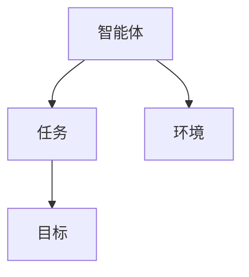
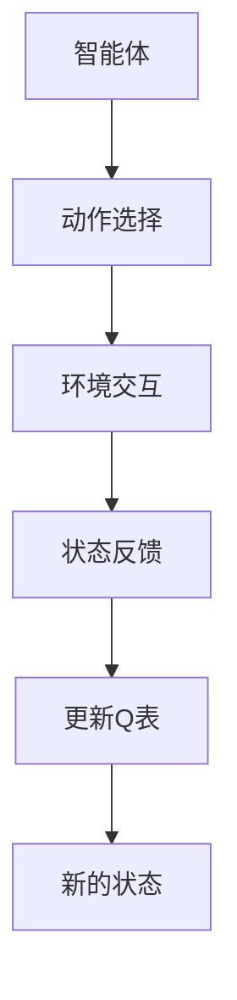
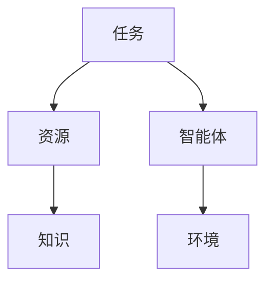
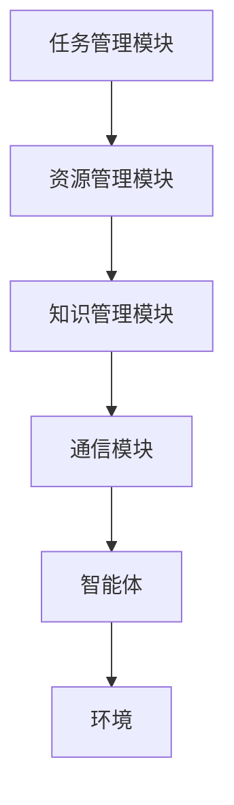

                 


# 企业AI Agent的多智能体系统在团队协作中的应用

> 关键词：企业协作、多智能体系统、AI Agent、团队协作、分布式计算、一致性算法、强化学习

> 摘要：本文深入探讨了企业AI Agent的多智能体系统在团队协作中的应用，分析了多智能体系统的核心概念、算法原理、系统架构以及实际项目中的应用案例。通过详细的技术分析和实际案例，本文为读者提供了全面了解和应用企业AI Agent的多智能体系统提供了理论和实践指导。

---

# 第1章: 企业协作中的多智能体系统概述

## 1.1 问题背景与问题描述

### 1.1.1 企业协作中的问题与挑战

企业在团队协作中面临以下问题：
- **信息孤岛**：各部门之间的信息不共享，导致效率低下。
- **协作低效**：任务分配和执行缺乏智能化支持，容易出现资源浪费。
- **动态变化**：市场需求和技术更新快速，协作系统需要具备灵活性。

### 1.1.2 多智能体系统在企业协作中的应用潜力

多智能体系统通过分布式计算和智能体之间的协作，能够有效解决企业协作中的问题。其应用潜力包括：
- **提高效率**：通过智能体自动分配任务，优化资源利用。
- **增强灵活性**：系统能够动态调整任务分配，适应变化。
- **提升决策能力**：通过智能体协作，实现更高效的决策过程。

### 1.1.3 AI Agent的核心作用与目标

AI Agent的核心作用在于通过智能化的决策和执行，帮助企业在团队协作中实现以下目标：
- **自动化任务分配**：智能体能够根据任务需求自动分配资源。
- **动态协作**：智能体能够实时调整协作策略，确保任务高效完成。
- **知识共享**：通过智能体的协作，实现知识的有效传递和共享。

## 1.2 多智能体系统的基本概念

### 1.2.1 多智能体系统的定义与特点

多智能体系统（Multi-Agent System, MAS）是由多个智能体组成的系统，这些智能体能够通过协作完成复杂任务。其特点包括：
- **分布式计算**：智能体之间通过分布式计算实现协作。
- **自主性**：每个智能体都有一定的自主决策能力。
- **协作性**：智能体之间通过协作完成任务。

### 1.2.2 多智能体系统与单智能体系统的区别

| 属性 | 单智能体系统 | 多智能体系统 |
|------|--------------|--------------|
| 决策 | 单一决策中心 | 分布式决策 |
| 通信 | 无或简单通信 | 高频通信 |
| 效率 | 可能较低 | 可能较高 |

### 1.2.3 企业协作中的多智能体系统架构

多智能体系统在企业协作中的架构包括：
- **任务管理智能体**：负责任务的分配和监控。
- **资源管理智能体**：负责资源的分配和调度。
- **知识管理智能体**：负责知识的共享和传递。

## 1.3 AI Agent的定义与分类

### 1.3.1 AI Agent的基本定义

AI Agent是一种智能实体，能够感知环境并采取行动以实现目标。它具备以下特点：
- **自主性**：能够在没有外部干预的情况下运行。
- **反应性**：能够根据环境变化调整行为。
- **目标导向**：通过目标驱动行动。

### 1.3.2 基于任务的AI Agent分类

基于任务的AI Agent可以分为以下几类：
- **简单任务AI Agent**：处理单一任务的智能体。
- **复杂任务AI Agent**：处理多个复杂任务的智能体。
- **协作任务AI Agent**：专门用于协作任务的智能体。

### 1.3.3 基于智能水平的AI Agent分类

基于智能水平的AI Agent可以分为：
- **反应式AI Agent**：基于当前感知做出反应。
- **基于模型的AI Agent**：基于内部模型做出决策。
- **混合型AI Agent**：结合反应式和基于模型的方法。

---

# 第2章: 多智能体系统的核心概念与联系

## 2.1 多智能体系统的核心原理

### 2.1.1 分布式计算与协作机制

分布式计算是多智能体系统的核心，通过以下机制实现协作：
- **任务分解**：将复杂任务分解为多个子任务。
- **任务分配**：通过智能体之间的协作分配任务。
- **任务执行**：每个智能体负责执行分配的任务。

### 2.1.2 智能体之间的通信与协调

智能体之间的通信与协调是多智能体系统的重要组成部分，主要通过以下方式实现：
- **消息传递**：智能体之间通过消息传递信息。
- **状态同步**：定期同步智能体的状态以确保一致性。
- **冲突解决**：通过协商解决任务分配中的冲突。

### 2.1.3 多智能体系统的动态性与适应性

多智能体系统具备动态性和适应性，能够根据环境变化调整协作策略。其动态性主要体现在：
- **任务动态变化**：任务需求可能会随时变化。
- **智能体动态加入或退出**：系统允许智能体动态加入或退出。

## 2.2 多智能体系统中的实体关系

### 2.2.1 实体关系表格

| 实体 | 关系 | 描述 |
|------|------|------|
| 智能体 | 任务 | 智能体负责执行任务 |
| 任务 | 目标 | 任务的目的是为了实现目标 |
| 环境 | 智能体 | 智能体感知并适应环境 |

### 2.2.2 Mermaid实体关系图



## 2.3 本章小结

---

# 第3章: 多智能体系统的算法原理

## 3.1 分布式计算算法

### 3.1.1 分布式计算的基本原理

分布式计算通过将任务分解到多个计算节点上，实现并行计算。其基本原理包括：
- **任务分解**：将任务分解为多个子任务。
- **任务分配**：将子任务分配到不同的计算节点上。
- **任务执行**：各个计算节点并行执行分配的任务。
- **结果汇总**：将各个节点的结果汇总到主节点。

### 3.1.2 多进程通信与协作

多进程通信与协作是分布式计算的重要组成部分，主要通过以下方式实现：
- **消息队列**：使用消息队列进行进程之间的通信。
- **共享内存**：通过共享内存实现进程之间的数据共享。
- **远程过程调用**：通过远程过程调用实现进程之间的协作。

### 3.1.3 分布式一致性算法（如Raft）

Raft是一种分布式一致性算法，用于保证分布式系统中数据的一致性。其基本步骤包括：
1. **选举领头节点**：通过投票机制选举一个领头节点。
2. **日志同步**：领头节点将日志条目同步到其他节点。
3. **客户端请求处理**：客户端请求通过领头节点处理，并将请求分发到其他节点。

## 3.2 强化学习在多智能体系统中的应用

### 3.2.1 强化学习的基本原理

强化学习是一种通过智能体与环境交互来学习策略的方法。其基本原理包括：
- **状态空间**：智能体所处的状态。
- **动作空间**：智能体可以采取的动作。
- **奖励函数**：智能体采取动作后获得的奖励。

### 3.2.2 多智能体强化学习的挑战

多智能体强化学习面临以下挑战：
- **动作空间复杂性**：多个智能体之间的动作空间相互影响。
- **通信与协调**：智能体之间需要进行有效的通信和协调。
- **学习效率**：多智能体系统的学习效率可能较低。

### 3.2.3 基于Q-learning的多智能体协作算法

Q-learning是一种经典的强化学习算法，适用于多智能体协作场景。其基本公式为：
$$ Q(s, a) = Q(s, a) + \alpha [r + \max_{a'} Q(s', a') - Q(s, a)] $$
其中：
- \( Q(s, a) \) 表示在状态 \( s \) 下采取动作 \( a \) 的价值。
- \( \alpha \) 表示学习率。
- \( r \) 表示奖励。
- \( s' \) 表示下一个状态。

### 3.2.4 Mermaid算法流程图



## 3.3 本章小结

---

# 第4章: 多智能体系统的数学模型与公式

## 4.1 多智能体系统的一致性算法模型

### 4.1.1 一致性算法的数学表达

一致性算法的目标是保证分布式系统中所有节点的数据一致。其数学表达为：
$$ \forall i, j \in \text{Nodes}, \text{Value}_i = \text{Value}_j $$

### 4.1.2 Raft一致性算法的数学推导

Raft算法的数学推导包括以下步骤：
1. **选举领头节点**：通过投票机制确定领头节点。
2. **日志同步**：领头节点将日志条目同步到其他节点。
3. **客户端请求处理**：客户端请求通过领头节点处理，并将请求分发到其他节点。

## 4.2 多智能体强化学习的数学模型

### 4.2.1 强化学习的数学公式

强化学习的数学公式为：
$$ Q(s, a) = Q(s, a) + \alpha [r + \max_{a'} Q(s', a') - Q(s, a)] $$

### 4.2.2 多智能体协作的数学推导

多智能体协作的数学推导包括以下步骤：
1. **状态感知**：智能体感知当前状态。
2. **动作选择**：智能体根据当前状态选择动作。
3. **环境交互**：智能体执行动作并获得奖励。
4. **状态更新**：环境根据智能体的动作更新状态。

---

# 第5章: 多智能体系统的系统分析与架构设计

## 5.1 项目背景与需求分析

### 5.1.1 项目背景介绍

本项目旨在通过多智能体系统实现企业团队协作的智能化。项目需求包括：
- **任务自动化分配**：智能体能够自动分配任务。
- **动态协作**：系统能够动态调整协作策略。
- **知识共享**：实现知识的有效传递和共享。

### 5.1.2 系统功能需求

系统功能需求包括：
- **任务管理模块**：负责任务的分配和监控。
- **资源管理模块**：负责资源的分配和调度。
- **知识管理模块**：负责知识的共享和传递。

## 5.2 系统功能设计

### 5.2.1 领域模型设计

领域模型设计包括以下部分：
- **任务模型**：定义任务的属性和关系。
- **资源模型**：定义资源的属性和关系。
- **知识模型**：定义知识的属性和关系。

### 5.2.2 Mermaid领域模型图



## 5.3 系统架构设计

### 5.3.1 系统架构设计

系统架构设计包括：
- **任务管理模块**：负责任务的分配和监控。
- **资源管理模块**：负责资源的分配和调度。
- **知识管理模块**：负责知识的共享和传递。
- **通信模块**：负责智能体之间的通信和协调。

### 5.3.2 Mermaid架构图



## 5.4 本章小结

---

# 第6章: 多智能体系统的项目实战

## 6.1 环境安装与配置

### 6.1.1 开发环境安装

开发环境包括：
- **Python**：用于编写智能体。
- **Docker**：用于容器化部署。
- **Kubernetes**：用于容器编排。

### 6.1.2 项目依赖安装

项目依赖包括：
- **Django**：用于Web框架。
- **Docker Compose**：用于容器编排。
- **Docker Swarm**：用于容器集群管理。

## 6.2 核心代码实现

### 6.2.1 多智能体通信代码

```python
class Agent:
    def __init__(self, id):
        self.id = id
        self.tasks = []

    def receive_message(self, message):
        # 处理接收到的消息
        pass

    def send_message(self, message):
        # 发送消息
        pass
```

### 6.2.2 任务分配代码

```python
class TaskManager:
    def __init__(self):
        self.tasks = []

    def assign_task(self, agent, task):
        # 分配任务
        pass

    def get_available_tasks(self):
        # 获取可用任务
        return self.tasks
```

### 6.2.3 任务执行代码

```python
class TaskExecutor:
    def __init__(self):
        self.executors = []

    def execute_task(self, task, agent):
        # 执行任务
        pass

    def get_executors(self):
        # 获取执行器
        return self.executors
```

## 6.3 代码应用解读与分析

### 6.3.1 代码功能解读

- **Agent类**：负责智能体的基本功能，包括接收和发送消息。
- **TaskManager类**：负责任务的分配和管理。
- **TaskExecutor类**：负责任务的执行。

### 6.3.2 代码实现细节

- **消息传递**：通过消息队列实现智能体之间的通信。
- **任务分配**：通过任务管理模块实现任务的分配。
- **任务执行**：通过任务执行模块实现任务的执行。

## 6.4 实际案例分析

### 6.4.1 案例背景介绍

某企业需要通过多智能体系统实现团队协作的智能化。项目需求包括：
- **任务自动化分配**：智能体能够自动分配任务。
- **动态协作**：系统能够动态调整协作策略。
- **知识共享**：实现知识的有效传递和共享。

### 6.4.2 案例实现步骤

1. **环境安装与配置**：安装必要的开发环境和依赖。
2. **代码实现**：实现多智能体通信、任务分配和任务执行的代码。
3. **系统测试**：对系统进行功能测试和性能测试。
4. **系统部署**：通过容器化部署系统。
5. **系统优化**：根据测试结果进行系统优化。

## 6.5 本章小结

---

# 第7章: 多智能体系统的最佳实践与总结

## 7.1 最佳实践

### 7.1.1 系统设计中的注意事项

- **任务分解**：任务分解要合理，避免任务过于复杂。
- **智能体通信**：智能体之间的通信要高效，避免瓶颈。
- **系统扩展性**：系统设计要具备扩展性，方便后续功能的添加。

### 7.1.2 系统实现中的注意事项

- **代码规范**：代码要符合规范，方便维护。
- **测试覆盖率**：测试覆盖率要高，确保系统稳定性。
- **性能优化**：系统性能要优化，确保高效运行。

## 7.2 小结与展望

### 7.2.1 本文总结

本文深入探讨了企业AI Agent的多智能体系统在团队协作中的应用，分析了多智能体系统的核心概念、算法原理、系统架构以及实际项目中的应用案例。

### 7.2.2 未来展望

未来的研究方向包括：
- **更复杂的多智能体系统**：研究更复杂的多智能体系统设计。
- **更高效的算法**：研究更高效的多智能体系统算法。
- **更广泛的应用场景**：探索多智能体系统在更多领域的应用。

---

# 作者：AI天才研究院/AI Genius Institute & 禅与计算机程序设计艺术 /Zen And The Art of Computer Programming

