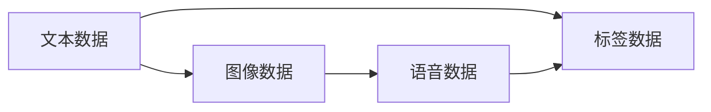
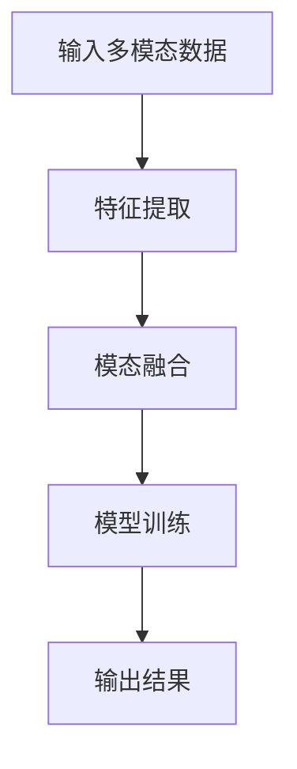
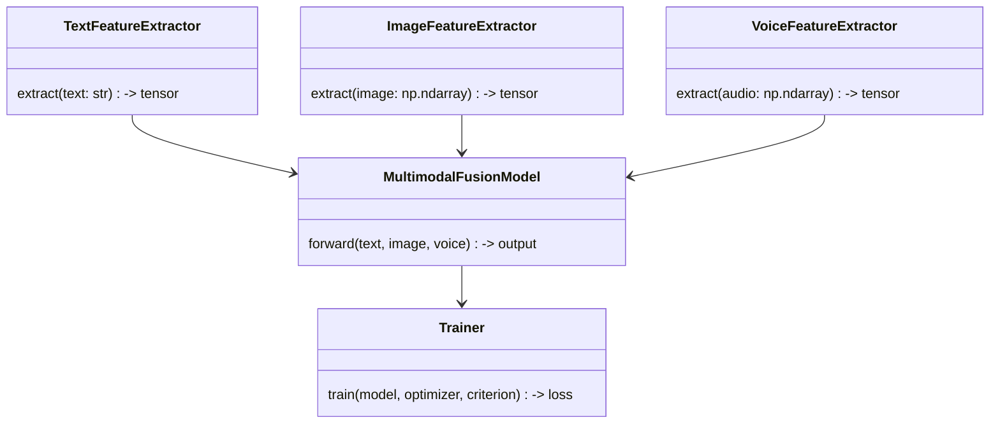
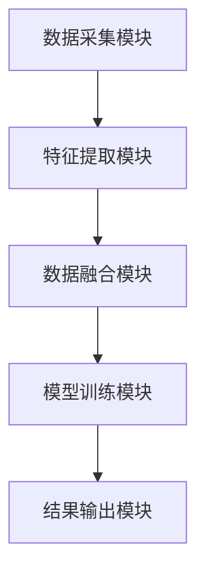
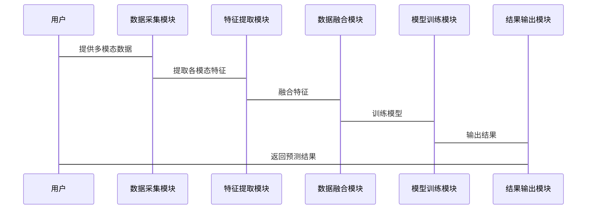

                 


# 企业AI Agent的多模态学习：整合文本、图像与语音数据

> 关键词：企业AI Agent，多模态学习，文本数据，图像数据，语音数据，深度学习，数据融合

> 摘要：本文探讨了在企业环境中，AI Agent如何通过整合文本、图像和语音数据进行多模态学习。文章首先介绍了多模态学习的背景与意义，分析了企业AI Agent的核心概念与特点，随后详细讲解了多模态数据的整合方法和相关算法原理。接着，文章从系统架构的角度，设计了一个多模态学习的系统框架，并通过实际案例展示了如何在企业中应用这些技术。最后，文章总结了多模态学习在企业中的最佳实践，为读者提供了清晰的指导和深入的见解。

---

## 第1章: 多模态学习的背景与意义

### 1.1 多模态数据的定义与特点

#### 1.1.1 多模态数据的定义
多模态数据指的是来自不同感知渠道（如文本、图像、语音等）的综合数据。与单一模态数据相比，多模态数据能够提供更全面的信息，帮助AI系统更好地理解和处理复杂场景。

#### 1.1.2 多模态数据的特点
- **异构性**：不同模态的数据具有不同的结构和特征。
- **互补性**：各模态数据可以互相补充，提高信息的完整性。
- **复杂性**：整合不同模态的数据需要复杂的算法和技术。

#### 1.1.3 多模态学习的优势与挑战
- **优势**：提高模型的泛化能力，增强对复杂场景的理解。
- **挑战**：数据异构性、模态间关联性弱、计算资源需求高。

---

### 1.2 AI Agent的定义与特点

#### 1.2.1 AI Agent的基本概念
AI Agent（人工智能代理）是一种能够感知环境、自主决策并执行任务的智能实体。它可以在企业中承担多种角色，如助手、客服、推荐系统等。

#### 1.2.2 AI Agent的核心能力
- **感知能力**：通过多模态数据感知环境。
- **决策能力**：基于感知信息做出最优决策。
- **执行能力**：通过执行动作与环境交互。

#### 1.2.3 企业级AI Agent的应用场景
- **客户服务**：通过多模态数据提供个性化的客户支持。
- **智能推荐**：结合用户行为数据推荐相关内容。
- **流程自动化**：优化企业内部流程，提高效率。

---

## 第2章: 企业AI Agent的多模态学习需求

### 2.1 企业智能化转型的背景

#### 2.1.1 数字化转型的现状
企业正在从传统的信息化向智能化转型，AI技术在其中扮演着重要角色。

#### 2.1.2 智能化升级的需求
企业需要通过智能化技术提高效率、降低成本、提升用户体验。

#### 2.1.3 多模态数据整合的必要性
在复杂的企业环境中，单一模态数据难以满足需求，多模态数据整合成为必然趋势。

---

### 2.2 多模态数据整合的挑战

#### 2.2.1 数据异构性问题
不同模态的数据格式和特征差异较大，整合难度高。

#### 2.2.2 数据融合的技术难点
如何有效提取各模态的特征并进行融合，是技术难点。

#### 2.2.3 企业应用场景的多样性
不同企业、不同业务场景对多模态数据的需求各不相同。

---

## 第3章: 多模态学习的核心概念与联系

### 3.1 多模态数据的整合方法

#### 3.1.1 数据预处理与标准化
- **数据清洗**：去除噪声数据，确保数据质量。
- **特征提取**：从原始数据中提取有意义的特征。

#### 3.1.2 特征提取与表示学习
- **文本特征提取**：使用词袋模型、TF-IDF、BERT等方法。
- **图像特征提取**：使用CNN、FRCN等模型提取图像特征。
- **语音特征提取**：使用MFCC、STFT等方法提取语音特征。

#### 3.1.3 多模态模型的融合策略
- **晚期融合**：在特征层或决策层进行融合。
- **早期融合**：在原始数据层或特征层进行融合。

---

### 3.2 多模态数据的特征对比

| 模态类型 | 特征维度 | 特征描述 |
|----------|----------|----------|
| 文本      | 词汇、语义 | 字词、句子结构、语义信息 |
| 图像      | 颜色、形状 | 图像像素、物体形状、颜色分布 |
| 语音      | 频率、时域 | 音调、节奏、语速 |

---

### 3.3 多模态学习的实体关系图



---

## 第4章: 多模态数据融合算法

### 4.1 多模态融合方法

#### 4.1.1 晚期融合（Late Fusion）
- **定义**：在特征层或决策层进行融合。
- **优势**：简单易实现，适用于不同模态数据分布差异较大的场景。

#### 4.1.2 早期融合（Early Fusion）
- **定义**：在原始数据层或特征层进行融合。
- **优势**：能够更好地捕捉模态间的关系，提高模型性能。

---

### 4.2 多模态融合算法流程图



---

### 4.3 多模态融合算法实现代码

```python
import torch
import torch.nn as nn

# 定义多模态融合模型
class MultimodalFusionModel(nn.Module):
    def __init__(self, text_dim, image_dim, voice_dim, output_dim):
        super(MultimodalFusionModel, self).__init__()
        self.text_layer = nn.Linear(text_dim, 128)
        self.image_layer = nn.Linear(image_dim, 128)
        self.voice_layer = nn.Linear(voice_dim, 128)
        self.fc = nn.Linear(384, output_dim)
        self.dropout = nn.Dropout(0.5)
    
    def forward(self, text_feature, image_feature, voice_feature):
        text_out = self.text_layer(text_feature)
        image_out = self.image_layer(image_feature)
        voice_out = self.voice_layer(voice_feature)
        
        # 晚期融合：将特征拼接
        fused_feature = torch.cat([text_out, image_out, voice_out], dim=-1)
        output = self.fc(fused_feature)
        output = self.dropout(output)
        return output

# 示例代码：训练循环
def train_loop(model, optimizer, criterion, text_data, image_data, voice_data, labels):
    optimizer.zero_grad()
    output = model(text_data, image_data, voice_data)
    loss = criterion(output, labels)
    loss.backward()
    optimizer.step()
    return loss.item()
```

---

### 4.4 模型损失函数与优化目标

损失函数定义为交叉熵损失：

$$ L = -\frac{1}{N}\sum_{i=1}^{N} \sum_{k=1}^{C} y_{i,k}\log(p_{i,k}) $$

优化目标是最小化损失函数：

$$ \min_{\theta} \mathbb{E}[L] $$

---

## 第5章: 系统分析与架构设计

### 5.1 项目背景介绍

为了实现企业AI Agent的多模态学习能力，我们设计了一个基于文本、图像和语音数据的多模态学习系统。

---

### 5.2 系统功能设计

#### 5.2.1 系统功能模块
- **数据采集模块**：采集文本、图像、语音数据。
- **特征提取模块**：提取各模态的特征。
- **数据融合模块**：整合多模态特征。
- **模型训练模块**：训练多模态融合模型。
- **结果输出模块**：输出最终结果。

#### 5.2.2 系统功能设计类图



---

### 5.3 系统架构设计

#### 5.3.1 系统架构图



---

### 5.4 系统接口与交互流程

#### 5.4.1 系统接口设计
- **输入接口**：接收文本、图像、语音数据。
- **输出接口**：输出模型预测结果。

#### 5.4.2 系统交互流程图



---

## 第6章: 项目实战

### 6.1 环境安装与配置

安装所需的Python包：

```bash
pip install numpy torch torchvision
```

---

### 6.2 系统核心代码实现

#### 6.2.1 文本特征提取代码

```python
import torch
import torch.nn as nn

class TextFeatureExtractor(nn.Module):
    def __init__(self, vocab_size, embedding_dim):
        super(TextFeatureExtractor, self).__init__()
        self.embedding = nn.Embedding(vocab_size, embedding_dim)
        self.dropout = nn.Dropout(0.5)
    
    def forward(self, text):
        embedded = self.embedding(text)
        return self.dropout(embedded)
```

---

### 6.2.2 图像特征提取代码

```python
import torch
import torch.nn as nn

class ImageFeatureExtractor(nn.Module):
    def __init__(self, image_size, hidden_dim):
        super(ImageFeatureExtractor, self).__init__()
        self.conv = nn.Sequential(
            nn.Conv2d(3, 32, kernel_size=3, stride=1, padding=1),
            nn.ReLU(),
            nn.MaxPool2d(2, 2),
            nn.Conv2d(32, 64, kernel_size=3, stride=1, padding=1),
            nn.ReLU(),
            nn.MaxPool2d(2, 2)
        )
        self.fc = nn.Linear(64 * (image_size//4) * (image_size//4), hidden_dim)
    
    def forward(self, image):
        features = self.conv(image)
        features = features.view(features.size(0), -1)
        output = self.fc(features)
        return output
```

---

### 6.2.3 语音特征提取代码

```python
import numpy as np

def extract_mfcc(audio, sample_rate=16000):
    # 假设audio是numpy数组，sample_rate是采样率
    # 使用 librosa 库提取MFCC特征
    import librosa
    mfccs = librosa.feature.mfcc(y=audio, sr=sample_rate, n_mfcc=13)
    return mfccs.T
```

---

### 6.3 项目总结

通过以上代码实现，我们可以看到多模态学习在企业AI Agent中的实际应用。整合文本、图像和语音数据，能够显著提高模型的性能和准确性。

---

## 第7章: 最佳实践与总结

### 7.1 小结

多模态学习通过整合文本、图像和语音数据，能够提升企业AI Agent的智能水平，使其在复杂场景中表现更优。

---

### 7.2 注意事项

- 数据预处理是关键，需确保各模态数据的特征提取方法一致。
- 模型融合需根据具体场景选择合适的方法。
- 训练数据需多样化，避免模型过拟合。

---

### 7.3 拓展阅读

- 《Deep Learning》—— Ian Goodfellow
- 《Hands-on Machine Learning with Scikit-Learn, Keras, and TensorFlow》—— Aurélien Géron
- 《Multimodal Machine Learning》—— Yasheng Wang

---

## 作者：AI天才研究院 & 禅与计算机程序设计艺术

通过本文，我们详细探讨了企业AI Agent的多模态学习方法，从理论到实践，为读者提供了全面的指导。希望本文能够帮助读者更好地理解和应用多模态学习技术。

