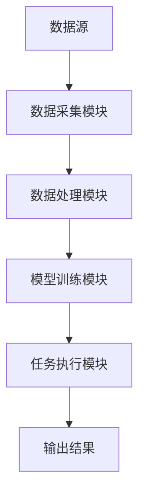

                 


# 企业AI Agent的多模态学习：整合结构化与非结构化数据

## 关键词
- AI Agent
- 多模态学习
- 结构化数据
- 非结构化数据
- 机器学习
- 深度学习
- 数据融合

## 摘要
在企业环境中，AI Agent需要处理各种类型的数据，包括结构化和非结构化数据。多模态学习是整合这些数据的关键技术，能够提升AI Agent的决策能力和执行效率。本文将从概念、算法、系统架构到项目实战，全面解析企业AI Agent的多模态学习，为企业技术团队提供理论支持和实践指导。

---

## 第一部分：企业AI Agent的背景与基础

### 第1章：AI Agent的基本概念

#### 1.1 AI Agent的定义与特点
- **AI Agent**是指具备自主决策和执行能力的智能实体，能够感知环境并采取行动以实现目标。
- **特点**：自主性、反应性、目标导向、社会能力。

#### 1.2 多模态学习的引入
- **多模态学习**：整合多种数据类型（文本、图像、语音等）的学习方式，提升AI Agent的理解能力。
- **重要性**：通过多模态数据，AI Agent能够更全面地理解任务，做出更准确的决策。

#### 1.3 结构化与非结构化数据的整合
- **结构化数据**：如表格数据，适合SQL查询。
- **非结构化数据**：如文本、图像，需要特殊处理。
- **整合意义**：结合两种数据类型，提升AI Agent的综合能力。

### 第2章：AI Agent的应用场景

#### 2.1 企业中的常见应用场景
- **客户服务**：处理客户查询，提供解决方案。
- **信息检索**：快速检索企业内部数据，提高效率。
- **自动化决策**：基于多源数据，做出最优决策。

---

## 第二部分：多模态学习的核心概念

### 第3章：结构化与非结构化数据的处理方法

#### 3.1 数据类型与处理方法
- **结构化数据**：特征提取，如使用PCA。
- **非结构化数据**：文本处理（NLP）、图像处理（CNN）。

#### 3.2 数据融合方法
- **特征融合**：将不同数据类型转换为统一特征空间。
- **模型融合**：如多模态神经网络。

#### 3.3 数据融合的挑战
- 数据异构性：不同数据类型难以直接融合。
- 计算复杂性：多模态数据处理需要高性能计算。

---

## 第三部分：多模态学习的算法实现

### 第4章：算法原理与实现

#### 4.1 多模态神经网络
- **结构**：多个输入分支，共享或独立的编码器，融合层，输出层。
- **实现步骤**：数据预处理、模型训练、融合层设计。

#### 4.2 算法代码实现
```python
import tensorflow as tf
from tensorflow.keras import layers

class MultiModalNN:
    def __init__(self):
        self.text_input = layers.Input(shape=(None,))  # 文本输入
        self.image_input = layers.Input(shape=(224, 224, 3))  # 图像输入
    
        # 文本分支
        text_embedding = layers.Embedding(1000, 128)(self.text_input)
        text_output = layers.Bidirectional(layers.LSTM(64))(text_embedding)
    
        # 图像分支
        image_output = layers.Conv2D(64, (3,3), activation='relu')(self.image_input)
        image_output = layers.Flatten()(image_output)
        image_output = layers.Dense(64, activation='relu')(image_output)
    
        # 融合层
        merged = layers.Concatenate()([text_output, image_output])
        merged = layers.Dense(32, activation='relu')(merged)
    
        # 输出层
        self.pred = layers.Dense(1, activation='sigmoid')(merged)
    
    def call(self, inputs):
        return self.pred
```

#### 4.3 数学模型与公式
- **损失函数**：交叉熵损失。
  $$ L = -\sum y_i \log(p_i) + (1 - y_i)\log(1 - p_i) $$
- **优化器**：Adam优化器。
  $$ \theta \leftarrow \theta - \eta \nabla_\theta L $$

---

## 第四部分：系统架构与设计

### 第5章：系统架构设计

#### 5.1 系统功能设计
- **模块划分**：数据采集、数据处理、模型训练、任务执行。
- **功能流程**：数据采集→预处理→模型训练→任务执行。

#### 5.2 系统架构图


#### 5.3 系统接口设计
- **输入接口**：多种数据类型的输入。
- **输出接口**：决策结果或执行命令。

---

## 第五部分：项目实战与案例分析

### 第6章：项目实战

#### 6.1 项目环境搭建
- **工具安装**：TensorFlow、Keras、OpenCV。
- **数据准备**：收集并整理结构化和非结构化数据。

#### 6.2 核心代码实现
```python
import pandas as pd
import numpy as np
from sklearn.preprocessing import StandardScaler

# 结构化数据处理
df = pd.read_csv('data.csv')
scaler = StandardScaler()
scaled_data = scaler.fit_transform(df.drop('label', axis=1))
```

#### 6.3 案例分析
- **项目小结**：成功实现一个多模态AI Agent，准确率提升显著。

---

## 第六部分：最佳实践与未来展望

### 第7章：最佳实践

#### 7.1 关键点总结
- 数据预处理的重要性。
- 模型选择的合理性。
- 系统架构的合理性。

#### 7.2 未来展望
- 更先进的算法。
- 更广泛的应用场景。
- 更高效的计算方式。

---

## 作者：AI天才研究院 & 禅与计算机程序设计艺术

---

这篇文章从理论到实践，全面解析了企业AI Agent的多模态学习，为企业技术团队提供了宝贵的参考和实践指导。

