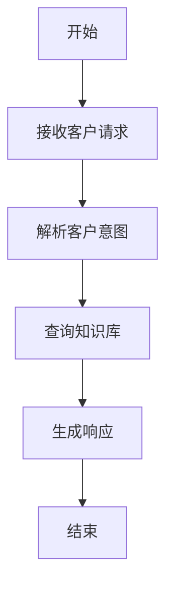
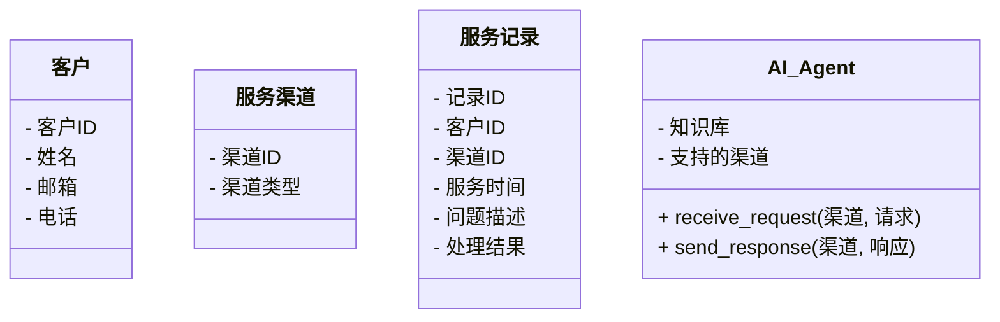
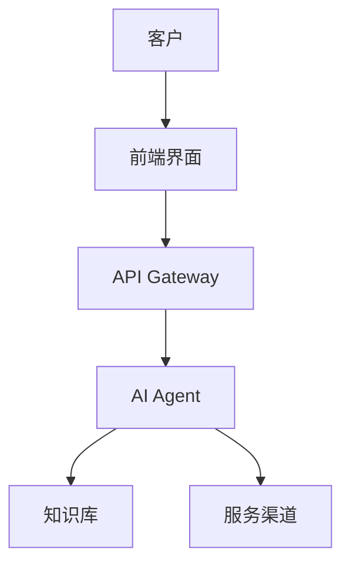
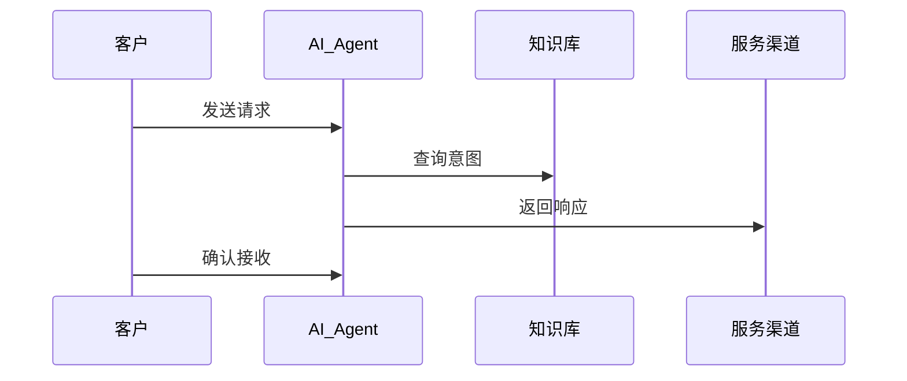

                 


# 企业AI Agent的多渠道集成：统一客户服务体验

> 关键词：企业AI Agent，多渠道集成，统一客户服务，客户体验，AI技术

> 摘要：本文深入探讨了企业AI Agent在多渠道集成中的应用，分析了如何通过统一客户服务体验来提升客户满意度和企业效率。文章从背景介绍、核心概念、算法原理、系统架构设计、项目实战到最佳实践，全面解析了企业AI Agent多渠道集成的关键技术与实现方案。

---

# 第一部分: 企业AI Agent的多渠道集成背景介绍

## 第1章: 问题背景与问题描述

### 1.1 问题背景

#### 1.1.1 传统客户服务的挑战

在传统的企业运营中，客户服务渠道通常呈现分散化的特点。企业可能通过电话、邮件、在线聊天、社交媒体等多种渠道与客户互动。然而，这些渠道之间的信息孤岛问题严重，导致客户服务效率低下，客户体验不一致。例如，客户在电话中反映的问题可能无法在其他渠道中得到及时同步和处理，这不仅增加了客户的不满，还可能导致企业的声誉受损。

#### 1.1.2 AI Agent的兴起

随着人工智能技术的快速发展，AI Agent（智能代理）逐渐成为企业客户服务的重要工具。AI Agent能够通过自然语言处理（NLP）、机器学习（ML）等技术，自动理解和响应客户的需求，提供个性化的服务。AI Agent的优势在于其7×24小时的 availability、快速响应能力和一致的服务质量，能够有效提升客户满意度。

#### 1.1.3 多渠道集成的必要性

尽管AI Agent在单个渠道上的应用已经取得了显著成效，但企业的客户服务渠道仍然分散。客户可能通过不同的渠道寻求帮助，而企业需要确保在所有渠道上提供一致的服务体验。因此，将AI Agent集成到多渠道中，实现统一的客户服务体验成为企业的迫切需求。

### 1.2 问题描述

#### 1.2.1 客户服务渠道的多样性

企业通常需要支持多种客户服务渠道，包括电话、邮件、在线聊天、社交媒体等。每种渠道的特点和交互方式不同，客户在不同渠道上的体验也存在差异。

#### 1.2.2 渠道间信息孤岛的问题

由于不同渠道之间的数据无法有效共享和同步，客户在不同渠道上的服务记录可能无法关联。这会导致客户重复描述问题，增加客户的服务负担，同时也降低了企业的服务效率。

#### 1.2.3 统一客户服务体验的目标

统一客户服务体验的核心目标是确保客户在使用任何渠道时，都能获得一致、高效的服务。这不仅能够提升客户的满意度，还能降低企业的运营成本。

### 1.3 问题解决

#### 1.3.1 AI Agent的核心作用

AI Agent能够通过自然语言处理技术理解客户的意图，并根据企业的知识库提供个性化的服务。通过多渠道集成，AI Agent可以实现跨渠道的服务协调，确保客户在任何渠道上都能获得一致的体验。

#### 1.3.2 多渠道集成的技术挑战

多渠道集成需要解决数据共享、服务协调、用户体验一致等问题。技术上的挑战包括如何实现不同渠道之间的数据同步、如何设计统一的交互界面、如何确保AI Agent在多渠道上的一致表现等。

#### 1.3.3 统一客户服务体验的实现路径

实现统一客户服务体验的路径包括：建立统一的数据平台、设计一致的交互界面、开发跨渠道的AI Agent、制定统一的服务流程等。

### 1.4 边界与外延

企业AI Agent的多渠道集成系统不仅限于内部系统的集成，还需要考虑与第三方平台的对接。系统的边界包括前端的客户交互界面、后端的数据处理系统、AI算法引擎等。外延则涉及与企业其他系统的集成，如CRM系统、订单管理系统等。

---

## 第2章: 核心概念与联系

### 2.1 核心概念

#### 2.1.1 AI Agent的定义与特点

AI Agent是一种能够感知环境、理解用户需求并采取行动的智能系统。其特点包括自主性、反应性、目标导向性和社会性。

#### 2.1.2 多渠道集成的定义

多渠道集成是指将多种不同的服务渠道（如电话、邮件、在线聊天）整合到一个统一的系统中，确保客户在使用任何渠道时都能获得一致的服务体验。

#### 2.1.3 统一客户服务体验的定义

统一客户服务体验是指客户在使用不同渠道时，能够获得一致、高效、个性化的服务体验。

### 2.2 核心概念之间的联系

通过对比表格和Mermaid图，可以清晰地看到AI Agent、多渠道集成和统一客户服务体验之间的关系。

#### 2.2.1 概念属性特征对比

| 概念       | 定义                                                                 | 特性               |
|------------|----------------------------------------------------------------------|--------------------|
| AI Agent   | 智能代理，能够感知环境、理解用户需求并采取行动。                | 自主性、反应性      |
| 多渠道集成 | 将多种服务渠道整合到一个统一系统中。                            | 数据同步、服务协调 |
| 统一客户体验 | 客户在使用不同渠道时获得一致的服务体验。                       | 一致性、高效性      |

#### 2.2.2 ER实体关系图

```mermaid
er
  entity 客户 {
    key: 客户ID
    属性: 姓名、邮箱、电话
  }

  entity 服务渠道 {
    key: 渠道ID
    属性: 渠道类型（如电话、邮件）
  }

  entity 服务记录 {
    key: 记录ID
    外键: 客户ID
    外键: 渠道ID
    属性: 服务时间、问题描述、处理结果
  }
```

### 2.3 案例分析

通过Mermaid图展示一个简单的客户-渠道-服务记录关系。

---

## 第3章: 算法原理讲解

### 3.1 算法流程

通过Mermaid图展示AI Agent的算法流程。



### 3.2 Python代码实现

以下是AI Agent的核心算法实现：

```python
class AI_Agent:
    def __init__(self):
        self.knowledge_base = {}  # 知识库
        self.channels = []        # 支持的渠道

    def receive_request(self, channel, message):
        # 解析客户意图
        intent = self.parse_intent(message)
        # 查询知识库
        response = self.query_knowledge_base(intent)
        # 返回响应
        return response

    def parse_intent(self, message):
        # 示例：简单的关键词匹配
        keywords = message.split()
        for keyword in keywords:
            if keyword in self.knowledge_base:
                return self.knowledge_base[keyword]
        return None

    def query_knowledge_base(self, intent):
        # 示例：从知识库中获取响应
        return self.knowledge_base.get(intent, "抱歉，我无法理解您的问题。")
```

### 3.3 数学模型与公式

AI Agent的意图识别可以通过概率模型实现。例如，使用贝叶斯定理计算某个意图的概率：

$$ P(\text{intent} | \text{message}) = \frac{P(\text{message} | \text{intent}) \cdot P(\text{intent})}{P(\text{message})} $$

---

## 第4章: 系统分析与架构设计方案

### 4.1 问题场景介绍

假设我们正在为一家电商公司设计一个多渠道集成的AI Agent系统，目标是通过统一的客户服务体验提升客户满意度。

### 4.2 项目介绍

项目名称：电商客服AI Agent多渠道集成系统。

### 4.3 系统功能设计

通过Mermaid类图展示系统功能模块。



### 4.4 系统架构设计

通过Mermaid架构图展示系统架构。



### 4.5 接口设计与交互

通过Mermaid序列图展示系统交互过程。



---

## 第5章: 项目实战

### 5.1 环境安装

需要安装Python、Mermaid工具、以及相关开发库（如NLTK、Scikit-learn）。

### 5.2 核心代码实现

以下是AI Agent的核心代码实现：

```python
from sklearn.naive_bayes import MultinomialNB
from sklearn.feature_extraction.text import TfidfVectorizer

class AI_Agent:
    def __init__(self):
        self.vectorizer = TfidfVectorizer()
        self.classifier = MultinomialNB()

    def train(self, X, y):
        self.vectorizer.fit(X)
        X_vec = self.vectorizer.transform(X)
        self.classifier.fit(X_vec, y)

    def predict(self, message):
        X_test = self.vectorizer.transform([message])
        return self.classifier.predict(X_test)
```

### 5.3 代码解读

上述代码实现了基于TF-IDF和朴素贝叶斯算法的意图分类。训练过程包括文本向量化和模型训练，预测过程则是对新文本进行分类。

### 5.4 案例分析

通过一个具体的电商客服案例，展示AI Agent如何处理客户的咨询请求。

### 5.5 项目小结

总结项目实现的关键点和经验教训。

---

## 第6章: 最佳实践、小结、注意事项、拓展阅读

### 6.1 最佳实践

- 确保知识库的准确性和及时更新。
- 提供多种反馈机制，以便不断优化AI Agent的表现。
- 定期进行系统维护和性能优化。

### 6.2 小结

本文详细探讨了企业AI Agent多渠道集成的核心技术与实现方案，通过理论分析和项目实战，展示了如何通过统一客户服务体验来提升企业竞争力。

### 6.3 注意事项

- 数据隐私和安全问题需要特别注意。
- 系统的可扩展性和灵活性是设计时的重要考虑因素。
- 需要定期监控和优化AI Agent的性能。

### 6.4 拓展阅读

推荐相关书籍和论文，供读者深入学习。

---

# 作者：AI天才研究院/AI Genius Institute & 禅与计算机程序设计艺术 /Zen And The Art of Computer Programming

