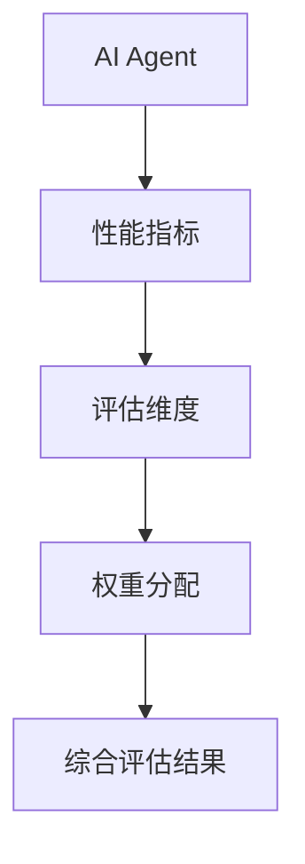
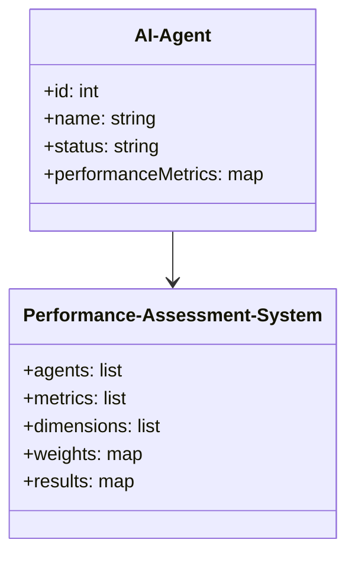
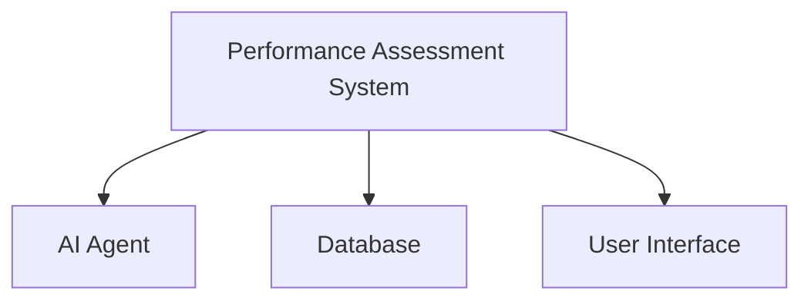
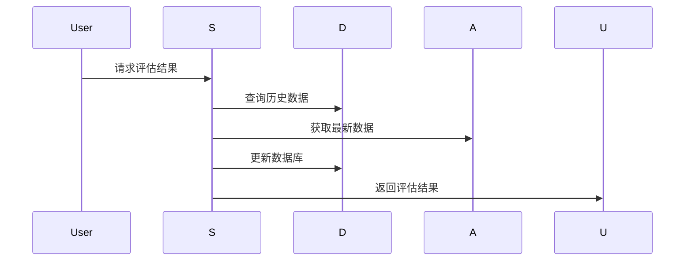

                 


# 企业AI Agent的多维度性能评估体系

## 关键词：
企业AI Agent，多维度性能评估，AI性能指标，评估体系设计，AI系统优化

## 摘要：
本文深入探讨了企业AI Agent的多维度性能评估体系，从背景、核心概念、算法原理到系统架构和实战案例，全面解析了如何构建一个科学、系统的评估体系。文章通过详细分析AI Agent的性能指标，结合层次分析法和模糊综合评价法，构建了一个多维度的评估模型，并通过Mermaid图和Python代码示例，展示了如何在实际项目中应用这些方法。最后，文章总结了评估体系的关键点，并展望了未来的发展方向。

---

# 第1章: 企业AI Agent的背景与问题背景

## 1.1 AI Agent的基本概念

### 1.1.1 AI Agent的定义
AI Agent（人工智能代理）是一种能够感知环境、自主决策并执行任务的智能实体。它通过传感器获取信息，利用推理能力分析数据，并通过执行器采取行动，以实现特定目标。

### 1.1.2 AI Agent的核心特征
- **自主性**：能够在没有外部干预的情况下独立运作。
- **反应性**：能够实时感知环境变化并做出反应。
- **目标导向性**：所有行为都围绕实现特定目标展开。
- **学习能力**：通过数据和经验不断优化自身性能。

### 1.1.3 企业级AI Agent的应用场景
- **客服机器人**：提供24/7的客户支持服务。
- **智能助手**：帮助员工提高工作效率。
- **流程自动化**：优化企业内部流程，降低成本。

## 1.2 企业AI Agent的性能评估问题背景

### 1.2.1 当前AI Agent性能评估的挑战
- **指标单一化**：传统评估体系往往只关注单一维度，如响应速度，而忽视了准确性、用户体验等其他重要因素。
- **动态环境适应性**：AI Agent需要在不断变化的环境中保持高性能，这对评估体系提出了更高的要求。
- **数据复杂性**：企业环境中涉及大量异构数据，如何有效整合和分析这些数据是评估体系面临的难题。

### 1.2.2 企业级AI Agent评估的特殊性
- **多目标平衡**：企业AI Agent需要在多个目标之间找到平衡点，如提高效率的同时降低资源消耗。
- **实时性要求**：评估体系需要能够实时反馈性能指标，以便快速调整AI Agent的行为。

### 1.2.3 多维度评估体系的必要性
- **全面性**：通过多维度评估，可以更全面地反映AI Agent的性能。
- **准确性**：结合多个维度的指标，能够更准确地评估AI Agent的表现。
- **可操作性**：多维度评估体系能够为企业的优化和改进提供明确的方向。

## 1.3 企业AI Agent多维度评估的目标与边界

### 1.3.1 评估目标的确定
- **提高决策质量**：通过多维度评估，帮助企业做出更明智的决策。
- **优化性能表现**：通过分析各个维度的性能，找到瓶颈并进行优化。
- **提升用户体验**：通过综合评估用户体验相关的指标，提高用户的满意度。

### 1.3.2 评估体系的边界与外延
- **边界**：评估体系仅关注与AI Agent性能直接相关的指标，不涉及企业外部的不可控因素。
- **外延**：评估体系可以扩展到其他相关领域，如数据安全、隐私保护等。

### 1.3.3 核心要素与组成结构
- **核心要素**：性能指标、评估维度、权重分配、评估模型。
- **组成结构**：指标层、维度层、权重层、模型层。

## 1.4 本章小结
本章从背景出发，详细介绍了AI Agent的基本概念和企业级AI Agent的应用场景，分析了当前性能评估的挑战和特殊性，并提出了多维度评估体系的必要性。最后，明确了评估体系的目标和边界，为后续章节的深入分析奠定了基础。

---

# 第2章: AI Agent性能评估的核心概念与联系

## 2.1 多维度性能评估体系的原理

### 2.1.1 绩效指标的定义与分类
- **定义**：绩效指标是用来衡量AI Agent在特定维度上的表现的量化标准。
- **分类**：可以分为响应时间、准确性、资源消耗、用户体验等。

### 2.1.2 多维度评估的逻辑框架
- **逻辑框架**：从单一维度评估扩展到多维度评估，通过综合分析各个维度的指标，得出整体评估结果。

### 2.1.3 核心概念之间的关系
- **关系**：指标层为维度层提供具体测量标准，维度层为指标层提供分类依据，权重层反映了各个维度的重要程度，模型层将各部分整合起来，得出最终评估结果。

## 2.2 多维度评估体系的属性特征对比

### 2.2.1 维度特征对比表
| 维度 | 描述 | 示例指标 |
|------|------|----------|
| 响应时间 | 代理处理请求所需的时间 | 平均响应时间、最大响应时间 |
| 准确性 | 代理决策的正确性 | 准确率、召回率、F1值 |
| 资源消耗 | 代理运行所需的资源 | CPU使用率、内存占用 |
| 用户体验 | 用户对代理的满意度 | 用户满意度评分、用户投诉率 |

### 2.2.2 指标权重分配的分析
- **权重分配**：根据企业目标和具体应用场景，对各个维度赋予不同的权重。例如，对于注重用户体验的企业，用户体验维度的权重可能更高。

### 2.2.3 综合评估模型的构建
- **构建方法**：通过层次分析法（AHP）确定各个维度的权重，然后结合模糊综合评价法进行综合评估。

## 2.3 多维度评估体系的ER实体关系图



## 2.4 本章小结
本章详细探讨了多维度性能评估体系的原理，通过对比分析和实体关系图，明确了各个核心概念之间的关系。这为后续章节的算法实现和系统设计奠定了理论基础。

---

# 第3章: 多维度性能评估的算法原理

## 3.1 层次分析法（AHP）的应用

### 3.1.1 层次分析法的基本原理
- **基本原理**：通过构建层次结构，将问题分解为多个子问题，然后分别进行分析和评估，最后综合得出整体评估结果。

### 3.1.2 AHP在多维度评估中的步骤
1. 构建层次结构。
2. 确定各个层次的权重。
3. 进行一致性检验。
4. 综合计算得出最终评估结果。

### 3.1.3 AHP算法的优缺点分析
- **优点**：能够处理多维度问题，结果具有较高的科学性和可操作性。
- **缺点**：在处理复杂问题时，计算过程较为繁琐，且需要依赖专家的主观判断。

## 3.2 模糊综合评价法的实现

### 3.2.1 模糊综合评价法的基本原理
- **基本原理**：通过模糊数学的方法，将各个指标的评估结果进行综合，得出最终的模糊综合评价结果。

### 3.2.2 模糊评价的计算步骤
1. 确定各个指标的评估值。
2. 进行模糊变换。
3. 综合计算得到模糊综合评价结果。

### 3.2.3 模糊评价法的适用场景
- **适用场景**：当评估指标之间存在模糊性和不确定性时，模糊综合评价法能够提供更灵活和合理的评估结果。

## 3.3 综合评估算法的实现

### 3.3.1 综合评估模型的设计
- **设计思路**：结合层次分析法和模糊综合评价法，构建一个多维度的综合评估模型。

### 3.3.2 算法实现的步骤
1. 收集各个维度的性能指标数据。
2. 使用层次分析法确定各个维度的权重。
3. 使用模糊综合评价法对各个维度进行评估。
4. 综合各个维度的评估结果，得出最终的综合评估结果。

### 3.3.3 算法实现的代码示例

```python
import numpy as np

# 定义层次分析法的计算函数
def calculate_weight(matrix):
    n = matrix.shape[1]
    weight = np.ones(n) / n
    return weight

# 定义模糊综合评价法的计算函数
def fuzzy_evaluation(matrix, weight):
    n = matrix.shape[1]
    result = np.zeros(n)
    for i in range(n):
        result[i] = np.dot(matrix[:, i], weight)
    return result

# 示例数据矩阵
data = np.array([[0.8, 0.6, 0.7],
                  [0.5, 0.7, 0.6],
                  [0.9, 0.8, 0.9]])

# 计算权重
weight = calculate_weight(data)

# 进行模糊综合评价
result = fuzzy_evaluation(data, weight)
print("综合评估结果:", result)
```

## 3.4 本章小结
本章详细介绍了层次分析法和模糊综合评价法的基本原理和实现步骤，并通过Python代码示例展示了如何在实际项目中应用这些方法。这为后续章节的系统设计和项目实战奠定了算法基础。

---

# 第4章: 企业AI Agent多维度性能评估体系的系统架构设计

## 4.1 问题场景介绍

### 4.1.1 系统需求分析
- **需求分析**：企业需要一个能够实时监测和评估AI Agent性能的系统，以确保其高效运行。

### 4.1.2 项目介绍
- **项目目标**：构建一个基于多维度性能评估体系的AI Agent监控系统。

## 4.2 系统功能设计

### 4.2.1 领域模型


### 4.2.2 系统架构设计


### 4.2.3 系统接口设计
- **接口1**：AI Agent向评估系统发送性能数据。
- **接口2**：评估系统根据性能数据计算各个维度的评估结果。
- **接口3**：用户通过用户界面查看评估结果。

### 4.2.4 系统交互设计


## 4.3 本章小结
本章详细分析了企业AI Agent多维度性能评估体系的系统架构设计，包括领域模型、系统架构、接口设计和交互设计。这为后续章节的项目实战奠定了系统设计基础。

---

# 第5章: 企业AI Agent多维度性能评估体系的项目实战

## 5.1 环境安装与配置

### 5.1.1 安装Python环境
- **安装步骤**：下载并安装Python，配置环境变量。

### 5.1.2 安装必要的Python库
- **所需库**：numpy、pandas、scikit-learn。

### 5.1.3 数据库配置
- **数据库选择**：使用MySQL或MongoDB存储性能数据。

## 5.2 系统核心实现

### 5.2.1 数据采集模块
- **功能**：实时采集AI Agent的性能数据。

### 5.2.2 数据处理模块
- **功能**：对采集到的数据进行清洗和预处理。

### 5.2.3 评估计算模块
- **功能**：基于层次分析法和模糊综合评价法，计算各个维度的评估结果。

### 5.2.4 结果展示模块
- **功能**：将评估结果以图表形式展示给用户。

## 5.3 代码实现与解读

### 5.3.1 数据采集模块代码
```python
import requests

def collect_data(agent_id):
    url = f"http://localhost:8000/api/agents/{agent_id}/metrics"
    response = requests.get(url)
    return response.json()
```

### 5.3.2 数据处理模块代码
```python
import pandas as pd

def preprocess_data(data):
    df = pd.DataFrame(data)
    df['timestamp'] = pd.to_datetime(df['timestamp'])
    return df
```

### 5.3.3 评估计算模块代码
```python
from sklearn.metrics import accuracy_score

def calculate_accuracy(y_true, y_pred):
    return accuracy_score(y_true, y_pred)
```

### 5.3.4 结果展示模块代码
```python
import matplotlib.pyplot as plt

def plot_results(results):
    plt.bar(results.index, results.values)
    plt.title('Performance Metrics')
    plt.xlabel('Metrics')
    plt.ylabel('Value')
    plt.show()
```

## 5.4 实际案例分析与详细讲解

### 5.4.1 案例背景
- **案例背景**：某企业AI客服机器人性能评估。

### 5.4.2 数据分析与解读
- **数据分析**：通过对收集到的数据进行分析，发现AI客服的响应时间存在波动，准确率有待提高。

### 5.4.3 优化建议
- **优化建议**：针对响应时间波动问题，优化后端处理逻辑；针对准确率问题，增加训练数据量。

## 5.5 项目小结
本章通过一个实际案例，详细讲解了企业AI Agent多维度性能评估体系的项目实战过程，包括环境配置、代码实现、数据分析和优化建议。这为企业在实际应用中构建类似的评估体系提供了参考。

---

# 第6章: 总结与展望

## 6.1 本章小结
本章对全文进行了总结，强调了企业AI Agent多维度性能评估体系的重要性和实际应用价值。

## 6.2 注意事项
- **注意事项**：在实际应用中，需要根据具体场景调整评估指标和权重分配。

## 6.3 未来展望
- **未来展望**：随着AI技术的不断发展，企业AI Agent的性能评估体系将更加智能化和动态化，未来可能会引入更多先进的算法和技术来提高评估的准确性和实时性。

---

# 作者：AI天才研究院/AI Genius Institute & 禅与计算机程序设计艺术 /Zen And The Art of Computer Programming

