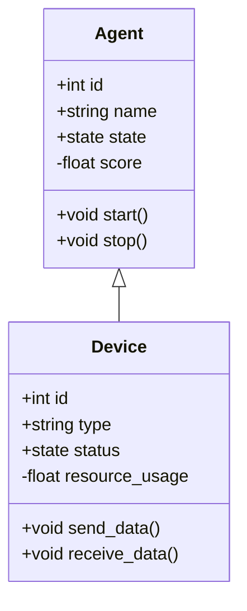
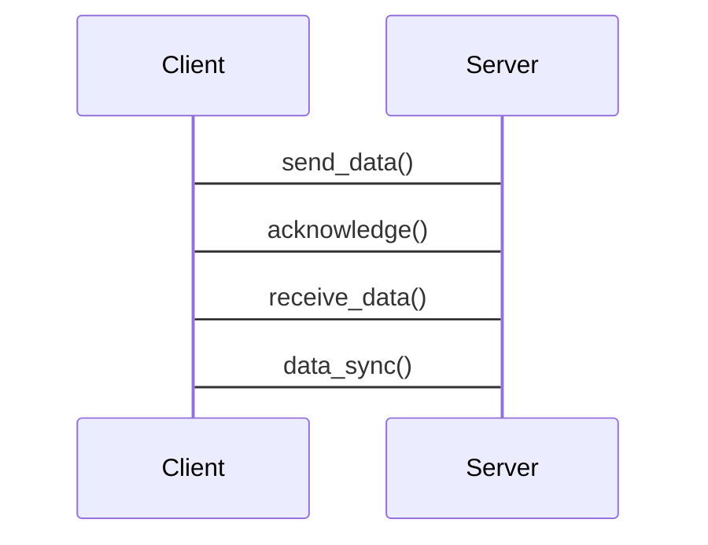

                 


# 企业AI Agent的多设备支持：PC、移动端到IoT设备

> 关键词：AI Agent，多设备支持，企业应用，PC，移动端，IoT设备，智能系统，边缘计算，协同工作

> 摘要：本文深入探讨了企业AI Agent在多设备环境下的支持策略，分析了PC、移动端和IoT设备在AI Agent系统中的角色与协同机制。文章首先介绍了AI Agent的核心概念和多设备支持的背景，然后从算法原理、系统架构、项目实战等多个维度展开详细分析，最后给出了实际应用中的最佳实践和未来展望。

---

## 第一章：企业AI Agent的多设备支持背景

### 1.1 问题背景与描述

#### 1.1.1 企业AI Agent的定义与核心概念
企业AI Agent（Artificial Intelligence Agent）是指在企业环境中，能够感知环境、自主决策并执行任务的智能实体。它能够通过与用户、系统或其他设备的交互，完成复杂的企业级任务。AI Agent的核心特征包括：
- **自主性**：能够自主决策和执行任务。
- **反应性**：能够实时感知环境变化并做出响应。
- **协作性**：能够与其他设备、系统或人进行协同工作。

#### 1.1.2 多设备支持的必要性与挑战
随着企业数字化转型的推进，AI Agent的应用场景越来越广泛。企业环境中通常涉及多种设备，包括PC、移动端设备（如手机、平板）和物联网设备（IoT，如传感器、智能摄像头）。为了满足不同场景的需求，AI Agent需要能够支持多种设备类型，并实现设备间的协同工作。然而，多设备支持也带来了以下挑战：
- **设备异构性**：不同设备的操作系统、硬件性能和通信协议差异较大。
- **资源限制**：IoT设备通常资源有限，对AI Agent的计算能力要求较高。
- **数据一致性**：多设备环境下，如何保证数据的一致性和实时性是一个关键问题。

#### 1.1.3 当前市场与技术背景分析
当前，AI Agent在企业中的应用越来越普及。根据市场调研，大多数企业在数字化转型中都引入了AI Agent技术。然而，大多数现有解决方案仅支持单一设备类型，无法满足企业对多设备支持的需求。因此，研究企业AI Agent的多设备支持技术具有重要的现实意义。

---

### 1.2 问题解决与边界

#### 1.2.1 AI Agent在企业中的主要应用场景
AI Agent在企业中的应用场景包括：
- **智能客服**：通过自然语言处理（NLP）技术为用户提供智能咨询服务。
- **自动化运维**：通过AI Agent实现系统监控、故障诊断和自动修复。
- **智能调度**：在生产环境中，AI Agent可以实现设备的智能调度和资源优化。

#### 1.2.2 多设备支持的核心问题与边界
多设备支持的核心问题是如何实现不同设备间的协同工作，同时保证系统的实时性、可靠性和可扩展性。边界包括：
- 设备类型：支持PC、移动端和IoT设备。
- 通信协议：支持常见的通信协议，如HTTP、WebSocket、MQTT等。
- 资源限制：考虑设备的计算能力和存储空间限制。

#### 1.2.3 相关技术与概念的外延与限制
相关技术包括：
- **边缘计算**：在IoT设备端进行局部计算，减少数据传输延迟。
- **雾计算**：在边缘层进行数据处理和分析。
- **分布式系统**：通过分布式架构实现设备间的协同工作。

---

### 1.3 概念结构与核心要素

#### 1.3.1 AI Agent的基本组成要素
AI Agent的基本组成要素包括：
- **感知模块**：用于感知环境信息，如传感器数据、用户输入等。
- **决策模块**：基于感知信息进行决策，选择最优行动方案。
- **执行模块**：将决策结果转化为具体行动，如调用API、发送指令等。
- **通信模块**：与其他设备或系统进行通信，实现协同工作。

#### 1.3.2 多设备支持的系统架构
多设备支持的系统架构包括：
- **设备层**：包括PC、移动端和IoT设备。
- **通信层**：实现设备间的通信与数据同步。
- **数据层**：存储和管理设备间共享的数据。
- **应用层**：实现具体的业务逻辑和用户交互。

#### 1.3.3 核心要素之间的关系与依赖
AI Agent的各组成要素之间存在以下关系：
- **感知模块**与**通信模块**：感知模块获取环境信息，通信模块将信息传递给其他设备。
- **决策模块**与**执行模块**：决策模块基于感知信息做出决策，执行模块将决策结果转化为具体行动。
- **通信模块**与**数据层**：通信模块通过数据层实现设备间的数据同步和共享。

---

### 1.4 本章小结
本章主要介绍了企业AI Agent的多设备支持的背景、核心概念、应用场景以及系统架构。通过分析多设备支持的必要性与挑战，明确了本文的研究目标和范围。

---

## 第二章：企业AI Agent的核心概念与原理

### 2.1 AI Agent的核心原理

#### 2.1.1 AI Agent的定义与分类
AI Agent可以根据不同的标准进行分类：
- **按智能水平**：分为弱AI Agent和强AI Agent。
- **按应用场景**：分为智能客服、自动化运维、智能调度等。
- **按设备类型**：分为PC端AI Agent、移动端AI Agent和IoT设备端AI Agent。

#### 2.1.2 AI Agent的核心算法与技术
AI Agent的核心算法包括：
- **自然语言处理（NLP）**：用于实现人机交互和智能对话。
- **强化学习（Reinforcement Learning）**：用于实现自主决策和优化。
- **知识图谱（Knowledge Graph）**：用于实现智能推理和知识管理。

#### 2.1.3 AI Agent的决策机制与执行流程
AI Agent的决策机制包括：
- **感知环境**：通过传感器、API或用户输入获取环境信息。
- **分析决策**：基于感知信息进行分析和决策。
- **执行行动**：根据决策结果执行具体行动，如调用API、发送指令等。

---

### 2.2 多设备支持的核心概念

#### 2.2.1 多设备支持的定义与目标
多设备支持的目标是实现不同设备间的协同工作，提高系统的整体效率和用户体验。核心概念包括：
- **设备协同**：通过通信协议实现设备间的协同工作。
- **数据同步**：保证设备间数据的一致性和实时性。
- **资源分配**：合理分配设备资源，提高系统性能。

#### 2.2.2 设备间协同的核心原理
设备间协同的核心原理包括：
- **通信协议**：通过HTTP、WebSocket、MQTT等协议实现设备间的通信。
- **数据同步**：通过分布式系统技术实现设备间数据的实时同步。
- **任务分配**：根据设备的资源情况动态分配任务。

#### 2.2.3 多设备环境下的数据同步与一致性
多设备环境下的数据同步与一致性可以通过以下方式实现：
- **分布式事务**：通过分布式事务保证数据的原子性、一致性、隔离性和持久性。
- **冲突解决**：通过冲突检测和恢复机制解决数据冲突问题。

---

### 2.3 核心概念对比分析

#### 2.3.1 AI Agent与传统自动化系统的对比
AI Agent与传统自动化系统的区别在于：
- **自主性**：AI Agent具有自主决策能力，而传统自动化系统需要人工干预。
- **学习能力**：AI Agent可以通过机器学习不断优化性能，而传统自动化系统无法学习。
- **适应性**：AI Agent能够适应环境变化，而传统自动化系统需要人工调整。

#### 2.3.2 多设备支持与单一设备支持的对比
多设备支持与单一设备支持的区别在于：
- **设备数量**：多设备支持涉及多个设备，而单一设备支持仅涉及一个设备。
- **通信复杂度**：多设备支持需要考虑设备间的通信和数据同步，而单一设备支持不需要。
- **资源分配**：多设备支持需要动态分配资源，而单一设备支持资源固定。

#### 2.3.3 不同设备类型对AI Agent的影响
不同设备类型对AI Agent的影响包括：
- **计算能力**：IoT设备计算能力有限，可能需要边缘计算技术。
- **通信方式**：不同设备的通信方式和协议可能不同。
- **用户界面**：不同设备的用户界面设计和交互方式不同。

---

### 2.4 本章小结
本章详细分析了企业AI Agent的核心概念与原理，重点介绍了多设备支持的核心概念和实现原理。通过对比分析，明确了多设备支持与单一设备支持的区别以及不同设备类型对AI Agent的影响。

---

## 第三章：企业AI Agent的算法原理与数学模型

### 3.1 AI Agent的算法原理

#### 3.1.1 基于强化学习的决策算法
强化学习是一种通过试错机制实现决策优化的算法。其核心公式为：
$$ Q(s, a) = r + \gamma \max Q(s', a') $$
其中：
- $Q(s, a)$：状态$s$下采取动作$a$的Q值。
- $r$：立即奖励。
- $\gamma$：折扣因子。
- $s'$：下一步状态。
- $a'$：下一步动作。

#### 3.1.2 基于监督学习的执行算法
监督学习是一种基于标签数据的机器学习算法。其核心公式为：
$$ y = f(x) $$
其中：
- $x$：输入数据。
- $y$：输出结果。
- $f$：模型函数。

#### 3.1.3 基于知识图谱的推理算法
知识图谱是一种用于表示知识的图结构。推理算法可以通过图遍历实现，例如：
- **深度优先搜索（DFS）**：遍历图的深度优先。
- **广度优先搜索（BFS）**：遍历图的广度优先。

---

### 3.2 多设备协同的算法原理

#### 3.2.1 跨设备协同的核心算法
跨设备协同的核心算法包括：
- **分布式计算**：通过分布式计算实现设备间的协同工作。
- **任务分配**：根据设备的资源情况动态分配任务。
- **数据同步**：通过分布式系统技术实现设备间数据的实时同步。

#### 3.2.2 設備間通信協議與數據同步算法
设备间通信协议可以采用MQTT协议，其核心流程如下：
1. **设备注册**：设备通过MQTT协议向服务器注册。
2. **消息发布**：设备发布消息到主题（Topic）。
3. **消息订阅**：其他设备订阅主题，接收消息。

数据同步算法可以采用两阶段提交（2PC）协议，其核心公式为：
$$ \text{阶段1：} \text{协调者发送Prepare消息} $$
$$ \text{阶段2：} \text{协调者发送Commit消息或Rollback消息} $$

---

### 3.3 算法的数学模型与公式

#### 3.3.1 强化学习的数学模型
强化学习的数学模型可以表示为：
$$ Q(s, a) = r + \gamma \max Q(s', a') $$
其中，$Q(s, a)$表示状态$s$下采取动作$a$的Q值，$r$表示立即奖励，$\gamma$表示折扣因子。

#### 3.3.2 资源分配的优化模型
资源分配的优化模型可以表示为：
$$ \min \sum_{i=1}^{n} c_i x_i $$
其中，$c_i$表示设备$i$的资源消耗，$x_i$表示设备$i$的任务分配量。

---

### 3.4 算法实现与代码示例

#### 3.4.1 强化学习算法的Python实现
```python
import numpy as np
from collections import defaultdict

def q_learning(env):
    Q = defaultdict(lambda: np.zeros(env.action_space.n))
    for episode in range(episodes):
        state = env.reset()
        while True:
            action = np.argmax(Q[state])
            next_state, reward, done, _ = env.step(action)
            Q[state][action] += reward + gamma * np.max(Q[next_state])
            if done:
                break
    return Q
```

#### 3.4.2 分布式任务分配算法的Python实现
```python
import socket
import threading

def worker():
    while True:
        data = socket.recv(1024)
        if not data:
            break
        # 处理数据
        # 分配任务
```

---

## 第四章：企业AI Agent的系统架构设计

### 4.1 系统功能设计

#### 4.1.1 领域模型设计
领域模型可以通过Mermaid类图表示：


#### 4.1.2 系统架构设计
系统架构可以通过Mermaid架构图表示：


---

### 4.2 系统接口设计

#### 4.2.1 API接口设计
API接口设计包括：
- **注册接口**：设备通过API接口向系统注册。
- **数据同步接口**：设备通过API接口同步数据。
- **任务分配接口**：系统通过API接口分配任务。

#### 4.2.2 通信接口设计
通信接口设计包括：
- **设备间通信接口**：通过MQTT协议实现设备间的通信。
- **设备与服务器通信接口**：通过HTTP协议实现设备与服务器的通信。

---

### 4.3 系统交互设计

#### 4.3.1 交互流程设计
交互流程可以通过Mermaid序列图表示：


---

## 第五章：企业AI Agent的项目实战

### 5.1 环境安装

#### 5.1.1 系统环境要求
系统环境要求包括：
- **操作系统**：Linux、Windows、macOS。
- **编程语言**：Python 3.6+。
- **依赖库**：TensorFlow、Kafka、MongoDB。

#### 5.1.2 安装步骤
安装步骤包括：
1. 安装Python和相关依赖库。
2. 安装MQTT协议的Mosquitto服务器。
3. 安装分布式任务队列Celery。

---

### 5.2 系统核心实现

#### 5.2.1 AI Agent的核心实现
AI Agent的核心实现包括：
- **感知模块**：通过传感器获取环境信息。
- **决策模块**：基于强化学习算法做出决策。
- **执行模块**：根据决策结果执行具体行动。

#### 5.2.2 多设备协同的实现
多设备协同的实现包括：
- **设备注册**：设备通过MQTT协议向服务器注册。
- **数据同步**：设备通过分布式系统技术实现数据同步。
- **任务分配**：系统根据设备资源情况动态分配任务。

---

### 5.3 案例分析与实际应用

#### 5.3.1 实际案例分析
实际案例分析包括：
- **智能工厂**：AI Agent在智能工厂中的应用案例。
- **智能物流**：AI Agent在智能物流中的应用案例。

#### 5.3.2 代码实现与解读
代码实现与解读包括：
- **强化学习算法的实现**：实现Q-learning算法。
- **分布式任务分配的实现**：实现基于Celery的任务队列。

---

### 5.4 项目总结

#### 5.4.1 项目成果
项目成果包括：
- 实现了一个支持多设备的AI Agent系统。
- 提出了基于强化学习的决策算法。
- 实现了设备间的通信与数据同步。

#### 5.4.2 经验总结
经验总结包括：
- **设备协同**：设备间的协同工作需要考虑通信协议和数据同步问题。
- **资源分配**：资源分配需要动态调整，以提高系统性能。
- **算法优化**：算法需要不断优化，以提高决策效率。

---

## 第六章：企业AI Agent的未来展望与最佳实践

### 6.1 未来展望

#### 6.1.1 技术发展趋势
技术发展趋势包括：
- **边缘计算**：边缘计算将在AI Agent中发挥越来越重要的作用。
- **5G技术**：5G技术将为AI Agent的多设备支持提供更强大的支持。
- **AI芯片**：AI芯片的发展将推动AI Agent的性能提升。

#### 6.1.2 应用场景扩展
应用场景扩展包括：
- **智慧城市**：AI Agent在智慧城市中的应用。
- **智能家居**：AI Agent在智能家居中的应用。

---

### 6.2 最佳实践

#### 6.2.1 系统设计建议
系统设计建议包括：
- **模块化设计**：系统设计应尽量模块化，便于维护和扩展。
- **高可用性设计**：系统设计应考虑高可用性，避免单点故障。
- **安全性设计**：系统设计应考虑安全性，防止数据泄露和网络攻击。

#### 6.2.2 开发与维护建议
开发与维护建议包括：
- **代码规范**：开发人员应遵循统一的代码规范。
- **单元测试**：开发人员应编写单元测试，确保代码质量。
- **持续集成**：采用持续集成技术，确保系统的稳定性。

---

### 6.3 小结
本章对未来展望了企业AI Agent的技术发展趋势和应用场景，同时给出了系统设计和开发维护的最佳实践建议。

---

## 作者信息

作者：AI天才研究院/AI Genius Institute & 禅与计算机程序设计艺术 /Zen And The Art of Computer Programming

---

感谢您的耐心阅读！希望这篇文章能够为您提供有价值的信息和启示。

