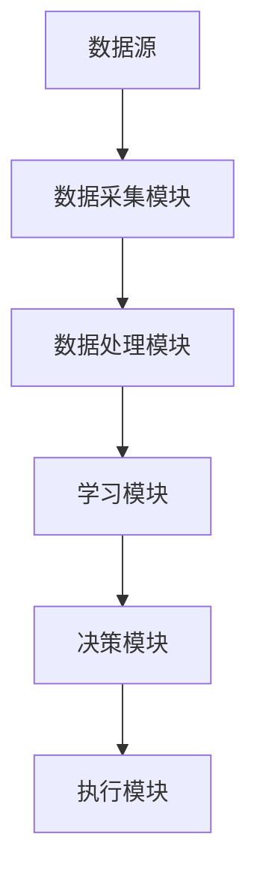
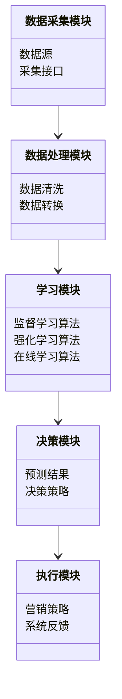
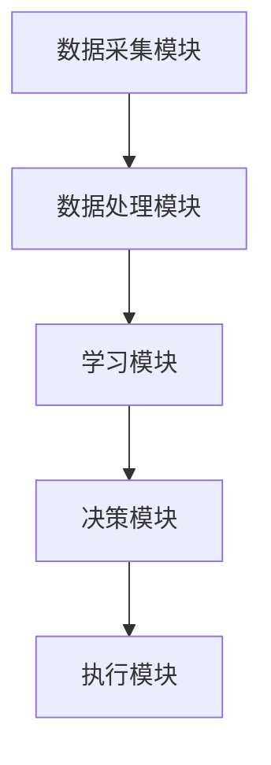

                 


# 企业AI Agent的实时学习能力：持续优化业务流程

## 关键词：企业AI Agent、实时学习、业务流程优化、机器学习、强化学习、在线学习、数字化转型

## 摘要

企业AI Agent的实时学习能力是指通过实时数据输入和动态调整模型参数，持续优化业务流程的能力。随着企业数字化转型的深入推进，AI Agent在实时学习能力方面的应用变得越来越重要。本文将从企业AI Agent的定义与特点、实时学习能力的核心概念、算法原理、系统架构设计、项目实战等方面进行详细探讨，旨在为企业在实际应用中提供有价值的指导和建议。

---

# 第一部分：企业AI Agent的实时学习能力概述

## 第1章：企业AI Agent与实时学习能力

### 1.1 企业AI Agent的定义与特点

#### 1.1.1 企业AI Agent的基本概念

企业AI Agent是一种能够感知环境、自主决策并执行任务的智能体。它通过与企业系统的交互，能够实时获取数据、分析信息，并根据结果进行调整和优化。与传统AI相比，企业AI Agent更加注重实时性、动态性和适应性。

#### 1.1.2 实时学习能力的核心特征

实时学习能力是企业AI Agent的核心特征之一，主要体现在以下三个方面：

1. **实时性**：能够在数据生成的瞬间进行学习和调整。
2. **动态性**：能够根据环境的变化动态更新模型参数。
3. **适应性**：能够在不同场景下自适应地调整学习策略。

#### 1.1.3 企业AI Agent与传统AI的区别

企业AI Agent与传统AI的区别主要体现在以下几个方面：

1. **目标驱动**：企业AI Agent以具体业务目标为导向，而传统AI更注重通用问题的解决。
2. **实时性**：企业AI Agent强调实时学习和决策，传统AI则更注重离线分析。
3. **动态性**：企业AI Agent能够动态调整模型，而传统AI通常基于静态数据。

### 1.2 企业AI Agent的实时学习机制

#### 1.2.1 实时学习的定义与作用

实时学习是指在数据生成的瞬间，系统能够立即进行学习和调整的过程。其作用主要体现在以下方面：

1. **快速响应**：能够实时感知环境变化，迅速做出调整。
2. **持续优化**：通过不断学习新数据，优化模型性能。
3. **增强适应性**：能够适应不同场景下的业务需求。

#### 1.2.2 实时学习的关键技术

实时学习的关键技术包括：

1. **监督学习**：基于标注数据进行模型训练。
2. **强化学习**：通过与环境交互，学习最优策略。
3. **在线学习**：在数据流中实时更新模型。

#### 1.2.3 企业AI Agent的实时学习场景

企业AI Agent的实时学习场景包括：

1. **客户行为预测**：实时分析客户行为，优化营销策略。
2. **流程优化**：实时调整业务流程，提高效率。
3. **风险控制**：实时监控风险，进行预警和应对。

### 1.3 企业AI Agent的应用价值

#### 1.3.1 提升业务流程效率

通过实时学习能力，企业AI Agent能够不断优化业务流程，减少冗余操作，提高效率。

#### 1.3.2 优化决策能力

实时学习能力能够帮助企业在复杂环境下做出更优的决策，降低决策风险。

#### 1.3.3 实时响应市场变化

企业AI Agent能够实时感知市场变化，快速调整策略，提升企业的市场竞争力。

---

## 第2章：企业AI Agent实时学习能力的背景与挑战

### 2.1 企业数字化转型的背景

#### 2.1.1 数字化转型的核心目标

企业数字化转型的核心目标是通过技术手段提升企业的运营效率、客户体验和市场响应能力。

#### 2.1.2 AI技术在企业转型中的作用

AI技术在企业数字化转型中发挥着重要作用，能够帮助企业实现智能化、自动化和数据驱动的决策。

#### 2.1.3 业务流程优化的必要性

业务流程优化是企业数字化转型的重要组成部分，能够显著提升企业的竞争力。

### 2.2 企业AI Agent实时学习的挑战

#### 2.2.1 数据实时性要求

实时学习需要数据能够实时输入和处理，这对数据采集和传输提出了更高的要求。

#### 2.2.2 算法实时更新的难度

实时更新算法需要处理大量的动态数据，算法的稳定性和计算效率是关键挑战。

#### 2.2.3 系统稳定性与安全性

实时学习系统需要高度稳定和安全，防止数据泄露和系统崩溃。

---

## 第3章：企业AI Agent实时学习能力的核心概念

### 3.1 实时学习的数学模型

#### 3.1.1 监督学习模型

监督学习模型是基于标注数据的学习方法，常用算法包括线性回归、支持向量机（SVM）和随机森林等。

#### 3.1.2 强化学习模型

强化学习模型通过与环境交互，学习最优策略，常用算法包括Q-learning和Deep Q-Network（DQN）。

#### 3.1.3 在线学习模型

在线学习模型是在数据流中实时更新模型参数，常用算法包括随机梯度下降（SGD）。

### 3.2 实时学习算法的对比分析

#### 3.2.1 不同学习算法的特征对比

| 算法类型 | 数据类型 | 是否需要标注 | 优缺点 |
|----------|----------|--------------|--------|
| 监督学习 | 结构化数据 | 需要 | 数据依赖性高，实时性差 |
| 强化学习 | 非结构化数据 | 不需要 | 需要大量交互，计算复杂 |
| 在线学习 | 流数据 | 不需要 | 实时性强，计算效率高 |

#### 3.2.2 算法选择的影响因素

1. **数据类型**：结构化数据适合监督学习，非结构化数据适合强化学习。
2. **实时性要求**：在线学习适用于高实时性场景。
3. **计算资源**：强化学习需要大量计算资源。

#### 3.2.3 算法性能评估指标

1. **准确率**：模型预测的准确程度。
2. **响应时间**：模型处理数据的快慢。
3. **稳定性**：模型在动态环境下的表现。

### 3.3 实时学习的系统架构

#### 3.3.1 系统模块划分

1. **数据采集模块**：负责实时采集数据。
2. **数据处理模块**：对数据进行清洗和预处理。
3. **学习模块**：基于数据进行实时学习。
4. **决策模块**：根据学习结果做出决策。
5. **执行模块**：执行决策并反馈结果。

#### 3.3.2 数据流与信息流分析

数据流从数据源流向数据处理模块，经过处理后进入学习模块，学习结果传递给决策模块，最终执行模块根据决策结果进行操作。

#### 3.3.3 系统组件之间的关系



---

## 第4章：企业AI Agent实时学习能力的算法原理

### 4.1 监督学习算法

#### 4.1.1 线性回归模型

线性回归是一种简单的监督学习算法，用于预测连续型变量。其数学模型如下：

$$ y = \theta^T x + b $$

其中，$y$ 是预测值，$\theta$ 是权重，$x$ 是输入特征，$b$ 是截距。

#### 4.1.2 支持向量机（SVM）

SVM是一种监督学习算法，用于分类和回归问题。其核心思想是通过找到一个超平面，将数据分成不同的类别。

#### 4.1.3 随机森林算法

随机森林是一种基于决策树的集成算法，通过随机采样和特征选择来提高模型的泛化能力。

### 4.2 强化学习算法

#### 4.2.1 Q-learning算法

Q-learning是一种经典的强化学习算法，通过学习状态-动作价值函数来优化决策策略。

$$ Q(s, a) = r + \gamma \max_{a'} Q(s', a') $$

其中，$s$ 是当前状态，$a$ 是动作，$r$ 是奖励，$\gamma$ 是折扣因子，$s'$ 是下一个状态。

#### 4.2.2 Deep Q-Network（DQN）

DQN是一种基于深度学习的强化学习算法，通过神经网络来近似Q值函数。

#### 4.2.3 策略梯度算法

策略梯度算法通过优化策略参数，直接最大化期望奖励。

$$ \theta = \theta + \alpha \nabla_\theta J(\theta) $$

其中，$\alpha$ 是学习率，$J(\theta)$ 是目标函数。

### 4.3 在线学习算法

#### 4.3.1 增量学习算法

增量学习算法通过逐个样本更新模型参数。

$$ \theta = \theta + \alpha (y - \hat{y}) x $$

其中，$\alpha$ 是学习率，$y$ 是真实值，$\hat{y}$ 是预测值，$x$ 是输入特征。

#### 4.3.2 随机梯度下降（SGD）

随机梯度下降是一种在线学习算法，通过随机采样更新模型参数。

$$ \theta = \theta - \alpha \nabla_\theta L(\theta) $$

其中，$L(\theta)$ 是损失函数。

#### 4.3.3 在线学习的优缺点

优点：

1. 实时性强。
2. 适应性强。
3. 计算效率高。

缺点：

1. �易受噪声数据影响。
2. 需要持续计算资源。

---

## 第5章：企业AI Agent实时学习能力的系统架构设计

### 5.1 问题场景介绍

以企业客户行为预测为例，实时学习系统需要根据客户的实时行为数据，预测客户的购买意愿，并进行营销策略优化。

### 5.2 系统功能设计

#### 5.2.1 领域模型设计



### 5.3 系统架构设计

#### 5.3.1 系统架构图



#### 5.3.2 系统接口设计

1. 数据接口：提供数据采集和传输的API。
2. 学习接口：提供模型训练和更新的API。
3. 决策接口：提供决策结果查询和反馈的API。

#### 5.3.3 系统交互流程图

```mermaid
sequenceDiagram
    客户行为 --> 数据采集模块
    数据采集模块 --> 数据处理模块
    数据处理模块 --> 学习模块
    学习模块 --> 决策模块
    决策模块 --> 执行模块
    执行模块 --> 反馈结果
```

---

## 第6章：企业AI Agent实时学习能力的项目实战

### 6.1 环境安装

1. 安装Python和相关库（如scikit-learn、TensorFlow、Keras等）。
2. 安装Jupyter Notebook用于代码编写和调试。

### 6.2 核心代码实现

#### 6.2.1 监督学习代码示例

```python
from sklearn.linear_model import SGDClassifier
import numpy as np

# 生成数据
X = np.random.rand(100, 2)
y = np.random.randint(0, 2, 100)

# 训练模型
model = SGDClassifier()
model.fit(X, y)

# 预测
print(model.predict(X))
```

#### 6.2.2 强化学习代码示例

```python
import gym

env = gym.make('CartPole-v0')
env.reset()

for _ in range(1000):
    action = env.action_space.sample()
    observation, reward, done, info = env.step(action)
    if done:
        env.reset()
```

#### 6.2.3 在线学习代码示例

```python
import numpy as np

X = np.random.rand(1000, 2)
y = np.random.randint(0, 2, 1000)

theta = np.zeros(2)
alpha = 0.1

for i in range(1000):
    xi = X[i]
    yi = y[i]
    pred = np.dot(xi, theta)
    error = yi - pred
    theta += alpha * error * xi

print(theta)
```

### 6.3 代码解读与分析

1. 监督学习代码示例：使用随机梯度下降（SGD）算法训练一个线性分类器。
2. 强化学习代码示例：通过随机采样动作，模拟强化学习中的交互过程。
3. 在线学习代码示例：通过逐步更新权重，实现在线回归模型的训练。

### 6.4 案例分析

以客户行为预测为例，实时学习系统能够根据客户的实时行为数据，预测客户的购买意愿，并实时调整营销策略，提高转化率。

### 6.5 项目小结

通过项目实战，我们能够理解实时学习能力在企业中的具体应用，掌握相关算法的实现和优化方法，为后续的系统设计和优化奠定基础。

---

## 第7章：企业AI Agent实时学习能力的最佳实践

### 7.1 小结

企业AI Agent的实时学习能力是数字化转型的重要驱动力，通过实时数据处理和动态模型更新，能够显著提升企业的竞争力。

### 7.2 注意事项

1. 数据质量：确保数据的准确性和实时性。
2. 算法选择：根据场景选择合适的算法。
3. 系统稳定性：确保系统的高度稳定和安全。

### 7.3 拓展阅读

1. 《机器学习实战》
2. 《强化学习（书籍）》
3. 《在线学习算法研究》

---

## 作者信息

作者：AI天才研究院/AI Genius Institute & 禅与计算机程序设计艺术 /Zen And The Art of Computer Programming

---

通过以上步骤，我们可以全面了解企业AI Agent的实时学习能力，掌握其实现原理和应用场景。希望本文能为企业在数字化转型中的实践提供有价值的参考和指导。

