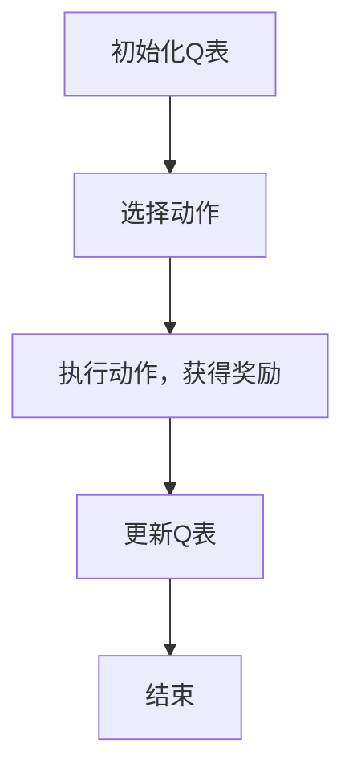
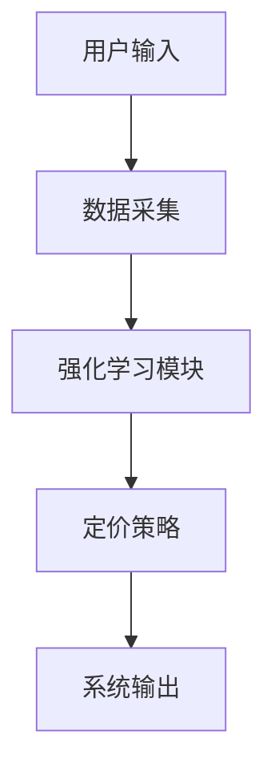
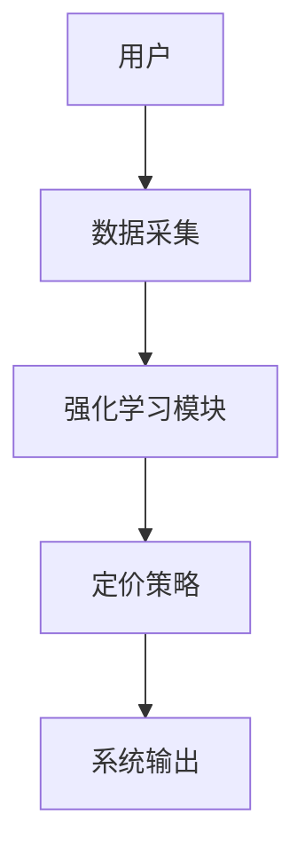

                 


# 企业AI Agent的强化学习在动态定价策略中的应用

> 关键词：AI Agent, 强化学习, 动态定价, 算法设计, 系统架构

> 摘要：本文探讨了企业AI Agent如何利用强化学习技术优化动态定价策略。通过分析强化学习的原理、动态定价的挑战以及两者的结合方式，详细阐述了基于强化学习的动态定价系统的设计与实现。文章从系统架构、算法实现、项目实战等多个角度进行了深入分析，为企业的动态定价策略提供了新的思路和解决方案。

---

## 第一部分：企业AI Agent与强化学习基础

### 第1章：企业AI Agent与强化学习概述

#### 1.1 企业AI Agent的定义与特点
企业AI Agent是一种能够感知环境、自主决策并执行任务的智能体。它具备以下特点：
- **自主性**：无需外部干预，自主完成任务。
- **反应性**：能够实时感知环境变化并做出响应。
- **目标导向**：以明确的目标为导向，优化决策过程。

**表格：AI Agent与传统自动化系统的对比**
| 特性           | AI Agent                | 传统自动化系统          |
|----------------|-------------------------|-------------------------|
| 智能性         | 高                     | 低                     |
| 决策能力       | 强                     | 弱                     |
| 适应性         | 强                     | 有限                   |

#### 1.2 强化学习的基本原理
强化学习是一种通过试错机制来优化决策的算法。其核心要素包括：
- **状态（State）**：环境的当前情况。
- **动作（Action）**：智能体采取的行为。
- **奖励（Reward）**：环境对智能体行为的反馈。
- **策略（Policy）**：决定下一步动作的规则。

**公式：Q-learning算法的核心公式**
$$ Q(s, a) = Q(s, a) + \alpha (r + \gamma \max Q(s', a') - Q(s, a)) $$

#### 1.3 动态定价策略的背景与挑战
动态定价是指根据市场变化实时调整产品价格的策略。其主要挑战包括：
- **实时性**：需要快速响应市场变化。
- **复杂性**：涉及多个变量，如供需、竞争等。
- **数据量**：需要处理大量实时数据。

### 第2章：强化学习算法原理

#### 2.1 强化学习的核心算法
- **Q-learning**：基于值函数的算法，适合离散动作空间。
- **策略梯度（Policy Gradient）**：直接优化策略，适用于连续动作空间。
- **深度强化学习（DRL）**：结合深度学习，处理高维状态空间。

**流程图：Q-learning算法流程**


#### 2.2 强化学习的数学模型
- **状态空间（S）**：所有可能的状态集合。
- **动作空间（A）**：所有可能的动作集合。
- **奖励函数（R）**：定义每个状态动作对的奖励。

### 第3章：动态定价策略与强化学习结合

#### 3.1 动态定价策略的需求分析
动态定价的核心需求包括实时性、精准性和适应性。

#### 3.2 强化学习在动态定价中的应用
通过定义状态、动作和奖励函数，强化学习能够优化定价策略。

#### 3.3 动态定价的强化学习模型设计
- **状态空间**：包括时间、库存、需求等因素。
- **动作空间**：调整价格的范围。
- **奖励函数**：利润最大化。

## 第二部分：系统架构与设计

### 第4章：系统架构设计

#### 4.1 系统功能模块
- **数据采集模块**：实时收集市场数据。
- **强化学习模块**：执行定价策略优化。
- **执行模块**：调整价格并输出结果。

#### 4.2 系统架构图


## 第三部分：项目实战

### 第5章：项目实战

#### 5.1 环境安装与数据准备
安装必要的库，如TensorFlow、Keras，并准备市场数据集。

#### 5.2 核心代码实现
实现强化学习算法，并集成到动态定价系统中。

**代码示例：Q-learning实现**
```python
import numpy as np

class QLearning:
    def __init__(self, state_space, action_space, learning_rate=0.1, gamma=0.9):
        self.q_table = np.zeros((state_space, action_space))
        self.learning_rate = learning_rate
        self.gamma = gamma

    def choose_action(self, state):
        return np.argmax(self.q_table[state])

    def update_q_table(self, state, action, reward, next_state):
        self.q_table[state][action] += self.learning_rate * (reward + self.gamma * np.max(self.q_table[next_state]) - self.q_table[state][action])
```

#### 5.3 案例分析与优化
通过实际案例分析优化定价策略，并验证算法的有效性。

## 第四部分：总结与展望

### 第6章：总结与展望

#### 6.1 本章总结
本文详细探讨了企业AI Agent如何利用强化学习优化动态定价策略，提出了系统的架构设计和实现方案。

#### 6.2 最佳实践
- 定期更新模型参数。
- 结合实时数据进行优化。
- 采用多目标优化策略。

## 附录

### 附录A：数学公式汇总
- Q-learning公式：$$ Q(s, a) = Q(s, a) + \alpha (r + \gamma \max Q(s', a') - Q(s, a)) $$

### 附录B：系统架构图


## 作者

作者：AI天才研究院 & 禅与计算机程序设计艺术

---

通过以上结构，文章详细阐述了企业AI Agent在动态定价中的应用，从理论到实践，为企业的定价策略优化提供了可行的解决方案。

