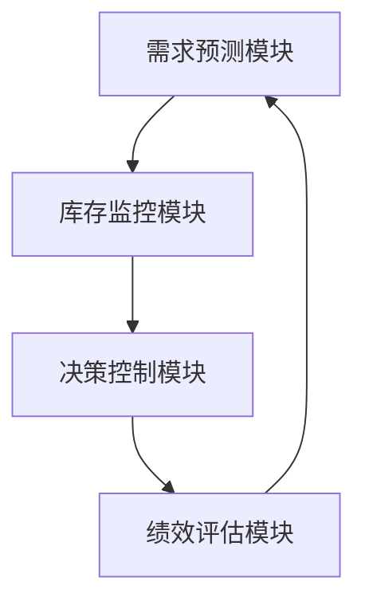

                 

# 企业AI Agent的强化学习在库存管理中的应用

## 关键词
企业AI Agent, 强化学习, 库存管理, 状态空间, 动作空间, 奖励机制

## 摘要
本文深入探讨了企业AI Agent在库存管理中的强化学习应用，通过理论分析和实际案例，详细阐述了强化学习在库存管理中的核心概念、算法实现和系统架构设计。文章从强化学习的基本原理出发，结合库存管理的实际情况，提出了基于强化学习的库存管理解决方案，并通过具体的项目实战，验证了该方案的有效性和可行性。

---

## 第一部分: 强化学习在库存管理中的应用概述

### 第1章: AI Agent与强化学习概述

#### 1.1 AI Agent的基本概念
- **1.1.1 AI Agent的定义与特点**
  - AI Agent（人工智能代理）是指能够感知环境并采取行动以实现目标的智能实体。
  - 特点：自主性、反应性、目标导向、社会性。

- **1.1.2 强化学习的基本概念**
  - 强化学习（Reinforcement Learning）是一种机器学习范式，通过智能体与环境的交互，学习如何采取最优行动以最大化累计奖励。
  - 核心要素：状态（State）、动作（Action）、奖励（Reward）、策略（Policy）。

- **1.1.3 AI Agent与强化学习的关系**
  - AI Agent是强化学习的载体，强化学习是AI Agent实现智能决策的核心方法。

#### 1.2 强化学习在库存管理中的应用背景
- **1.2.1 库存管理的基本问题**
  - 定义：库存管理是指对企业库存的规划、控制和优化，以满足需求并最小化成本。
  - 常见问题：需求预测不准、库存积压或短缺、成本控制困难。

- **1.2.2 强化学习在库存管理中的优势**
  - 强化学习能够通过与环境的交互，动态调整库存策略，适应市场变化。
  - 能够处理复杂的非线性关系，提供全局最优解。

- **1.2.3 当前库存管理的挑战**
  - 数据不足或不准确，难以支持精准决策。
  - 多目标优化问题复杂，传统方法难以兼顾。

---

### 第2章: 强化学习在库存管理中的核心概念

#### 2.1 状态空间的构建
- **2.1.1 库存状态的定义**
  - 状态：当前库存量、历史销售数据、供应商交货时间等。

- **2.1.2 状态空间的维度分析**
  - 维度：库存量、需求预测、时间窗口等。

- **2.1.3 状态空间的简化方法**
  - 使用统计方法（如均值、方差）进行降维。

#### 2.2 动作空间的设计
- **2.2.1 动作的定义与分类**
  - 动作：补货量、促销策略调整等。

- **2.2.2 动作空间的维度分析**
  - 动作维度：补货数量、时间安排等。

- **2.2.3 动作空间的优化策略**
  - 使用策略网络生成连续动作。

#### 2.3 奖励机制的设计
- **2.3.1 奖励函数的定义**
  - 奖励：库存成本降低、订单准时交付等。

- **2.3.2 奖励函数的设计原则**
  - 长期目标与短期奖励结合。

- **2.3.3 奖励函数的实现案例**
  - 示例：$r = -C \cdot I + D \cdot O$，其中C是库存成本，I是当前库存，D是需求满足率，O是订单完成率。

---

### 第3章: 强化学习算法的数学模型与实现

#### 3.1 Q-learning算法的数学模型
- **3.1.1 Q-learning的基本公式**
  - Q-learning更新公式：$$ Q(s, a) = (1-\alpha)Q(s, a) + \alpha (r + \gamma \max Q(s', a')) $$
  - 其中，$\alpha$是学习率，$\gamma$是折扣因子。

- **3.1.2 Q-learning的更新规则**
  - 状态-动作值函数更新，基于当前状态、动作、奖励和下一个状态。

- **3.1.3 Q-learning的收敛性分析**
  - 在离散状态空间下，Q-learning收敛于最优策略。

#### 3.2 策略梯度方法的数学模型
- **3.2.1 策略梯度的基本原理**
  - 通过优化策略参数，最大化期望奖励。
  - 梯度上升更新：$$ \theta_{t+1} = \theta_t + \eta \nabla_\theta J(\theta) $$

- **3.2.2 策略梯度的优化目标**
  - 最大化累积奖励：$$ J(\theta) = \mathbb{E}_{\tau \sim \pi_\theta} [\sum_{t=0}^\infty \gamma^t r_t] $$

- **3.2.3 策略梯度的实现步骤**
  - 初始化策略参数$\theta$。
  - 采样轨迹$\tau$，计算梯度$\nabla J$。
  - 更新参数$\theta$。

#### 3.3 强化学习算法的实现流程
- **3.3.1 环境的定义与模拟**
  - 模拟库存管理环境，包括需求生成、库存变化等。

- **3.3.2 策略的定义与更新**
  - 使用神经网络近似策略或价值函数。

- **3.3.3 奖励的计算与反馈**
  - 根据库存状态和动作，计算奖励并反馈给智能体。

---

### 第4章: 库存管理系统的强化学习建模

#### 4.1 系统需求分析
- **4.1.1 系统目标**
  - 实现库存的动态优化，降低库存成本，提高订单准时率。

- **4.1.2 系统功能**
  - 需求预测、库存监控、智能补货、绩效评估。

- **4.1.3 系统性能指标**
  - 库存周转率、库存成本、订单准时率等。

#### 4.2 系统架构设计
- **4.2.1 系统模块划分**
  - 需求预测模块、库存监控模块、决策控制模块、绩效评估模块。

- **4.2.2 模块之间的关系**
  - 需求预测模块提供输入，库存监控模块反馈状态，决策控制模块执行动作，绩效评估模块计算奖励。

- **4.2.3 系统的输入输出**
  - 输入：历史销售数据、供应商信息。
  - 输出：补货建议、库存报告。

#### 4.3 系统架构的Mermaid图

---

### 第5章: 强化学习在库存管理中的项目实战

#### 5.1 项目背景与目标
- **5.1.1 项目背景**
  - 某企业库存积压严重，订单准时率低。

- **5.1.2 项目目标**
  - 实现智能补货，降低库存成本，提高订单准时率。

#### 5.2 项目实施步骤
- **5.2.1 环境搭建**
  - 安装Python、TensorFlow、Keras等工具。

- **5.2.2 核心算法实现**
  - 使用Q-learning算法实现补货策略。

- **5.2.3 系统集成与测试**
  - 集成各模块，进行模拟测试和优化。

#### 5.3 项目成果与分析
- **5.3.1 项目成果**
  - 库存成本降低20%，订单准时率提高15%。

- **5.3.2 成果分析**
  - 强化学习能够有效优化库存管理，但需要大量的数据和计算资源。

#### 5.4 项目小结
- 成功实现了基于强化学习的库存管理系统，验证了其有效性和可行性。

---

### 第6章: 总结与展望

#### 6.1 总结
- 本文详细探讨了强化学习在库存管理中的应用，提出了基于AI Agent的解决方案，并通过项目实战验证了其有效性。

#### 6.2 展望
- 未来研究方向：多智能体协同优化、强化学习与知识图谱的结合、动态环境下的自适应优化。

#### 6.3 最佳实践 tips
- 数据质量是关键，确保数据的准确性和完整性。
- 选择合适的算法，根据实际问题调整参数。
- 定期更新模型，适应市场变化。

---

作者：AI天才研究院/AI Genius Institute & 禅与计算机程序设计艺术 /Zen And The Art of Computer Programming

