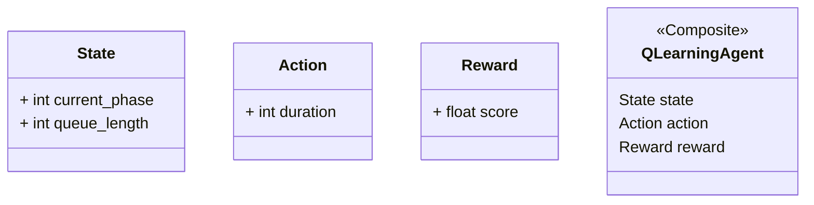
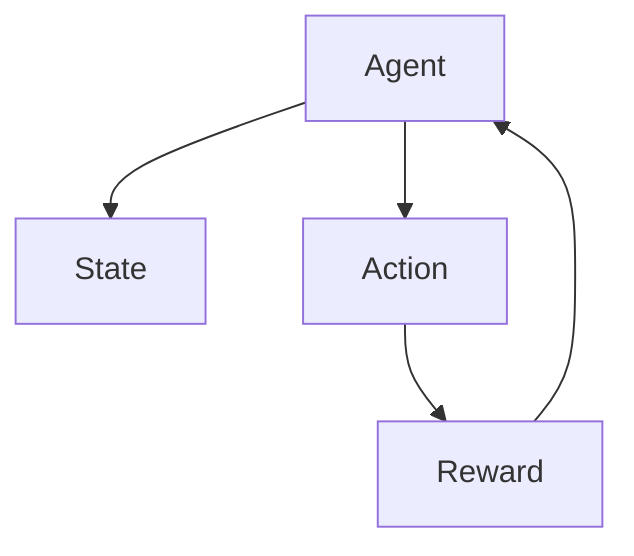
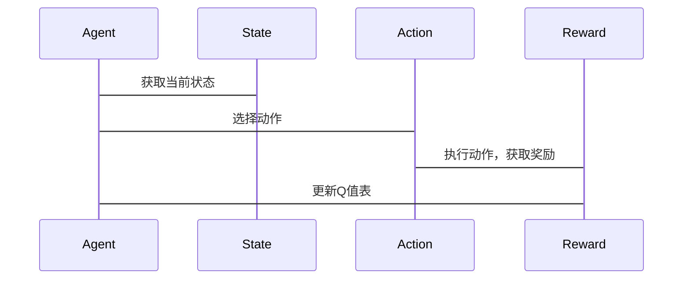

                 


# 企业AI Agent的强化学习在智慧城市管理中的应用

> 关键词：AI Agent，强化学习，智慧城市，城市管理，多智能体协作

> 摘要：本文深入探讨了企业AI Agent在智慧城市管理中的应用，重点分析了强化学习算法在城市管理中的优化作用。通过详细讲解强化学习的数学模型、算法实现、系统架构设计以及实际案例，本文为读者提供了从理论到实践的全面指导。同时，本文还探讨了AI Agent在智慧城市管理中的潜在价值和未来发展方向。

---

# 目录

1. [企业AI Agent与强化学习概述](#企业AI-Agent与强化学习概述)
   1.1 AI Agent的基本概念
   1.2 强化学习的核心概念
   1.3 智慧城市管理的背景与需求

2. [强化学习的数学模型](#强化学习的数学模型)
   2.1 状态空间与动作空间
   2.2 奖励函数与策略优化
   2.3 Q-learning算法的数学推导

3. [Q-learning算法的实现](#Q-learning算法的实现)
   3.1 Q-learning算法流程图
   3.2 Python实现Q-learning算法

4. [系统分析与架构设计](#系统分析与架构设计)
   4.1 智慧城市管理的场景描述
   4.2 系统功能设计（领域模型）
   4.3 系统架构设计
   4.4 系统接口设计
   4.5 系统交互序列图

5. [项目实战](#项目实战)
   5.1 环境安装与配置
   5.2 核心功能实现
   5.3 案例分析与代码解读

6. [最佳实践与小结](#最佳实践与小结)
   6.1 实践中的注意事项
   6.2 本章小结
   6.3 拓展阅读推荐

---

# 第一部分: 企业AI Agent与强化学习概述

## 1.1 AI Agent的基本概念

### 1.1.1 AI Agent的定义与分类
AI Agent（人工智能代理）是一种能够感知环境、自主决策并执行任务的智能实体。它可以分为以下几类：
- **反应式Agent**：基于当前感知做出反应，不依赖历史信息。
- **认知式Agent**：具有复杂推理和规划能力，能够处理不确定性。
- **学习式Agent**：能够通过经验改进自身的决策策略。

### 1.1.2 强化学习的基本原理
强化学习是一种机器学习范式，通过智能体与环境的交互，逐步优化决策策略以最大化累积奖励。其核心要素包括：
- **状态（State）**：环境的当前情况。
- **动作（Action）**：智能体的决策。
- **奖励（Reward）**：环境对决策的反馈。
- **策略（Policy）**：从状态到动作的映射。

### 1.1.3 企业AI Agent的应用场景
在智慧城市建设中，AI Agent可以应用于交通管理、资源分配、公共安全等领域。例如：
- **交通优化**：通过实时调整信号灯控制策略，缓解交通拥堵。
- **资源调度**：优化城市资源（如电力、水资源）的分配，提高效率。
- **应急响应**：在灾害发生时，快速协调救援资源，制定最优救援方案。

---

## 1.2 强化学习的核心概念

### 1.2.1 状态、动作、奖励的定义
- **状态（State）**：描述环境的当前情况，例如交通信号灯的状态。
- **动作（Action）**：智能体可以采取的操作，例如调整信号灯的时长。
- **奖励（Reward）**：智能体采取动作后获得的反馈，例如减少交通拥堵获得的奖励分数。

### 1.2.2 Q-learning算法简介
Q-learning是一种经典的强化学习算法，通过更新Q值表（Q-table）来学习最优策略。Q值表示在特定状态下采取某个动作后的预期回报。

### 1.2.3 多智能体强化学习的挑战
在智慧城市管理中，通常需要多个AI Agent协作完成任务。多智能体强化学习的挑战包括：
- **协调与通信**：多个智能体之间需要有效协作。
- **目标冲突**：不同智能体的目标可能不一致。
- **复杂性**：系统的整体优化需要考虑所有智能体的交互。

---

## 1.3 智慧城市管理的背景与需求

### 1.3.1 智慧城市的基本概念
智慧城市是通过物联网、大数据、人工智能等技术，将城市中的各个系统（如交通、能源、医疗等）有机连接，实现智能化管理的城市形态。

### 1.3.2 城市管理中的复杂问题
- **资源分配**：如何高效分配有限的资源（如电力、水资源）。
- **交通拥堵**：如何优化交通流量，减少拥堵。
- **公共安全**：如何快速响应突发事件（如火灾、地震）。

### 1.3.3 AI Agent在城市管理中的潜在价值
- **实时决策**：通过强化学习，AI Agent可以在复杂环境中实时做出最优决策。
- **自我优化**：通过不断学习和调整，优化城市管理的效率和效果。
- **多目标平衡**：在多目标优化问题中，AI Agent可以找到最优平衡点。

---

## 1.4 本章小结
本章介绍了AI Agent和强化学习的基本概念，分析了智慧城市管理的背景与需求，并探讨了AI Agent在城市管理中的潜在价值。下一章将深入讲解强化学习的数学模型。

---

# 第二部分: 强化学习的数学模型

## 2.1 状态空间与动作空间

### 2.1.1 状态空间的表示
状态空间可以表示为一个向量空间，每个维度对应一个状态特征。例如，交通信号灯的状态可以用一个二进制向量表示。

### 2.1.2 动作空间的定义
动作空间是智能体可以采取的所有动作的集合。例如，在交通信号灯控制中，动作可以是“延长绿灯时长”或“缩短红灯时长”。

### 2.1.3 状态转移概率
状态转移概率描述了从当前状态到下一个状态的概率。可以通过马尔可夫链模型来建模。

## 2.2 奖励函数与策略优化

### 2.2.1 奖励函数的设计原则
奖励函数的设计需要考虑任务目标和优化方向。例如，在交通管理中，奖励可以是“减少拥堵程度”。

### 2.2.2 策略函数的数学表达
策略函数是一个从状态到动作的概率分布。可以表示为：
$$ \pi(a|s) = P(\text{采取动作 } a \mid \text{状态 } s) $$

### 2.2.3 动作值函数的计算公式
动作值函数表示在某个状态下采取某个动作后的预期回报：
$$ Q(s, a) = r + \gamma \max_{a'} Q(s', a') $$
其中，$\gamma$是折扣因子，$r$是即时奖励。

## 2.3 Q-learning算法的数学推导

### 2.3.1 Q-learning的核心公式
Q-learning算法通过更新Q值表来逼近最优策略。更新公式为：
$$ Q(s, a) \leftarrow Q(s, a) + \alpha [r + \gamma \max Q(s', a') - Q(s, a)] $$
其中，$\alpha$是学习率。

### 2.3.2 Bellman方程的应用
Bellman方程描述了Q值的最优解：
$$ Q^*(s, a) = \max_{a'} [ r + \gamma Q^*(s', a') ] $$

### 2.3.3 算法收敛性分析
Q-learning算法在经验回放和目标网络的辅助下可以更快收敛。收敛性证明依赖于马尔可夫链的性质。

---

## 2.4 本章小结
本章详细讲解了强化学习的数学模型，包括状态空间、动作空间、奖励函数和Q-learning算法的推导。下一章将通过代码实现进一步理解这些概念。

---

# 第三部分: 强化学习算法实现

## 3.1 Q-learning算法流程图

```mermaid
graph TD
    A[初始化Q表] --> B[选择动作]
    B --> C[执行动作]
    C --> D[获取奖励]
    D --> E[更新Q值]
    E --> F[判断是否结束]
    F --> G[结束] 或 F --> B[继续]
```

## 3.2 Python实现Q-learning算法

```python
import numpy as np

class QLearning:
    def __init__(self, state_space, action_space):
        self.state_space = state_space
        self.action_space = action_space
        self.q_table = np.zeros((state_space, action_space))
    
    def choose_action(self, state, epsilon=0.1):
        if np.random.random() < epsilon:
            return np.random.randint(self.action_space)
        else:
            return np.argmax(self.q_table[state])
    
    def update_q_table(self, state, action, reward, next_state, gamma=0.99, alpha=0.1):
        current_q = self.q_table[state, action]
        next_max_q = np.max(self.q_table[next_state])
        self.q_table[state, action] = current_q + alpha * (reward + gamma * next_max_q - current_q)
```

---

## 3.3 本章小结
本章通过流程图和Python代码实现了Q-learning算法，帮助读者理解强化学习的实现细节。下一章将从系统设计的角度深入探讨AI Agent在智慧城市管理中的应用。

---

# 第四部分: 系统分析与架构设计

## 4.1 智慧城市管理的场景描述

### 4.1.1 问题背景
以交通信号灯控制为例，AI Agent需要实时调整信号灯的时长，以优化交通流量。

### 4.1.2 问题目标
通过强化学习优化交通信号灯控制策略，减少拥堵，提高道路通行效率。

### 4.1.3 问题约束
- 信号灯的时长调整需要符合交通法规。
- 系统需要实时响应，不能有延迟。

## 4.2 系统功能设计（领域模型）

### 4.2.1 领域模型类图


## 4.3 系统架构设计

### 4.3.1 系统架构图


## 4.4 系统接口设计

### 4.4.1 系统接口描述
- **输入接口**：接收交通信号灯的状态信息（如当前相位、队列长度）。
- **输出接口**：输出信号灯的控制动作（如延长绿灯时长）。
- **反馈接口**：接收环境的奖励反馈，更新Q值表。

## 4.5 系统交互序列图



---

## 4.6 本章小结
本章从系统设计的角度，详细描述了AI Agent在智慧城市管理中的应用场景，设计了系统的功能模块和架构。下一章将通过实际案例进一步验证这些设计。

---

# 第五部分: 项目实战

## 5.1 环境安装与配置

### 5.1.1 安装Python与依赖库
- 安装Python 3.x
- 安装必要的库：numpy、matplotlib

### 5.1.2 安装强化学习框架（可选）
- 使用OpenAI Gym或其他强化学习框架简化实现。

## 5.2 核心功能实现

### 5.2.1 信号灯控制系统的实现
```python
class TrafficLightController:
    def __init__(self, state_space, action_space):
        self.agent = QLearning(state_space, action_space)
    
    def update_state(self, new_state):
        self.current_state = new_state
    
    def get_action(self):
        return self.agent.choose_action(self.current_state)
    
    def update_reward(self, reward, next_state):
        self.agent.update_q_table(self.current_state, self.last_action, reward, next_state)
```

### 5.2.2 系统运行与测试
- 初始化系统。
- 模拟交通信号灯状态变化。
- 记录并分析Q值表的变化。

## 5.3 案例分析与代码解读

### 5.3.1 案例分析
以交通信号灯控制为例，分析系统在不同状态下的动作选择和奖励更新。

### 5.3.2 代码解读
```python
def main():
    state_space = 4
    action_space = 2
    agent = QLearning(state_space, action_space)
    
    for episode in range(1000):
        state = 0
        done = False
        while not done:
            action = agent.choose_action(state)
            next_state = (state + 1) % state_space
            reward = get_reward(state, action, next_state)
            agent.update_q_table(state, action, reward, next_state)
            state = next_state
```

---

## 5.4 本章小结
本章通过实际案例，展示了AI Agent在智慧城市管理中的具体实现。下一章将总结最佳实践和注意事项。

---

# 第六部分: 最佳实践与小结

## 6.1 实践中的注意事项

### 6.1.1 系统设计
- 确保系统的实时性和响应性。
- 设计合理的奖励机制，避免误导性奖励。

### 6.1.2 算法优化
- 使用经验回放和目标网络加速收敛。
- 调整学习率和折扣因子，优化算法性能。

### 6.1.3 可扩展性
- 设计模块化的系统架构，便于扩展。
- 支持多智能体协作，提高系统的整体性能。

## 6.2 本章小结
本文通过理论与实践相结合的方式，详细探讨了企业AI Agent在智慧城市管理中的应用。从算法原理到系统设计，再到项目实战，为读者提供了全面的指导。

## 6.3 拓展阅读推荐

- **《强化学习：算法与应用》**：深入讲解强化学习的理论与实践。
- **《多智能体强化学习》**：探讨多智能体协作的最新研究成果。

---

# 结语

通过本文的学习，读者可以掌握强化学习在智慧城市管理中的应用方法，理解AI Agent的核心原理，并能够将其应用于实际问题中。未来，随着技术的不断发展，AI Agent将在智慧城市建设中发挥越来越重要的作用。

---

# 作者

作者：AI天才研究院/AI Genius Institute & 禅与计算机程序设计艺术 /Zen And The Art of Computer Programming

