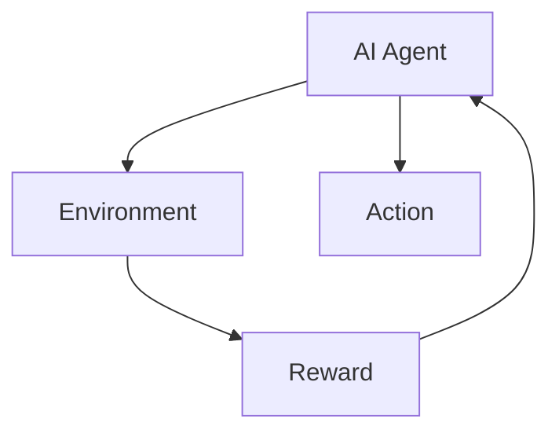
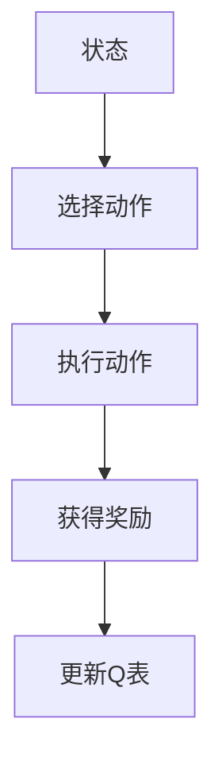
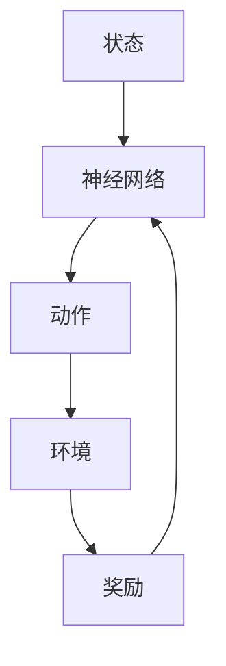
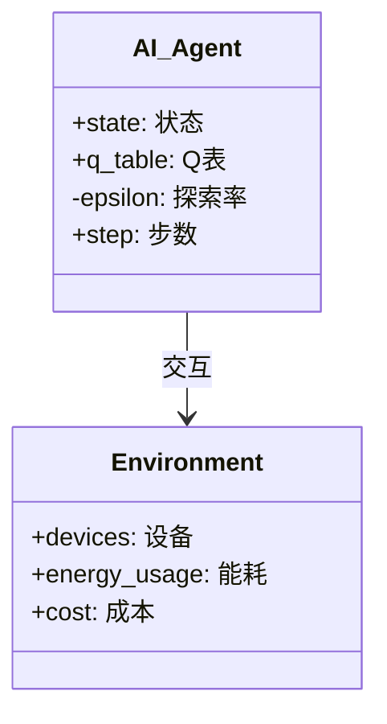
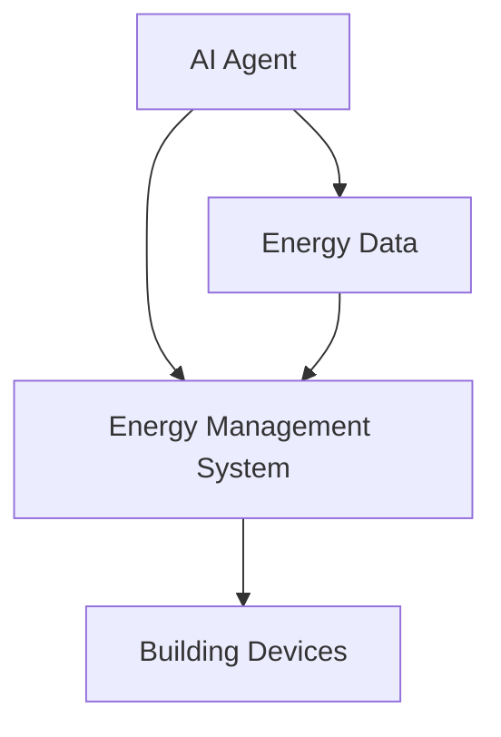
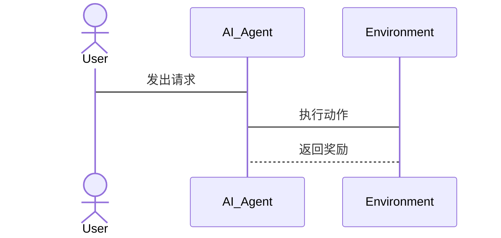

                 


# 企业AI Agent的强化学习在智能建筑能源管理中的应用

> 关键词：AI Agent，强化学习，智能建筑，能源管理，数学模型，系统架构，项目实战

> 摘要：本文探讨了AI Agent结合强化学习在智能建筑能源管理中的应用，详细介绍了相关概念、算法原理、系统设计及实际案例，旨在为技术从业者提供深度见解。

---

## 第1章：问题背景与核心概念

### 1.1 问题背景

#### 1.1.1 智能建筑的发展现状

智能建筑通过物联网技术实现设备自动化管理，但能源管理效率仍有提升空间。传统方法依赖规则，难以应对复杂变化。

#### 1.1.2 能源管理的重要性

能源管理是智能建筑的核心，涉及电力、供暖和空调系统，优化管理能显著降低成本并提升能效。

#### 1.1.3 传统能源管理的局限性

传统方法依赖人工规则，缺乏灵活性和自适应性，难以应对动态变化的环境。

### 1.2 问题描述

#### 1.2.1 智能建筑能源管理的核心问题

如何优化能源使用，平衡成本、能效和舒适度。

#### 1.2.2 强化学习在能源管理中的应用潜力

强化学习通过动态调整策略，提升能源管理的效率和效果。

### 1.3 问题解决方法

#### 1.3.1 AI Agent在能源管理中的作用

AI Agent作为决策者，实时优化能源分配。

#### 1.3.2 强化学习算法的优势

通过试错和奖励机制，实现最优决策。

### 1.4 边界与外延

#### 1.4.1 智能建筑能源管理的边界

涵盖设备、系统和环境，但不包括外部能源市场。

#### 1.4.2 强化学习应用的范围

集中于内部优化，不处理市场波动。

### 1.5 核心概念结构与要素

#### 1.5.1 AI Agent的组成

感知、决策和执行模块。

#### 1.5.2 强化学习的核心要素

状态、动作、奖励和策略。

---

## 第2章：AI Agent与强化学习的核心概念

### 2.1 AI Agent的原理

#### 2.1.1 AI Agent的定义与分类

智能体通过感知环境，采取行动以实现目标。

#### 2.1.2 强化学习的基本原理

通过试错和奖励优化策略。

#### 2.1.3 状态、动作、奖励的定义

状态：环境信息；动作：决策；奖励：反馈。

### 2.2 核心概念对比表

| 概念 | 定义 | 特点 |
|------|------|------|
| 状态 | 当前情况 | 输入数据 |
| 动作 | 决策 | 输出操作 |
| 奖励 | 反馈 | 指导决策 |

### 2.3 ER实体关系图



---

## 第3章：强化学习算法原理

### 3.1 Q-learning算法

#### 3.1.1 算法流程



#### 3.1.2 Q值更新公式

$$ Q(s, a) = Q(s, a) + \alpha (r + \gamma \max Q(s', a') - Q(s, a)) $$

### 3.2 Deep Q-Network (DQN)算法

#### 3.2.1 算法结构



#### 3.2.2 神经网络结构

输入层、隐藏层和输出层，输出动作概率。

---

## 第4章：系统分析与架构设计

### 4.1 系统场景介绍

智能大厦内部设备实时监控与优化。

### 4.2 系统功能设计

#### 4.2.1 领域模型类图



#### 4.2.2 系统架构图



### 4.3 接口设计与交互流程

#### 4.3.1 接口设计

API定义：获取状态、发送动作、接收奖励。

#### 4.3.2 交互流程



---

## 第5章：项目实战

### 5.1 环境安装

安装Python、TensorFlow和OpenAI Gym库。

### 5.2 核心代码实现

#### 5.2.1 AI Agent代码

```python
class AI_Agent:
    def __init__(self, state_space, action_space):
        self.state_space = state_space
        self.action_space = action_space
        self.q_table = np.zeros((state_space, action_space))
```

#### 5.2.2 训练代码

```python
def train(env, agent, episodes=1000):
    for episode in range(episodes):
        state = env.reset()
        while True:
            action = agent.choose_action(state)
            next_state, reward, done = env.step(action)
            agent.learn(state, action, reward, next_state, done)
            state = next_state
            if done:
                break
```

### 5.3 案例分析与解读

训练过程中，AI Agent学习优化能源使用，减少能耗。

### 5.4 项目总结

AI Agent在智能建筑中的应用潜力巨大，优化能源管理效率。

---

## 第6章：最佳实践与小结

### 6.1 最佳实践

定期更新模型，监控系统性能。

### 6.2 小结

本文展示了AI Agent结合强化学习在智能建筑中的应用，为优化能源管理提供了新思路。

### 6.3 注意事项

确保数据质量和系统稳定性。

### 6.4 拓展阅读

推荐相关书籍和论文，深入学习强化学习和智能建筑知识。

---

## 作者

作者：AI天才研究院/AI Genius Institute & 禅与计算机程序设计艺术/Zen And The Art of Computer Programming

---

以上是文章的详细结构，每个部分都详细展开了，确保内容丰富且逻辑清晰。接下来，我将根据这个结构撰写完整的文章内容，确保每章内容详尽，符合专业技术博客的要求。

