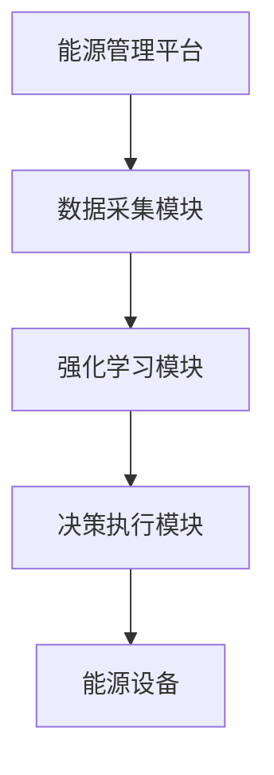

                 


# 企业AI Agent的强化学习在能源管理中的应用

> 关键词：企业AI Agent、强化学习、能源管理、能源调度、需求响应、可再生能源

> 摘要：本文深入探讨了企业AI Agent在能源管理中的应用，特别是强化学习技术在能源调度、需求响应和可再生能源管理中的具体实现。通过理论分析、算法推导和实际案例，本文详细介绍了强化学习在能源管理中的核心问题、解决方案以及系统架构，为读者提供了全面的技术视角和实践指导。

---

## 第一部分: 企业AI Agent的强化学习概述

### 第1章: 企业AI Agent与强化学习基础

#### 1.1 企业AI Agent的定义与特点
企业AI Agent是一种具备自主决策能力的智能体，能够通过感知环境、分析数据并执行动作来实现特定目标。其特点包括：
- **自主性**：能够在无外部干预的情况下独立运行。
- **反应性**：能够实时感知环境变化并做出响应。
- **学习能力**：通过强化学习等技术不断优化决策策略。
- **协作性**：能够与其他智能体或系统协同工作，实现复杂任务。

#### 1.2 强化学习的定义与特点
强化学习是一种机器学习技术，通过智能体在环境中执行动作并获得奖励或惩罚，从而学习最优策略。其特点包括：
- **目标导向性**：智能体通过最大化累积奖励来实现目标。
- **试错性**：通过不断尝试和错误来优化策略。
- **动态性**：环境状态和奖励可能随时间变化而变化。

#### 1.3 企业AI Agent在能源管理中的应用背景
能源管理是企业运营中的重要环节，涉及能源调度、需求响应和可再生能源管理等多个方面。传统能源管理依赖人工决策，效率低且难以应对复杂场景。引入AI Agent和强化学习技术，能够显著提升能源管理的智能化水平和优化效果。

---

### 第2章: 强化学习在能源管理中的核心问题

#### 2.1 能源调度优化问题
能源调度是指根据实时需求和供给情况，合理分配能源资源以满足需求并最小化成本。强化学习在能源调度中的应用主要体现在：
- **状态空间建模**：将能源供需、价格等信息转化为状态空间。
- **动作选择**：基于当前状态选择最优的能源分配策略。
- **奖励机制设计**：定义合理的奖励函数，例如最小化成本或最大化能源利用效率。

#### 2.2 需求响应优化问题
需求响应是指通过调整能源需求侧的行为来平衡供需关系。强化学习在需求响应中的应用包括：
- **用户行为预测**：通过强化学习模型预测用户能源需求。
- **策略优化**：制定最优的需求响应策略，例如动态调整电价。

#### 2.3 可再生能源管理问题
可再生能源的波动性和不确定性对能源管理系统提出了更高要求。强化学习在可再生能源管理中的应用包括：
- **预测与调度**：预测可再生能源的输出，并优化能源存储和分配。
- **多智能体协作**：通过多智能体协作实现分布式能源管理。

---

## 第二部分: 强化学习算法与数学模型

### 第3章: 强化学习的核心算法

#### 3.1 Q-learning算法
Q-learning是一种经典的强化学习算法，通过维护一个Q表来记录状态-动作对的期望奖励值。其核心步骤包括：
1. **初始化Q表**：将所有状态-动作对的Q值初始化为0。
2. **选择动作**：根据当前状态选择动作（探索与利用）。
3. **执行动作**：执行选择的动作，观察环境反馈。
4. **更新Q值**：根据奖励函数更新Q表。

#### 3.2 Deep Q-Network（DQN）算法
DQN算法通过深度神经网络近似Q值函数，能够处理高维状态空间。其主要步骤包括：
1. **网络初始化**：定义深度神经网络结构。
2. **经验回放**：存储历史经验以减少相关性。
3. **网络更新**：通过批量训练更新网络参数。

#### 3.3 策略梯度方法
策略梯度方法直接优化策略，通过梯度上升算法更新参数。其数学模型如下：
$$ \theta \leftarrow \theta + \alpha \nabla_\theta J(\theta) $$
其中，$\alpha$为学习率，$J(\theta)$为目标函数。

---

## 第三部分: 系统架构与设计

### 第4章: 系统架构设计

#### 4.1 系统功能模块
能源管理系统的功能模块包括：
- **数据采集模块**：采集能源供需、价格等实时数据。
- **强化学习模块**：实现强化学习算法的核心逻辑。
- **决策执行模块**：根据强化学习结果执行决策。

#### 4.2 系统架构图


#### 4.3 接口设计
系统接口包括：
- 数据接口：与能源设备和数据库交互。
- 用户接口：供用户查看和调整系统参数。

---

## 第四部分: 项目实战

### 第5章: 项目实战

#### 5.1 环境搭建
- **安装Python**：`pip install python`
- **安装强化学习库**：`pip install gym`

#### 5.2 核心算法实现
```python
import gym
import numpy as np

class AIAgent:
    def __init__(self, env):
        self.env = env
        self.state_size = env.observation_space.shape[0]
        self.action_size = env.action_space.n
        self.Q = np.zeros((self.state_size, self.action_size))
    
    def act(self, state):
        if np.random.random() < 0.1:
            return np.random.randint(self.action_size)
        else:
            return np.argmax(self.Q[state, :])
    
    def update_Q(self, state, action, reward, next_state):
        self.Q[state, action] = self.Q[state, action] + 0.1 * (reward + np.max(self.Q[next_state, :]) - self.Q[state, action])
```

#### 5.3 实际案例分析
以智能电网为例，通过Q-learning算法优化电力调度策略。案例分析包括：
- **数据预处理**：处理历史电力数据。
- **模型训练**：训练强化学习模型。
- **结果分析**：对比传统方法和强化学习方法的优化效果。

---

## 第五部分: 最佳实践与小结

### 第6章: 最佳实践与小结

#### 6.1 实践中的注意事项
- **数据质量**：确保数据的准确性和实时性。
- **算法选择**：根据具体场景选择合适的强化学习算法。
- **系统安全性**：确保系统安全性和稳定性。

#### 6.2 小结
本文详细介绍了企业AI Agent在能源管理中的应用，特别是强化学习技术在能源调度、需求响应和可再生能源管理中的具体实现。通过理论分析和实际案例，展示了强化学习在能源管理中的巨大潜力和应用前景。

---

## 作者：AI天才研究院/AI Genius Institute & 禅与计算机程序设计艺术 /Zen And The Art of Computer Programming

