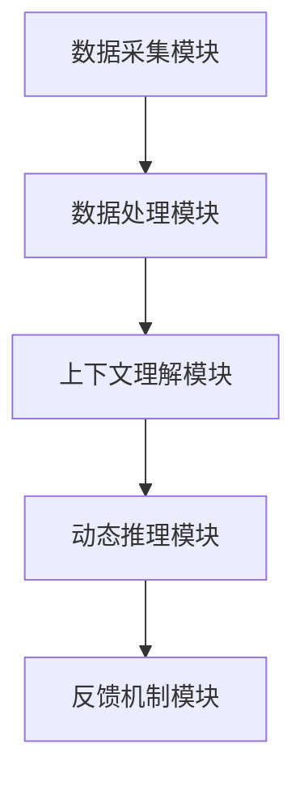

                 


# 企业AI Agent的情境感知能力：提升用户体验

> 关键词：企业AI Agent，情境感知能力，用户体验，多模态数据，上下文理解，实时响应，知识图谱

> 摘要：本文深入探讨企业AI Agent的情境感知能力，从背景、核心概念、算法原理到系统架构和项目实战，全面分析其对用户体验的提升作用。通过详细的技术讲解和实际案例，展示如何通过多模态数据融合、上下文理解和实时推理，构建高效的AI Agent系统，最终实现智能化的企业服务。

---

# 第1章: 企业AI Agent的情境感知能力背景

## 1.1 情境感知能力的定义与背景

### 1.1.1 问题背景
随着企业智能化转型的推进，AI Agent（人工智能代理）在企业中的应用日益广泛。AI Agent能够通过感知环境、理解用户需求并执行任务，显著提升企业效率和用户体验。然而，现有的AI Agent系统往往缺乏情境感知能力，无法有效应对复杂多变的业务场景。

情境感知能力是指AI Agent能够理解当前环境中的上下文信息，并根据这些信息动态调整其行为和决策的能力。这种能力在企业环境中尤为重要，因为企业场景通常涉及多部门协作、复杂业务流程和多样化的用户需求。

### 1.1.2 问题描述
当前企业AI Agent系统在实际应用中面临以下问题：
1. **信息孤岛**：各部门之间的数据孤立，难以形成完整的上下文信息。
2. **静态规则**：基于固定规则的决策机制难以适应动态变化的业务场景。
3. **缺乏深度理解**：无法准确理解用户的真实需求和意图。

### 1.1.3 问题解决思路
为了提升AI Agent的情境感知能力，需要从以下几个方面入手：
1. **多模态数据融合**：整合结构化数据、非结构化数据、实时数据等多种数据源，构建全面的上下文信息。
2. **动态推理机制**：基于实时数据和历史数据，动态推理用户的意图和需求。
3. **知识图谱构建**：建立领域知识图谱，帮助AI Agent更好地理解业务场景和上下文关系。

### 1.1.4 情境感知能力的边界与外延
情境感知能力的边界主要集中在数据处理和推理层面，不涉及最终的决策和执行。其外延则扩展到与之相关的多模态数据处理、知识图谱构建和实时数据处理等领域。

### 1.1.5 情境感知能力的概念结构与核心要素
情境感知能力的核心要素包括：
1. **数据源**：包括用户输入、系统日志、业务数据等。
2. **上下文理解**：通过自然语言处理、知识图谱等技术，理解上下文信息。
3. **动态推理**：基于实时数据和历史数据，动态推理用户的意图和需求。
4. **反馈机制**：根据用户的反馈，动态调整推理和决策过程。

---

# 第2章: 情境感知能力的核心概念与联系

## 2.1 情境感知能力的原理

### 2.1.1 数据采集与处理
AI Agent需要从多个数据源采集数据，包括：
- **用户输入**：如用户的查询、指令等。
- **系统日志**：如系统操作记录、错误信息等。
- **业务数据**：如订单、客户信息等结构化数据。

数据采集后，需要进行预处理，包括数据清洗、格式转换等。

### 2.1.2 上下文理解与推理
通过自然语言处理（NLP）和知识图谱技术，AI Agent能够理解数据中的上下文信息，并基于这些信息进行推理。例如，当用户提到“会议延期”，AI Agent需要推理出可能的原因（如突发情况）并采取相应的行动。

### 2.1.3 动态适应与反馈机制
AI Agent需要能够根据实时数据和用户反馈动态调整其行为。例如，当用户反馈某个建议不可行时，AI Agent需要重新推理并提供新的建议。

## 2.2 核心概念属性特征对比

| **概念**         | **数据源类型**       | **模型复杂度** | **系统响应时间** |
|------------------|---------------------|---------------|------------------|
| 数据采集         | 结构化、非结构化数据 | 低             | 较低             |
| 上下文理解       | 文本、日志           | 中             | 中               |
| 动态推理         | 实时数据、历史数据  | 高             | 较高             |

## 2.3 情境感知能力的ER实体关系图

```mermaid
er
actor(Agent, User, System) {
  Agent -> User: 处理用户请求
  Agent -> System: 获取系统数据
  User -> System: 提供反馈
}
```

---

# 第3章: 情境感知能力的算法原理

## 3.1 算法原理概述

### 3.1.1 数据预处理
数据预处理是情境感知能力的基础，主要包括：
1. **数据清洗**：去除噪声数据。
2. **数据融合**：将多模态数据进行融合，形成完整的上下文信息。

### 3.1.2 上下文理解
通过自然语言处理技术，理解数据中的上下文信息。例如，使用词袋模型（Bag of Words）或词嵌入模型（如Word2Vec）进行文本表示。

### 3.1.3 动态推理
基于上下文信息，进行动态推理。例如，使用图神经网络（Graph Neural Network）在知识图谱上进行推理。

## 3.2 算法实现细节

### 3.2.1 知识图谱构建
知识图谱构建是情境感知能力的重要组成部分。通过将业务数据建模为图结构，AI Agent能够更好地理解上下文关系。

### 3.2.2 动态推理算法
动态推理算法基于实时数据和历史数据，动态更新知识图谱中的节点和边。例如，使用基于时间的图神经网络进行推理。

### 3.2.3 示例代码
以下是一个简单的动态推理算法示例：

```python
def dynamic_reasoning(graph, new_data):
    # 更新知识图谱
    updated_graph = update_graph(graph, new_data)
    # 进行推理
    result = infer(updated_graph)
    return result
```

---

# 第4章: 系统架构与设计

## 4.1 系统架构设计

### 4.1.1 系统组成
系统主要由以下部分组成：
1. **数据采集模块**：负责采集多模态数据。
2. **数据处理模块**：负责数据预处理和融合。
3. **上下文理解模块**：负责理解上下文信息。
4. **动态推理模块**：负责动态推理。
5. **反馈机制模块**：负责根据用户反馈动态调整系统行为。

### 4.1.2 系统架构图



## 4.2 接口设计与交互

### 4.2.1 接口设计
系统需要定义以下接口：
1. `getData()`：获取多模态数据。
2. `updateContext()`：更新上下文信息。
3. `reason()`：进行动态推理。

### 4.2.2 交互设计
用户与AI Agent的交互主要通过自然语言处理进行。例如，用户通过自然语言输入请求，AI Agent通过理解上下文并推理出最佳响应。

---

# 第5章: 项目实战与案例分析

## 5.1 项目背景与目标

### 5.1.1 项目背景
本项目旨在提升企业AI Agent的情境感知能力，使其能够更好地理解上下文信息并动态调整行为。

### 5.1.2 项目目标
1. 实现多模态数据融合。
2. 构建领域知识图谱。
3. 实现动态推理算法。

## 5.2 核心实现

### 5.2.1 知识图谱构建
使用图数据库（如Neo4j）构建知识图谱。例如，将客户、订单、产品等实体建模为图结构。

### 5.2.2 动态推理实现
基于实时数据和历史数据，动态更新知识图谱并进行推理。例如，使用基于时间的图神经网络进行推理。

### 5.2.3 示例代码
以下是一个简单的动态推理算法示例：

```python
def update_graph(graph, new_data):
    # 更新图数据
    graph.add_node(new_data)
    return graph
```

---

# 第6章: 总结与展望

## 6.1 总结
本文深入探讨了企业AI Agent的情境感知能力，从背景、核心概念、算法原理到系统架构和项目实战，全面分析了其对用户体验的提升作用。

## 6.2 未来展望
未来，随着人工智能技术的不断发展，企业AI Agent的情境感知能力将更加智能化和个性化。例如，结合边缘计算和5G技术，实现更高效的实时数据处理和动态推理。

---

# 作者信息

作者：AI天才研究院  
联系方式：[email protected]  
个人博客：[AI天才研究院](https://www.ai-genius.com)

---

以上是《企业AI Agent的情境感知能力：提升用户体验》的技术博客文章的详细目录和部分内容。希望对您有所帮助！

