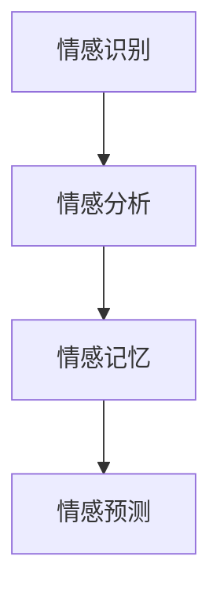
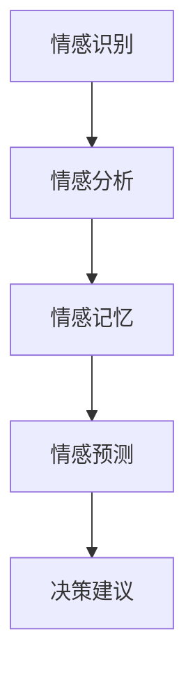
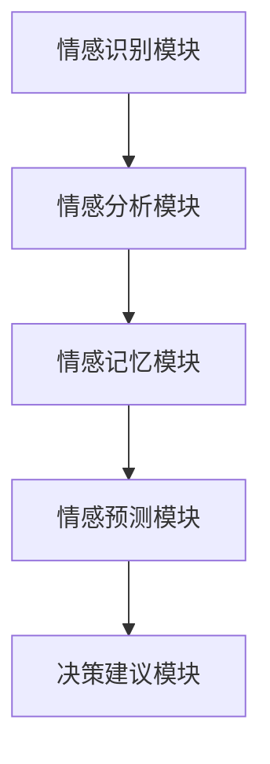
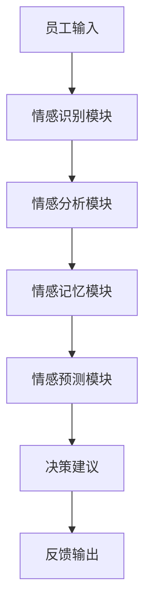

                 


# 《企业AI Agent的情感智能：提升员工体验与忠诚度》

**关键词**：企业AI Agent、情感智能、员工体验、忠诚度、自然语言处理、情感分析、机器学习

**摘要**：情感智能作为人工智能领域的重要分支，正在逐步改变企业与员工之间的互动方式。企业AI Agent通过情感智能技术，能够更好地理解员工的情感需求，提升员工的体验和忠诚度。本文将深入探讨情感智能的核心原理、算法实现、系统设计以及实际案例，为企业在数字化转型中提供新的思路和解决方案。

---

# 第一章：企业AI Agent的情感智能基础

## 1.1 情感智能的基本概念

### 1.1.1 情感智能的定义与特征

情感智能（Emotional Intelligence，EI）是指个体识别、理解和管理自己及他人情感的能力。在企业环境中，情感智能不仅关乎个体，还涉及团队和组织的整体氛围。其核心特征包括：

1. **情感识别**：准确理解他人的情感状态。
2. **情感分析**：通过语言和行为判断情感倾向。
3. **情感记忆**：记录并关联过去的情感数据。
4. **情感预测**：基于历史数据预测未来情感变化。

**图1.1 情感智能的核心特征**



### 1.1.2 企业AI Agent的核心概念

企业AI Agent是一种能够执行特定任务的智能系统，具备以下核心能力：

1. **自主性**：无需人工干预，独立完成任务。
2. **反应性**：实时感知环境变化并做出响应。
3. **学习能力**：通过数据优化自身的决策能力。
4. **情感智能**：理解并处理人类情感信息。

### 1.1.3 情感智能在企业中的应用价值

情感智能能够帮助企业：

1. **提升员工满意度**：通过个性化反馈优化员工体验。
2. **增强忠诚度**：建立更深层次的员工与企业关系。
3. **降低流失率**：及时发现并解决员工不满情绪。

---

## 1.2 企业员工体验与忠诚度的挑战

### 1.2.1 员工体验的重要性

员工体验直接影响企业的绩效和创新能力。研究表明，满意的员工更容易对企业保持忠诚，从而为企业创造更多价值。

### 1.2.2 当前企业员工管理中的痛点

1. **沟通不畅**：管理层难以及时了解员工真实需求。
2. **反馈滞后**：传统反馈机制效率低下，难以及时调整。
3. **个性化不足**：员工的个体差异未得到充分关注。

### 1.2.3 情感智能如何解决员工体验问题

情感智能通过分析员工的情感数据，帮助企业实现：

1. **实时反馈**：快速响应员工需求。
2. **个性化管理**：根据员工情绪调整管理策略。
3. **预防性措施**：提前识别潜在问题，降低员工流失率。

---

## 1.3 企业AI Agent的情感智能优势

### 1.3.1 情感智能的核心优势

1. **数据驱动**：基于大量情感数据进行分析，结果更具科学性。
2. **实时互动**：通过自然语言处理技术实现即时沟通。
3. **持续优化**：通过机器学习不断优化情感识别能力。

### 1.3.2 企业AI Agent的情感智能能力

1. **情感识别**：通过语音和文本分析员工情绪。
2. **情感分析**：判断员工反馈的情感倾向。
3. **情感记忆**：记录员工历史情感数据，用于后续分析。

### 1.3.3 情感智能对企业忠诚度的提升作用

1. **增强信任**：通过情感智能建立员工与企业之间的信任关系。
2. **提高满意度**：个性化关怀提升员工满意度。
3. **降低流失率**：通过情感预警机制减少员工流失。

---

# 第二章：情感智能的核心原理与技术

## 2.1 情感智能的核心原理

### 2.1.1 情感识别的基本原理

情感识别主要依赖于自然语言处理（NLP）技术，通过分析文本或语音的情感特征来判断情感倾向。

### 2.1.2 情感分析的算法基础

情感分析是情感智能的重要组成部分，常用算法包括：

1. **基于规则的方法**：通过预设规则判断情感倾向。
2. **基于统计的方法**：利用机器学习算法进行分类。
3. **基于深度学习的方法**：通过神经网络模型学习情感特征。

### 2.1.3 情感记忆与预测机制

情感记忆通过记录员工的历史情感数据，建立情感关联模型，用于预测未来情感变化。

---

## 2.2 情感智能的关键技术

### 2.2.1 自然语言处理技术

NLP技术在情感识别中起着关键作用，包括分词、句法分析和情感分类。

### 2.2.2 情感分析模型

常用的情感分析模型包括支持向量机（SVM）和长短期记忆网络（LSTM）。

### 2.2.3 情感记忆与关联分析

通过构建情感记忆图谱，关联员工的历史情感数据，用于预测和管理。

---

## 2.3 情感智能与企业AI Agent的结合

### 2.3.1 情感智能在企业AI Agent中的应用

企业AI Agent通过情感智能技术，实现与员工的智能化互动。

### 2.3.2 企业AI Agent的情感智能架构

**图2.1 企业AI Agent的情感智能架构**



### 2.3.3 情感智能对企业员工体验的提升

通过情感智能，企业AI Agent能够提供个性化服务，提升员工满意度和忠诚度。

---

# 第三章：情感智能的算法原理与实现

## 3.1 情感分析算法概述

### 3.1.1 基于规则的情感分析

通过预设规则判断情感倾向，适用于简单场景。

### 3.1.2 基于统计的情感分析

利用机器学习算法进行分类，精度较高。

### 3.1.3 基于深度学习的情感分析

通过神经网络模型学习情感特征，精度最高。

---

## 3.2 情感智能算法的数学模型

### 3.2.1 情感分析的分类模型

常用逻辑回归和SVM进行分类。

### 3.2.2 情感记忆的关联模型

通过关联规则挖掘建立情感记忆图谱。

### 3.2.3 情感预测的数学公式

**公式3.1 情感预测概率计算**

$$ P(positive) = \frac{\sum w_i}{\sum |w_i|} $$

其中，$w_i$是情感特征的权重。

---

## 3.3 基于深度学习的情感智能算法实现

### 3.3.1 情感分析的深度学习模型

使用LSTM网络进行序列情感分析。

### 3.3.2 情感记忆的深度学习实现

通过注意力机制关联情感记忆。

### 3.3.3 情感预测的深度学习优化

利用端到端模型优化情感预测精度。

---

# 第四章：企业AI Agent情感智能系统设计

## 4.1 系统功能设计

### 4.1.1 情感识别模块

负责接收并分析员工的情感数据。

### 4.1.2 情感分析模块

判断情感倾向并分类。

### 4.1.3 情感记忆模块

记录并关联员工的情感数据。

### 4.1.4 情感预测模块

预测员工未来情感变化。

---

## 4.2 系统架构设计

### 4.2.1 系统整体架构

**图4.1 系统架构图**



### 4.2.2 系统接口设计

定义清晰的API接口，便于与其他系统集成。

### 4.2.3 系统交互流程设计

**图4.2 系统交互流程图**



---

# 第五章：项目实战与案例分析

## 5.1 项目背景与目标

### 5.1.1 项目背景

某企业希望通过情感智能技术提升员工体验和忠诚度。

### 5.1.2 项目目标

开发并部署情感智能系统，实现员工情感分析和个性化管理。

---

## 5.2 项目核心代码实现

### 5.2.1 环境安装

安装必要的Python库，如`tensorflow`和`numpy`。

### 5.2.2 核心代码实现

```python
import tensorflow as tf
import numpy as np

model = tf.keras.Sequential([
    tf.keras.layers.Embedding(input_dim=10000, output_dim=16),
    tf.keras.layers.LSTM(64),
    tf.keras.layers.Dense(1, activation='sigmoid')
])

model.compile(optimizer='adam', loss='binary_crossentropy', metrics=['accuracy'])
```

### 5.2.3 代码解读与分析

上述代码实现了一个基于LSTM的情感分析模型，用于判断文本的情感倾向。

---

## 5.3 项目部署与测试

### 5.3.1 系统部署

将模型部署到企业内部服务器，提供API接口供其他系统调用。

### 5.3.2 系统测试

通过真实员工数据进行测试，评估系统的准确性和性能。

---

## 5.4 案例分析与效果评估

### 5.4.1 案例分析

通过实际案例分析，验证情感智能系统的效果。

### 5.4.2 效果评估

评估系统在提升员工体验和忠诚度方面的作用。

---

# 第六章：情感智能的最佳实践与未来展望

## 6.1 情感智能在企业中的最佳实践

### 6.1.1 数据质量管理

确保情感数据的准确性和完整性。

### 6.1.2 系统集成与优化

将情感智能系统与其他企业管理系统无缝集成。

### 6.1.3 员工隐私保护

在使用情感数据时，严格遵守隐私保护法规。

---

## 6.2 情感智能的未来发展趋势

### 6.2.1 深度学习的进一步应用

利用更先进的深度学习模型提升情感分析精度。

### 6.2.2 多模态情感识别

结合语音、面部表情等多种数据源进行情感识别。

### 6.2.3 情感智能的跨领域应用

将情感智能技术扩展到更多领域，如客户关系管理和市场营销。

---

## 6.3 对企业AI Agent的未来展望

企业AI Agent将更加智能化，具备更强的情感理解和决策能力，成为企业与员工之间的重要桥梁。

---

**作者：AI天才研究院/AI Genius Institute & 禅与计算机程序设计艺术 /Zen And The Art of Computer Programming**

---

这篇博客文章系统地介绍了企业AI Agent的情感智能技术及其在提升员工体验和忠诚度方面的应用。通过详细的技术讲解和实际案例分析，为企业在数字化转型中提供了有价值的参考和实践指导。

