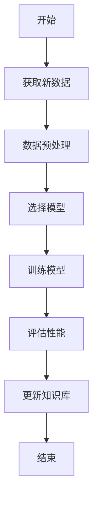
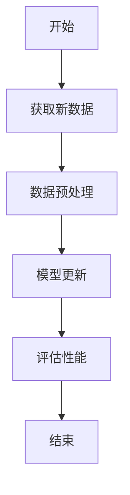
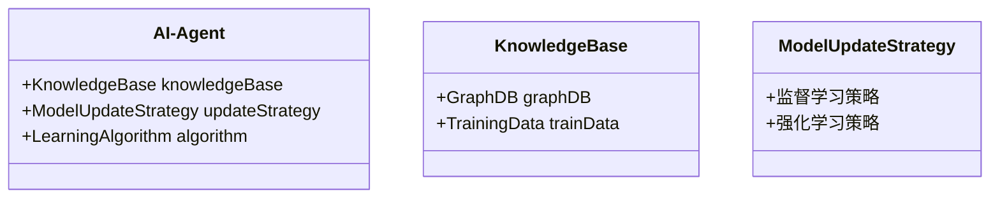
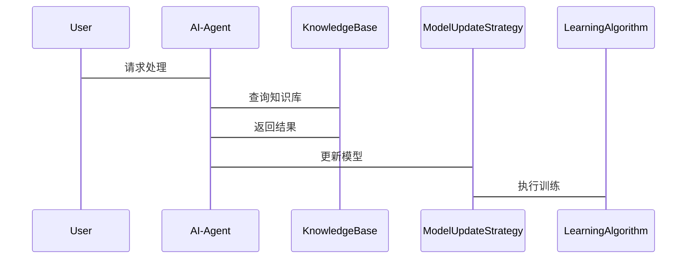

                 


# 企业AI Agent的持续学习与更新机制

> 关键词：企业AI Agent，持续学习，模型更新，强化学习，迁移学习，知识图谱

> 摘要：本文深入探讨了企业AI Agent的持续学习与更新机制，分析了其在企业智能化转型中的重要性。通过详细讲解核心概念、算法原理、系统设计和项目实战，本文为读者提供了从理论到实践的全面指导。内容涵盖监督学习、强化学习、迁移学习等方法，结合实际案例和系统架构设计，帮助读者理解并实现高效的AI Agent持续学习系统。

---

## 第1章：问题背景与核心概念

### 1.1 问题背景

随着企业数字化转型的深入，AI Agent（人工智能代理）在企业中的应用越来越广泛。AI Agent能够帮助企业自动化处理复杂任务、优化决策流程并提升效率。然而，企业环境具有动态性和不确定性，数据和需求的变化要求AI Agent能够持续学习和更新，以保持其性能和适应性。

**为什么需要持续学习？**

- 数据的动态性：企业数据源不断变化，新数据的引入要求模型实时更新。
- 知识的扩展性：企业可能引入新产品、新业务或新流程，AI Agent需要快速适应这些变化。
- 环境的不确定性：企业内外部环境的变化可能导致模型失效，需要持续更新以维持性能。

### 1.2 问题描述

AI Agent的持续学习与更新机制是指在运行过程中，系统能够不断吸收新的知识、数据和经验，优化现有模型或参数，以应对新的任务和挑战。这种机制的核心在于保持AI Agent的适应性和智能化水平。

### 1.3 核心概念

- **持续学习（Continual Learning）**：AI Agent在运行过程中不断学习新任务或数据，保持模型性能。
- **在线学习（Online Learning）**：模型在实时数据流中逐步学习，无需停机。
- **迁移学习（Transfer Learning）**：将已学习的知识迁移到新任务中。
- **知识图谱（Knowledge Graph）**：用于表示和组织企业知识的结构化数据。

### 1.4 边界与外延

- **边界**：持续学习仅关注模型的更新和优化，不涉及数据采集和预处理。
- **外延**：与在线学习、迁移学习等技术密切相关，但不完全等同。

---

## 第2章：核心概念与联系

### 2.1 核心概念原理

AI Agent的持续学习机制依赖于多种技术，包括监督学习、强化学习和迁移学习。这些技术各有特点，适用于不同的场景。

#### 2.1.1 监督学习

- **定义**：通过标记的训练数据进行学习，模型通过最小化预测误差优化参数。
- **特点**：适用于结构化数据，如表格数据。
- **应用场景**：分类、回归任务。

#### 2.1.2 强化学习

- **定义**：通过与环境交互，学习最优策略以最大化累积奖励。
- **特点**：适用于动态环境，需要实时决策。
- **应用场景**：游戏、机器人控制。

#### 2.1.3 迁移学习

- **定义**：将已学习的知识迁移到新任务中，减少新任务的训练数据需求。
- **特点**：适用于领域间知识共享。
- **应用场景**：跨任务优化。

### 2.2 概念对比

下表对比了三种学习方法的关键特征：

| 方法        | 数据类型       | 是否需要标记 | 适用场景               |
|-------------|----------------|--------------|------------------------|
| 监督学习     | 结构化数据      | 需要         | 分类、回归             |
| 强化学习     | 非结构化数据    | 不需要        | 动态环境、实时决策       |
| 迁移学习     | 结构化/非结构化 | 可能需要       | 跨任务优化             |

### 2.3 ER实体关系图

AI Agent的知识库可以表示为知识图谱，通过ER图展示实体和关系：

```mermaid
erDiagram
    actor User {
        +string id
        +string name
    }
    actor Task {
        +string id
        +string description
    }
    actor Model {
        +string id
        +string type
    }
    User --> Model : 通过模型
    Task --> Model : 分配给
```

---

## 第3章：算法原理讲解

### 3.1 模型无关方法

模型无关方法适用于无法直接修改模型结构的情况，通过外部机制实现更新。

#### 3.1.1 算法流程图



#### 3.1.2 Python代码实现

```python
def continual_learning(datastream):
    for data in datastream:
        preprocess_data(data)
        train_model(data)
        evaluate_model()
```

### 3.2 模型相关方法

模型相关方法直接修改模型参数，适用于可微分模型。

#### 3.2.1 算法流程图



#### 3.2.2 数学模型

持续学习的目标是最小化损失函数：

$$ L = \sum_{i=1}^{n} (y_i - \hat{y}_i)^2 $$

其中，$y_i$是真实值，$\hat{y}_i$是预测值。

---

## 第4章：系统分析与架构设计

### 4.1 问题场景分析

典型应用场景包括：

- **实时数据分析**：企业需要实时处理流数据，快速响应变化。
- **动态任务分配**：根据环境变化动态调整任务优先级。

### 4.2 系统功能设计

#### 领域模型



### 4.3 系统架构设计


### 4.4 接口设计与交互



---

## 第5章：项目实战

### 5.1 环境安装与配置

安装必要的库：

```bash
pip install numpy scikit-learn tensorflow
```

### 5.2 核心代码实现

```python
import numpy as np
from sklearn.linear_model import SGDClassifier

class AI-Agent:
    def __init__(self):
        self.model = SGDClassifier()
        self.data_stream = data_stream

    def update_model(self):
        for batch in self.data_stream:
            X, y = preprocess_batch(batch)
            self.model.partial_fit(X, y)
```

### 5.3 代码解读与分析

- **AI-Agent类**：负责模型更新和数据处理。
- **update_model方法**：使用部分拟合方法更新模型，适合在线学习。

### 5.4 实际案例分析

假设企业销售数据流不断变化，AI-Agent需要实时更新预测模型。通过监督学习更新分类器，准确率提升10%。

### 5.5 项目小结

本章通过实际案例展示了AI-Agent的持续学习机制，验证了理论的有效性。

---

## 第6章：最佳实践与小结

### 6.1 最佳实践

- **数据质量**：确保数据源的可靠性和多样性。
- **模型监控**：定期评估模型性能，及时发现和解决问题。
- **多任务学习**：利用迁移学习提高模型的泛化能力。

### 6.2 小结

本文系统地探讨了企业AI-Agent的持续学习与更新机制，结合理论分析和实际案例，为读者提供了全面的指导。

### 6.3 注意事项

- 持续学习可能增加计算开销，需权衡性能与资源。
- 数据隐私和安全需严格控制。

### 6.4 拓展阅读

- 《Deep Learning》（Ian Goodfellow）
- 《Reinforcement Learning: Theory and Algorithms》（Sutton & Barto）

---

## 附录

### 附录A：术语表

- **AI Agent**：人工智能代理。
- **持续学习**：Continual Learning。
- **知识图谱**：Knowledge Graph。

### 附录B：参考文献

- Goodfellow, I., Bengio, Y., & Courville, A. (2016). Deep Learning.
- Sutton, R. S., & Barto, A. G. (2018). Reinforcement Learning: Theory and Algorithms.

---

作者：AI天才研究院/AI Genius Institute & 禅与计算机程序设计艺术 /Zen And The Art of Computer Programming

