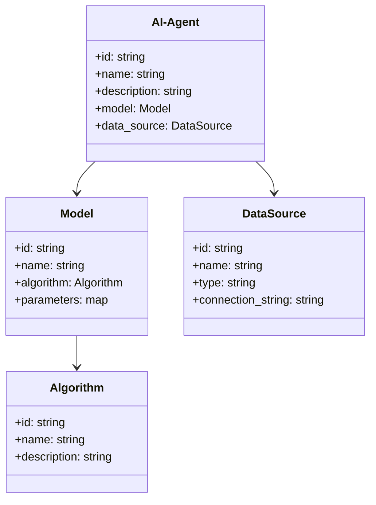
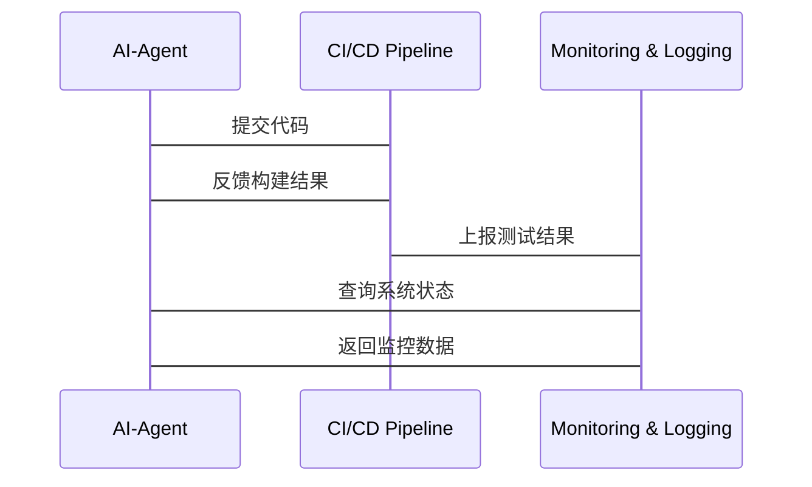

                 


# 企业AI Agent的持续集成与持续部署(CI/CD)实践

## 关键词：AI Agent，持续集成，持续部署，DevOps，企业应用，系统架构，CI/CD流程

## 摘要

随着人工智能技术的快速发展，AI Agent（智能代理）在企业中的应用越来越广泛。AI Agent是一种能够感知环境、自主决策并执行任务的智能系统，它在企业自动化、流程优化和决策支持等领域发挥着重要作用。然而，AI Agent的开发和部署面临着复杂性和动态性的挑战。为了确保AI Agent的高效开发和稳定运行，持续集成（CI）和持续部署（CD）成为不可或缺的方法。本文将深入探讨企业AI Agent的持续集成与持续部署的关键环节，分析其实现方法，并结合实际案例进行详细讲解，为读者提供实用的实践指导。

## 正文

---

## 第一部分：企业AI Agent的持续集成与持续部署背景

### 第1章：AI Agent与CI/CD概述

#### 1.1 AI Agent的基本概念

- **1.1.1 AI Agent的定义与特点**
  - AI Agent是一种智能代理系统，能够感知环境、理解需求并执行任务。
  - 其特点包括自主性、反应性、目标导向和社会能力。

- **1.1.2 企业AI Agent的应用场景**
  - 自动化操作：如无人值守的订单处理系统。
  - 智能决策：如基于数据的销售预测和库存管理。
  - 人机协作：如客服机器人辅助人类处理客户咨询。

- **1.1.3 AI Agent与传统软件开发的差异**
  - 开发复杂性：涉及机器学习模型训练和部署。
  - 动态性：需要实时数据处理和模型更新。
  - 高可用性：要求高可靠性和快速响应。

#### 1.2 持续集成与持续部署（CI/CD）的基本概念

- **1.2.1 CI/CD的定义与核心流程**
  - CI：通过自动化构建、测试和反馈，确保代码每次提交都能稳定集成。
  - CD：通过自动化交付和部署，确保代码能够快速、安全地发布到生产环境。

- **1.2.2 CI/CD在企业开发中的重要性**
  - 提高开发效率：通过自动化流程减少人工干预。
  - 确保代码质量：通过持续测试发现和修复问题。
  - 支持快速迭代：快速交付新功能，响应市场需求。

- **1.2.3 AI Agent开发中的CI/CD挑战**
  - 复杂的依赖管理：AI Agent通常依赖多种数据源和算法库。
  - 高计算资源需求：模型训练和推理需要大量计算资源。
  - 持续测试的难度：AI模型的测试需要考虑多种场景和数据集。

#### 1.3 本章小结

本章介绍了AI Agent的基本概念及其在企业中的应用场景，并分析了CI/CD在AI Agent开发中的重要性和挑战。

---

## 第二部分：AI Agent的持续集成实践

### 第2章：持续集成的流程与工具

#### 2.1 CI流程的详细步骤

- **2.1.1 版本控制与代码提交**
  - 开发人员将代码提交到版本控制系统（如Git）。
  - CI工具（如GitHub Actions）自动触发构建和测试流程。

- **2.1.2 自动化构建与测试**
  - 使用Docker容器化构建环境，确保构建环境一致性。
  - 执行单元测试、集成测试和端到端测试，验证代码功能。

- **2.1.3 代码审查与反馈机制**
  - 使用代码审查工具（如GitHub Review）检查代码质量。
  - 测试结果通过CI工具反馈给开发人员，确保问题及时修复。

#### 2.2 CI工具的选择与配置

- **2.2.1 常见CI工具（Jenkins、GitHub Actions等）**
  - Jenkins：功能强大，适合复杂项目。
  - GitHub Actions：集成性好，适合基于Git的项目。

- **2.2.2 工具的安装与配置**
  - 安装Jenkins并配置插件（如Git Plugin、Docker Plugin）。
  - 在GitHub Actions中配置工作流 YAML 文件，定义CI流程。

- **2.2.3 CI工具的优缺点对比**
  - Jenkins：灵活性高，但配置复杂。
  - GitHub Actions：易于配置，但功能相对简单。

#### 2.3 代码仓库的使用与管理

- **2.3.1 Git版本控制的使用**
  - 使用Git进行代码版本管理，确保代码的安全性和可追溯性。
  - 实施分支策略，如主分支策略，确保代码质量。

- **2.3.2 分支策略与代码合并**
  - 使用 feature 分支进行功能开发，确保主分支代码稳定。
  - 合并代码时进行代码审查，确保代码符合规范。

- **2.3.3 代码仓库的安全管理**
  - 配置权限控制，确保只有授权人员可以访问敏感代码。
  - 定期备份代码仓库，防止数据丢失。

#### 2.4 本章小结

本章详细讲解了持续集成的流程，包括代码提交、构建、测试和反馈，并探讨了常见CI工具的选择与配置，以及代码仓库的管理策略。

---

## 第三部分：AI Agent的持续部署实践

### 第3章：持续部署的流程与策略

#### 3.1 CD流程的详细步骤

- **3.1.1 交付物的构建与验证**
  - 将CI构建的结果打包成可部署的镜像或包。
  - 在测试环境进行验证，确保交付物符合要求。

- **3.1.2 部署策略（蓝绿部署、滚动发布等）**
  - 蓝绿部署：使用两套相同的生产环境，切换流量以降低风险。
  - 滚动发布：逐步更新服务实例，确保服务不中断。

- **3.1.3 监控与回滚机制**
  - 部署完成后，实时监控系统运行状态。
  - 发现异常时，及时回滚到之前的稳定版本。

#### 3.2 CD工具的选择与配置

- **3.2.1 常见CD工具（Kubernetes、Docker等）**
  - Kubernetes：适合容器化部署，支持弹性伸缩和自愈合。
  - Docker：提供容器化服务，确保环境一致性。

- **3.2.2 工具的安装与配置**
  - 安装Kubernetes集群，配置Docker容器。
  - 使用Kubernetes的部署策略，如Deployment和Service。

- **3.2.3 CD工具的优缺点对比**
  - Kubernetes：功能强大，但配置复杂。
  - Docker：轻量级，适合微服务架构。

#### 3.3 部署环境的管理与优化

- **3.3.1 环境配置与资源分配**
  - 根据业务需求，配置不同的环境（如开发、测试、生产）。
  - 分配合适的计算资源，确保性能最优。

- **3.3.2 容器化部署与资源隔离**
  - 使用Docker容器化部署，确保服务独立运行。
  - 配置资源限制，防止资源争抢影响性能。

- **3.3.3 监控与日志管理**
  - 部署Prometheus和Grafana，实时监控系统运行状态。
  - 使用ELK（Elasticsearch、Logstash、Kibana）进行日志管理，快速定位问题。

#### 3.4 本章小结

本章详细介绍了持续部署的流程，包括交付物的构建与验证、部署策略的选择与实施，以及监控与回滚机制的配置。

---

## 第四部分：系统架构设计与实现

### 第4章：系统架构设计与实现

#### 4.1 问题场景介绍

- 企业AI Agent系统需要处理大量的数据，提供实时的智能决策支持。
- 系统需要高可用性、高扩展性和高安全性，确保业务连续性。

#### 4.2 项目介绍

- **项目目标**：开发一个支持持续集成和持续部署的AI Agent系统。
- **项目范围**：包括数据采集、模型训练、服务部署和监控管理。
- **项目约束**：资源有限，要求系统可扩展和可维护。

#### 4.3 系统功能设计（领域模型Mermaid类图）



#### 4.4 系统架构设计（Mermaid架构图）


#### 4.5 系统接口设计与交互流程（Mermaid序列图）



---

## 第五部分：项目实战与代码实现

### 第5章：项目实战与代码实现

#### 5.1 环境安装与配置

- **安装Docker与Kubernetes**：
  ```bash
  # 安装Docker
  sudo apt-get update && sudo apt-get install docker.io
  # 安装Kubernetes
  curl -fsSL https://get.docker.com | bash -s docker
  ```

- **配置GitHub Actions**：
  ```yaml
  name: CI/CD Pipeline
  on:
    push:
      branches: [ main ]
  jobs:
    build:
      runs-on: ubuntu-latest
      steps:
        - uses: actions/checkout@v2
        - name: Build Docker Image
          uses: actions/docker-compose@v1
          with:
            file: docker-compose.yml
            action: push
            images: my-agent:latest
  ```

- **配置Docker镜像**：
  ```dockerfile
  FROM python:3.8-slim
  WORKDIR /app
  COPY requirements.txt .
  RUN pip install -r requirements.txt
  COPY . .
  CMD ["python", "app.py"]
  ```

#### 5.2 系统核心实现源代码

- **AI Agent服务代码**：
  ```python
  import logging
  import json
  from typing import Dict, Any

  class AIAssistant:
      def __init__(self, model_path: str):
          self.model = self.load_model(model_path)
          self.logger = logging.getLogger(self.__class__.__name__)

      def load_model(self, model_path: str) -> Any:
          # 加载模型的逻辑
          pass

      def process_request(self, request: Dict[str, Any]) -> Dict[str, Any]:
          try:
              response = self.model.predict(request)
              return {"result": response}
          except Exception as e:
              self.logger.error(f"Error processing request: {str(e)}")
              return {"error": str(e)}
  ```

- **CI/CD流程配置文件**：
  ```yaml
  jobs:
    build:
      steps:
        - checkout: self
        - name: Build
          run: |
            mkdir -p _build
            # 编译代码
            # 执行测试
            ./run_tests.sh
    deploy:
      depends_on: build
      steps:
        - checkout: self
        - name: Deploy
          run: |
            ./deploy_to_kubernetes.sh
  ```

#### 5.3 代码应用解读与分析

- **代码解读**：
  - `AIAssistant`类负责处理用户的请求，调用模型进行预测。
  - `process_request`方法处理请求，捕获异常并记录日志。
  - CI/CD流程配置文件定义了构建和部署的步骤，使用GitHub Actions进行自动化。

- **实际案例分析**：
  - 某企业AI Agent系统采用Docker和Kubernetes进行容器化部署，通过GitHub Actions实现CI/CD。
  - 系统日志和监控数据通过ELK平台进行管理，确保快速定位问题。

#### 5.4 项目小结

本章通过实际案例展示了如何在企业中实施AI Agent的CI/CD，包括环境配置、代码实现、流程配置和系统监控。

---

## 第六部分：最佳实践与总结

### 第6章：最佳实践与总结

#### 6.1 最佳实践

- **代码审查与测试**：
  - 实施严格的代码审查，确保代码质量和可维护性。
  - 定期进行回归测试，确保功能稳定。

- **容器化与微服务架构**：
  - 使用Docker容器化部署，确保环境一致性。
  - 采用微服务架构，提高系统的扩展性和灵活性。

- **监控与日志管理**：
  - 部署实时监控系统，及时发现和处理异常。
  - 使用日志管理工具，快速定位问题根源。

- **持续学习与优化**：
  - 定期更新AI模型，确保系统的智能性和适应性。
  - 优化CI/CD流程，提高开发效率和部署速度。

#### 6.2 小结与展望

- **小结**：
  - 本文详细探讨了企业AI Agent的CI/CD实践，从理论到实际应用，提供了系统的指导。
  - 通过实际案例分析，展示了如何在企业中高效实施AI Agent的开发和部署。

- **展望**：
  - 随着AI技术的不断发展，AI Agent的开发和部署将更加复杂和动态。
  - 未来，CI/CD在AI Agent中的应用将更加智能化和自动化，推动企业智能化转型。

---

## 作者信息

作者：AI天才研究院 & 禅与计算机程序设计艺术

---

**注意**：以上目录和内容仅为示例，实际编写时需要根据具体需求和实际情况进行调整和补充。

