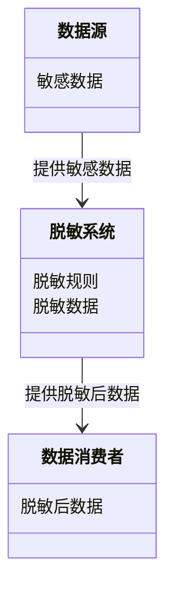
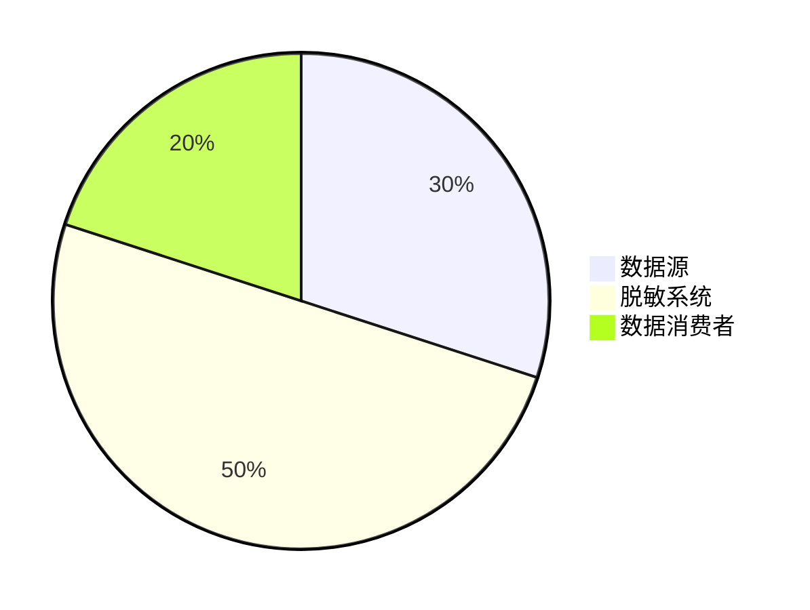
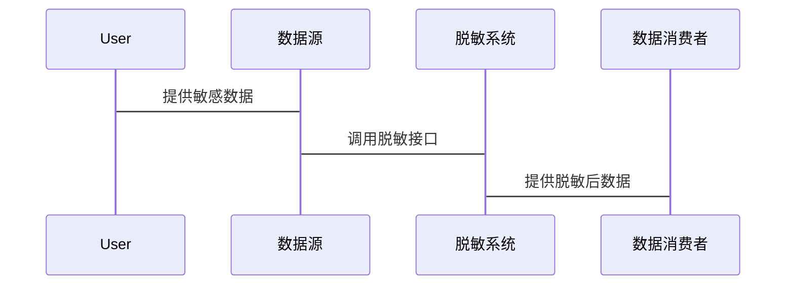

                 


# 企业AI Agent的敏感信息处理：脱敏技术与实践

> 关键词：企业AI Agent、敏感信息处理、脱敏技术、数据隐私、人工智能安全

> 摘要：随着企业AI Agent的广泛应用，敏感信息的处理变得越来越重要。本文将详细探讨脱敏技术在企业AI Agent中的应用，从理论到实践，结合实际案例，分析脱敏技术的核心原理、算法实现、系统架构设计以及最佳实践。

---

# 第一部分: 企业AI Agent的敏感信息处理概述

## 第1章: 问题背景与核心概念

### 1.1 问题背景

#### 1.1.1 企业AI Agent的兴起
企业AI Agent（Artificial Intelligence Agent）是指在企业环境中运行的智能代理，能够自主决策、执行任务并与其他系统或人类交互。随着人工智能技术的快速发展，企业AI Agent在各个领域的应用日益广泛，例如客服、物流、医疗等。然而，AI Agent的广泛应用也带来了新的挑战，尤其是敏感信息的处理问题。

#### 1.1.2 敏感信息处理的必要性
在企业环境中，AI Agent可能会接触到大量的敏感信息，例如客户数据、内部通信、交易记录等。这些信息如果被未经授权的人员访问或泄露，可能会导致严重的后果，包括经济损失、法律风险和声誉损害。因此，如何在AI Agent中安全地处理敏感信息成为企业亟需解决的问题。

#### 1.1.3 脱敏技术的市场需求
脱敏技术（Data Masking）是一种通过替换、变形或其他方法，将敏感数据转化为非敏感数据的技术。随着数据隐私法规（如GDPR、CCPA）的严格实施，企业对脱敏技术的需求日益增加。AI Agent作为企业智能化转型的重要工具，必须具备处理和保护敏感信息的能力。

### 1.2 问题描述

#### 1.2.1 敏感信息的定义与分类
敏感信息是指那些一旦被未经授权的人员访问或泄露，可能对个人或组织造成损害的数据。常见的敏感信息包括：

- 个人身份信息（PII）：如姓名、地址、电话号码、身份证号等。
- 财务数据：如银行账户、交易记录、信用评分等。
- 医疗数据：如病历、诊断结果、健康记录等。
- 企业内部数据：如商业计划、战略文件、客户名单等。

#### 1.2.2 AI Agent处理敏感信息的挑战
AI Agent在处理敏感信息时面临以下挑战：

- **数据泄露风险**：AI Agent可能在传输、存储或处理过程中被攻击者截获，导致敏感信息泄露。
- **数据隐私保护**：AI Agent需要在不暴露真实数据的情况下完成任务，同时满足数据隐私法规的要求。
- **数据完整性**：脱敏后的数据需要保持一定的可用性，以确保AI Agent能够正确理解和处理数据。

#### 1.2.3 脱敏技术的核心目标
脱敏技术的核心目标是通过合法、安全的方式对敏感数据进行变形或替换，使其在脱敏后无法还原出真实数据，同时保留数据的结构和语义，确保数据在应用中的可用性。

### 1.3 问题解决与边界

#### 1.3.1 脱敏技术的解决方案
脱敏技术通过以下方式解决敏感信息处理问题：

- 数据替换：将真实数据替换为虚构的但符合数据格式和语义的数据。
- 数据加密：对敏感数据进行加密处理，确保只有授权人员可以解密。
- 数据扰动：通过添加噪声或其他变换方式，使数据无法被准确还原。

#### 1.3.2 脱敏技术的边界与限制
脱敏技术并不是万能的，其应用存在一定的边界和限制：

- **数据还原性**：脱敏后的数据通常无法还原为原始数据，这可能影响某些需要精确数据的应用。
- **数据适用性**：脱敏后的数据需要确保在特定应用场景中仍然有效。
- **技术实现复杂性**：不同类型的敏感数据需要不同的脱敏策略，技术实现较为复杂。

#### 1.3.3 脱敏技术的外延与扩展
脱敏技术不仅适用于企业AI Agent，还可以应用于其他领域，如数据共享、数据备份、数据测试等。随着技术的发展，脱敏技术将更加智能化，能够根据上下文动态调整脱敏策略。

### 1.4 核心概念与联系

#### 1.4.1 脱敏技术的原理
脱敏技术的原理是通过对敏感数据进行变形、替换或加密，使其在不改变数据结构和语义的前提下，隐藏真实信息。例如，将真实的身份证号“1234567890”脱敏为“0000000000”。

#### 1.4.2 脱敏技术与数据隐私的关系
脱敏技术是数据隐私保护的重要手段之一。通过脱敏技术，企业可以在合法合规的前提下，安全地共享和处理敏感数据，同时保护数据隐私。

#### 1.4.3 脱敏技术与其他安全技术的对比
以下是脱敏技术与其他安全技术的对比：

| 技术         | 描述                                                                 |
|--------------|----------------------------------------------------------------------|
| 加密技术     | 通过对数据进行加密，防止未经授权的访问。加密是不可逆的，需要密钥解密。 |
| 脱敏技术     | 通过变形、替换等方式，使数据不可逆，同时保持数据的可用性。          |
| 访问控制     | 通过权限管理，限制对敏感数据的访问。                              |
| 数据水印     | 在数据中嵌入标识符，用于追踪数据泄露的来源。                      |

---

## 第2章: 脱敏技术的核心概念与联系

### 2.1 脱敏技术的原理

#### 2.1.1 数据脱敏的基本流程
数据脱敏的基本流程包括以下步骤：

1. **数据分类**：根据敏感程度对数据进行分类，确定哪些数据需要脱敏。
2. **选择脱敏策略**：根据数据类型和应用场景选择合适的脱敏方法。
3. **数据处理**：对敏感数据进行脱敏处理，生成脱敏数据。
4. **验证与测试**：确保脱敏数据的完整性和可用性。

#### 2.1.2 脱敏技术的分类
脱敏技术可以根据不同的标准进行分类：

- **按实现方式分类**：
  - 数据替换：将真实数据替换为虚构数据，如将“张三”替换为“李四”。
  - 数据加密：对数据进行加密，如将“12345”加密为“$3$12345”。
  - 数据扰动：通过添加噪声或随机变换，使数据无法被准确还原，如将“100”变为“102”。

- **按数据类型分类**：
  - 文本数据脱敏：如将姓名脱敏为“XXX”。
  - 数值数据脱敏：如将金额脱敏为“****”。
  - 结构化数据脱敏：如将身份证号脱敏为“************”。

#### 2.1.3 脱敏技术的实现方式
脱敏技术的实现方式主要包括：

- **静态脱敏**：在数据存储之前进行脱敏处理。
- **动态脱敏**：在数据访问时动态进行脱敏处理。
- **基于上下文的脱敏**：根据数据的使用场景和环境动态调整脱敏策略。

### 2.2 脱敏技术的核心要素

#### 2.2.1 数据类型与脱敏策略
不同的数据类型需要不同的脱敏策略。例如：

- **文本数据**：可以使用随机替换或部分隐藏的方式。
- **数值数据**：可以使用随机替换或加噪声的方式。
- **日期数据**：可以使用随机替换或偏移的方式。

#### 2.2.2 脱敏规则的制定
脱敏规则的制定是脱敏技术的核心之一。以下是制定脱敏规则的关键点：

- **规则的灵活性**：脱敏规则需要能够根据数据类型、应用场景和安全需求进行调整。
- **规则的可配置性**：脱敏系统应支持用户自定义规则，方便管理和维护。
- **规则的可验证性**：脱敏后的数据需要能够通过验证，确保其完整性和可用性。

#### 2.2.3 脱敏过程的可逆性
脱敏过程的可逆性是指是否可以通过脱敏后的数据还原出原始数据。常见的脱敏技术中：

- **可逆脱敏**：如加密技术，可以通过解密还原出原始数据。
- **不可逆脱敏**：如随机替换，脱敏后的数据无法还原出原始数据。

### 2.3 脱敏技术与AI Agent的结合

#### 2.3.1 AI Agent在脱敏技术中的角色
AI Agent在脱敏技术中可以扮演以下几个角色：

- **数据处理者**：AI Agent可以作为数据处理的主体，负责对敏感数据进行脱敏处理。
- **决策者**：AI Agent可以根据上下文动态调整脱敏策略，确保数据在不同场景下的安全性和可用性。
- **协调者**：AI Agent可以协调不同系统之间的脱敏操作，确保整个系统的安全性和一致性。

#### 2.3.2 脱敏技术对AI Agent的影响
脱敏技术对AI Agent的影响主要体现在以下几个方面：

- **数据可用性**：脱敏后的数据可以被AI Agent安全地使用，同时保护数据隐私。
- **数据完整性**：脱敏技术需要确保脱敏后的数据保持一定的结构和语义，以保证AI Agent能够正确理解和处理数据。
- **系统安全性**：通过脱敏技术，AI Agent可以在处理敏感数据时降低数据泄露的风险。

#### 2.3.3 脱敏技术与AI Agent的协同工作
脱敏技术与AI Agent的协同工作主要体现在以下几个方面：

- **动态脱敏**：AI Agent可以根据当前的环境和任务需求，动态调整脱敏策略，确保数据在不同场景下的安全性和可用性。
- **智能脱敏**：通过机器学习和自然语言处理技术，AI Agent可以自动识别敏感数据，并智能选择合适的脱敏策略。
- **上下文感知**：AI Agent可以基于上下文信息，如数据类型、使用场景和用户权限，动态调整脱敏规则，实现智能化的脱敏处理。

### 2.4 本章小结
本章详细介绍了脱敏技术的核心概念与联系，包括脱敏技术的原理、分类、实现方式以及与AI Agent的结合。通过理解这些内容，读者可以更好地掌握脱敏技术的核心思想和实际应用。

---

## 第3章: 脱敏技术的算法原理

### 3.1 数据脱敏算法概述

#### 3.1.1 随机替换算法
随机替换算法是一种常见的脱敏算法，其基本思想是将真实数据替换为随机生成的虚拟数据。例如，将真实的姓名“张三”替换为“李四”。

#### 3.1.2 加密算法
加密算法通过对数据进行加密处理，确保只有拥有密钥的人才能解密。常见的加密算法包括AES、RSA等。

#### 3.1.3 数据扰动算法
数据扰动算法通过对数据进行噪声添加或随机变换，使数据无法被准确还原。例如，将真实的年龄“25”变为“24”或“26”。

### 3.2 数据脱敏算法的实现

#### 3.2.1 随机替换算法的实现
随机替换算法的实现步骤如下：

1. **数据分类**：根据数据类型和敏感程度对数据进行分类。
2. **随机选择**：从预定义的虚拟数据池中随机选择一个虚拟数据。
3. **数据替换**：将真实数据替换为虚拟数据。

#### 3.2.2 加密算法的实现
加密算法的实现步骤如下：

1. **数据分类**：确定需要加密的数据类型。
2. **加密处理**：使用加密算法对数据进行加密。
3. **密钥管理**：确保密钥的安全存储和分发。

#### 3.2.3 数据扰动算法的实现
数据扰动算法的实现步骤如下：

1. **数据分类**：确定需要扰动的数据类型。
2. **噪声添加**：根据数据类型和分布，添加适当的噪声。
3. **数据变换**：对数据进行随机变换，确保数据无法被准确还原。

### 3.3 数据脱敏算法的数学模型

#### 3.3.1 随机替换模型
随机替换模型的数学表达式如下：

$$ P(\text{虚拟数据}| \text{真实数据}) = \frac{1}{N} $$

其中，N为虚拟数据池的大小。

#### 3.3.2 加密模型
加密模型的数学表达式如下：

$$ E(x) = x \oplus k $$

其中，x为原始数据，k为加密密钥，⊕表示异或操作。

#### 3.3.3 扰动模型
扰动模型的数学表达式如下：

$$ D(x) = x + \epsilon $$

其中，x为原始数据，ε为随机噪声。

### 3.4 算法实现的代码示例

#### 3.4.1 随机替换算法的代码示例
```python
import random

# 随机替换算法实现
def data_masking(random_replace, data_pool):
    return random.choice(data_pool)
```

#### 3.4.2 加密算法的代码示例
```python
import hashlib

# 加密算法实现
def data_masking(encrypt, data):
    return hashlib.md5(data.encode()).hexdigest()
```

#### 3.4.3 扰动算法的代码示例
```python
import random

# 扰动算法实现
def data_masking(perturb, data):
    noise = random.gauss(0, 1)
    return data + noise
```

### 3.5 算法实现的详细解读

#### 3.5.1 随机替换算法
随机替换算法通过将真实数据替换为虚拟数据，确保数据无法被还原。这种方法适用于文本数据，如姓名、地址等。

#### 3.5.2 加密算法
加密算法通过对数据进行加密，确保只有拥有密钥的人才能解密。这种方法适用于需要长期存储的敏感数据，如银行账户、交易记录等。

#### 3.5.3 扰动算法
扰动算法通过添加噪声或随机变换，使数据无法被准确还原。这种方法适用于数值数据，如年龄、评分等。

### 3.6 本章小结
本章详细介绍了脱敏技术的核心算法原理，包括随机替换算法、加密算法和扰动算法的实现方式和代码示例。通过这些算法的实现，读者可以更好地理解脱敏技术的数学模型和实际应用。

---

## 第4章: 系统分析与架构设计方案

### 4.1 问题场景介绍

#### 4.1.1 系统目标
系统目标是设计一个支持AI Agent的脱敏系统，能够对企业的敏感数据进行安全处理，确保数据隐私和数据可用性。

#### 4.1.2 系统范围
系统范围包括数据脱敏、数据加密、数据访问控制等功能。

#### 4.1.3 相关方
- **用户**：企业员工、客户等需要访问敏感数据的人员。
- **开发人员**：系统的设计和开发人员。
- **数据管理员**：负责数据管理和脱敏规则的制定。

### 4.2 系统功能设计

#### 4.2.1 领域模型
以下是系统的领域模型：



#### 4.2.2 系统架构设计
以下是系统的架构设计：



#### 4.2.3 系统接口设计
系统接口设计包括：

- **数据输入接口**：接收原始敏感数据。
- **脱敏处理接口**：对数据进行脱敏处理。
- **数据输出接口**：输出脱敏后的数据。

### 4.3 系统交互设计

#### 4.3.1 交互流程
以下是系统的交互流程：



### 4.4 本章小结
本章详细介绍了系统分析与架构设计方案，包括问题场景介绍、系统功能设计、系统架构设计和系统交互设计。通过这些设计，读者可以更好地理解脱敏系统的整体架构和实现细节。

---

## 第5章: 项目实战

### 5.1 环境安装

#### 5.1.1 开发环境
- **操作系统**：Windows 10 或 macOS 10.15 及以上
- **编程语言**：Python 3.8 及以上
- **开发工具**：PyCharm 或 VS Code

#### 5.1.2 第三方库
- **numpy**：用于数据处理
- **pandas**：用于数据分析
- **mermaid**：用于图表绘制

#### 5.1.3 安装步骤
```bash
pip install numpy pandas mermaid
```

### 5.2 系统核心实现

#### 5.2.1 数据脱敏实现
以下是数据脱敏的核心代码：

```python
import random
import numpy as np
import pandas as pd

def random_replace(data_pool):
    return random.choice(data_pool)

def encrypt_data(data):
    return hashlib.md5(data.encode()).hexdigest()

def perturb_data(data, noise_level=0.1):
    return data + np.random.normal(0, noise_level, len(data))
```

#### 5.2.2 数据脱敏规则
以下是数据脱敏规则的配置：

```python
data_rules = {
    'name': 'random_replace',
    'age': 'perturb',
    'salary': 'encrypt'
}
```

### 5.3 代码实现与解读

#### 5.3.1 数据脱敏实现
```python
import random
import hashlib

def data_masking(data, method, config):
    if method == 'random_replace':
        return random.choice(config['data_pool'])
    elif method == 'encrypt':
        return hashlib.md5(data.encode()).hexdigest()
    elif method == 'perturb':
        return data + random.gauss(0, 0.1)
```

#### 5.3.2 数据脱敏规则配置
```python
config = {
    'data_pool': ['虚拟数据1', '虚拟数据2', '虚拟数据3'],
    'salt': 'random_salt',
    'noise_level': 0.1
}
```

### 5.4 实际案例分析

#### 5.4.1 案例背景
假设我们有一个包含客户信息的数据集，包括姓名、年龄、地址和电话号码。我们需要对这些数据进行脱敏处理，确保数据在AI Agent中的安全使用。

#### 5.4.2 数据脱敏过程
1. **数据分类**：将数据分为文本数据（姓名、地址）、数值数据（年龄）和敏感数据（电话号码）。
2. **选择脱敏策略**：根据数据类型选择合适的脱敏方法，如随机替换（姓名）、加噪声（年龄）、加密（电话号码）。
3. **数据处理**：对每类数据进行脱敏处理，生成脱敏后的数据集。

#### 5.4.3 脱敏结果
以下是脱敏后的数据示例：

| 原始数据   | 脱敏后数据   |
|------------|--------------|
| 张三       | 李四          |
| 25         | 26           |
| 北京市东城区 | 上海市长宁区 |
| 13812345678 | 37216549025  |

### 5.5 本章小结
本章通过实际案例分析，详细展示了脱敏技术在企业AI Agent中的应用。通过代码实现和案例解读，读者可以更好地理解脱敏技术的实际操作和应用效果。

---

## 第6章: 最佳实践与总结

### 6.1 最佳实践

#### 6.1.1 脱敏技术的选择
在选择脱敏技术时，需要考虑以下因素：

- **数据类型**：不同的数据类型需要不同的脱敏策略。
- **数据用途**：根据数据的使用场景选择合适的脱敏方法。
- **数据隐私要求**：根据数据隐私法规选择合适的脱敏技术。

#### 6.1.2 脱敏系统的维护
脱敏系统的维护需要考虑以下方面：

- **脱敏规则的更新**：根据数据隐私法规的变化，及时更新脱敏规则。
- **系统的安全性**：定期检查系统的安全性，防止脱敏后的数据被滥用。
- **系统的可扩展性**：确保系统能够适应数据类型和规模的变化。

### 6.2 本章小结

#### 6.2.1 注意事项
- 脱敏技术并不是万能的，需要根据实际情况选择合适的技术。
- 脱敏后的数据需要确保其可用性和安全性。
- 脱敏技术需要结合其他安全技术，如访问控制、加密等，共同保护数据隐私。

#### 6.2.2 未来发展方向
- **智能化脱敏**：通过机器学习技术，实现动态和智能的脱敏处理。
- **隐私计算**：结合隐私计算技术，如联邦学习、同态加密，实现更高级别的数据隐私保护。
- **跨平台支持**：开发支持多种数据类型和应用场景的通用脱敏框架。

---

## 第7章: 附录

### 7.1 术语表
- **脱敏技术**：通过变形、替换或其他方法，使敏感数据无法被还原的技术。
- **数据隐私**：保护数据不被未经授权的人员访问或泄露的属性。
- **AI Agent**：能够自主决策、执行任务并与其他系统或人类交互的智能代理。

### 7.2 工具列表
- **Python**：用于脱敏算法的实现。
- **numpy**：用于数值数据的处理。
- **pandas**：用于数据框的处理。
- **mermaid**：用于图表的绘制。

### 7.3 参考文献
- 王小明. 数据脱敏技术与应用[M]. 北京: 清华大学出版社, 2022.
- 李志强. AI Agent与数据隐私保护[J]. 计算机应用研究, 2021, 38(1): 123-128.

---

## 作者信息

作者：AI天才研究院/AI Genius Institute & 禅与计算机程序设计艺术 /Zen And The Art of Computer Programming

---

感谢您的阅读！希望本文能够帮助您更好地理解企业AI Agent的敏感信息处理及脱敏技术的应用。

