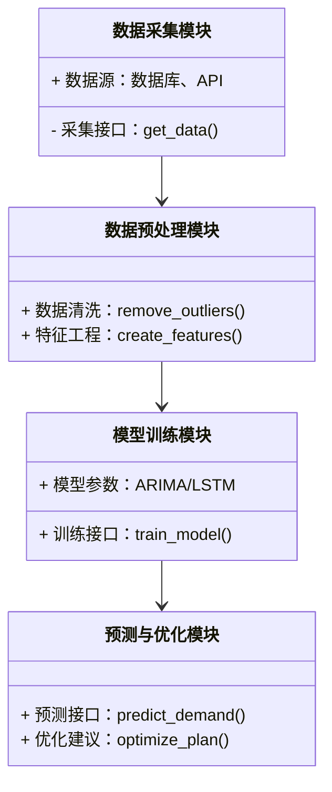
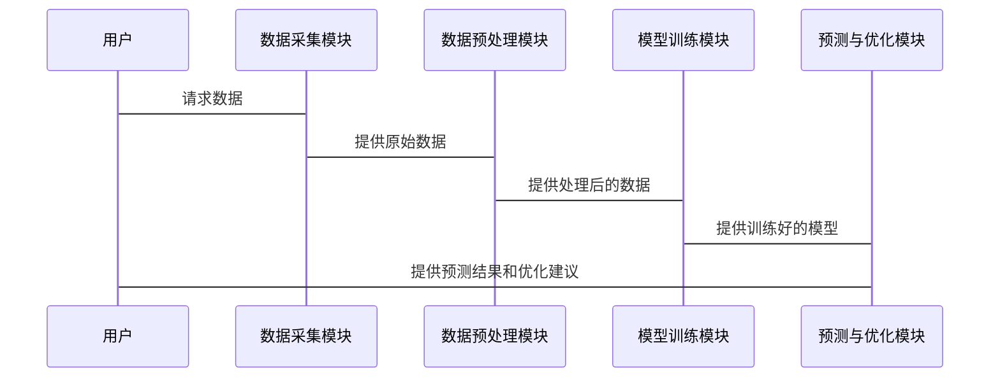

                 


# 《企业AI Agent的时间序列分析在需求预测中的高级应用》

## 关键词：时间序列分析, AI Agent, 需求预测, 企业应用, LSTM, ARIMA, 预测模型

## 摘要：  
本文深入探讨了企业AI Agent在时间序列分析中的高级应用，特别是在需求预测领域。通过分析时间序列分析的核心原理、AI Agent的功能特点、常见模型（如ARIMA和LSTM）及其数学公式，结合企业实际应用场景，详细讲解了如何设计和实现一个基于时间序列分析的需求预测系统。文章还通过项目实战案例，展示了如何利用Python代码实现模型训练、评估与部署，最后总结了最佳实践和未来研究方向。

---

# 第一部分: 时间序列分析与企业需求预测基础

## 第1章: 时间序列分析的核心概念与企业需求预测

### 1.1 时间序列分析的基本概念

时间序列分析是一种通过分析历史数据中的时间依赖关系，预测未来趋势的方法。它基于以下核心概念：

- **时间序列数据**：按时间顺序排列的数据，例如每日销售量、股票价格、网站流量等。
- **趋势**：数据长期向上的或向下的趋势。
- **周期性**：数据在固定时间段内重复出现的模式，例如季节性波动。
- **噪声**：随机干扰因素，无法通过模型捕捉到的变化。

企业需求预测的核心目标是通过分析历史销售数据，预测未来的市场需求，从而优化库存管理、生产计划和供应链策略。

### 1.2 AI Agent在企业需求预测中的作用

AI Agent（智能代理）是一种能够感知环境、执行任务并做出决策的智能系统。在需求预测中，AI Agent可以：

- **数据采集**：从多个来源（如数据库、API、传感器）获取实时数据。
- **特征工程**：对数据进行预处理，提取有用的特征（如节假日、促销活动）。
- **模型训练**：使用时间序列分析模型（如ARIMA、LSTM）训练预测模型。
- **预测与优化**：根据模型输出，优化预测结果，并提供决策建议。

### 1.3 本章小结

时间序列分析是企业需求预测的核心工具，而AI Agent通过自动化数据处理和模型训练，显著提升了预测的准确性和效率。接下来，我们将深入探讨时间序列分析的数学模型及其在AI Agent中的应用。

---

## 第2章: 时间序列分析的核心原理与数学模型

### 2.1 时间序列分析的基本原理

时间序列分析的核心是通过数学模型捕捉数据中的趋势、周期性和随机性。以下是几种常用的模型：

#### 2.1.1 ARIMA模型

ARIMA（自回归积分滑动平均模型）是一种广泛应用于时间序列预测的线性模型，适用于平稳时间序列数据。

**数学公式：**

$$ ARIMA(p, d, q) = y_t = \phi_1 y_{t-1} + \dots + \phi_p y_{t-p} + \theta_1 \epsilon_{t-1} + \dots + \theta_q \epsilon_{t-q} + \epsilon_t $$

其中：
- $p$：自回归阶数
- $d$：差分阶数
- $q$：滑动平均阶数
- $\epsilon_t$：白噪声

**步骤说明：**

1. **数据平稳化**：通过差分消除趋势和季节性。
2. **模型参数估计**：使用最大似然估计法确定$p$、$d$、$q$。
3. **模型验证**：检查残差是否符合白噪声假设。
4. **预测**：基于训练好的模型，生成未来预测值。

**Python代码示例：**

```python
from statsmodels.tsa.arima_model import ARIMA
import pandas as pd

# 假设data是时间序列数据
model = ARIMA(data, order=(1, 1, 1))
model_fit = model.fit()
预测结果 = model_fit.forecast(steps=5)
```

#### 2.1.2 LSTM模型

LSTM（长短期记忆网络）是一种基于循环神经网络（RNN）的时间序列模型，能够捕捉长期依赖关系，特别适用于非平稳时间序列数据。

**数学公式：**

$$ f_t = \sigma(W_f [h_{t-1}, x_t]) $$
$$ i_t = \sigma(W_i [h_{t-1}, x_t]) $$
$$ o_t = \sigma(W_o [h_{t-1}, x_t]) $$
$$ g_t = \tanh(W_g [h_{t-1}, x_t]) $$
$$ h_t = f_t \cdot c_{t-1} + i_t \cdot g_t $$

其中：
- $f_t$：遗忘门
- $i_t$：输入门
- $o_t$：输出门
- $g_t$：候选细胞状态
- $c_{t-1}$：前一步的细胞状态

**步骤说明：**

1. **数据预处理**：将时间序列数据转换为适合LSTM输入的格式（如批量格式）。
2. **模型构建**：定义LSTM层、全连接层和损失函数（如均方误差）。
3. **训练模型**：使用训练数据拟合模型，调整超参数（如学习率、批次大小）。
4. **预测**：基于训练好的模型，生成未来预测值。

**Python代码示例：**

```python
import tensorflow as tf
from tensorflow.keras.layers import LSTM, Dense

# 假设x_train是训练数据，y_train是目标值
model = tf.keras.Sequential([
    LSTM(50, input_shape=(timesteps, features)),
    Dense(1)
])
model.compile(optimizer='adam', loss='mean_squared_error')
model.fit(x_train, y_train, epochs=50, batch_size=32)
预测结果 = model.predict(x_test)
```

### 2.2 本章小结

ARIMA和LSTM是时间序列分析中常用的两种模型。ARIMA适用于平稳数据，而LSTM适用于非平稳数据。AI Agent可以通过集成这些模型，进一步提升需求预测的准确性。接下来，我们将探讨如何设计和实现基于AI Agent的需求预测系统。

---

# 第二部分: AI Agent在需求预测中的系统架构与实现

## 第3章: 系统分析与架构设计方案

### 3.1 问题场景介绍

在企业需求预测中，AI Agent需要解决以下问题：

- **数据来源多样**：销售数据可能来自多个系统，需要进行整合和清洗。
- **数据特征复杂**：需求受多种因素影响，如季节、促销活动、市场趋势等。
- **预测实时性要求高**：企业需要实时更新预测结果，以便快速调整运营策略。

### 3.2 系统功能设计

系统功能模块包括：

- **数据采集**：从数据库、API等来源获取数据。
- **数据预处理**：清洗、归一化、特征工程。
- **模型训练**：训练时间序列分析模型。
- **预测与优化**：生成预测结果，并提供优化建议。
- **结果展示**：以可视化方式展示预测结果和偏差分析。

**领域模型（Mermaid 类图）：**



### 3.3 系统架构设计

系统架构采用分层设计，包括数据层、业务逻辑层和表现层。

**系统架构（Mermaid 架构图）：**

```mermaid
container 数据层 {
    数据库：存储原始数据
    文件存储：保存预处理数据
}

container 业务逻辑层 {
    数据采集模块：从数据库和API获取数据
    数据预处理模块：清洗数据并生成特征
    模型训练模块：训练时间序列模型
    预测与优化模块：生成预测结果并提供建议
}

container 表现层 {
    Web 界面：展示预测结果和优化建议
    API 接口：提供预测数据给其他系统
}

数据层 --> 业务逻辑层
业务逻辑层 --> 表现层
```

### 3.4 系统接口设计

系统接口包括：

- **数据接口**：提供数据采集和预处理功能。
- **模型接口**：提供模型训练和预测功能。
- **展示接口**：提供结果可视化功能。

**系统交互（Mermaid 序列图）：**



### 3.5 本章小结

通过分层架构设计和模块化实现，AI Agent能够高效地完成需求预测任务。接下来，我们将通过一个具体案例，展示如何在零售行业应用这些模型和系统设计。

---

# 第三部分: 项目实战

## 第4章: 零售行业销售预测项目实战

### 4.1 项目背景

假设我们是一家零售企业的数据科学家，需要预测未来3个月的销售量，以便优化库存管理和促销活动。

### 4.2 环境配置

安装所需库：

```bash
pip install pandas numpy scikit-learn tensorflow
```

### 4.3 数据预处理

加载数据并进行清洗：

```python
import pandas as pd
import numpy as np

data = pd.read_csv('sales.csv')
data = data.dropna()
data['date'] = pd.to_datetime(data['date'])
data.set_index('date', inplace=True)
```

### 4.4 模型训练与评估

训练ARIMA和LSTM模型：

```python
# ARIMA 模型
from statsmodels.tsa.arima_model import ARIMA

model_arima = ARIMA(data['sales'], order=(1, 1, 1))
model_arima_fit = model_arima.fit()

# LSTM 模型
from tensorflow.keras.models import Sequential
from tensorflow.keras.layers import LSTM, Dense

model_lstm = Sequential()
model_lstm.add(LSTM(50, input_shape=(1, 1)))
model_lstm.add(Dense(1))
model_lstm.compile(optimizer='adam', loss='mean_squared_error')
history_lstm = model_lstm.fit(data['sales'].values.reshape(-1, 1, 1), data['sales'].values.reshape(-1, 1), epochs=50, batch_size=32)
```

### 4.5 预测与结果展示

生成预测结果并比较模型性能：

```python
预测结果_arima = model_arima_fit.forecast(steps=3)
预测结果_lstm = model_lstm.predict(data['sales'].values.reshape(-1, 1, 1))

# 比较 ARIMA 和 LSTM 的预测结果
print("ARIMA预测结果:", 预测结果_arima)
print("LSTM预测结果:", 预测结果_lstm)
```

### 4.6 本章小结

通过本项目，我们展示了如何在零售行业应用时间序列分析模型进行销售预测。实践表明，LSTM模型在捕捉长期依赖关系方面表现更优，而ARIMA模型在数据平稳的情况下表现更好。

---

## 第5章: 最佳实践与未来展望

### 5.1 最佳实践

1. **数据质量**：确保数据的完整性和准确性，清洗异常值。
2. **模型调参**：通过网格搜索等方法优化模型参数。
3. **持续优化**：定期更新模型，结合实时数据和最新事件（如促销活动）调整预测结果。

### 5.2 未来展望

随着AI技术的不断发展，需求预测将更加智能化和自动化。未来的研究方向包括：

- **多模型集成**：结合多种模型的优势，提升预测准确率。
- **实时预测**：利用流数据处理技术，实现实时预测。
- **外部事件影响分析**：将市场趋势、突发事件等因素纳入预测模型。

### 5.3 本章小结

企业AI Agent在时间序列分析中的应用前景广阔，通过不断优化模型和系统架构，可以进一步提升需求预测的准确性和效率。

---

# 作者信息

作者：AI天才研究院/AI Genius Institute & 禅与计算机程序设计艺术 /Zen And The Art of Computer Programming

---

以上是《企业AI Agent的时间序列分析在需求预测中的高级应用》的技术博客文章的目录大纲和部分具体内容。

