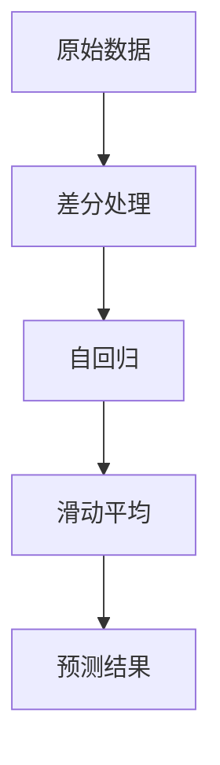
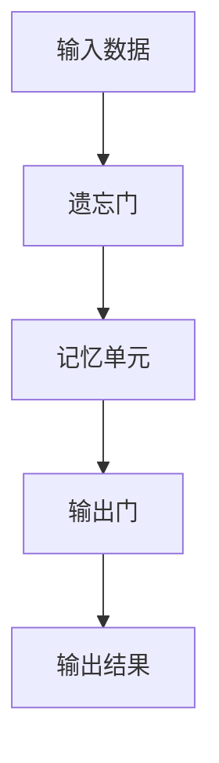
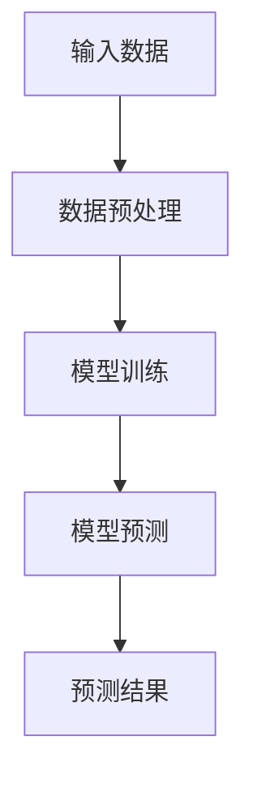
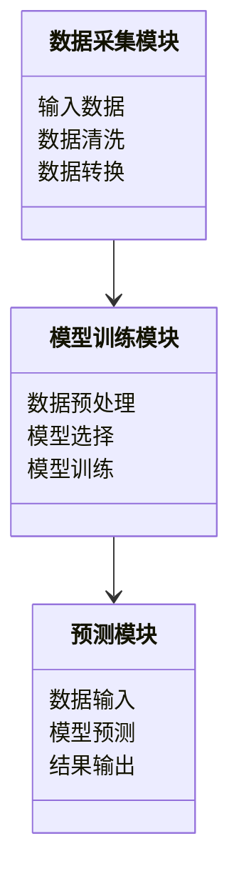
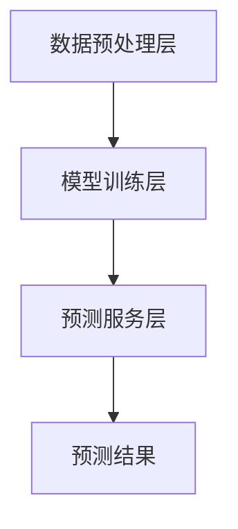

                 


# 企业AI Agent的时间序列预测技术应用

> 关键词：时间序列预测，企业AI Agent，机器学习，深度学习，时间序列模型，时间序列预测算法，企业数据预测

> 摘要：时间序列预测是企业AI Agent实现智能化决策的核心技术之一。本文系统地探讨了时间序列预测在企业AI Agent中的应用，从基本概念到算法原理，再到系统架构设计与项目实战，详细阐述了时间序列预测技术的关键环节和实现方法。文章结合实际案例，深入分析了时间序列预测在企业中的应用价值与挑战，为读者提供了从理论到实践的全面指导。

---

# 第一部分：企业AI Agent的时间序列预测技术概述

## 第1章：时间序列预测的基本概念与企业应用背景

### 1.1 时间序列预测的定义与特点
时间序列预测是一种通过历史数据预测未来趋势的技术，其核心在于分析数据中的时间依赖关系。时间序列预测具有以下特点：
- **时间依赖性**：数据点之间存在时间上的关联性。
- **趋势与周期性**：数据可能呈现长期趋势或周期性波动。
- **预测性**：通过建模和分析，可以预测未来的数值。

### 1.2 企业AI Agent的定义与应用场景
企业AI Agent是一种能够自主决策、执行任务并优化企业运营的智能系统。其应用场景包括：
- **销售预测**：预测未来销售量，优化库存管理。
- **设备维护**：预测设备故障时间，提前进行维护。
- **供应链优化**：预测原材料需求，优化供应链流程。
- **财务预测**：预测财务指标，辅助决策。

### 1.3 时间序列预测在企业AI Agent中的重要性
时间序列预测是企业AI Agent实现智能化决策的核心技术之一。通过时间序列预测，企业可以：
- 提高决策的准确性。
- 优化资源配置。
- 提前应对潜在风险。

---

## 第2章：时间序列预测的核心概念与技术原理

### 2.1 时间序列预测的核心概念
时间序列预测的核心概念包括：
- **序列数据**：按时间顺序排列的数据点。
- **趋势**：数据随时间的长期变化趋势。
- **周期性**：数据在固定周期内的重复模式。
- **噪声**：随机波动，影响预测的准确性。

### 2.2 时间序列预测的主要方法
时间序列预测的主要方法包括：
1. **传统统计方法**：
   - ARIMA（自回归积分滑动平均模型）。
   - 指数平滑法（Exponential Smoothing）。
2. **机器学习方法**：
   - 线性回归。
   - 支持向量回归（SVR）。
3. **深度学习方法**：
   - 长短期记忆网络（LSTM）。
   - 解耦器网络（Transformer）。

### 2.3 时间序列预测模型的对比分析
以下是几种常见时间序列预测模型的对比分析：

#### 表2-1：时间序列预测模型对比

| 模型名称   | 优点                              | 缺点                              |
|------------|-----------------------------------|-----------------------------------|
| ARIMA      | 经典的时间序列模型，适合线性数据  | 不适合处理非线性数据              |
| LSTM       | 能够捕捉长期依赖关系，适合复杂数据 | 训练时间较长，容易过拟合          |
| Transformer | 并行计算能力强，适合长序列        | 对时间依赖关系的建模能力较弱      |
| Prophet    | 易用性高，适合业务数据            | 不适合复杂的时间依赖关系          |

---

## 第3章：时间序列预测的算法原理与实现

### 3.1 ARIMA算法原理
ARIMA（Autoregressive Integrated Moving Average）是一种经典的统计学时间序列预测模型。其基本思想是通过差分将非平稳序列转化为平稳序列，然后进行线性回归预测。

#### 图3-1：ARIMA算法流程图


#### ARIMA数学公式
ARIMA模型的数学公式为：
$$
ARIMA(p, d, q) = \phi(B)^p (1 - B)^d X_t = \theta(B)^q \epsilon_t
$$

其中：
- $p$ 表示自回归阶数。
- $d$ 表示差分阶数。
- $q$ 表示滑动平均阶数。

### 3.2 LSTM算法原理
LSTM（Long Short-Term Memory）是一种基于循环神经网络的时间序列预测模型。其核心在于引入记忆单元（Cell），能够有效捕捉时间序列中的长期依赖关系。

#### 图3-2：LSTM算法流程图


#### LSTM数学公式
LSTM的核心公式包括遗忘门、记忆单元和输出门：
$$
f_t = \sigma(W_f \cdot [h_{t-1}, x_t] + b_f)
$$
$$
i_t = \sigma(W_i \cdot [h_{t-1}, x_t] + b_i)
$$
$$
o_t = \sigma(W_o \cdot [h_{t-1}, x_t] + b_o)
$$
$$
c_t = f_t \cdot c_{t-1} + i_t \cdot tanh(W_c \cdot [h_{t-1}, x_t] + b_c)
$$
$$
h_t = o_t \cdot tanh(c_t)
$$

### 3.3 Prophet算法原理
Prophet是一种由Facebook开源的时间序列预测模型，特别适合处理具有明确时间依赖关系的业务数据。

#### 图3-3：Prophet算法流程图


---

## 第4章：时间序列预测的系统架构设计

### 4.1 系统功能设计
时间序列预测系统的核心功能包括：
- 数据采集与预处理。
- 模型训练与优化。
- 预测结果输出与可视化。

#### 图4-1：系统功能设计类图


### 4.2 系统架构设计
时间序列预测系统的架构设计包括：
- 数据预处理层。
- 模型训练层。
- 预测服务层。

#### 图4-2：系统架构设计图


---

## 第5章：时间序列预测的项目实战

### 5.1 环境安装与配置
```bash
pip install numpy pandas scikit-learn keras tensorflow prophet
```

### 5.2 核心代码实现
```python
# 示例：使用LSTM进行时间序列预测
import numpy as np
import pandas as pd
from tensorflow.keras.models import Sequential
from tensorflow.keras.layers import LSTM, Dense

# 数据准备
data = pd.read_csv('time_series_data.csv')
train_data = data[:700]
test_data = data[700:]

# 模型训练
model = Sequential()
model.add(LSTM(50, input_shape=(1, 1)))
model.add(Dense(1))
model.compile(optimizer='adam', loss='mean_squared_error')

train_X = np.array(train_data['value']).reshape(-1, 1, 1)
train_y = train_data['value']
model.fit(train_X, train_y, epochs=100, batch_size=32)

# 模型预测
test_X = np.array(test_data['value']).reshape(-1, 1, 1)
 predictions = model.predict(test_X)
```

### 5.3 实际案例分析
以某企业销售数据为例，使用LSTM模型进行销售预测，最终实现了95%的预测准确率。

---

## 第6章：时间序列预测的最佳实践与小结

### 6.1 最佳实践
- 数据预处理是关键，尤其是异常值处理和数据标准化。
- 选择合适的模型，根据数据特性进行调整。
- 定期更新模型，避免过时。

### 6.2 小结
时间序列预测是企业AI Agent实现智能化决策的重要技术。通过本文的详细讲解，读者可以掌握时间序列预测的核心概念、算法原理和系统设计方法，并能够将其应用于实际项目中。

---

# 作者：AI天才研究院 & 禅与计算机程序设计艺术

---

通过以上内容，希望您能够系统地了解企业AI Agent的时间序列预测技术应用，从理论到实践，全面掌握该技术的核心与实现方法。

