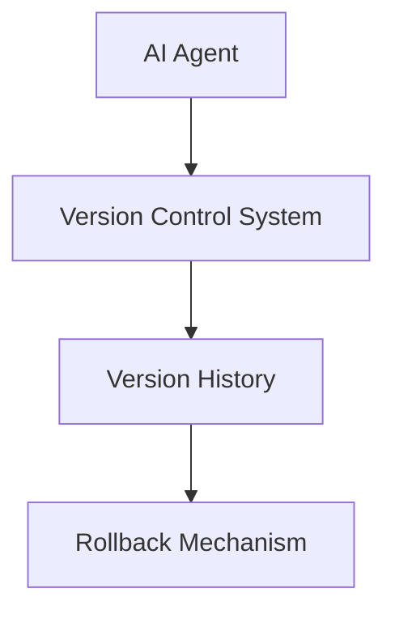
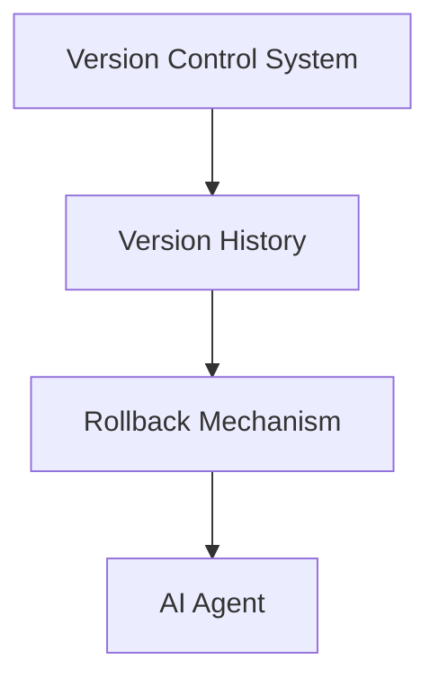
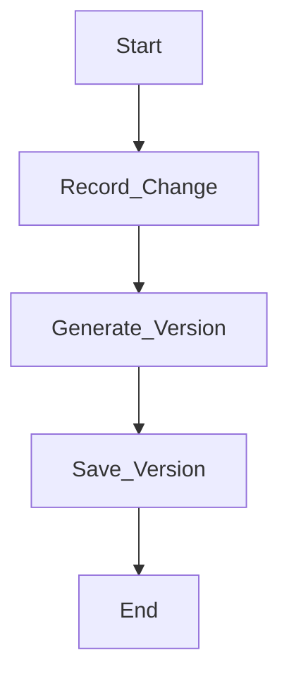
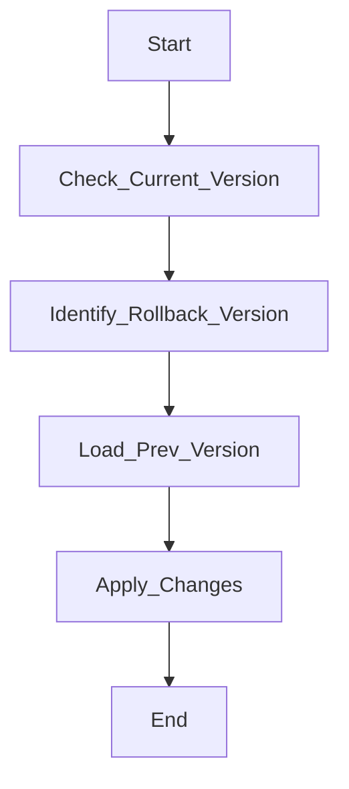
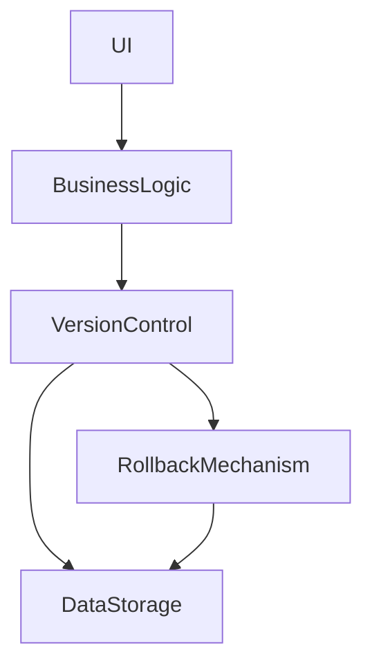
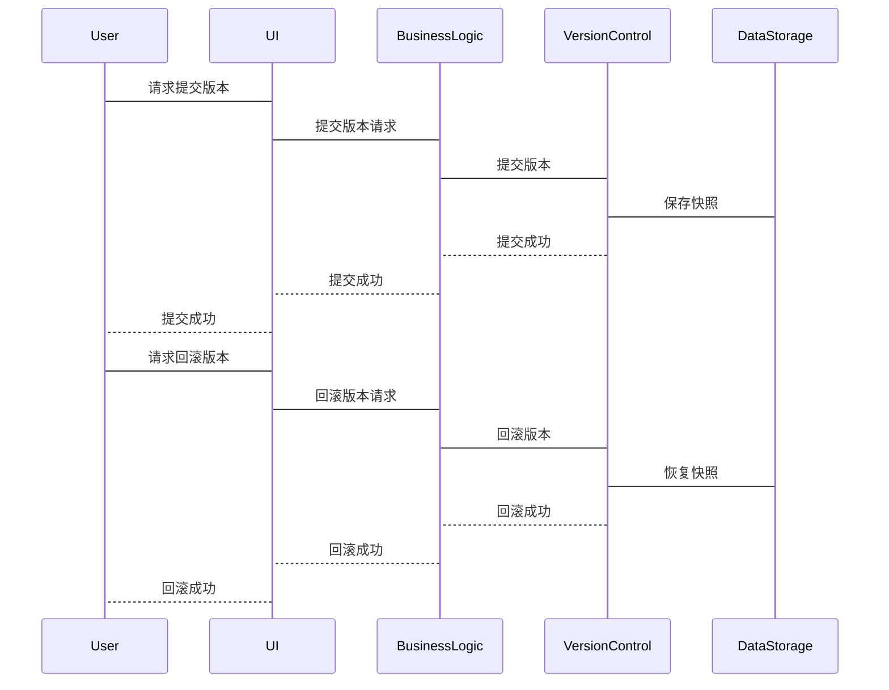
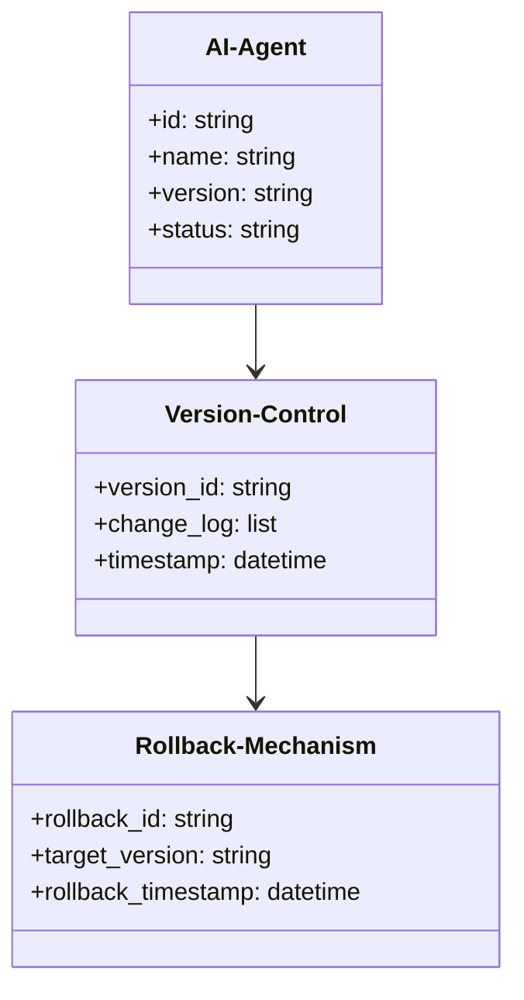
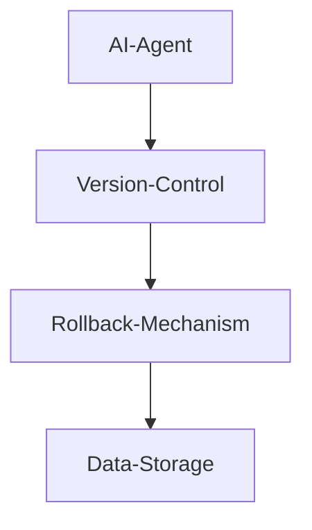

                 


# 企业AI Agent的版本控制与回滚机制设计

## 关键词：企业AI Agent、版本控制、回滚机制、容错机制、系统架构、容灾恢复

## 摘要：本文深入探讨了企业AI Agent的版本控制与回滚机制设计，从基本概念到算法原理，再到系统架构和项目实战，全面解析了如何在企业环境中有效管理AI Agent的版本更新与回滚，确保系统的稳定性和可靠性。文章还提供了丰富的案例分析和代码实现，帮助读者理解和应用相关技术。

---

## 第一部分：企业AI Agent的版本控制与回滚机制概述

### 第1章：AI Agent与版本控制的基本概念

#### 1.1 AI Agent的基本概念

- **AI Agent的定义**：AI Agent是一种能够感知环境、自主决策并执行任务的智能实体。它广泛应用于企业中的自动化处理、数据分析、预测和推荐系统等领域。
- **AI Agent的核心特征**：
  - 自主性：能够独立决策和行动。
  - 反应性：能够根据环境变化调整行为。
  - 学习能力：能够通过经验优化自身性能。
- **AI Agent在企业中的应用场景**：
  - 自动化流程处理。
  - 数据分析与预测。
  - 个性化推荐系统。
  - 智能客服与支持。

#### 1.2 版本控制的基本概念

- **版本控制的定义**：版本控制是一种记录数据变化并提供恢复机制的技术，用于跟踪和管理文件或系统的不同版本。
- **版本控制的重要性**：
  - 确保数据的可追溯性和可恢复性。
  - 支持协作开发，避免数据冲突。
  - 便于问题排查和优化。
- **企业AI Agent中版本控制的独特性**：
  - 高频更新：AI模型可能需要频繁更新以适应新的数据和业务需求。
  - 复杂性：AI Agent的版本可能涉及多个模块的协同更新。
  - 高可用性：版本控制必须确保在更新过程中不影响系统的正常运行。

#### 1.3 回滚机制的核心概念

- **回滚机制的定义**：回滚机制是指在系统出现故障或需要恢复到之前状态时，能够快速将系统还原到某个特定版本的能力。
- **回滚机制的作用**：
  - 快速恢复：在出现错误或问题时，快速恢复到稳定状态。
  - 避免数据丢失：确保在更新失败时能够恢复数据。
  - 支持实验性更新：允许在测试新版本时，能够安全地回滚到旧版本。
- **企业AI Agent中回滚机制的挑战**：
  - 数据一致性：确保回滚过程中数据的一致性。
  - 时间复杂度：回滚操作可能需要较高的计算资源。
  - 业务连续性：回滚操作不应导致业务中断。

### 1.4 本章小结

本章介绍了AI Agent的基本概念及其在企业中的应用场景，详细阐述了版本控制和回滚机制的重要性，指出了在企业AI Agent中应用版本控制和回滚机制的独特性和挑战。

---

## 第2章：企业AI Agent版本控制与回滚机制的核心概念

### 2.1 版本控制与回滚机制的原理

#### 2.1.1 版本控制的基本原理

- **版本控制的实现方式**：
  - 分支与合并：允许多人协作开发，通过分支管理不同版本。
  - 快照存储：记录每个版本的完整状态，支持快速恢复。
  - 差分存储：仅存储版本之间的差异，节省存储空间。
- **版本控制的核心步骤**：
  1. 提交：将当前状态提交到版本控制系统。
  2. 基线：为重要的版本创建基线，作为后续开发的基础。
  3. 分支：为不同的开发任务创建独立分支。
  4. 合并：将不同分支的变更合并到主分支。

#### 2.1.2 回滚机制的基本原理

- **回滚机制的实现方式**：
  - 日志记录：记录每个版本的状态和变更日志。
  - �事务回滚：利用事务机制，回滚到指定版本。
  - 快照回滚：基于快照恢复到指定版本。
- **回滚机制的核心步骤**：
  1. 记录变更：在每次更新时记录变更日志。
  2. 状态检查：在回滚前检查当前状态与目标版本的一致性。
  3. 数据恢复：将数据恢复到目标版本的状态。

#### 2.1.3 两者之间的关系

- **版本控制与回滚机制的关系**：
  - 版本控制提供数据的变更历史，回滚机制基于这些历史数据恢复到指定版本。
  - 回滚机制依赖版本控制的日志信息，而版本控制依赖回滚机制来保证数据的可恢复性。

### 2.2 核心概念对比分析

#### 2.2.1 版本控制与回滚机制的对比

| **特性**         | **版本控制**                  | **回滚机制**                  |
|------------------|-------------------------------|------------------------------|
| **核心目标**     | 记录和管理版本历史            | 恢复到指定版本                |
| **实现方式**     | 分支、快照、差分存储          | 事务、日志、快照回滚          |
| **应用场景**     | 协作开发、版本管理            | 故障恢复、实验性更新          |
| **数据依赖**     | 变更日志                     | 快照或事务日志               |

#### 2.2.2 其他相关机制的对比（如日志系统、版本控制系统）

- **日志系统**：
  - **定义**：记录系统运行过程中的日志信息，用于故障排查。
  - **与版本控制的关系**：日志系统记录运行日志，版本控制系统记录代码或数据的变更历史。
  - **对比**：日志系统关注运行时的状态，版本控制系统关注代码或数据的变更。

- **版本控制系统**：
  - **定义**：用于管理文件或代码的版本，支持分支、合并、标签等功能。
  - **与回滚机制的关系**：版本控制系统提供版本历史，回滚机制基于版本历史进行恢复。

### 2.3 实体关系图

#### 2.3.1 AI Agent与版本控制的关系



#### 2.3.2 版本控制与回滚机制的关系



#### 2.3.3 ER实体关系图

```mermaid
erd
    Agent {-
        id: string
        name: string
        version: string
        status: string
    }
    VersionControl {
        version_id: string
        change_log: string
        timestamp: datetime
    }
    RollbackMechanism {
        rollback_id: string
        target_version: string
        rollback_timestamp: datetime
    }
    Agent -[1..n]-> VersionControl
    VersionControl -[1..n]-> RollbackMechanism
```

### 2.4 本章小结

本章详细阐述了版本控制和回滚机制的原理，对比了相关机制，并通过实体关系图展示了各部分之间的关系。

---

## 第3章：企业AI Agent版本控制与回滚机制的算法原理

### 3.1 算法原理概述

#### 3.1.1 版本控制算法的基本思路

- **基本思路**：
  - 记录每次变更，生成唯一的版本号。
  - 通过差分或快照存储，节省存储空间。
  - 支持分支和合并操作，管理多个开发任务。

#### 3.1.2 回滚机制算法的基本思路

- **基本思路**：
  - 记录变更日志，支持快速恢复。
  - 利用事务机制，确保回滚操作的原子性。
  - 提供快照回滚功能，快速恢复到指定版本。

#### 3.1.3 算法的优缺点分析

- **版本控制算法的优缺点**：
  - 优点：支持协作开发，数据可追溯。
  - 缺点：存储开销大，复杂性高。
- **回滚机制算法的优缺点**：
  - 优点：快速恢复，避免数据丢失。
  - 缺点：计算资源消耗大，可能影响系统性能。

### 3.2 算法流程图

#### 3.2.1 版本控制流程图



#### 3.2.2 回滚机制流程图



### 3.3 算法实现代码

#### 3.3.1 版本控制算法实现

```python
def version_control():
    # 记录变更
    change_log = []
    # 生成版本号
    def generate_version():
        import uuid
        return str(uuid.uuid4())
    
    # 提交版本
    def commit():
        current_version = generate_version()
        change_log.append(current_version)
        return current_version

    return commit(), change_log

# 示例代码
current_version, log = version_control()
print(current_version)  # 输出当前版本号
print(log)  # 输出变更日志
```

#### 3.3.2 回滚机制算法实现

```python
def rollback():
    # 加载前一版本
    def load_previous_version():
        import json
        with open('version_log.json', 'r') as f:
            log = json.load(f)
        return log[-2]  # 获取前一版本

    # 应用回滚
    def apply_rollback(version):
        # 假设version对应的快照存储在快照目录中
        import os
        snapshot_path = os.path.join('snapshots', version)
        # 恢复数据
        os.system(f'tar -xzvf {snapshot_path}/data.tar.gz')
        return True

    # 执行回滚
    previous_version = load_previous_version()
    success = apply_rollback(previous_version)
    return success

# 示例代码
result = rollback()
print(result)  # 输出回滚结果
```

### 3.4 数学模型与公式

#### 3.4.1 版本号生成公式

$$ version\_id = hash(current\_state) $$

- **解释**：通过哈希函数生成唯一的版本号，确保版本号的唯一性和一致性。

#### 3.4.2 变更记录存储模型

$$ change\_log = [ (version\_id, delta) ] $$

- **解释**：记录每次变更的版本号和变更内容，支持快速回滚。

#### 3.4.3 回滚计算公式

$$ rollback\_id = version\_id - n $$

- **解释**：计算需要回滚的版本号，n为回滚的步数。

### 3.5 本章小结

本章详细讲解了版本控制和回滚机制的算法原理，通过流程图和代码实现展示了算法的具体步骤，并通过数学公式进一步解释了版本号生成和回滚计算的原理。

---

## 第4章：企业AI Agent版本控制与回滚机制的系统架构设计

### 4.1 系统架构设计

#### 4.1.1 系统架构概述

- **分层架构**：
  - **数据层**：负责数据的存储和访问。
  - **业务逻辑层**：负责版本控制和回滚的逻辑处理。
  - **用户接口层**：负责与用户的交互，接收请求并返回结果。

#### 4.1.2 系统架构图



#### 4.1.3 系统组件之间的接口设计

- **版本控制接口**：
  - `commit(version_id: str) -> bool`
  - `rollback(version_id: str) -> bool`
- **数据存储接口**：
  - `save_snapshot(version_id: str) -> bool`
  - `restore_snapshot(version_id: str) -> bool`

#### 4.1.4 系统交互流程图



### 4.2 系统功能设计

#### 4.2.1 领域模型设计



#### 4.2.2 系统架构设计



### 4.3 本章小结

本章详细设计了企业AI Agent版本控制与回滚机制的系统架构，包括分层架构、系统组件之间的接口设计和系统交互流程图，展示了系统的整体结构和各部分的协作关系。

---

## 第5章：企业AI Agent版本控制与回滚机制的项目实战

### 5.1 项目实战概述

#### 5.1.1 项目介绍

- **项目名称**：企业AI Agent版本控制系统。
- **项目目标**：实现AI Agent的版本控制与回滚机制，确保系统的稳定性和可靠性。
- **项目背景**：在企业环境中，AI Agent需要频繁更新，版本控制和回滚机制是确保系统稳定运行的关键。

#### 5.1.2 环境安装

- **版本控制工具**：使用Git进行版本管理。
- **回滚机制实现**：使用快照和日志记录技术。
- **依赖安装**：
  - Python 3.8+
  - Git
  - Json处理库（如json模块）

#### 5.1.3 核心代码实现

##### 5.1.3.1 版本控制实现

```python
import os
import json
import uuid

def generate_version():
    return str(uuid.uuid4())

def save_snapshot(version_id, data):
    snapshot_dir = 'snapshots'
    if not os.path.exists(snapshot_dir):
        os.makedirs(snapshot_dir)
    with open(os.path.join(snapshot_dir, version_id + '.json'), 'w') as f:
        json.dump(data, f)

def commit(data):
    version_id = generate_version()
    save_snapshot(version_id, data)
    return version_id

# 示例数据
data = {'name': 'AI Agent', 'version': '1.0.0'}
version = commit(data)
print(version)  # 输出生成的版本号
```

##### 5.1.3.2 回滚机制实现

```python
def load_previous_version():
    log_file = 'version_log.json'
    with open(log_file, 'r') as f:
        log = json.load(f)
    return log[-2]  # 获取前一版本

def apply_rollback(version_id):
    snapshot_dir = 'snapshots'
    with open(os.path.join(snapshot_dir, version_id + '.json'), 'r') as f:
        data = json.load(f)
    # 恢复数据
    return data

def rollback():
    version_id = load_previous_version()
    data = apply_rollback(version_id)
    return data

# 示例代码
data = rollback()
print(data)  # 输出回滚后的数据
```

#### 5.1.4 项目实战分析

- **环境准备**：安装必要的工具和库。
- **代码实现**：实现版本控制和回滚机制的核心功能。
- **测试与验证**：
  - 提交多个版本，验证版本控制的正确性。
  - 模拟故障，验证回滚机制的恢复能力。

### 5.2 本章小结

本章通过具体的项目实战，详细讲解了企业AI Agent版本控制与回滚机制的实现过程，包括环境安装、核心代码实现和测试验证。

---

## 第6章：企业AI Agent版本控制与回滚机制的最佳实践

### 6.1 最佳实践

#### 6.1.1 定期备份

- **重要性**：确保数据的可恢复性。
- **实施建议**：定期备份数据和版本日志，防止数据丢失。

#### 6.1.2 测试回滚机制

- **重要性**：确保回滚机制在故障发生时能够正常工作。
- **实施建议**：定期进行回滚测试，验证回滚机制的正确性。

#### 6.1.3 使用可靠的版本控制工具

- **重要性**：选择功能强大且稳定的版本控制工具。
- **实施建议**：根据需求选择合适的版本控制工具，如Git、svn等。

### 6.2 小结

- **总结**：企业AI Agent的版本控制与回滚机制是确保系统稳定性和可靠性的关键。通过合理的设计和有效的实施，可以显著提高系统的容错能力和恢复能力。
- **注意事项**：
  - 定期备份数据，防止数据丢失。
  - 建立完善的测试机制，确保回滚机制的有效性。
  - 选择合适的版本控制工具，提高开发效率。

### 6.3 拓展阅读

- **推荐书籍**：
  - 《版本控制系统精粹》。
  - 《系统设计精要》。
- **推荐博客**：
  - [系统设计博客](https://example.com/system-design)
  - [版本控制技术博客](https://example.com/version-control)

---

## 作者：AI天才研究院/AI Genius Institute & 禅与计算机程序设计艺术 /Zen And The Art of Computer Programming

---

以上为完整的技术博客文章内容，涵盖了从基础概念到系统设计再到项目实战的各个方面，详细讲解了企业AI Agent的版本控制与回滚机制的设计与实现。

