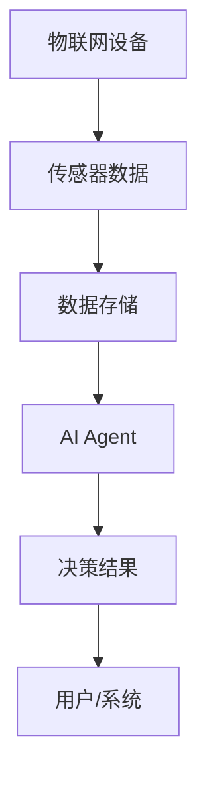

                 


# 企业AI Agent的物联网(IoT)数据分析与应用

> 关键词：企业AI Agent，物联网(IoT)，数据分析，机器学习，系统架构，项目实战

> 摘要：本文深入探讨了企业AI Agent在物联网数据分析与应用中的核心原理、算法实现、系统架构设计以及实际项目案例。通过详细的技术分析和实际代码实现，展示了如何利用AI Agent提升物联网数据处理效率和智能决策能力。

---

## 第一部分: 企业AI Agent与物联网基础

### 第1章: 企业AI Agent与物联网概述

#### 1.1 企业AI Agent的基本概念

- **AI Agent的定义与特征**  
  AI Agent（智能体）是指能够感知环境、自主决策并采取行动的智能系统。它具备以下特征：  
  1. **自主性**：无需外部干预，自主完成任务。  
  2. **反应性**：能够实时感知环境变化并做出响应。  
  3. **目标导向性**：基于目标驱动行为，优化决策。  

- **企业AI Agent的核心功能**  
  在企业场景中，AI Agent主要用于数据处理、智能决策、任务执行和结果反馈。它能够帮助企业在复杂环境中实现自动化、智能化的业务流程优化。

- **物联网(IoT)的基本概念与架构**  
  物联网是指通过各种信息传感设备，如传感器、射频识别（RFID）、全球定位系统（GPS）、红外感应器等，按照约定的协议，把任何物品与互联网连接起来，进行信息交换和通信。其典型架构包括：  
  1. **感知层**：通过传感器采集数据。  
  2. **网络层**：数据传输通道。  
  3. **计算层**：数据存储与处理。  
  4. **应用层**：数据应用与展示。  

#### 1.2 AI Agent与物联网的结合

- **AI Agent在物联网中的角色**  
  AI Agent作为物联网系统的智能决策核心，负责从海量数据中提取有价值的信息，并根据实时情况做出最优决策。例如，在智能家居场景中，AI Agent可以根据用户的习惯和环境数据自动调节室内温湿度。

- **物联网数据的特点与挑战**  
  物联网数据具有实时性、多样性、异构性等特点，但也面临数据量大、数据质量差、数据隐私等问题。例如，传感器数据可能受到噪声干扰，需要进行数据清洗和特征提取。

- **企业AI Agent在物联网中的应用场景**  
  1. **智能监控**：实时监控设备状态，预测设备故障。  
  2. **智能调度**：优化资源分配，降低能耗。  
  3. **智能预测**：基于历史数据预测未来趋势。  

#### 1.3 企业AI Agent与物联网的结合优势

- **提高数据处理效率**  
  AI Agent能够快速处理海量物联网数据，减少数据冗余。  
- **实现智能决策**  
  基于机器学习算法，AI Agent能够做出更精准的决策，提升系统效率。  
- **优化企业运营流程**  
  AI Agent能够自动化处理业务流程，减少人工干预，提升企业运营效率。  

---

## 第二部分: 企业AI Agent的核心概念与原理

### 第2章: AI Agent的核心原理

#### 2.1 AI Agent的决策机制

- **基于规则的决策**  
  基于预定义的规则进行决策，适用于场景简单、规则明确的情况。例如，当温度超过阈值时，启动冷却系统。

- **基于机器学习的决策**  
  使用机器学习算法（如随机森林、神经网络）进行预测和分类，适用于场景复杂、规则动态变化的情况。例如，预测设备故障概率。

- **基于知识图谱的决策**  
  利用知识图谱进行推理，结合领域知识做出决策。例如，在医疗物联网中，结合患者病史和症状进行诊断建议。

#### 2.2 AI Agent的感知与交互能力

- **多模态数据感知**  
  AI Agent能够同时处理多种类型的数据，例如图像、文本、语音等。例如，在工业物联网中，AI Agent可以通过图像识别和声音分析同时监控设备状态。

- **自然语言处理能力**  
  AI Agent能够理解并生成自然语言，与人类进行有效交互。例如，在客服系统中，AI Agent可以与用户进行对话，解决用户问题。

- **人机交互界面设计**  
  设计友好的人机交互界面，提升用户体验。例如，使用可视化界面展示物联网数据，并支持用户与AI Agent进行语音交互。

#### 2.3 AI Agent的自适应与学习能力

- **在线学习机制**  
  AI Agent能够在运行过程中不断学习新的知识，适应环境变化。例如，在金融物联网中，AI Agent可以根据市场动态调整投资策略。

- **连续优化算法**  
  使用强化学习等算法，优化AI Agent的决策策略。例如，通过不断试错，优化自动驾驶系统的路径规划。

- **知识更新与维护**  
  定期更新AI Agent的知识库，确保其决策能力与时俱进。例如，更新天气预报模型，提升天气预测的准确性。

---

### 第3章: AI Agent与传统物联网系统的对比

#### 3.1 核心概念对比

| **对比维度** | **传统物联网系统** | **AI Agent驱动的物联网系统** |
|--------------|--------------------|-------------------------------|
| 数据处理能力 | 单一、固定 | 智能、动态 |
| 决策方式     | 基于规则 | 基于机器学习 |
| 系统灵活性   | 较低 | 较高 |
| 扩展性       | 有限 | 强大 |

#### 3.2 实体关系图（ER图）



---

## 第三部分: 物联网数据分析与机器学习算法

### 第3章: 物联网数据的特征与处理

#### 3.1 物联网数据的特征分析

- **数据的实时性**  
  物联网数据通常需要实时处理，以保证系统的响应速度和准确性。

- **数据的多样性**  
  物联网数据可能来自多种类型的传感器，具有不同的格式和结构。

- **数据的异构性**  
  数据可能分布在不同的设备和系统中，格式和接口可能存在差异。

#### 3.2 物联网数据的预处理

- **数据清洗与去噪**  
  去除噪声数据，确保数据质量。例如，使用中位数滤波法去除异常值。

- **数据标准化与归一化**  
  将数据转换到相同的尺度，便于模型训练。例如，使用Min-Max归一化将数据范围限制在[0,1]。

- **数据特征提取**  
  提取关键特征，降低数据维度。例如，从时间序列数据中提取均值、方差等统计特征。

### 第4章: 基于机器学习的物联网数据分析

#### 4.1 时间序列分析算法

- **ARIMA模型**  
  ARIMA（自回归积分滑动平均模型）适用于预测具有趋势和季节性的数据。其数学公式为：

  $$
  ARIMA(p, d, q) = y_t = \phi_1 y_{t-1} + \phi_2 y_{t-2} + \dots + \phi_p y_{t-p} + \theta_1 \epsilon_{t-1} + \theta_2 \epsilon_{t-2} + \dots + \theta_q \epsilon_{t-q} + \epsilon_t
  $$

  其中，$p$ 为自回归阶数，$d$ 为差分阶数，$q$ 为滑动平均阶数。

- **LSTM网络**  
  长短期记忆网络（LSTM）是一种特殊的RNN，适合处理长序列数据。其核心思想是通过门控机制控制信息的流动。

  ```python
  import numpy as np
  from keras.layers import LSTM, Dense
  from keras.models import Sequential

  model = Sequential()
  model.add(LSTM(64, input_shape=(None, 1)))
  model.add(Dense(1))
  model.compile(optimizer='adam', loss='mse')
  ```

- **Prophet模型**  
  Prophet是由Facebook开源的时间序列预测工具，适用于业务数据的预测。其主要步骤包括数据加载、模型训练、模型预测和结果可视化。

#### 4.2 物联网数据的异常检测

- **基于统计的方法**  
  使用Z-score或Isolation Forest等方法检测异常值。例如，使用Z-score公式：

  $$
  Z = \frac{x - \mu}{\sigma}
  $$

  其中，$\mu$ 是均值，$\sigma$ 是标准差。

- **基于深度学习的方法**  
  使用自动编码器（Autoencoder）或变体自动编码器（VAE）进行异常检测。例如，训练一个编码器将输入数据压缩到低维空间，再解码回高维空间，比较重构误差。

- **基于聚类的方法**  
  使用K-means或DBSCAN等聚类算法，将数据分为正常和异常类别。

#### 4.3 物联网数据的分类与预测

- **支持向量机(SVM)**  
  SVM适用于小规模数据的分类任务。例如，在智能家居中，使用SVM分类设备状态。

  ```python
  from sklearn import svm

  clf = svm.SVC(kernel='rb

