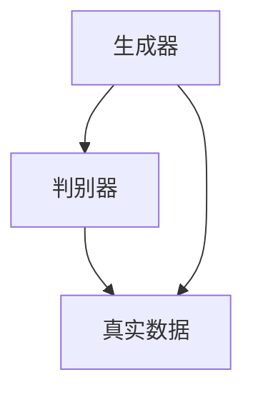
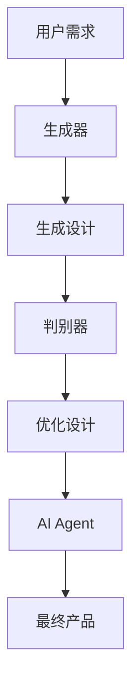
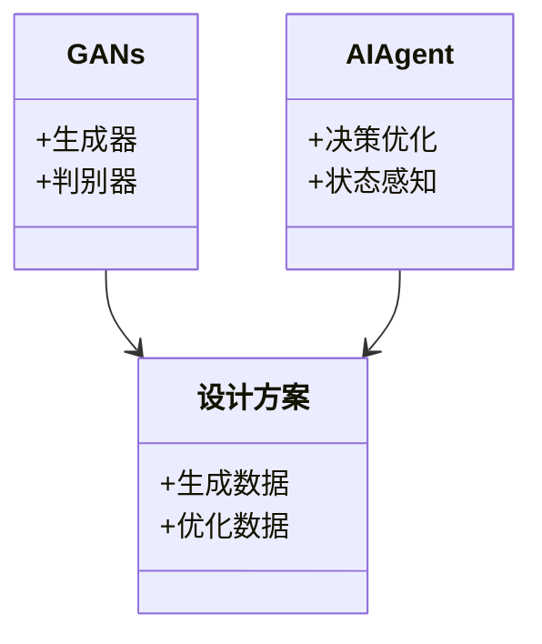
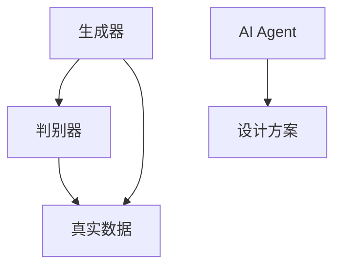
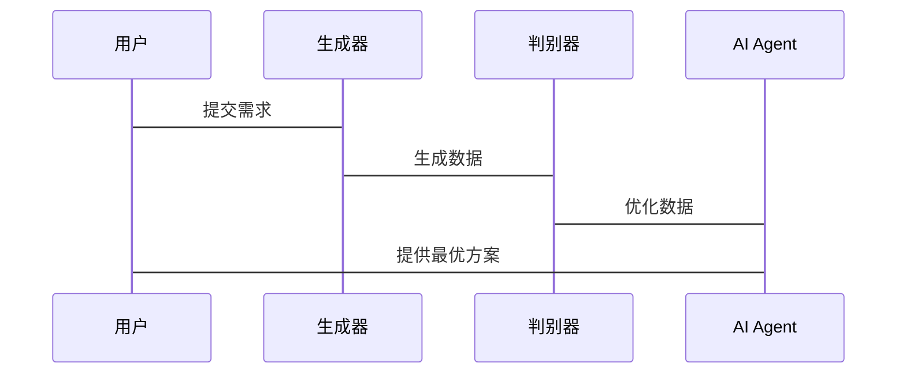

                 


# 企业AI Agent的生成对抗网络在产品设计创新中的应用

## 关键词：企业AI Agent，生成对抗网络，产品设计，创新，深度学习

## 摘要：本文探讨了将生成对抗网络（GANs）应用于企业AI Agent在产品设计创新中的应用。通过分析GANs和AI Agent的核心原理，结合实际案例，展示了如何利用GANs生成多样化的设计方案，并通过AI Agent优化设计流程，提升产品创新性。

---

# 第一章: 问题背景与概念介绍

## 1.1 问题背景

### 1.1.1 产品设计创新的挑战

现代市场竞争日益激烈，企业需要不断推出创新产品以保持竞争优势。然而，传统的产品设计过程往往依赖于设计师的经验和灵感，存在效率低、成本高等问题。如何利用技术手段提高产品设计的效率和创新能力，成为企业关注的重点。

### 1.1.2 AI技术在产品设计中的应用现状

人工智能技术在产品设计中的应用逐渐增多。例如，AI可以通过数据分析预测市场趋势，辅助设计师进行概念设计。然而，现有的AI工具在生成多样化设计方案方面仍有局限性，难以满足企业对创新设计的需求。

### 1.1.3 生成对抗网络的引入与意义

生成对抗网络（GANs）作为一种强大的生成模型，能够在图像生成、文本生成等领域表现出色。将其引入产品设计领域，可以生成多样化的设计方案，为企业提供丰富的创新思路。结合AI Agent，可以通过智能化的决策优化设计流程，进一步提升产品创新性。

## 1.2 核心概念与问题描述

### 1.2.1 生成对抗网络的基本概念

生成对抗网络由生成器和判别器组成，通过对抗训练不断优化生成器的能力。生成器尝试生成逼真的数据，而判别器则试图识别数据是否真实。这种博弈过程使得生成器能够生成高质量的数据。

### 1.2.2 AI Agent的定义与功能

AI Agent是一种智能体，能够感知环境并采取行动以实现目标。在产品设计中，AI Agent可以用于辅助决策、优化设计流程等。结合GANs，AI Agent可以通过生成多样化设计方案并优化选择，提升设计效率和创新性。

### 1.2.3 问题解决目标与边界

本文的目标是探讨如何利用GANs和AI Agent提升产品设计创新性。通过分析GANs在设计中的应用，结合AI Agent优化设计流程，为企业提供一种高效、创新的设计方法。边界包括设计流程的优化、设计方案的生成，但不涉及具体的产品制造过程。

---

# 第二章: 生成对抗网络与AI Agent的核心原理

## 2.1 生成对抗网络的原理

### 2.1.1 GANs的基本架构

GANs由生成器和判别器组成，通过对抗训练优化生成器的能力。生成器尝试生成逼真的数据，而判别器则试图识别数据是否真实。这种博弈过程使得生成器能够生成高质量的数据。

### 2.1.2 生成器与判别器的博弈过程

生成器和判别器交替训练，生成器试图欺骗判别器，使得判别器无法区分生成数据和真实数据。通过不断迭代，生成器的能力逐渐提升，生成的数据越来越逼真。

### 2.1.3 损失函数与优化方法

生成器的损失函数为判别器对生成数据的分类损失，判别器的损失函数为对真实数据和生成数据的分类损失。优化方法通常采用梯度下降等技术，如Adam优化器。

### 2.1.4 数学公式

生成器的损失函数：
$$ \mathcal{L}_G = \mathbb{E}_{z \sim p_z} \left[ \log D(G(z)) \right] $$

判别器的损失函数：
$$ \mathcal{L}_D = \mathbb{E}_{x \sim p_x} \left[ \log D(x) \right] + \mathbb{E}_{z \sim p_z} \left[ \log (1 - D(G(z))) \right] $$

### 2.1.5 Wassershtein距离

Wasserstein距离用于衡量生成数据与真实数据之间的距离：
$$ W = \inf_{\gamma \in \Gamma} \left( \mathbb{E}_{x,y}[\gamma(x,y)] \right) $$

## 2.2 AI Agent的原理与功能

### 2.2.1 AI Agent的定义与分类

AI Agent可以分为基于规则的Agent和基于学习的Agent。基于规则的Agent通过预定义的规则进行决策，而基于学习的Agent则通过机器学习模型进行决策。

### 2.2.2 基于GANs的AI Agent设计

结合GANs，AI Agent可以生成多样化的设计方案，并通过学习优化设计选择。生成器生成设计方案，AI Agent评估并选择最优方案。

### 2.2.3 GANs与AI Agent的协同作用

GANs生成设计方案，AI Agent优化选择，两者协同作用，提升设计效率和创新性。

## 2.3 GANs与AI Agent的核心要素对比

### 2.3.1 GANs的属性特征

| 特性 | 描述 |
|------|------|
| 输入 | 数据样本 |
| 输出 | 生成数据 |
| 模型 | 生成器和判别器 |

### 2.3.2 AI Agent的属性特征

| 特性 | 描述 |
|------|------|
| 输入 | 状态和目标 |
| 输出 | 行动 |
| 模型 | 基于规则或学习 |

### 2.3.3 对比分析与总结

GANs擅长生成数据，AI Agent擅长决策优化。两者结合可以实现数据生成与优化决策的完美结合。

---

# 第三章: GANs与AI Agent的协同流程

## 3.1 GANs与AI Agent的实体关系图



## 3.2 GANs与AI Agent的协同流程图



---

# 第四章: 算法原理与数学模型

## 4.1 GANs算法的数学模型与公式

### 4.1.1 生成器与判别器的损失函数

生成器的损失函数：
$$ \mathcal{L}_G = \mathbb{E}_{z \sim p_z} \left[ \log D(G(z)) \right] $$

判别器的损失函数：
$$ \mathcal{L}_D = \mathbb{E}_{x \sim p_x} \left[ \log D(x) \right] + \mathbb{E}_{z \sim p_z} \left[ \log (1 - D(G(z))) \right] $$

### 4.1.2 梯度下降与优化方法

通常采用Adam优化器，优化生成器和判别器的参数。

### 4.1.3 Wasserstein距离的公式

$$ W = \inf_{\gamma \in \Gamma} \left( \mathbb{E}_{x,y}[\gamma(x,y)] \right) $$

---

# 第五章: 系统分析与架构设计

## 5.1 项目场景介绍

### 5.1.1 项目背景

企业需要高效、创新的产品设计流程，利用GANs和AI Agent提升设计效率。

### 5.1.2 项目目标

通过GANs生成设计方案，AI Agent优化选择，提升产品创新性。

## 5.2 系统功能设计

### 5.2.1 领域模型类图



### 5.2.2 系统架构图



### 5.2.3 接口设计

API接口用于生成数据和优化设计，方便集成到现有系统中。

### 5.2.4 交互序列图



---

# 第六章: 项目实战

## 6.1 环境安装

### 6.1.1 安装Python和相关库

安装Python和TensorFlow、Keras、numpy等库。

### 6.1.2 安装GANs库

安装GANs相关的库，如tensorflow-gan。

## 6.2 核心代码实现

### 6.2.1 生成器代码

```python
import tensorflow as tf
from tensorflow.keras import layers

def make_generator_model():
    model = tf.keras.Sequential()
    model.add(layers.Dense(256, activation='relu', input_shape=(100,)))
    model.add(layers.Dense(512, activation='relu'))
    model.add(layers.Dense(784, activation='sigmoid'))
    return model
```

### 6.2.2 判别器代码

```python
def make_discriminator_model():
    model = tf.keras.Sequential()
    model.add(layers.Dense(256, activation='relu', input_shape=(784,)))
    model.add(layers.Dense(128, activation='relu'))
    model.add(layers.Dense(1, activation='sigmoid'))
    return model
```

## 6.3 代码解读与分析

### 6.3.1 生成器解读

生成器将100维的随机向量映射到784维的空间，生成图像数据。

### 6.3.2 判别器解读

判别器将784维的数据映射到0或1，判断数据是否为真实数据。

## 6.4 案例分析与详细讲解

### 6.4.1 案例分析

通过训练GANs生成图像数据，AI Agent优化设计选择。

### 6.4.2 代码实现细节

详细讲解生成器和判别器的训练过程，以及如何优化模型。

## 6.5 项目小结

通过项目实战，验证了GANs和AI Agent在产品设计中的应用效果，提升了设计效率和创新性。

---

# 第七章: 最佳实践与总结

## 7.1 最佳实践 tips

### 7.1.1 模型优化技巧

选择合适的超参数，如学习率、批量大小等。

### 7.1.2 系统集成建议

将GANs和AI Agent集成到现有设计流程中，提升整体效率。

## 7.2 小结

通过本文的探讨，我们了解了GANs和AI Agent在产品设计中的应用，以及如何利用它们提升设计效率和创新性。

## 7.3 注意事项

在实际应用中，需注意模型的收敛性问题，避免生成不合理的数据。

## 7.4 拓展阅读

建议进一步研究GANs的变体，如Wasserstein GAN，以及强化学习在AI Agent中的应用。

---

# 作者

作者：AI天才研究院/AI Genius Institute & 禅与计算机程序设计艺术 /Zen And The Art of Computer Programming

---

通过本文的详细探讨，我们了解了GANs和AI Agent在产品设计中的应用，以及如何利用它们提升设计效率和创新性。希望本文能为企业的设计创新提供新的思路和方法。

