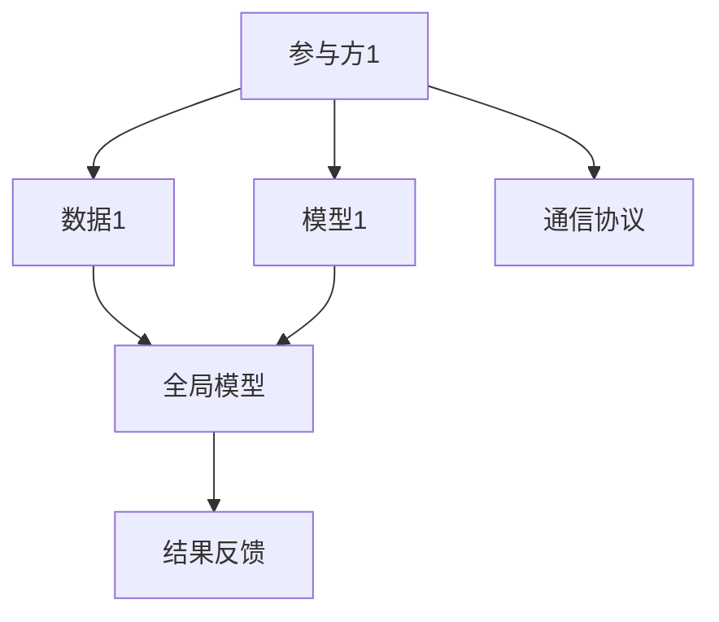
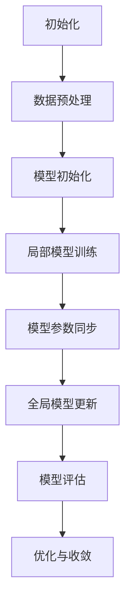
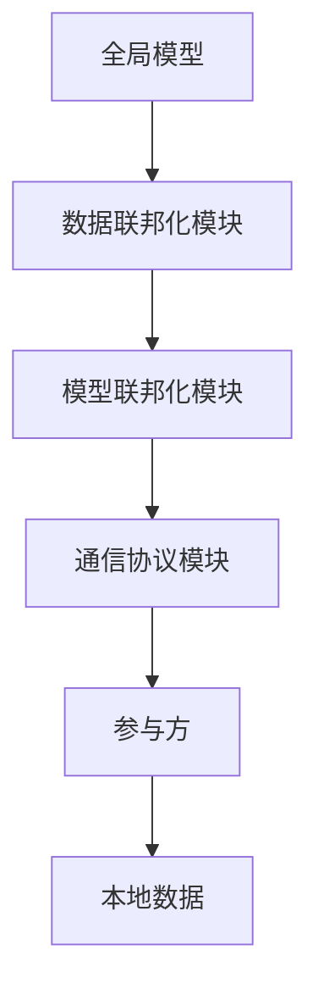

                 


# 企业AI Agent的联邦学习在跨企业数据协作中的实践

## 关键词：联邦学习、跨企业协作、数据隐私、AI Agent、分布式计算、机器学习

## 摘要

本文探讨了在跨企业数据协作中，企业AI Agent如何利用联邦学习技术实现数据隐私保护和高效协作。通过详细分析联邦学习的核心概念、算法原理、系统架构以及实际项目案例，本文为读者提供了一个全面的视角，展示了如何在不泄露原始数据的情况下，通过联邦学习进行模型训练和数据共享。文章还总结了联邦学习在实际应用中的优势、挑战和未来发展方向。

---

## 正文

### 第1章: 企业AI Agent的背景与挑战

#### 1.1 数据孤岛与协作问题

数据孤岛是指各个企业或组织之间由于数据格式、隐私政策或技术标准的不同，导致数据无法有效共享和利用的现象。这种现象在当今数字化时代尤为突出，尤其是在AI和大数据领域。企业AI Agent作为一种智能化的数据协作工具，旨在打破数据孤岛，促进跨企业的数据协作。

在企业AI Agent的应用场景中，数据孤岛问题主要表现在以下几个方面：
1. 数据孤岛导致企业无法充分利用外部数据进行模型训练，限制了AI模型的性能提升。
2. 数据隐私和安全问题使得企业在共享数据时顾虑重重，难以实现真正的协作。
3. 数据格式和标准的不统一，增加了跨企业数据协作的难度。

#### 1.2 联邦学习的定义与核心概念

联邦学习（Federated Learning）是一种分布式机器学习技术，允许多个参与方在不共享原始数据的情况下，共同训练一个共享的模型。其核心在于通过数据联邦化和模型联邦化，实现数据的局部使用和模型的全局优化。

联邦学习的核心概念包括：
1. **数据联邦化**：数据保持在原始来源处，通过加密和隐私保护技术进行局部模型训练。
2. **模型联邦化**：通过通信协议将各参与方的模型参数进行同步，形成一个全局模型。
3. **通信协议**：定义数据和模型参数的传输方式，确保协作过程中的安全性和效率。

#### 1.3 联邦学习的优势与应用场景

联邦学习相较于传统数据协作方式，具有以下优势：
1. **数据隐私保护**：数据无需离开原始存储位置，有效降低了数据泄露风险。
2. **高效协作**：通过分布式计算，减少数据传输量，提高计算效率。
3. **灵活性**：支持多种数据格式和模型架构，适应不同企业的需求。

联邦学习的应用场景包括：
1. **金融领域的风险评估**：多个银行或金融机构可以通过联邦学习共同训练信用评分模型，而不泄露客户数据。
2. **医疗领域的疾病预测**：多家医院可以协作训练疾病预测模型，同时保护患者隐私。
3. **零售领域的客户画像**：多个零售企业可以联合训练客户画像模型，提升营销精准度。

---

### 第2章: 联邦学习的核心概念与联系

#### 2.1 联邦学习的核心原理

联邦学习的实现依赖于以下几个关键原理：
1. **数据联邦化**：每个参与方在本地数据上训练模型，生成局部梯度或模型参数。
2. **模型联邦化**：通过通信协议将各参与方的模型参数进行汇总，更新全局模型。
3. **通信协议**：定义数据和模型的传输方式，确保协作过程中的安全性和效率。

#### 2.2 联邦学习的核心要素

联邦学习的核心要素包括：
1. **数据隐私与安全**：通过加密技术（如同态加密）和差分隐私保护数据隐私。
2. **模型更新与同步**：定义模型更新的频率和方式，确保全局模型的收敛。
3. **激励机制**：通过激励机制鼓励更多企业参与联邦学习，提升协作效果。

#### 2.3 联邦学习的实体关系图

以下是联邦学习的实体关系图，展示了各参与方之间的关系和数据流向：



---

### 第3章: 联邦学习的算法原理

#### 3.1 联邦学习的数学模型

联邦学习的数学模型主要分为横向联邦学习、纵向联邦学习和混合联邦学习三种类型。

1. **横向联邦学习**：
   假设每个参与方有相同的数据特征，但样本不重叠。模型参数更新公式如下：

   $$
   \theta_{i}^{new} = \theta_{i} + \eta \cdot \nabla L_i(\theta_i)
   $$

   其中，$\theta_i$ 表示第i个参与方的模型参数，$\eta$ 是学习率，$\nabla L_i$ 是第i个参与方的损失函数梯度。

2. **纵向联邦学习**：
   假设每个参与方有不同的数据特征，但样本部分重叠。模型参数更新公式如下：

   $$
   \theta^{new} = \theta + \eta \cdot \sum_{i=1}^{n} \nabla L_i(\theta)
   $$

3. **混合联邦学习**：
   结合横向和纵向联邦学习的特点，适用于数据特征和样本部分重叠的情况。

#### 3.2 联邦学习的算法流程

以下是联邦学习的算法流程图：



#### 3.3 联邦学习的通信协议

联邦学习的通信协议包括数据加密、模型参数传输和同步机制。以下是通信协议的实现步骤：

1. 数据加密：使用同态加密对数据进行加密，确保数据在传输过程中的安全性。
2. 模型参数传输：通过安全通道传输模型参数，确保传输过程中的数据完整性和机密性。
3. 同步机制：定义模型参数的同步频率和方式，确保全局模型的收敛和优化。

---

### 第4章: 联邦学习的系统架构设计

#### 4.1 系统功能设计

系统功能设计包括数据联邦化模块、模型联邦化模块和通信协议模块。

1. **数据联邦化模块**：负责本地数据的预处理和模型训练。
2. **模型联邦化模块**：负责模型参数的同步和全局模型的更新。
3. **通信协议模块**：负责数据和模型参数的安全传输。

#### 4.2 系统架构图

以下是系统架构图：



#### 4.3 系统接口设计

系统接口设计包括数据接口、模型接口和通信接口。

1. **数据接口**：定义数据的输入格式和处理方式。
2. **模型接口**：定义模型的输入和输出格式。
3. **通信接口**：定义数据和模型参数的传输协议。

---

### 第5章: 联邦学习的项目实战

#### 5.1 环境安装与配置

以下是环境安装与配置步骤：

1. 安装Python和相关库（如TensorFlow、Keras）。
2. 配置通信协议模块（如使用加密库进行数据加密）。
3. 部署系统架构（如使用云平台进行分布式部署）。

#### 5.2 系统核心实现源代码

以下是联邦学习的Python代码实现：

```python
import numpy as np
import tensorflow as tf
from tensorflow.keras import layers

# 初始化模型
model = tf.keras.Sequential([
    layers.Dense(64, activation='relu'),
    layers.Dense(10, activation='softmax')
])
model.compile(optimizer='adam', loss='sparse_categorical_crossentropy', metrics=['accuracy'])

# 模型训练
history = model.fit(x_train, y_train, epochs=10, batch_size=32, validation_data=(x_val, y_val))

# 模型保存
model.save('model.h5')
```

#### 5.3 代码解读与分析

1. **模型初始化**：使用Keras构建一个简单的神经网络模型。
2. **模型训练**：在本地数据上训练模型，生成局部梯度。
3. **模型保存**：保存训练好的模型，供后续同步使用。

#### 5.4 案例分析与详细讲解

案例分析：假设我们有三个参与方，每个参与方有本地数据集，通过联邦学习训练一个全局模型。

1. **数据预处理**：将数据划分为本地数据集。
2. **局部训练**：每个参与方在本地数据上训练模型，生成梯度。
3. **模型同步**：将各参与方的梯度进行汇总，更新全局模型。
4. **模型评估**：评估全局模型的性能，进行优化和调整。

---

### 第6章: 最佳实践与总结

#### 6.1 小结

本文详细探讨了企业AI Agent在跨企业数据协作中的应用，介绍了联邦学习的核心概念、算法原理和系统架构设计。通过项目实战，展示了联邦学习的实际应用价值和优势。

#### 6.2 注意事项

1. 数据隐私保护是联邦学习的核心，必须采用加密技术和安全协议。
2. 模型更新和同步需要考虑计算效率和通信成本。
3. 联邦学习的实现需要考虑不同企业的数据格式和模型架构差异。

#### 6.3 拓展阅读

建议读者进一步阅读以下内容：
1. 联邦学习的数学模型和优化方法。
2. 数据隐私保护技术（如差分隐私、同态加密）。
3. 联邦学习在不同领域的实际应用案例。

---

## 作者：AI天才研究院 & 禅与计算机程序设计艺术

--- 

以上是文章的完整内容，涵盖了联邦学习在跨企业数据协作中的各个方面，从理论到实践，从算法到系统设计，为读者提供了一个全面的视角。

