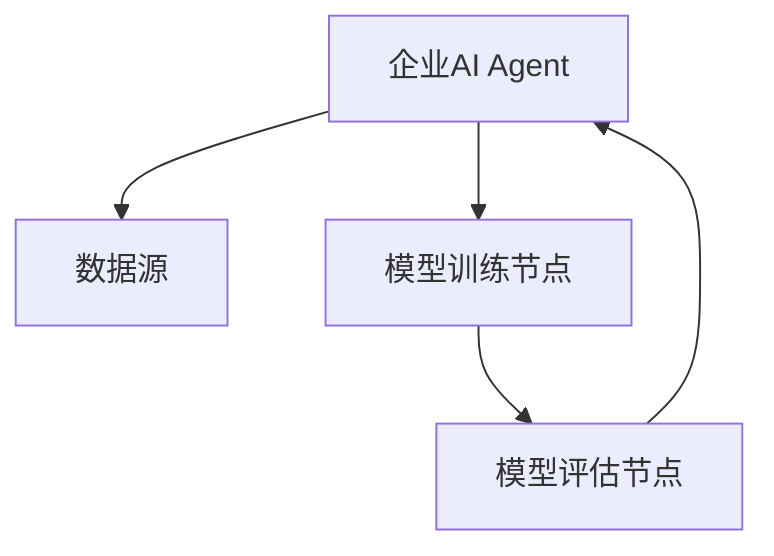
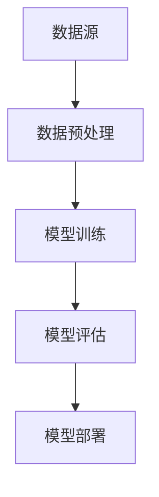

                 


# 企业AI Agent的联邦学习应用：数据隐私保护

> 关键词：企业AI Agent，联邦学习，数据隐私保护，机器学习，分布式计算

> 摘要：随着人工智能技术的快速发展，企业AI Agent的应用越来越广泛。然而，数据隐私保护成为了制约其发展的关键问题。本文将深入探讨企业AI Agent在联邦学习中的应用，分析联邦学习如何在保护数据隐私的前提下，实现跨机构的数据协作与模型训练。通过理论分析、算法实现和项目实战，本文将全面展示联邦学习在企业AI Agent中的核心作用，并为企业在数据隐私保护方面的实践提供参考。

---

# 第一部分: 企业AI Agent的联邦学习应用概述

# 第1章: 企业AI Agent与联邦学习概述

## 1.1 企业AI Agent的基本概念

### 1.1.1 AI Agent的定义与特点

AI Agent（人工智能代理）是指能够感知环境、执行任务并做出决策的智能实体。在企业环境中，AI Agent通常被设计为能够处理特定业务逻辑、优化流程、提高效率的自动化工具。企业AI Agent的特点包括：

1. **自主性**：能够独立决策和执行任务。
2. **反应性**：能够根据环境变化实时调整行为。
3. **学习能力**：能够通过数据和经验不断优化自身的性能。
4. **协作性**：能够与其他系统、AI Agent或人类进行协作。

### 1.1.2 企业AI Agent的应用场景

企业AI Agent的应用场景广泛，包括但不限于：

- **智能客服**：通过自然语言处理技术为用户提供个性化服务。
- **智能监控**：实时监控企业运营数据，发现异常并及时报警。
- **供应链管理**：优化供应链流程，提高库存管理和物流效率。
- **数据分析与决策支持**：通过大数据分析为企业的决策提供支持。

### 1.1.3 联邦学习的基本概念

联邦学习（Federated Learning）是一种分布式机器学习技术，旨在在不集中收集原始数据的情况下，通过分布式计算和模型更新，实现全局模型的训练。其核心思想是“数据不动，模型动”，即数据保留在原始设备或服务器上，只有模型参数在不同的设备或服务器之间进行同步和更新。

### 1.1.4 企业AI Agent与联邦学习的结合

企业AI Agent与联邦学习的结合，可以充分发挥联邦学习的分布式计算优势，同时利用AI Agent的智能化特性，实现跨机构、跨系统的数据协作与模型训练。例如，在金融行业，多个金融机构可以通过联邦学习共同训练风控模型，而无需共享客户数据。

## 1.2 数据隐私保护的重要性

### 1.2.1 数据隐私保护的背景

随着数字化转型的加速，企业收集和处理的数据种类和数量急剧增加。然而，数据泄露和滥用的问题也日益严重。根据统计，全球每年因数据泄露造成的损失高达数百万美元。数据隐私保护已成为企业必须面对的重要问题。

### 1.2.2 数据隐私保护的挑战

企业在数据隐私保护方面面临以下挑战：

- **数据孤岛**：数据分散在不同的系统和部门中，难以统一管理和保护。
- **数据共享的难题**：企业之间的数据共享往往涉及商业机密，直接共享数据存在风险。
- **法律法规的严格要求**：如欧盟的GDPR（通用数据保护条例）要求企业必须采取措施保护用户数据。

### 1.2.3 联邦学习在数据隐私保护中的作用

联邦学习通过分布式计算和模型更新，可以在不共享原始数据的情况下，实现跨机构的数据协作与模型训练。这不仅能够提高模型的泛化能力，还能够有效保护数据隐私。

## 1.3 本章小结

本章主要介绍了企业AI Agent和联邦学习的基本概念，以及数据隐私保护的重要性。通过对企业AI Agent的应用场景和联邦学习的核心思想的分析，我们初步了解了联邦学习在企业AI Agent中的潜在应用价值。同时，我们也认识到数据隐私保护是企业AI Agent发展的关键问题。

---

# 第二部分: 联邦学习的核心原理与技术

# 第2章: 联邦学习的核心原理

## 2.1 联邦学习的基本原理

### 2.1.1 联邦学习的定义

联邦学习（Federated Learning）是一种分布式机器学习技术，旨在在不集中收集原始数据的情况下，通过分布式计算和模型更新，实现全局模型的训练。

### 2.1.2 联邦学习的核心思想

联邦学习的核心思想是“数据不动，模型动”。具体来说，模型参数在不同的设备或服务器之间进行同步和更新，而原始数据仍然保留在本地，不会被共享。

### 2.1.3 联邦学习的实现流程

1. **初始化**：所有参与方初始化本地模型参数。
2. **本地训练**：每个参与方在本地数据上训练模型，并更新本地模型参数。
3. **模型同步**：通过通信协议将本地模型参数上传到中央服务器，或者直接在参与方之间进行同步。
4. **全局模型更新**：中央服务器对所有参与方的模型参数进行汇总和优化，生成全局模型。
5. **模型分发**：将全局模型分发给所有参与方，供其进行下一轮的本地训练。

### 2.1.4 联邦学习的关键技术

1. **数据加密与隐私保护技术**：通过加密技术保护数据隐私，确保模型训练过程中数据不被泄露。
2. **联邦学习的通信协议**：定义参与方之间数据交换的格式和规则。
3. **联邦学习的计算框架**：提供分布式计算的框架，支持模型训练和优化。

## 2.2 联邦学习的分类与对比

### 2.2.1 横向联邦学习

横向联邦学习是指多个参与方在同一数据特征空间上进行模型训练，通常适用于样本空间相同但特征空间不同的场景。

### 2.2.2 纵向联邦学习

纵向联邦学习是指多个参与方在不同的数据特征空间上进行模型训练，通常适用于样本空间不同但特征空间相同的场景。

### 2.2.3 联邦学习的优缺点对比

| 特性                | 横向联邦学习          | 纵向联邦学习          |
|---------------------|----------------------|----------------------|
| 数据共享方式        | 特征共享             | 样本共享             |
| 适用场景            | 样本空间相同，特征空间不同 | 样本空间不同，特征空间相同 |
| 模型更新复杂度        | 较低                 | 较高                 |

---

# 第三部分: 企业AI Agent的联邦学习应用架构

# 第3章: 企业AI Agent的系统架构设计

## 3.1 系统功能模块划分

### 3.1.1 数据采集与预处理模块

数据采集与预处理模块负责从各个数据源采集数据，并进行清洗、转换和标准化处理。

### 3.1.2 模型训练与优化模块

模型训练与优化模块负责在本地数据上训练模型，并更新本地模型参数。

### 3.1.3 模型部署与应用模块

模型部署与应用模块负责将全局模型部署到企业AI Agent中，供其进行实际应用。

## 3.2 系统架构的实体关系图



## 3.3 系统架构的流程图



## 3.4 本章小结

本章详细介绍了企业AI Agent的系统架构设计，包括数据采集与预处理模块、模型训练与优化模块以及模型部署与应用模块。通过实体关系图和流程图，我们清晰地展示了系统中各模块之间的关系和数据流动方向。

---

# 第四部分: 联邦学习算法的数学模型与实现

# 第4章: 联邦学习算法的数学模型

## 4.1 联邦学习的数学模型概述

### 4.1.1 联邦学习的优化目标

联邦学习的优化目标是最大化全局模型的准确率，同时最小化模型的参数更新量。

### 4.1.2 联邦学习的损失函数

$$ L_i(x_i, y_i) = \sum_{i=1}^n (y_i - \hat{y}_i)^2 $$

其中，$x_i$ 表示第 $i$ 个参与方的本地数据，$y_i$ 表示对应的标签，$\hat{y}_i$ 表示模型预测值。

### 4.1.3 联邦学习的优化算法

常用的优化算法包括随机梯度下降（SGD）、Adam优化器等。

## 4.2 横向联邦学习的数学模型

### 4.2.1 横向联邦学习的定义

横向联邦学习是指多个参与方在同一数据特征空间上进行模型训练。

### 4.2.2 横向联邦学习的数学公式

$$ \theta_{global} = \sum_{i=1}^k \frac{1}{k} \theta_i $$

其中，$\theta_{global}$ 表示全局模型参数，$\theta_i$ 表示第 $i$ 个参与方的本地模型参数，$k$ 表示参与方的数量。

## 4.3 纵向联邦学习的数学模型

### 4.3.1 纵向联邦学习的定义

纵向联邦学习是指多个参与方在不同的数据特征空间上进行模型训练。

### 4.3.2 纵向联邦学习的数学公式

$$ \theta_{global} = \sum_{i=1}^k \frac{1}{k} \theta_i $$

其中，$\theta_{global}$ 表示全局模型参数，$\theta_i$ 表示第 $i$ 个参与方的本地模型参数，$k$ 表示参与方的数量。

---

# 第五部分: 企业AI Agent的联邦学习应用实战

# 第5章: 企业AI Agent的项目实战

## 5.1 项目背景与目标

### 5.1.1 项目背景

在金融行业中，多个金融机构可以通过联邦学习共同训练风控模型，而无需共享客户数据。

### 5.1.2 项目目标

实现一个基于联邦学习的企业AI Agent系统，用于风控模型的训练和部署。

## 5.2 环境安装与配置

### 5.2.1 安装Python环境

使用Anaconda安装Python 3.8及以上版本。

### 5.2.2 安装必要的库

安装Flask、TensorFlow、Keras等库。

## 5.3 系统核心实现源代码

```python
import numpy as np
import tensorflow as tf
from tensorflow.keras import layers

# 初始化模型
def create_model(input_shape):
    model = tf.keras.Sequential()
    model.add(layers.Dense(64, activation='relu', input_shape=input_shape))
    model.add(layers.Dense(1, activation='sigmoid'))
    model.compile(optimizer='adam', loss='binary_crossentropy', metrics=['accuracy'])
    return model

# 模型训练
def train_model(model, x, y, epochs=10):
    model.fit(x, y, epochs=epochs, batch_size=32, verbose=0)

# 模型评估
def evaluate_model(model, x, y):
    loss, accuracy = model.evaluate(x, y, verbose=0)
    print(f"Loss: {loss}, Accuracy: {accuracy}")

# 联邦学习主函数
def federated_learning(agents, input_shape):
    global_model = create_model(input_shape)
    for agent in agents:
        # 模型同步到本地
        local_model = create_model(input_shape)
        # 本地训练
        train_model(local_model, agent.x, agent.y)
        # 模型评估
        evaluate_model(local_model, agent.x, agent.y)
        # 模型同步到全局模型
        global_model.set_weights(local_model.get_weights())
    return global_model
```

## 5.4 实际案例分析与详细讲解

### 5.4.1 案例背景

假设我们有三个金融机构，每个机构都有自己的客户数据，但希望共同训练一个风控模型。

### 5.4.2 数据准备

每个金融机构的数据集包含客户的基本信息和信用评分。

### 5.4.3 模型训练

使用上述代码实现联邦学习，训练全局模型。

### 5.4.4 模型评估

评估全局模型在各个金融机构的数据集上的表现。

## 5.5 本章小结

本章通过一个实际案例，详细讲解了企业AI Agent的联邦学习应用的实现过程，包括环境安装、模型训练、模型评估等步骤。

---

# 第六部分: 总结与展望

# 第6章: 总结与展望

## 6.1 本章总结

本文详细探讨了企业AI Agent在联邦学习中的应用，分析了联邦学习如何在保护数据隐私的前提下，实现跨机构的数据协作与模型训练。通过理论分析、算法实现和项目实战，本文全面展示了联邦学习在企业AI Agent中的核心作用。

## 6.2 未来展望

未来，随着联邦学习技术的不断发展，企业AI Agent的应用场景将更加广泛。同时，如何进一步优化联邦学习算法，提高模型的准确率和效率，仍是一个重要的研究方向。

---

# 作者：AI天才研究院/AI Genius Institute & 禅与计算机程序设计艺术 /Zen And The Art of Computer Programming

---

以上是《企业AI Agent的联邦学习应用：数据隐私保护》的技术博客文章的目录大纲。希望这篇文章能够为您提供有价值的参考和启发！

