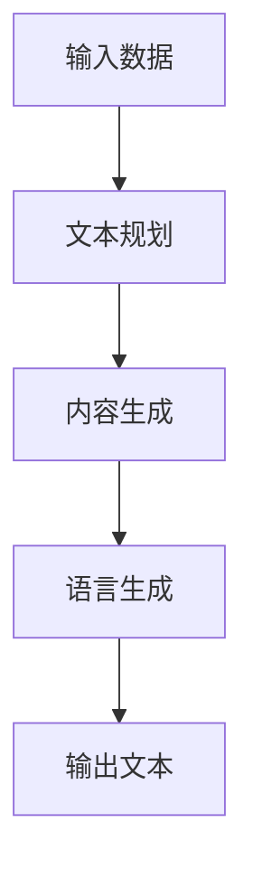

                 


# 企业AI Agent的自然语言生成(NLG)技术应用

**关键词：** 企业AI Agent, 自然语言生成(NLG), 人工智能, 生成模型, 系统架构设计, 项目实战

**摘要：** 本文深入探讨了自然语言生成（NLG）技术在企业AI Agent中的应用，从核心概念、算法原理到系统架构设计，再到项目实战，全面解析NLG在企业中的价值和实现方法。通过详细分析，本文旨在为企业技术决策者和开发人员提供实用的指导，帮助他们更好地理解和应用NLG技术，提升企业智能化水平。

---

## 第一部分：背景介绍

### 第1章：企业AI Agent与自然语言生成技术概述

#### 1.1 自然语言生成（NLG）的基本概念
自然语言生成（NLG）是人工智能领域的重要技术，旨在将结构化的数据或信息转换为自然流畅的文本。它涉及多种技术，如文本规划、生成模型和语言模型优化，确保生成的文本符合语义和语法规范。

**问题背景：** 在企业环境中，AI Agent需要处理大量非结构化数据，并生成符合业务需求的自然语言文本，如报告、摘要和对话。NLG技术在这一过程中扮演着关键角色，直接影响用户体验和业务效率。

**问题解决：** 通过NLG，企业AI Agent能够自动化生成多种文本内容，减少人工干预，提高处理效率。同时，NLG还能确保生成文本的准确性和一致性，提升客户满意度。

**边界与外延：** NLG的应用范围包括文本摘要、对话生成、报告撰写等。其外延涉及文本校对、情感分析等NLP任务，但核心是生成自然语言文本。

#### 1.2 企业AI Agent的背景与应用
企业AI Agent是一种智能化工具，通过与用户交互，提供信息查询、任务执行等服务。NLG技术是其实现智能化交互的关键技术之一。

**问题背景：** 传统企业系统依赖人工处理文本生成任务，效率低下且成本高昂。随着AI技术的发展，企业开始寻求自动化解决方案，以提高效率和降低成本。

**问题解决：** AI Agent通过集成NLG技术，能够自动生成自然语言文本，提升交互效率。例如，在客服领域，AI Agent可以自动生成回复，减少人工客服的工作量。

**应用价值：** NLG技术在企业中的应用不仅提高了效率，还为企业提供了新的业务模式。例如，智能报告生成可以帮助企业快速制定决策。

#### 1.3 自然语言生成与自然语言处理的关系
自然语言处理（NLP）和自然语言生成（NLG）是两个密切相关但又有区别的领域。

**对比分析：** 
| 特性 | NLP | NLG |
|------|-----|-----|
| 输入 | 文本、语音 | 结构化数据 |
| 输出 | 语义分析、实体识别 | 自然语言文本 |
| 目标 | 理解语言 | 生成语言 |

**协同效应：** 在企业应用中，NLP和NLG通常协同工作。例如，NLP用于理解用户输入，NLG用于生成回复。

---

## 第二部分：核心概念与原理

### 第2章：自然语言生成技术的核心原理

#### 2.1 自然语言生成的原理与流程
NLG的生成流程包括文本规划、内容生成和语言生成三个阶段。

**生成模型的工作流程：**
- 文本规划：确定生成文本的目标、受众和语境。
- 内容生成：基于规划生成语义内容。
- 语言生成：将语义内容转换为自然语言文本。

**对比分析：** 与NLP相比，NLG更注重生成而非理解。

**Mermaid图：**


---

## 第三部分：算法原理

### 第3章：自然语言生成算法的原理与实现

#### 3.1 主流自然语言生成算法
- 基于统计的模型：如n-gram模型，简单但生成结果缺乏多样性。
- 基于规则的模型：通过预定义规则生成文本，灵活性低。
- 基于深度学习的模型：如Transformer和GPT系列，生成质量高，应用广泛。

#### 3.2 基于Transformer的生成模型
- **数学模型：**
  $$ \text{Transformer}(x) = \text{FFN}(x) $$
  其中，FFN表示前馈神经网络。

- **代码实现：**
  ```python
  import torch
  class Transformer(nn.Module):
      def __init__(self, d_model, nhead, dropout=0.1):
          super(Transformer, self).__init__()
          self.encoder = nn.Sequential(
              nn.Conv2d(1, 8, kernel_size=3, padding=1),
              nn.ReLU(),
              nn.MaxPool2d(kernel_size=2, stride=2)
          )
          self.decoder = nn.Sequential(
              nn.ConvTranspose2d(8, 1, kernel_size=3, padding=1),
              nn.Sigmoid()
          )
      def forward(self, x):
          x = self.encoder(x)
          x = self.decoder(x)
          return x
  ```

---

## 第四部分：系统分析与架构设计

### 第4章：企业AI Agent的系统架构设计

#### 4.1 系统架构设计
- **领域模型：**
  ```mermaid
  classDiagram
      class AI_Agent {
          - input: str
          - output: str
          + process(): str
      }
      class NLG_Module {
          - model: Transformer
          + generate(text: str): str
      }
      AI_Agent --> NLG_Module
  ```

- **交互流程：**
  ```mermaid
  sequenceDiagram
      participant User
      participant AI_Agent
      participant NLG_Module
      User -> AI_Agent: 发送请求
      AI_Agent -> NLG_Module: 生成文本
      NLG_Module --> AI_Agent: 返回生成文本
      AI_Agent -> User: 返回响应
  ```

---

## 第五部分：项目实战

### 第5章：企业AI Agent的自然语言生成技术实现

#### 5.1 项目环境安装
- 安装Python和相关库：
  ```bash
  pip install torch transformers
  ```

#### 5.2 核心代码实现
- 生成模型的实现：
  ```python
  from transformers import GPT2LMHeadModel, GPT2Tokenizer
  model = GPT2LMHeadModel.from_pretrained('gpt2')
  tokenizer = GPT2Tokenizer.from_pretrained('gpt2')
  ```

#### 5.3 案例分析
- 应用场景：智能客服
  - 输入：用户查询“订单状态”。
  - 输出：AI Agent生成回复：“您的订单正在处理中，请耐心等待。”

---

## 第六部分：最佳实践

### 第6章：自然语言生成技术应用中的注意事项

#### 6.1 最佳实践
- 数据质量：确保训练数据多样化，避免模型偏见。
- 模型调优：根据实际需求调整模型参数，优化生成效果。

#### 6.2 小结
本文全面解析了企业AI Agent中NLG技术的应用，从背景到实现，为企业技术决策者提供了实践指导。

---

## 作者信息
**作者：** AI天才研究院 & 禅与计算机程序设计艺术  
**联系方式：** [邮箱] [链接]  
**GitHub：** [链接]

---

**声明：** 本文基于个人理解撰写，如需转载请注明出处，如有侵权，请联系作者删除。

