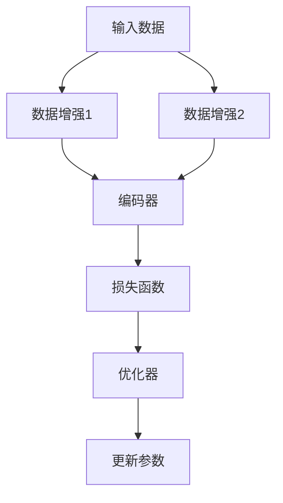
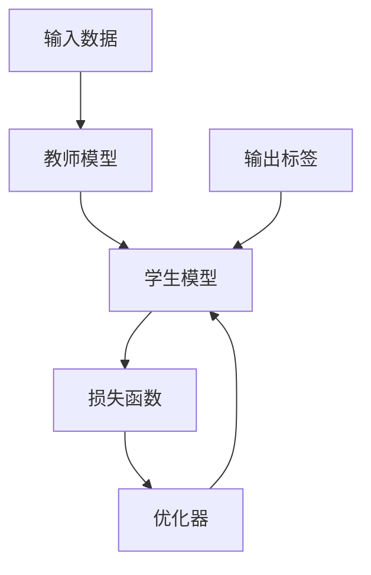
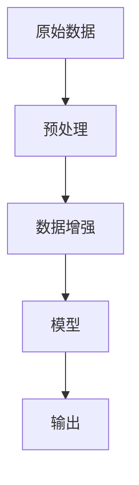
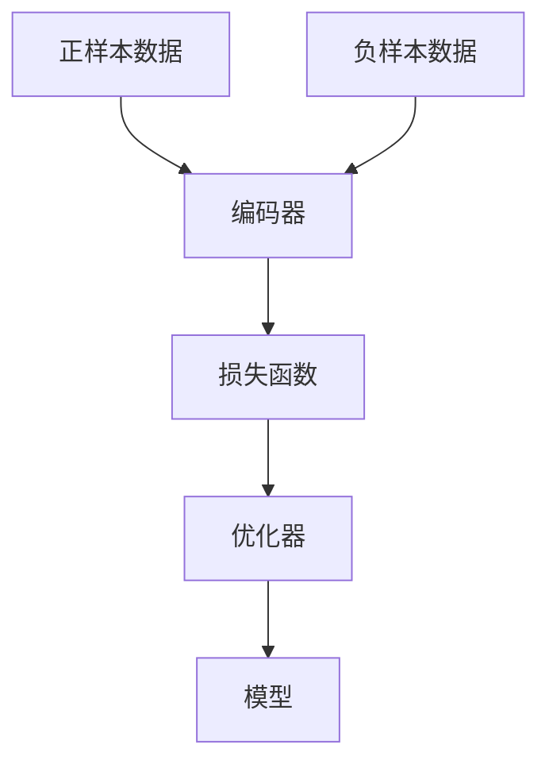
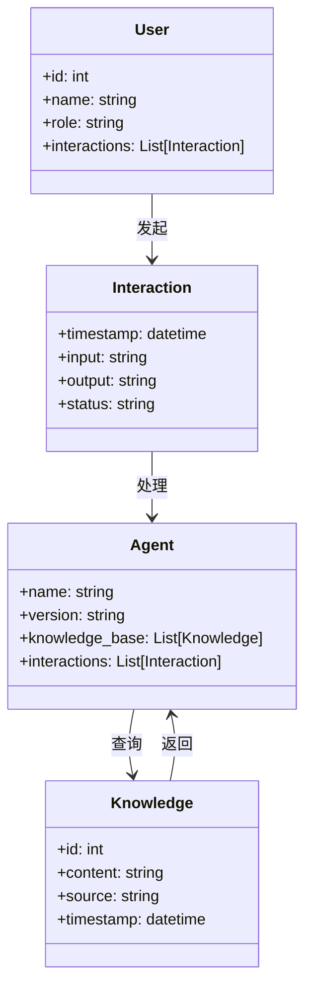
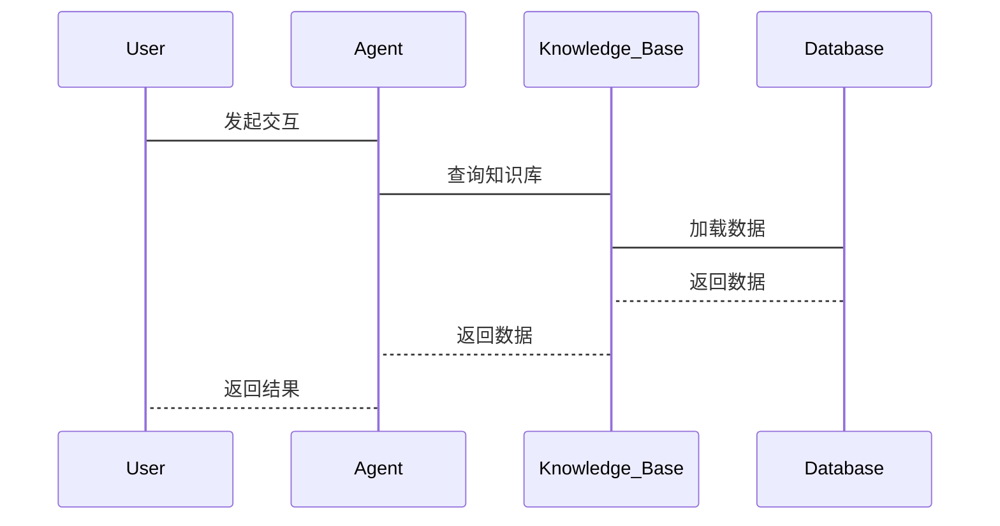
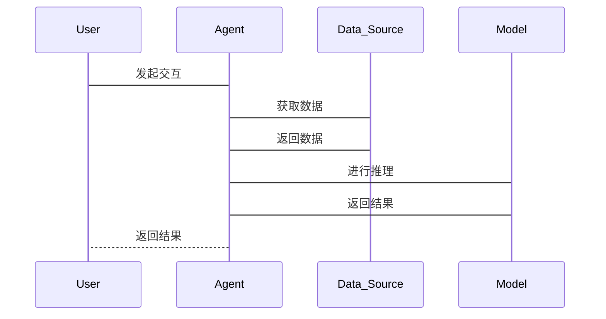

                 


# 《企业AI Agent的自监督学习：利用未标记数据提升性能》

---

## 关键词
企业AI Agent, 自监督学习, 未标记数据, 对比学习, 伪标签, 无监督学习, 深度学习

---

## 摘要
企业AI Agent的自监督学习是一种利用未标记数据来提升AI Agent性能的重要技术。本文从背景、核心概念、算法原理、系统设计到项目实战，全面解析了如何在企业环境中通过自监督学习提高AI Agent的智能水平。通过对比学习和伪标签生成等方法，本文详细探讨了如何在缺乏标注数据的情况下，最大化利用企业数据的价值，实现高效、智能的AI Agent系统。

---

# 第一部分：企业AI Agent的自监督学习背景与概述

## 第1章：企业AI Agent与自监督学习背景

### 1.1 问题背景与挑战

#### 1.1.1 企业AI Agent的核心需求
企业AI Agent是现代企业智能化转型的重要工具，其核心需求包括：
1. **智能交互**：能够理解并执行用户的复杂指令。
2. **数据处理**：能够处理企业内部的结构化和非结构化数据。
3. **持续学习**：能够通过不断的学习和优化提升性能。

#### 1.1.2 未标记数据的利用价值
在企业环境中，未标记数据的占比通常远高于标注数据。这些未标记数据包括：
1. **文本数据**：如企业文档、邮件、会议记录等。
2. **图像数据**：如企业内部的图片、图表等。
3. **日志数据**：如系统日志、用户操作日志等。

未标记数据的价值在于其丰富性和多样性，但其利用的难点在于缺乏标签，难以直接用于监督学习。

#### 1.1.3 自监督学习的必要性
自监督学习是一种能够在未标记数据上进行监督学习的方法，其必要性体现在：
1. **数据利用率提升**：通过自监督学习，企业可以充分利用未标记数据。
2. **降低标注成本**：避免了标注数据的高昂成本。
3. **模型鲁棒性增强**：通过利用未标记数据，模型的泛化能力更强。

### 1.2 自监督学习的定义与特点

#### 1.2.1 自监督学习的基本概念
自监督学习是一种通过引入某种形式的“自我监督”机制，在未标记数据上进行监督学习的方法。其核心思想是通过数据本身构建目标函数，从而实现对数据的建模和学习。

#### 1.2.2 自监督学习与监督学习的对比
| 对比维度       | 自监督学习                     | 监督学习                     |
|----------------|-------------------------------|-------------------------------|
| 数据需求       | 未标记数据                    | 标签数据                    |
| 学习目标       | 数据本身结构或特征             | 标签信息                    |
| 适用场景       | 数据量大，标签不足             | 数据量小，标签充足           |
| 优势           | 降低标注成本，提升数据利用率  | 模型训练简单，效果可控       |

#### 1.2.3 自监督学习的优势与局限性
**优势：**
1. **降低标注成本**：通过自监督学习，企业可以利用大量未标记数据进行模型训练。
2. **提升数据利用率**：自监督学习能够充分利用企业内部的未标记数据。
3. **增强模型鲁棒性**：通过学习未标记数据，模型的泛化能力更强。

**局限性：**
1. **性能受限**：相比监督学习，自监督学习的性能可能稍逊一筹。
2. **实现复杂度高**：自监督学习的算法实现相对复杂。

### 1.3 企业AI Agent中的自监督学习场景

#### 1.3.1 企业数据的特点与挑战
企业数据通常具有以下特点：
1. **多样性**：包括文本、图像、日志等多种类型。
2. **复杂性**：数据结构复杂，涉及多个业务领域。
3. **动态性**：数据随业务发展不断变化。

#### 1.3.2 自监督学习在企业AI Agent中的应用场景
1. **智能问答系统**：通过自监督学习，提升问答系统的理解和生成能力。
2. **异常检测**：利用自监督学习，检测企业数据中的异常情况。
3. **推荐系统**：通过自监督学习，提高推荐系统的精准度。

#### 1.3.3 未标记数据的获取与处理
企业AI Agent中未标记数据的获取与处理通常包括以下步骤：
1. **数据采集**：从企业内部系统中采集未标记数据。
2. **数据清洗**：对采集到的数据进行预处理，去除噪声。
3. **数据增强**：对数据进行增强处理，提升模型的泛化能力。

---

## 第2章：自监督学习的核心概念与联系

### 2.1 自监督学习的核心原理

#### 2.1.1 数据表示与特征学习
自监督学习的核心目标是通过数据本身构建目标函数，从而实现对数据的特征学习。例如，在图像领域，可以通过图像重建任务来学习图像的低维表示。

#### 2.1.2 对比学习与目标函数
对比学习是一种常见的自监督学习方法，其目标函数通常包括正样本对和负样本对的损失函数。例如，常用的NT-Xent损失函数如下：

$$ L = -\frac{1}{N}\sum_{i=1}^{N}\left[\text{log}\frac{e^{f(x_i,y_i)}}{e^{f(x_i,y_i)}+e^{f(x_j,y_j)}}\right] $$

其中，$N$ 是样本对的数量，$f(x,y)$ 是模型的输出。

#### 2.1.3 知识蒸馏与伪标签生成
知识蒸馏是一种通过教师模型指导学生模型学习的方法。在自监督学习中，可以通过知识蒸馏生成伪标签，从而实现对未标记数据的学习。

### 2.2 核心概念对比与ER图分析

#### 2.2.1 自监督学习与无监督学习的对比
| 对比维度       | 自监督学习                     | 无监督学习                     |
|----------------|-------------------------------|-------------------------------|
| 数据需求       | 未标记数据                    | 未标记数据                    |
| 学习目标       | 数据本身结构或特征             | 数据的内在结构或特征           |
| 监督信号       | 数据本身构建的目标函数        | 数据本身无目标函数             |
| 适用场景       | 数据量大，标签不足             | 数据量大，无任何标签           |
| 优势           | 可以利用未标记数据进行监督学习 | 可以发现数据的潜在结构         |
| 局限性          | 实现复杂度高                  | 无法直接用于分类或回归任务     |

#### 2.2.2 企业AI Agent中的数据流与实体关系
以下是企业AI Agent中的数据流与实体关系的ER图：

```mermaid
erDiagram
    customer : 用户
    agent : AI Agent
    data_source : 数据源
    action : 行为
    knowledge : 知识库
    interaction : 交互记录

    customer --> action : 发起
    action --> agent : 分配
    agent --> knowledge : 查询
    knowledge --> agent : 返回
    agent --> interaction : 记录
    data_source --> agent : 提供
```

#### 2.2.3 自监督学习的ER实体关系图
以下是自监督学习的ER实体关系图：

```mermaid
erDiagram
    raw_data : 原始数据
    preprocessed_data : 预处理数据
    model : 模型
    loss_function : 损失函数
    optimizer : 优化器
    training_process : 训练过程

    raw_data --> preprocessed_data : 预处理
    preprocessed_data --> model : 输入
    model --> loss_function : 计算损失
    loss_function --> optimizer : 更新参数
    optimizer --> training_process : 执行优化
```

---

## 第3章：自监督学习的算法原理与数学模型

### 3.1 对比学习算法

#### 3.1.1 对比学习的基本流程
以下是对比学习的基本流程：



#### 3.1.2 知识蒸馏与伪标签生成
知识蒸馏的流程如下：



#### 3.1.3 对比学习的损失函数
对比学习的损失函数通常包括正样本对和负样本对的损失。例如，常用的NT-Xent损失函数如下：

$$ L = -\frac{1}{N}\sum_{i=1}^{N}\left[\text{log}\frac{e^{f(x_i,y_i)}}{e^{f(x_i,y_i)}+e^{f(x_j,y_j)}}\right] $$

### 3.2 企业AI Agent中的自监督学习算法

#### 3.2.1 未标记数据的预处理与增强
以下是未标记数据的预处理与增强流程：



#### 3.2.2 对比学习在企业数据中的应用
以下是对比学习在企业数据中的应用流程：



#### 3.2.3 自监督学习的训练策略
自监督学习的训练策略通常包括以下步骤：
1. **数据预处理**：对未标记数据进行清洗和增强。
2. **模型训练**：使用对比学习方法训练模型。
3. **损失计算**：计算损失函数并进行反向传播。
4. **模型优化**：通过优化器更新模型参数。

---

## 第4章：自监督学习的数学模型与公式

### 4.1 对比学习的损失函数
对比学习的损失函数通常包括正样本对和负样本对的损失。例如，常用的NT-Xent损失函数如下：

$$ L = -\frac{1}{N}\sum_{i=1}^{N}\left[\text{log}\frac{e^{f(x_i,y_i)}}{e^{f(x_i,y_i)}+e^{f(x_j,y_j)}}\right] $$

### 4.2 未标记数据的特征表示
未标记数据的特征表示通常通过编码器进行。编码器的数学模型如下：

$$ f(x) = \text{Encoder}(x) $$

其中，$\text{Encoder}(x)$ 表示编码器对输入数据 $x$ 进行编码的过程。

### 4.3 伪标签生成的数学公式
伪标签生成的数学公式通常包括以下步骤：
1. **教师模型预测**：
   $$ p(y|x) = \text{Teacher}(x) $$
2. **伪标签生成**：
   $$ y_{\text{pseudo}} = \arg\max p(y|x) $$

---

## 第5章：系统分析与架构设计方案

### 5.1 问题场景介绍
企业AI Agent需要处理多种类型的数据，包括文本、图像、日志等。通过自监督学习，可以充分利用这些未标记数据，提升AI Agent的智能水平。

### 5.2 系统功能设计

#### 5.2.1 领域模型类图
以下是领域模型类图：



### 5.3 系统架构设计

#### 5.3.1 系统架构图
以下是系统架构图：


### 5.4 系统接口设计
以下是系统接口设计：



### 5.5 系统交互流程
以下是系统交互流程：



---

## 第6章：项目实战

### 6.1 环境安装

```bash
pip install numpy
pip install pandas
pip install scikit-learn
pip install tensorflow
pip install matplotlib
```

### 6.2 系统核心实现

#### 6.2.1 数据预处理代码
```python
import numpy as np
import pandas as pd

# 加载数据
data = pd.read_csv('data.csv')

# 数据清洗
data = data.dropna()

# 数据增强
data_augmented = data.apply(lambda x: x + np.random.normal(0, 0.1))
```

#### 6.2.2 模型训练代码
```python
import tensorflow as tf
from tensorflow.keras import layers

# 定义编码器
def encoder(x):
    x = layers.Dense(128, activation='relu')(x)
    x = layers.Dense(64, activation='relu')(x)
    return x

# 定义对比学习模型
def contrastive_model():
    input = layers.Input(shape=(input_dim,))
    encoded = encoder(input)
    model = tf.keras.Model(inputs=input, outputs=encoded)
    return model

# 定义损失函数
def contrastive_loss(y_true, y_pred):
    loss = tf.keras.losses.cosine_similarity(y_true, y_pred)
    return loss
```

#### 6.2.3 模型优化代码
```python
# 定义优化器
optimizer = tf.keras.optimizers.Adam(learning_rate=0.001)

# 编译模型
model = contrastive_model()
model.compile(optimizer=optimizer, loss=contrastive_loss)

# 训练模型
model.fit(x_train, y_train, epochs=100, batch_size=32)
```

### 6.3 案例分析与小结
通过上述代码，我们可以看到自监督学习在企业AI Agent中的具体实现。通过对比学习和伪标签生成，模型能够充分利用未标记数据，提升性能。

---

## 第7章：总结与展望

### 7.1 最佳实践 tips
1. **数据预处理**：确保数据的高质量和多样性。
2. **模型选择**：根据具体场景选择合适的模型和算法。
3. **持续优化**：定期更新模型，提升性能。

### 7.2 小结
本文详细介绍了企业AI Agent的自监督学习技术，从背景、核心概念、算法原理到系统设计和项目实战，全面解析了如何在企业环境中利用未标记数据提升AI Agent的性能。

### 7.3 注意事项
1. **数据隐私**：确保数据的隐私和安全。
2. **模型鲁棒性**：避免模型过拟合和欠拟合。
3. **技术选型**：根据具体需求选择合适的技术方案。

### 7.4 拓展阅读
1.《Deep Learning》——Ian Goodfellow
2.《Pattern Recognition and Machine Learning》——Christopher M. Bishop
3.《自监督学习：理论与应用》——相关学术论文和书籍

---

## 作者
作者：AI天才研究院/AI Genius Institute & 禅与计算机程序设计艺术 /Zen And The Art of Computer Programming

