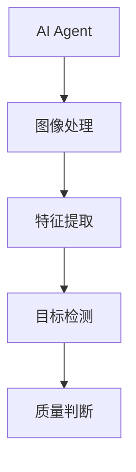
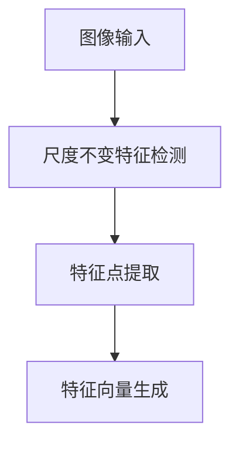
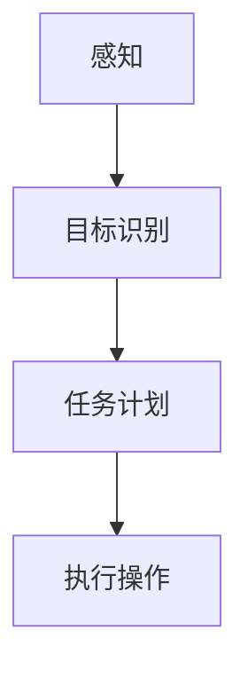
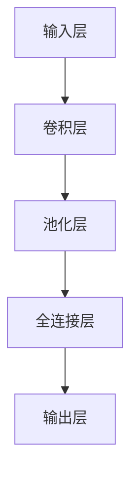
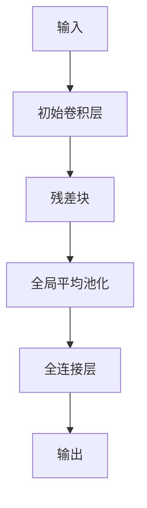
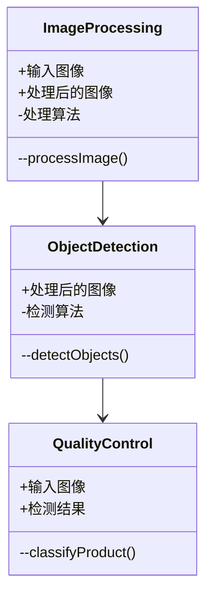

                 


# 企业AI Agent的计算机视觉技术应用：质量控制

> 关键词：企业AI Agent，计算机视觉，质量控制，图像处理，目标检测，深度学习

> 摘要：本文探讨了企业AI Agent在计算机视觉技术中的应用，特别是在质量控制领域。通过分析图像处理、目标检测和深度学习算法，本文详细阐述了AI Agent如何提升质量控制的效率和准确性。文章还提供了实际案例和系统架构设计，展示了如何将理论应用于实践。

---

## 第1章：引言

### 1.1 问题背景与问题描述

#### 1.1.1 问题背景
在企业生产过程中，质量控制是确保产品符合标准的关键环节。传统的人工质检存在效率低、成本高、易疲劳等问题。随着计算机视觉和人工智能技术的发展，AI Agent（智能体）逐渐成为质量控制的新趋势。

#### 1.1.2 问题描述
企业需要一种高效、准确且可扩展的解决方案，以取代传统的人工质检。AI Agent通过计算机视觉技术，能够实时分析产品图像，检测缺陷，分类产品，并提供决策支持。

#### 1.1.3 解决方案
引入AI Agent，结合计算机视觉技术，实现自动化的质量控制。通过图像处理、目标检测和深度学习算法，AI Agent能够快速识别产品缺陷，提高质检效率和准确性。

### 1.2 核心概念与技术联系

| 核心概念 | 定义 | 特性 | 示例 |
|----------|------|------|------|
| 图像处理 | 对图像进行增强、滤波等操作 | 提高图像质量、去除噪声 | 图像去噪、边缘检测 |
| 目标检测 | 在图像中检测和识别目标物体 | 高精度识别、实时性 | 缺陷检测、零件识别 |
| AI Agent | 具备感知和决策能力的智能体 | 自动化、智能化 | 自动化质检系统 |

### 1.3 实体关系图（Mermaid）



---

## 第2章：计算机视觉技术基础

### 2.1 图像处理与特征提取

#### 2.1.1 图像处理基础
图像处理是计算机视觉的基础，包括图像增强、二值化、边缘检测等操作。

##### 图像二值化示例（Python代码）

```python
import cv2

# 读取图像
img = cv2.imread('input.jpg', cv2.IMREAD_GRAYSCALE)

# 二值化处理
_, binary_img = cv2.threshold(img, 127, 255, cv2.THRESH_BINARY)

# 保存结果
cv2.imwrite('binary_output.jpg', binary_img)
```

#### 2.1.2 特征提取
特征提取是将图像转换为高维特征向量的过程，常用SIFT、HOG等算法。

##### SIFT特征提取（Mermaid流程图）



---

## 第3章：AI Agent的核心技术

### 3.1 AI Agent的基本原理

#### 3.1.1 任务规划与执行
AI Agent通过感知环境，制定任务计划并执行操作。

##### 任务规划流程（Mermaid流程图）



---

## 第4章：算法原理与实现

### 4.1 卷积神经网络（CNN）

#### 4.1.1 CNN的基本结构

##### CNN结构（Mermaid流程图）



#### 4.1.2 常见的CNN模型

##### ResNet网络结构（Mermaid流程图）



---

## 第5章：系统架构与设计

### 5.1 系统功能设计

#### 5.1.1 功能模块

##### 功能模块类图（Mermaid）



---

## 第6章：项目实战

### 6.1 环境配置

#### 6.1.1 安装依赖

```bash
pip install numpy matplotlib opencv-python tensorflow
```

### 6.2 核心代码实现

#### 6.2.1 目标检测代码（YOLO）

```python
import tensorflow as tf
from tensorflow.keras import layers

# 定义YOLO模型
def build_model():
    input_layer = layers.Input(shape=(416, 416, 3))
    # 网络结构
    # ...（YOLO网络）
    model = tf.keras.Model(inputs=input_layer, outputs=output_layer)
    return model

# 加载预训练权重
model = build_model()
model.load_weights('yolov4_weights.h5')

# 检测图像
def detect_objects(image_path):
    image = cv2.imread(image_path)
    # 预处理
    # ...（YOLO预处理步骤）
    predictions = model.predict(image)
    return predictions

detect_objects('input.jpg')
```

---

## 第7章：总结与展望

### 7.1 总结
本文详细探讨了企业AI Agent在计算机视觉技术中的应用，特别是在质量控制领域。通过图像处理、目标检测和深度学习算法，AI Agent能够显著提高质检效率和准确性。

### 7.2 展望
未来，随着技术的进步，AI Agent在质量控制中的应用将更加广泛。结合边缘计算和物联网技术，AI Agent将实现更高效的实时监控和预测性维护。

### 7.3 最佳实践Tips

1. 在实际项目中，确保数据质量是关键。
2. 使用预训练模型可以显著减少训练时间。
3. 实时性要求高的场景应优先选择轻量级算法。

---

## 作者：AI天才研究院 & 禅与计算机程序设计艺术

---

通过以上步骤，我们详细探讨了企业AI Agent在计算机视觉技术中的应用，特别是在质量控制领域。从基础概念到算法实现，再到系统设计和项目实战，本文为读者提供了全面的指导和深入的分析。

