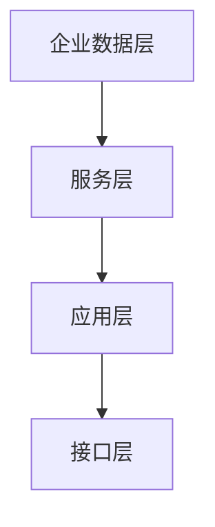
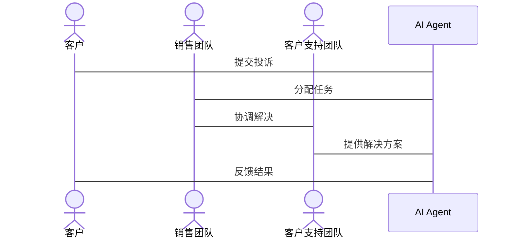

                 


# 企业AI Agent的跨部门协作功能设计与实现

> 关键词：企业AI Agent、跨部门协作、人工智能、协作机制、系统架构、算法设计

> 摘要：本文深入探讨了企业AI Agent在跨部门协作中的设计与实现。从AI Agent的基本概念到其在企业协作中的具体应用，详细分析了AI Agent的核心原理、算法设计、系统架构以及实际项目中的实现方案。通过实际案例和系统架构的设计，展示了如何利用AI Agent提升企业的协作效率和决策能力。

---

# 第一部分: 企业AI Agent的跨部门协作功能概述

## 第1章: 企业AI Agent的背景与概念

### 1.1 AI Agent的基本概念
AI Agent（人工智能代理）是一种能够感知环境并采取行动以实现目标的智能实体。AI Agent可以是软件程序、智能设备或任何能够自主决策的系统。其核心特征包括自主性、反应性、目标导向和社会性。

- 自主性：AI Agent能够在没有外部干预的情况下独立运作。
- 反应性：AI Agent能够感知环境并实时调整行为。
- 目标导向：AI Agent的行为基于明确的目标。
- 社会性：AI Agent能够与其他AI Agent或人类进行协作。

### 1.2 企业跨部门协作的挑战
企业在跨部门协作中常常面临以下挑战：

- **信息孤岛**：各部门之间数据不通，导致协作效率低下。
- **目标冲突**：不同部门的目标可能存在冲突，难以协调。
- **沟通不畅**：复杂的沟通流程可能导致信息失真或延迟。
- **决策延迟**：传统协作方式依赖人工决策，效率较低。

### 1.3 AI Agent在企业协作中的价值
AI Agent通过自动化和智能化的方式解决了传统协作的痛点：

- **自动化任务分配**：AI Agent能够根据任务优先级和部门能力自动分配任务。
- **实时信息共享**：AI Agent能够实时整合各部门数据，消除信息孤岛。
- **智能决策支持**：AI Agent通过数据分析提供决策支持，缩短决策时间。

### 1.4 企业AI Agent的应用场景
企业AI Agent可以应用于以下场景：

- **销售与客户支持协作**：AI Agent可以协调销售团队和客户支持团队，确保客户问题快速解决。
- **产品开发与市场反馈协同**：AI Agent可以整合产品开发团队和市场反馈，优化产品设计。
- **财务与供应链管理整合**：AI Agent可以协调财务部门和供应链部门，优化资源分配。

---

## 第2章: 企业AI Agent的设计原理

### 2.1 AI Agent的体系结构
AI Agent的体系结构决定了其功能和协作能力。常见的体系结构包括：

- **基于规则的AI Agent**：通过预定义的规则进行决策，适用于简单场景。
- **基于机器学习的AI Agent**：通过机器学习模型进行决策，适用于复杂场景。
- **混合型AI Agent**：结合规则和机器学习的AI Agent，适用于复杂且需要灵活调整的场景。

### 2.2 AI Agent的核心算法
AI Agent的核心算法决定了其协作能力和决策能力：

- **任务分配算法**：通过优先级和能力匹配分配任务。
- **冲突解决算法**：通过协商或仲裁解决任务分配中的冲突。
- **协作策略优化**：通过强化学习优化协作策略。

### 2.3 跨部门协作机制的设计
AI Agent的协作机制设计包括以下三个关键环节：

- **信息共享机制**：通过API或消息队列实现跨部门数据共享。
- **任务分配机制**：通过任务优先级和能力匹配分配任务。
- **结果反馈机制**：通过反馈机制优化协作策略。

---

## 第3章: AI Agent的算法原理

### 3.1 任务分配算法
任务分配算法是AI Agent协作的核心算法之一：

- **基于优先级的任务分配**：根据任务的紧急程度分配资源。
- **基于角色的任务分配**：根据部门角色分配任务。
- **基于协同过滤的任务分配**：通过协同过滤算法推荐任务分配方案。

### 3.2 冲突解决算法
冲突解决算法用于处理任务分配中的冲突：

- **基于协商的冲突解决**：通过协商解决冲突。
- **基于仲裁的冲突解决**：通过仲裁机制解决冲突。
- **基于优先级的冲突解决**：通过优先级规则解决冲突。

### 3.3 协作策略优化
协作策略优化是通过强化学习优化协作策略：

- **基于强化学习的策略优化**：通过强化学习优化协作策略。
- **基于遗传算法的策略优化**：通过遗传算法优化协作策略。
- **基于模拟退火的策略优化**：通过模拟退火优化协作策略。

---

## 第4章: 企业AI Agent的系统架构设计

### 4.1 系统架构设计
企业AI Agent的系统架构设计包括以下几个关键部分：

- **数据层**：存储企业数据。
- **服务层**：提供AI Agent所需的服务。
- **应用层**：实现AI Agent的功能。
- **接口层**：提供API接口供其他系统调用。

### 4.2 系统功能设计
系统功能设计包括以下几个方面：

- **任务管理**：管理任务的分配和执行。
- **信息共享**：实现跨部门数据共享。
- **协作机制**：实现任务分配、冲突解决和结果反馈。

### 4.3 系统架构图
以下是一个企业AI Agent的系统架构图：



---

## 第5章: 项目实战

### 5.1 项目环境配置
项目环境配置包括以下几个步骤：

- **安装Python**：安装Python 3.8或更高版本。
- **安装依赖库**：安装`numpy`、`pandas`、`scikit-learn`等依赖库。

### 5.2 核心代码实现
以下是AI Agent的核心代码实现：

```python
class AIAgent:
    def __init__(self):
        self.data = {}  # 数据存储
        self.tasks = []  # 任务列表
        self.results = []  # 结果存储

    def allocate_task(self, task):
        # 根据优先级分配任务
        pass

    def execute_task(self, task):
        # 执行任务
        pass

    def feedback_result(self, result):
        # 反馈结果
        pass
```

### 5.3 功能测试
功能测试包括以下几个步骤：

- **任务分配测试**：测试任务分配算法的正确性。
- **冲突解决测试**：测试冲突解决算法的正确性。
- **协作机制测试**：测试协作机制的正确性。

### 5.4 实际案例分析
以下是AI Agent在销售与客户支持协作中的实际案例：



---

## 第6章: 总结与展望

### 6.1 总结
企业AI Agent的跨部门协作功能设计与实现是一个复杂但重要的任务。通过合理的设计和实现，可以显著提升企业的协作效率和决策能力。

### 6.2 展望
未来，随着AI技术的不断发展，企业AI Agent的跨部门协作功能将更加智能化和自动化。AI Agent将在更多领域发挥重要作用，为企业创造更大的价值。

---

作者：AI天才研究院/AI Genius Institute & 禅与计算机程序设计艺术 /Zen And The Art of Computer Programming

