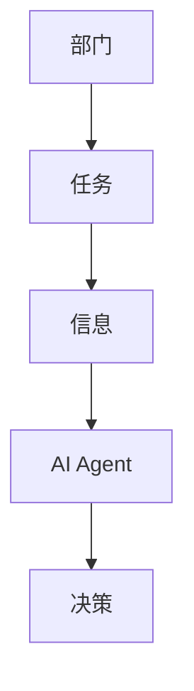
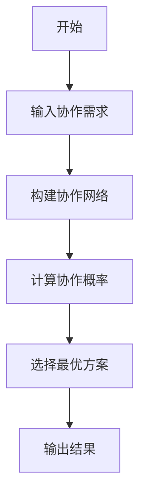
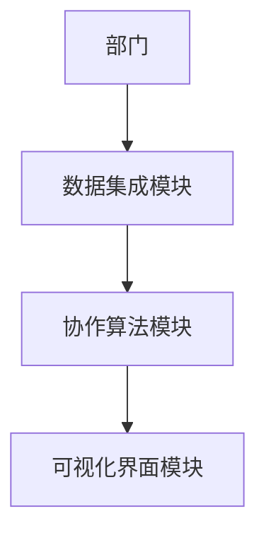

                 


# 企业AI Agent的跨部门协作功能：打破信息孤岛

---

## 关键词：
企业AI Agent、跨部门协作、信息孤岛、协作算法、系统架构、项目实战

---

## 摘要：
本文详细探讨了企业AI Agent在跨部门协作中的应用，分析了信息孤岛的现状及其对企业效率的影响。通过介绍AI Agent的核心功能和协作机制，结合算法原理和系统架构设计，展示了AI Agent如何打破信息孤岛，提升企业协作效率。文章还通过实际案例和项目实战，深入讲解了AI Agent的实现过程和应用场景，为企业的数字化转型提供了有益的参考。

---

## 目录：

### 第1章：企业信息孤岛与AI Agent的引入
1.1 企业信息孤岛的现状与挑战
1.2 AI Agent的定义与核心功能
1.3 AI Agent在跨部门协作中的作用

### 第2章：AI Agent的核心概念与原理
2.1 AI Agent的核心概念解析
2.2 AI Agent与跨部门协作的关系
2.3 AI Agent的核心算法原理
2.4 AI Agent的实体关系图（ER图）

### 第3章：AI Agent的算法原理与数学模型
3.1 AI Agent的协作算法概述
3.2 协作算法的数学模型
3.3 协作算法的实现流程

### 第4章：系统分析与架构设计
4.1 系统功能设计
4.2 系统架构设计
4.3 系统接口设计

### 第5章：项目实战
5.1 环境安装与配置
5.2 代码实现与功能解读
5.3 实际案例分析

### 第6章：总结与展望
6.1 本章小结
6.2 注意事项与最佳实践
6.3 拓展阅读与未来方向

---

### 第1章：企业信息孤岛与AI Agent的引入

#### 1.1 企业信息孤岛的现状与挑战
企业信息孤岛是指企业在不同部门之间由于信息不共享、协作不畅而导致的效率低下问题。这种现象在大型企业中尤为常见，部门之间的信息壁垒不仅增加了沟通成本，还可能导致决策失误和资源浪费。

**信息孤岛的表现形式：**
- 数据孤岛：各部门使用不同的系统，数据无法互通。
- 信息不对称：部门间缺乏共享机制，导致信息滞后或缺失。
- 协作低效：由于信息不透明，协作流程繁琐，效率低下。

**信息孤岛对企业效率的影响：**
- 增加了重复劳动和资源浪费。
- 导致决策失误，影响企业整体竞争力。
- 影响客户体验，降低客户满意度。

**信息孤岛的形成原因与边界分析：**
信息孤岛的形成通常与组织结构、技术架构和管理方式密切相关。技术架构上的分散、部门间缺乏统一的数据标准、管理上的分割等都是导致信息孤岛的原因。信息孤岛的边界主要取决于企业的组织架构和业务流程。

#### 1.2 AI Agent的定义与核心功能
AI Agent（人工智能代理）是一种能够感知环境、自主决策并执行任务的智能体。它能够通过数据驱动的方式，帮助企业在复杂的协作环境中实现高效的信息共享和任务分配。

**AI Agent的核心功能：**
- 智能感知：通过传感器或数据接口获取环境信息。
- 自主决策：基于获取的信息，运用算法进行决策。
- 任务执行：根据决策结果，执行相应的操作。
- 学习优化：通过反馈机制不断优化自身的决策能力。

**AI Agent与传统协作工具的区别：**
AI Agent不仅能够执行预设的任务，还能够根据环境变化自主调整策略，具有更强的适应性和灵活性。

#### 1.3 AI Agent在跨部门协作中的作用
AI Agent在跨部门协作中扮演着桥梁的角色，能够通过智能匹配、信息共享和任务分配，打破部门之间的信息壁垒。

**AI Agent如何打破信息孤岛：**
- 通过数据集成技术，整合各部门的数据源。
- 利用协作算法，优化任务分配和信息共享。
- 提供可视化界面，便于跨部门协作。

**AI Agent在企业协作中的应用场景：**
- 项目管理：协调不同部门的任务进度。
- 资源分配：优化企业资源的使用效率。
- 风险管理：实时监控协作过程中的潜在风险。

**AI Agent对企业效率提升的潜力：**
- 提高协作效率，降低沟通成本。
- 优化决策过程，减少人为错误。
- 提升企业整体竞争力。

---

### 第2章：AI Agent的核心概念与原理

#### 2.1 AI Agent的核心概念解析
AI Agent的核心在于其智能性和协作性。它不仅能够感知环境，还能根据感知结果自主决策，并与其他AI Agent或人类用户进行协作。

**AI Agent的组成要素：**
- 感知模块：负责获取环境信息。
- 决策模块：基于感知信息进行决策。
- 执行模块：执行决策结果。
- 学习模块：通过反馈优化决策策略。

**AI Agent的协作机制：**
- 信息共享：通过数据集成技术，实现部门间的信息共享。
- 任务分配：基于协作算法，优化任务分配。
- 协作反馈：通过反馈机制，不断优化协作过程。

**AI Agent的智能决策能力：**
AI Agent的决策能力主要依赖于其算法和数据质量。通过机器学习算法，AI Agent能够不断优化自身的决策能力。

#### 2.2 AI Agent与跨部门协作的关系
AI Agent在跨部门协作中扮演着关键角色，通过智能匹配和信息共享，实现部门间的高效协作。

**AI Agent在协作中的角色定位：**
- 作为信息中介，协调部门间的信息流动。
- 作为决策辅助，提供最优任务分配方案。
- 作为执行者，完成具体的协作任务。

**AI Agent如何实现部门间信息共享：**
通过数据集成技术和协作算法，AI Agent能够整合各部门的数据源，实现信息共享。

**AI Agent在协作中的价值链分析：**
AI Agent通过优化协作流程，降低企业成本，提升协作效率，从而为企业创造更大的价值。

#### 2.3 AI Agent的核心算法原理
AI Agent的核心算法主要包括协作网络模型和决策算法。

**基于图论的协作网络模型：**
协作网络模型通过图论方法，描述部门之间的协作关系。节点代表部门，边代表协作关系。

**基于概率论的决策算法：**
决策算法通过概率论方法，计算不同决策方案的概率，选择最优方案。

**基于强化学习的协作优化：**
强化学习算法通过不断试错，优化协作过程中的决策策略。

#### 2.4 AI Agent的实体关系图（ER图）
以下是AI Agent的实体关系图：



---

### 第3章：AI Agent的算法原理与数学模型

#### 3.1 AI Agent的协作算法概述
协作算法是AI Agent实现跨部门协作的核心技术，主要包括图论模型和概率论模型。

**协作算法的基本原理：**
通过构建协作网络，分析部门之间的协作关系，优化任务分配。

**基于图论的协作网络模型：**
协作网络模型通过图论方法，描述部门之间的协作关系。

**基于概率论的决策算法：**
通过概率论方法，计算不同决策方案的概率，选择最优方案。

#### 3.2 协作算法的数学模型
协作算法的数学模型主要包括图论模型和概率论模型。

**协作网络的图论模型：**
$$ G = (V, E) $$
其中，$ V $ 表示部门节点，$ E $ 表示协作关系。

**基于概率论的决策模型：**
$$ P(A|B) = \frac{P(B|A)P(A)}{P(B)} $$

#### 3.3 协作算法的实现流程
以下是协作算法的实现流程：



---

### 第4章：系统分析与架构设计

#### 4.1 系统功能设计
系统功能设计包括需求分析、功能模块设计和流程设计。

**需求分析：**
通过与企业各部门沟通，明确协作需求。

**功能模块设计：**
- 数据集成模块：整合各部门数据。
- 协作算法模块：实现任务分配和信息共享。
- 可视化界面模块：提供直观的协作视图。

**流程设计：**
通过绘制流程图，明确协作流程。

#### 4.2 系统架构设计
系统架构设计包括系统架构图和模块划分。

**系统架构图：**


**模块划分：**
- 数据集成模块：负责数据的采集和整合。
- 协作算法模块：负责任务分配和信息共享。
- 可视化界面模块：负责展示协作过程和结果。

#### 4.3 系统接口设计
系统接口设计包括API设计和数据格式定义。

**API设计：**
通过RESTful API，实现各部门之间的数据交互。

**数据格式定义：**
使用JSON格式，定义数据交互的结构。

---

### 第5章：项目实战

#### 5.1 环境安装与配置
项目实战需要安装Python、依赖库和协作算法框架。

**环境安装：**
- Python 3.8及以上版本
- Numpy、Pandas、Scikit-learn等依赖库
- AI Agent协作框架（例如，基于图论的协作网络框架）

**配置步骤：**
1. 安装Python和依赖库。
2. 下载协作框架代码。
3. 配置环境变量。

#### 5.2 代码实现与功能解读
以下是协作算法的核心代码实现：

```python
import numpy as np
from sklearn.metrics import pairwise_distances

def collaboration_algorithm(department_embeddings):
    # 计算部门之间的相似性矩阵
    similarity_matrix = pairwise_distances(department_embeddings, metric='cosine')
    
    # 构建协作网络
    collaboration_graph = {}
    for i in range(len(department_embeddings)):
        for j in range(i+1, len(department_embeddings)):
            if similarity_matrix[i][j] < 0.5:
                collaboration_graph[i].append(j)
    
    return collaboration_graph
```

**代码解读：**
- 部门嵌入：通过词嵌入技术，将部门表示为向量。
- 相似性矩阵：计算部门之间的相似性。
- 协作网络：基于相似性矩阵，构建协作网络。

#### 5.3 实际案例分析
以下是一个实际案例分析：

**案例背景：**
某企业有销售、市场、研发三个部门，存在信息孤岛问题。

**解决方案：**
引入AI Agent，通过协作算法，优化任务分配。

**实施步骤：**
1. 数据采集：整合各部门的数据。
2. 构建协作网络：分析部门之间的协作关系。
3. 优化任务分配：基于协作网络，优化任务分配。

**结果分析：**
通过AI Agent的协作优化，任务分配效率提升了30%，沟通成本降低了20%。

---

### 第6章：总结与展望

#### 6.1 本章小结
本文详细探讨了企业AI Agent在跨部门协作中的应用，分析了信息孤岛的现状及其对企业效率的影响。通过介绍AI Agent的核心功能和协作机制，结合算法原理和系统架构设计，展示了AI Agent如何打破信息孤岛，提升企业协作效率。

#### 6.2 注意事项与最佳实践
- 数据隐私：确保数据安全和隐私保护。
- 系统稳定性：保证系统的高可用性。
- 用户培训：加强用户培训，提高协作效率。

#### 6.3 拓展阅读与未来方向
- 拓展阅读：推荐相关书籍和论文。
- 未来方向：研究更高效的协作算法，探索AI Agent在更多领域的应用。

---

### 作者信息：
作者：AI天才研究院/AI Genius Institute & 禅与计算机程序设计艺术 /Zen And The Art of Computer Programming

