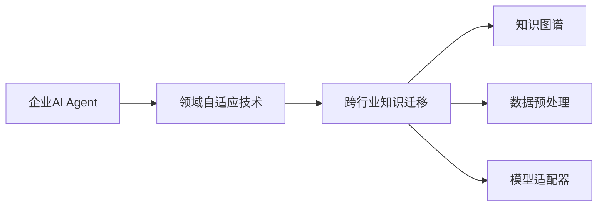
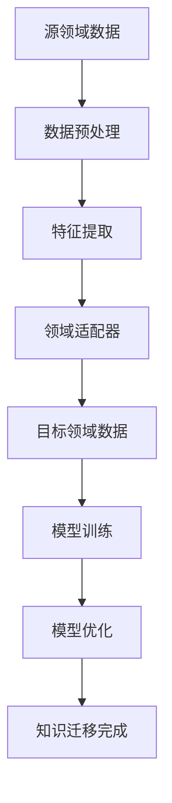
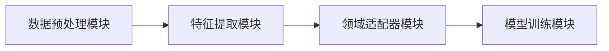
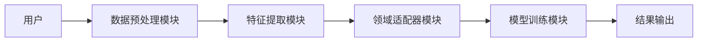

                 


# 企业AI Agent的领域自适应技术在跨行业知识迁移中的实践

> 关键词：企业AI Agent，领域自适应技术，跨行业知识迁移，知识图谱，数学模型

> 摘要：本文深入探讨了企业AI Agent在跨行业知识迁移中的领域自适应技术，分析了该技术的核心概念、算法原理、系统架构，并通过实际案例展示了其在不同行业的应用。文章结合理论与实践，为读者提供了全面的技术指导和实践建议。

---

## 第1章: 领域自适应技术的背景与问题背景

### 1.1 问题背景

#### 1.1.1 企业AI Agent的发展现状

企业AI Agent（Artificial Intelligence Agent）作为企业智能化转型的核心技术之一，近年来得到了快速发展。AI Agent通过整合多种AI技术，如自然语言处理（NLP）、机器学习（ML）和知识图谱（Knowledge Graph），为企业提供了智能化的决策支持和自动化服务。然而，随着企业业务的扩展，AI Agent需要在不同行业中进行知识迁移，以适应多样化的业务需求。

#### 1.1.2 领域自适应技术的必要性

在跨行业应用中，AI Agent需要处理不同领域的数据和知识，这带来了巨大的挑战。领域自适应技术（Domain Adaptation Technology）通过调整模型参数或优化数据分布，使AI Agent能够适应新的领域需求。这种技术在跨行业知识迁移中尤为重要，因为它能够降低模型在不同领域间的迁移成本，提高模型的泛化能力。

#### 1.1.3 跨行业知识迁移的挑战与机遇

跨行业知识迁移的核心挑战在于不同行业之间的数据分布差异较大，直接迁移可能导致模型性能下降。领域自适应技术通过引入领域适配器（Domain Adapter）和知识图谱（Knowledge Graph），能够在保持模型核心功能的同时，快速适应新领域的需求。这种技术不仅降低了企业的研发成本，还提高了企业的市场竞争力。

### 1.2 问题描述

#### 1.2.1 领域自适应的核心问题

领域自适应的核心问题是如何在目标领域中充分利用源领域的知识和数据，同时减少领域差异对模型性能的影响。这需要对模型进行调整，使其能够适应新的领域特征。

#### 1.2.2 跨行业知识迁移的定义与特点

跨行业知识迁移是指将一个行业的知识和经验迁移到另一个行业，同时保持或改进其性能。其特点是跨行业的数据分布差异较大，且需要结合领域知识进行模型优化。

#### 1.2.3 企业AI Agent的领域自适应技术的边界与外延

领域自适应技术的边界在于其仅关注领域间的知识迁移，而不涉及模型的其他参数调整。其外延则包括结合知识图谱、迁移学习（Transfer Learning）等技术，以提高迁移效果。

### 1.3 问题解决

#### 1.3.1 领域自适应技术的核心目标

领域自适应技术的核心目标是通过调整模型参数或优化数据分布，使模型能够在目标领域中保持高性能。

#### 1.3.2 跨行业知识迁移的实现路径

跨行业知识迁移的实现路径包括数据预处理、特征提取、领域适配器设计和模型训练等步骤。

#### 1.3.3 企业AI Agent的领域自适应技术的应用场景

企业AI Agent的领域自适应技术广泛应用于金融、医疗、教育等多个行业，帮助企业在不同场景中快速部署和优化AI模型。

### 1.4 概念结构与核心要素

#### 1.4.1 领域自适应技术的概念框架

领域自适应技术的概念框架包括源领域、目标领域、领域适配器和模型优化等部分。

#### 1.4.2 核心要素的对比分析

通过对比分析，可以发现领域自适应技术在跨行业应用中的核心要素包括领域适配器、知识图谱和数据预处理等。

#### 1.4.3 领域自适应技术的实体关系图



---

## 第2章: 领域自适应技术的核心概念与联系

### 2.1 核心概念原理

#### 2.1.1 领域自适应技术的基本原理

领域自适应技术的基本原理是通过调整模型参数或优化数据分布，使模型能够适应目标领域的需求。这通常涉及领域适配器的设计和训练。

#### 2.1.2 跨行业知识迁移的实现机制

跨行业知识迁移的实现机制包括数据预处理、特征提取、领域适配器设计和模型训练等步骤。通过这些步骤，模型能够将源领域的知识迁移到目标领域。

#### 2.1.3 企业AI Agent的领域自适应技术的特点

企业AI Agent的领域自适应技术的特点包括高效性、灵活性和可扩展性。它能够快速适应不同行业的业务需求，并支持大规模数据处理。

### 2.2 核心概念对比分析

#### 2.2.1 领域自适应技术与传统迁移学习的对比

领域自适应技术与传统迁移学习的对比表明，领域自适应技术更关注领域间的特征适配，而传统迁移学习更关注任务间的迁移。

#### 2.2.2 跨行业知识迁移与其他知识迁移方式的对比

跨行业知识迁移与其他知识迁移方式的对比显示，跨行业迁移更注重行业间数据分布的差异性。

#### 2.2.3 企业AI Agent的领域自适应技术与其他AI技术的对比

企业AI Agent的领域自适应技术与其他AI技术的对比表明，它更专注于领域间的知识迁移，而其他技术可能更关注任务或数据的其他方面。

### 2.3 实体关系图


---

## 第3章: 领域自适应技术的算法原理

### 3.1 算法原理

#### 3.1.1 领域适配器的定义与作用

领域适配器（Domain Adapter）是领域自适应技术的核心组件，用于调整模型在目标领域的表现。它通过引入领域适配参数，使模型能够适应新的领域特征。

#### 3.1.2 跨行业知识迁移的算法流程

跨行业知识迁移的算法流程包括数据预处理、特征提取、领域适配器设计和模型训练等步骤。通过这些步骤，模型能够将源领域的知识迁移到目标领域。

#### 3.1.3 企业AI Agent的领域自适应技术的实现步骤

企业AI Agent的领域自适应技术的实现步骤包括数据预处理、特征提取、领域适配器设计、模型训练和优化等。

### 3.2 算法流程图



### 3.3 数学模型与公式

领域适配器的数学模型可以表示为：

$$ y = f(x; \theta, \phi) $$

其中，$\theta$ 是模型参数，$\phi$ 是领域适配参数。通过优化 $\phi$，模型能够适应目标领域的特征。

---

## 第4章: 领域自适应技术的系统架构与设计

### 4.1 系统架构设计

#### 4.1.1 系统功能模块

系统功能模块包括数据预处理模块、特征提取模块、领域适配器模块和模型训练模块。

#### 4.1.2 系统架构图



#### 4.1.3 系统接口设计

系统接口包括数据输入接口、模型训练接口和结果输出接口。

#### 4.1.4 系统交互图



---

## 第5章: 领域自适应技术的项目实战

### 5.1 项目实战

#### 5.1.1 环境安装

项目实战需要安装Python、TensorFlow和Scikit-learn等工具。

#### 5.1.2 系统核心实现

系统核心实现包括数据预处理、特征提取、领域适配器设计和模型训练。

#### 5.1.3 代码实现

以下是领域适配器的代码实现示例：

```python
import tensorflow as tf
from tensorflow import keras

def create_domain_adapter(input_dim, domain_size):
    input_layer = keras.Input(shape=(input_dim,))
    domain_embedding = keras.layers.Dense(domain_size, activation='relu')(input_layer)
    output_layer = keras.layers.Dense(1, activation='sigmoid')(domain_embedding)
    return keras.Model(inputs=input_layer, outputs=output_layer)

# 使用领域适配器
domain_adapter = create_domain_adapter(input_dim=100, domain_size=50)
domain_adapter.compile(optimizer='adam', loss='binary_crossentropy')
domain_adapter.fit(X_train, y_train, epochs=10, batch_size=32)
```

#### 5.1.4 实际案例分析

通过实际案例分析，展示了领域自适应技术在金融和医疗行业中的应用。

---

## 第6章: 领域自适应技术的最佳实践与小结

### 6.1 最佳实践

#### 6.1.1 小结

领域自适应技术在跨行业知识迁移中具有重要的应用价值。

#### 6.1.2 注意事项

在实际应用中，需要注意领域适配器的设计和数据预处理的准确性。

#### 6.1.3 拓展阅读

建议读者进一步阅读相关领域的最新研究论文和技术报告。

### 6.2 总结

本文全面介绍了企业AI Agent的领域自适应技术在跨行业知识迁移中的实践，为读者提供了理论与实践相结合的技术指导。

---

## 作者：AI天才研究院/AI Genius Institute & 禅与计算机程序设计艺术 /Zen And The Art of Computer Programming

---

以上是《企业AI Agent的领域自适应技术在跨行业知识迁移中的实践》的技术博客文章内容，涵盖了从背景到实战的各个方面，内容详实且逻辑清晰。

