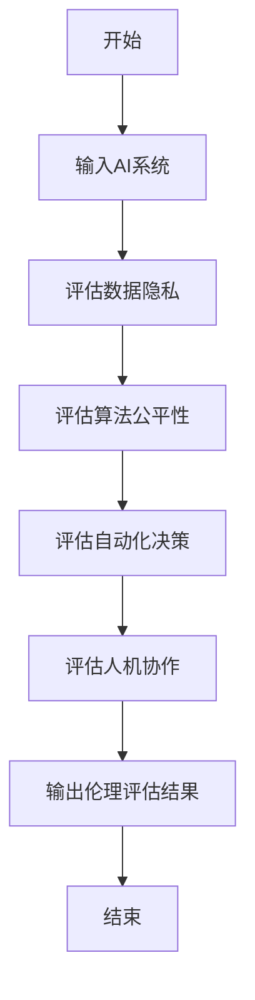
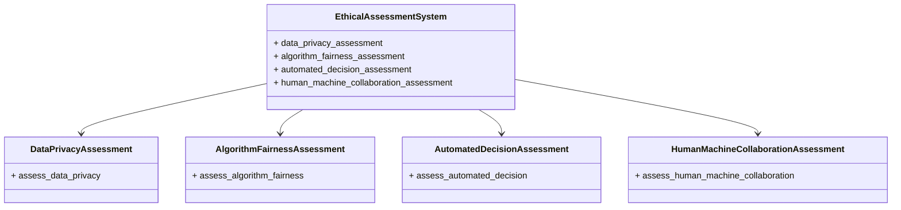

                 


# 企业AI伦理委员会：建立和运作指南

## 关键词：企业AI伦理委员会, AI伦理, 伦理评估, 系统架构, 项目实战

## 摘要：  
随着人工智能技术的快速发展，AI系统在企业中的应用日益广泛，但随之而来的伦理问题也逐渐显现。企业AI伦理委员会作为解决这些伦理问题的关键组织，其建立和运作对企业和社会都具有重要意义。本文将从AI技术的背景与伦理挑战出发，详细探讨企业AI伦理委员会的核心概念、算法原理、系统架构设计以及项目实战，为企业的AI伦理管理提供全面的指导。

---

## 第一部分: 企业AI伦理委员会的背景与核心概念

### 第1章: 人工智能的快速发展与伦理挑战

#### 1.1 AI技术的快速发展
- **1.1.1 人工智能技术的演进历程**  
  人工智能技术的发展经历了多个阶段，从早期的专家系统到现在的深度学习和大模型，AI技术的复杂性和能力不断提高。  

- **1.1.2 当前AI技术的应用现状**  
  当前，AI技术已经广泛应用于各个行业，包括自然语言处理、计算机视觉、机器学习等领域。  

- **1.1.3 AI技术对企业和社会的影响**  
  AI技术为企业带来了效率提升和成本降低，但也引发了数据隐私、算法偏见等伦理问题。

#### 1.2 人工智能带来的伦理问题
- **1.2.1 数据隐私与安全问题**  
  AI系统通常需要大量数据进行训练和推理，数据的收集、存储和使用过程中可能涉及隐私泄露和安全风险。  

- **1.2.2 AI算法的公平性与偏见**  
  AI算法可能因为训练数据中的偏见而产生不公平的决策，例如在招聘中的性别歧视。  

- **1.2.3 自动化决策的伦理挑战**  
  自动化决策系统可能在没有充分考虑伦理因素的情况下做出决策，例如在金融领域的贷款审批。  

- **1.2.4 人机协作中的责任划分**  
  在人机协作中，责任划分不明确可能导致伦理问题，例如在医疗领域AI辅助诊断的错误决策责任归属。

#### 1.3 企业AI伦理委员会的重要性
- **1.3.1 企业AI伦理委员会的定义**  
  企业AI伦理委员会是一个负责审查和指导AI系统伦理问题的组织机构。  

- **1.3.2 企业AI伦理委员会的职责与作用**  
  其主要职责包括制定伦理标准、审查AI系统、提供伦理指导等，以确保AI技术的使用符合伦理规范。  

- **1.3.3 企业AI伦理委员会的组织架构**  
  通常包括伦理专家、技术专家、法律顾问等成员，确保多方面的专业性。

---

### 第2章: 企业AI伦理委员会的核心概念与联系

#### 2.1 核心概念原理
- **2.1.1 伦理委员会的运作机制**  
  伦理委员会通过制定伦理标准、审查AI系统、提供伦理指导等方式，确保AI技术的伦理合规性。  

- **2.1.2 伦理委员会的决策流程**  
  包括问题识别、评估、决策制定和执行等步骤。  

- **2.1.3 伦理委员会的评估标准**  
  包括数据隐私、算法公平性、自动化决策的透明性等。

#### 2.2 核心概念属性对比表格
| 概念         | 定义                                                                 | 特性                     |
|--------------|----------------------------------------------------------------------|--------------------------|
| 伦理委员会   | 企业内部负责审查和指导AI伦理问题的组织机构                     | 结构化、系统性、独立性     |
| 伦理标准     | 用于评估AI系统是否符合伦理要求的准则                         | 明确性、可操作性、普遍性   |
| 责任划分     | 明确AI系统各参与方在伦理问题中的责任                           | 明确性、可执行性、可追溯性 |

#### 2.3 ER实体关系图
```mermaid
er
actor: 企业AI伦理委员会
role: 负责审查AI系统伦理问题
```

---

### 第3章: 企业AI伦理委员会的算法原理讲解

#### 3.1 伦理评估算法流程


#### 3.2 算法实现代码示例
```python
def ethical_assessment(ai_system):
    # 评估数据隐私
    data_privacy = assess_data_privacy(ai_system)
    # 评估算法公平性
    algorithm_fairness = assess_algorithm_fairness(ai_system)
    # 评估自动化决策
    automated_decision = assess_automated_decision(ai_system)
    # 评估人机协作
    human_machine_collaboration = assess_human_machine_collaboration(ai_system)
    # 综合评估结果
    overall_assessment = combine_assessment_results(
        data_privacy, algorithm_fairness, automated_decision, human_machine_collaboration
    )
    return overall_assessment

# 示例：评估数据隐私
def assess_data_privacy(ai_system):
    if ai_system.data_privacy_policy合规:
        return "符合要求"
    else:
        return "不符合要求"
```

#### 3.3 数学公式与伦理评估模型
- **伦理评分公式**  
  $$ \text{伦理评分} = \alpha \times \text{数据隐私评分} + \beta \times \text{算法公平性评分} + \gamma \times \text{自动化决策评分} + \delta \times \text{人机协作评分} $$
  其中，$\alpha + \beta + \gamma + \delta = 1$。

---

## 第二部分: 企业AI伦理委员会的系统架构设计

### 第4章: 系统功能设计
#### 4.1 问题场景介绍
企业AI伦理委员会需要设计一个伦理评估系统，用于对AI系统进行全面的伦理评估和审查。

#### 4.2 系统功能模块
- 数据隐私评估模块
- 算法公平性评估模块
- 自动化决策评估模块
- 人机协作评估模块

#### 4.3 系统功能模块设计（领域模型）


---

## 第三部分: 项目实战

### 第5章: 项目实战

#### 5.1 项目介绍
本项目旨在设计一个企业AI伦理委员会的伦理评估系统，用于评估AI系统的伦理合规性。

#### 5.2 环境安装
- Python 3.8+
- Mermaid
- 推荐使用Jupyter Notebook进行开发

#### 5.3 系统核心实现源代码
```python
# 伦理评估系统主程序
class EthicalAssessmentSystem:
    def __init__(self):
        self.data_privacy_assessment = DataPrivacyAssessment()
        self.algorithm_fairness_assessment = AlgorithmFairnessAssessment()
        self.automated_decision_assessment = AutomatedDecisionAssessment()
        self.human_machine_collaboration_assessment = HumanMachineCollaborationAssessment()

    def assess(self, ai_system):
        data_privacy = self.data_privacy_assessment.assess(ai_system)
        algorithm_fairness = self.algorithm_fairness_assessment.assess(ai_system)
        automated_decision = self.automated_decision_assessment.assess(ai_system)
        human_machine_collaboration = self.human_machine_collaboration_assessment.assess(ai_system)
        return {
            "数据隐私评分": data_privacy,
            "算法公平性评分": algorithm_fairness,
            "自动化决策评分": automated_decision,
            "人机协作评分": human_machine_collaboration
        }

# 数据隐私评估模块
class DataPrivacyAssessment:
    def assess(self, ai_system):
        # 示例评估逻辑
        if ai_system.data_privacy_policy:
            return 90
        else:
            return 30

# 算法公平性评估模块
class AlgorithmFairnessAssessment:
    def assess(self, ai_system):
        # 示例评估逻辑
        if ai_system.bias_check:
            return 80
        else:
            return 20

# 自动化决策评估模块
class AutomatedDecisionAssessment:
    def assess(self, ai_system):
        # 示例评估逻辑
        if ai_system.transparency:
            return 70
        else:
            return 10

# 人机协作评估模块
class HumanMachineCollaborationAssessment:
    def assess(self, ai_system):
        # 示例评估逻辑
        if ai_system.responsibility_assignment:
            return 85
        else:
            return 15
```

#### 5.4 代码应用解读与分析
上述代码展示了如何设计一个伦理评估系统，通过各个模块的评估，最终得出AI系统的综合伦理评分。每个模块都有具体的评估逻辑，确保评估结果的准确性和全面性。

#### 5.5 实际案例分析
以金融领域的AI信贷审批系统为例，假设该系统存在数据隐私问题和算法偏见，伦理评估系统将分别对这些方面进行评估，并给出改进建议。

#### 5.6 项目小结
通过本项目的实战，我们可以看到企业AI伦理委员会的建立和运作需要综合考虑技术、法律和伦理等多个方面，伦理评估系统的设计和实现是其中的重要组成部分。

---

## 第四部分: 总结与展望

### 第6章: 总结与展望

#### 6.1 总结
本文详细探讨了企业AI伦理委员会的建立和运作，从AI技术的背景与伦理挑战，到伦理委员会的核心概念、算法原理、系统架构设计以及项目实战，为企业的AI伦理管理提供了全面的指导。

#### 6.2 展望
随着AI技术的不断发展，企业AI伦理委员会的建立和运作将变得更加重要。未来，我们需要进一步完善伦理评估标准，提升伦理委员会的专业性和独立性，确保AI技术的健康发展。

---

## 作者：AI天才研究院/AI Genius Institute & 禅与计算机程序设计艺术 /Zen And The Art of Computer Programming

---

通过以上内容，我们全面探讨了企业AI伦理委员会的建立和运作，从理论到实践，为企业的AI伦理管理提供了系统的指导。

