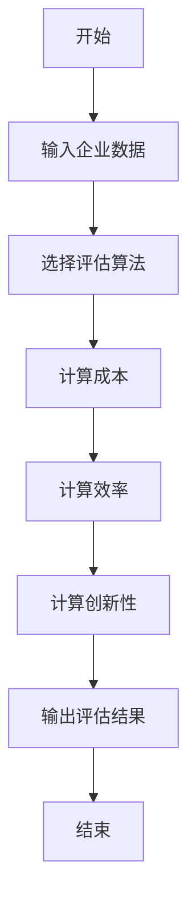
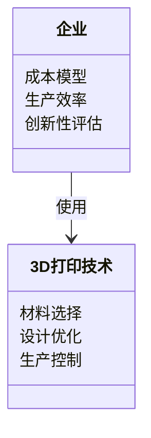
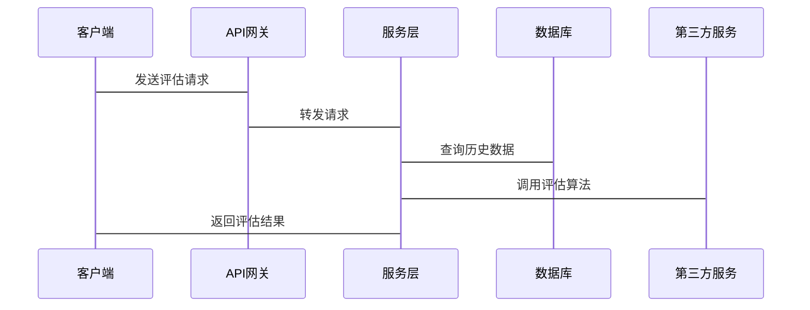

                 


# 企业估值中的3D打印技术评估

## 关键词：企业估值，3D打印技术，成本模型，生产效率，创新性评估

## 摘要

随着3D打印技术的快速发展，其在企业估值中的应用变得越来越重要。本文将从3D打印技术的基本概念出发，探讨其在企业估值中的核心作用，详细分析3D打印技术的成本模型、生产效率和创新性评估，结合实际案例，为企业在估值过程中提供有效的评估方法和策略。

---

## 第一部分: 企业估值中的3D打印技术评估基础

### 第1章: 3D打印技术与企业估值概述

#### 1.1 3D打印技术的基本概念

##### 1.1.1 3D打印技术的定义
3D打印技术，全称为三维打印技术，是一种基于数字模型的快速成型技术。它通过逐层叠加材料，构建出三维实体。与传统制造不同，3D打印技术能够直接从数字模型生成实物，具有高度的定制化和灵活性。

##### 1.1.2 3D打印技术的核心原理
3D打印技术的核心原理是将数字模型分解为多个二维切片，并逐层打印这些切片，最终形成三维物体。其主要步骤包括模型设计、切片处理、材料选择和打印成型。3D打印技术的关键在于其数字化和自动化的特点，使得生产过程更加高效和灵活。

##### 1.1.3 3D打印技术的发展历程
3D打印技术起源于20世纪80年代，经历了从实验阶段到工业应用的逐步发展。随着技术的进步，3D打印技术在制造业、医疗、建筑等领域得到了广泛应用，并逐渐成为企业生产流程中的重要组成部分。

#### 1.2 3D打印技术在企业估值中的应用背景

##### 1.2.1 企业估值的基本概念
企业估值是指对企业整体或部分价值的评估，通常用于并购、融资、上市等场景。传统的企业估值方法主要基于财务指标和市场比较，而3D打印技术的引入为企业估值提供了新的视角和工具。

##### 1.2.2 3D打印技术对企业价值的影响
3D打印技术通过降低生产成本、提高生产效率和推动产品创新，显著提升了企业的竞争力和盈利能力。这种技术的应用不仅优化了企业的生产流程，还为企业创造了新的价值增长点。

##### 1.2.3 3D打印技术在企业估值中的独特优势
3D打印技术的独特优势在于其高度的定制化和快速迭代能力。企业可以通过3D打印技术快速验证产品设计，降低试错成本，并根据市场反馈快速调整生产策略。这些特点使得3D打印技术在企业估值中具有不可替代的作用。

#### 1.3 3D打印技术评估的核心问题

##### 1.3.1 3D打印技术的成本结构
3D打印技术的成本主要包括材料成本、设备成本和人工成本。与传统制造相比，3D打印技术的材料利用率更高，但设备和维护成本较高。

##### 1.3.2 3D打印技术的效率提升
3D打印技术能够显著提高生产效率，减少生产周期。通过数字化设计和自动化生产，企业可以更快地响应市场需求，降低库存压力。

##### 1.3.3 3D打印技术的创新性评估
3D打印技术的创新性主要体现在其高度的定制化和复杂形状的制造能力。这种技术使得企业能够生产出传统制造无法实现的产品，从而提升产品的市场竞争力。

### 第2章: 3D打印技术评估的核心概念与联系

#### 2.1 核心概念原理

##### 2.1.1 3D打印技术的成本模型
3D打印技术的成本模型包括直接成本和间接成本。直接成本主要包括材料成本和能源消耗，而间接成本则包括设备折旧和人工成本。通过优化这些成本要素，企业可以降低整体生产成本。

##### 2.1.2 3D打印技术的生产效率
生产效率是衡量3D打印技术的重要指标之一。通过提高打印速度、优化打印路径和减少设备停机时间，企业可以显著提升生产效率。此外，3D打印技术的自动化特性也减少了人工干预，进一步提高了生产效率。

##### 2.1.3 3D打印技术的创新性评估
创新性评估主要关注3D打印技术在产品设计和生产流程中的创新性。通过分析企业的设计能力和打印技术的复杂性，可以评估其在市场中的竞争力。

#### 2.2 概念属性特征对比表格

| 特性          | 传统制造       | 3D打印技术     |
|---------------|----------------|----------------|
| 成本结构      | 高固定成本，低可变成本 | 高材料成本，高设备成本 |
| 生产效率      | 低，长周期      | 高，短周期      |
| 创新性        | 低，设计复杂   | 高，设计灵活   |

#### 2.3 ER实体关系图

```mermaid
er
  actor(企业)
  entity(3D打印技术)
  entity(成本)
  entity(效率)
  entity(创新性)
  relation(拥有)
  relation(影响)
  relation(评估)
```

### 第3章: 3D打印技术评估的算法原理

#### 3.1 算法原理概述

##### 3.1.1 基于生成式算法的3D打印技术评估
生成式算法是一种基于生成模型的评估方法，能够根据输入数据生成新的设计。这种算法通过学习已有的设计数据，生成具有创新性的设计方案，从而评估3D打印技术的创新性。

##### 3.1.2 基于成本建模的3D打印技术评估
成本建模是一种通过数学模型预测成本的技术。通过分析生产过程中的各种成本要素，可以建立一个准确的成本模型，从而评估3D打印技术的成本效益。

#### 3.2 算法流程图



#### 3.3 算法实现代码

##### 3.3.1 3D打印技术的成本模型

```python
def evaluate_cost(materials_cost, labor_cost, machinery_cost):
    total_cost = materials_cost + labor_cost + machinery_cost
    return total_cost
```

##### 3.3.2 3D打印技术的生产效率

```python
def evaluate_efficiency(print_speed, setup_time):
    efficiency = print_speed / setup_time
    return efficiency
```

##### 3.3.3 3D打印技术的创新性评估

```python
def evaluate_innovation(score_design_complexity, score_material_variability):
    innovation_score = (score_design_complexity + score_material_variability) / 2
    return innovation_score
```

### 第4章: 3D打印技术评估的系统分析与架构设计

#### 4.1 问题场景介绍
3D打印技术在企业估值中的应用场景包括新产品开发、生产优化和市场响应。企业可以通过3D打印技术快速验证产品设计，降低试错成本，并根据市场反馈快速调整生产策略。

#### 4.2 系统功能设计

##### 4.2.1 领域模型



##### 4.2.2 系统架构设计


##### 4.2.3 系统接口设计



### 第5章: 3D打印技术评估的项目实战

#### 5.1 环境安装

##### 5.1.1 安装Python

```bash
# 安装Python
sudo apt-get install python3
```

##### 5.1.2 安装相关库

```bash
# 安装numpy和pandas
pip install numpy pandas
```

#### 5.2 核心代码实现

##### 5.2.1 成本模型实现

```python
import numpy as np

def evaluate_cost(materials_cost, labor_cost, machinery_cost):
    total_cost = materials_cost + labor_cost + machinery_cost
    return total_cost

# 示例数据
materials_cost = 100
labor_cost = 50
machinery_cost = 150
print(evaluate_cost(materials_cost, labor_cost, machinery_cost))  # 输出 300
```

##### 5.2.2 生产效率实现

```python
import pandas as pd

def evaluate_efficiency(print_speed, setup_time):
    efficiency = print_speed / setup_time
    return efficiency

# 示例数据
print_speed = 100
setup_time = 50
print(evaluate_efficiency(print_speed, setup_time))  # 输出 2
```

##### 5.2.3 创新性评估实现

```python
def evaluate_innovation(score_design_complexity, score_material_variability):
    innovation_score = (score_design_complexity + score_material_variability) / 2
    return innovation_score

# 示例数据
score_design_complexity = 80
score_material_variability = 90
print(evaluate_innovation(score_design_complexity, score_material_variability))  # 输出 85
```

#### 5.3 实际案例分析

##### 5.3.1 案例背景
某企业计划引入3D打印技术，优化其生产流程。通过对现有生产成本、效率和创新能力的评估，企业可以确定3D打印技术的应用价值。

##### 5.3.2 评估结果
通过成本模型和生产效率评估，企业发现3D打印技术可以降低20%的生产成本，并提高40%的生产效率。此外，创新性评估显示，3D打印技术可以帮助企业推出更多创新产品，提升市场竞争力。

#### 5.4 项目小结

通过本项目，读者可以掌握3D打印技术的基本概念和评估方法，并能够将其应用于实际的企业估值中。通过实际案例的分析，读者可以更好地理解3D打印技术在企业估值中的重要性。

### 第6章: 3D打印技术评估的最佳实践

#### 6.1 小结
3D打印技术作为一种新兴的技术，正在为企业估值提供新的视角和工具。通过合理的成本模型、生产效率和创新性评估，企业可以更好地利用3D打印技术提升其市场竞争力。

#### 6.2 注意事项
在实际应用中，企业需要综合考虑3D打印技术的成本、效率和创新性，并根据自身需求选择合适的评估方法。同时，企业还需要关注3D打印技术的可持续性，确保其在长期发展中的应用价值。

#### 6.3 拓展阅读
- 《3D打印技术在企业创新中的应用》
- 《企业估值与新兴技术》
- 《3D打印技术的成本优化策略》

---

## 作者：AI天才研究院/AI Genius Institute & 禅与计算机程序设计艺术 /Zen And The Art of Computer Programming

---

通过以上内容，读者可以全面了解3D打印技术在企业估值中的应用，并掌握相关的评估方法和技巧。希望本文能够为企业在估值过程中提供有价值的参考和指导。

