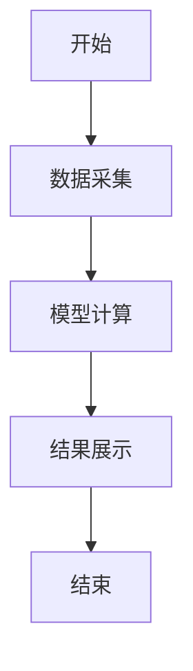

                 


# 企业估值中的5G应用场景评估

> **关键词**：5G技术、企业估值、应用场景、算法模型、系统架构

> **摘要**：  
> 随着5G技术的快速发展，其在企业中的应用场景日益广泛，对企业估值产生了深远影响。本文从5G技术的基本概念出发，分析其在企业估值中的重要性，探讨5G应用场景评估的核心方法，包括数学模型、系统架构设计及实际案例分析。通过详细的技术分析和实际应用，为读者提供全面的视角，帮助企业更好地理解和利用5G技术提升估值。

---

## 第一部分：5G应用场景与企业估值背景

### 第1章：5G技术与企业估值概述

#### 1.1 5G技术的基本概念
- **1.1.1 5G技术的定义与特点**  
  5G（第五代移动通信技术）是继4G之后的新一代通信技术，具有高速度、低延迟、大连接密度的特点。其传输速度是4G的100倍以上，延迟低至1毫秒，支持大规模物联网（IoT）设备的连接。

- **1.1.2 5G与企业估值的关系**  
  5G技术通过提升企业业务效率、降低成本、扩展业务场景，直接影响企业的收入和利润，从而影响企业的估值。

- **1.1.3 5G应用场景对企业价值的影响**  
  5G技术的应用场景广泛，包括智能制造、智慧城市、远程医疗、虚拟现实（VR）/增强现实（AR）、车联网等领域，这些场景的实现会显著提升企业的市场竞争力和估值。

#### 1.2 企业估值的核心概念
- **1.2.1 企业估值的基本原理**  
  企业估值是通过对企业未来现金流的折现、资产重估等方法，评估企业的整体价值。传统估值方法包括市盈率、市净率等。

- **1.2.2 5G应用场景在企业估值中的地位**  
  5G技术的应用场景是企业未来收益的重要来源，因此在估值中占据重要地位。通过评估5G应用场景的潜力，可以更准确地预测企业的未来收益。

- **1.2.3 5G技术对企业财务表现的影响**  
  5G技术的应用可以提升企业的收入、降低成本、优化资产结构，从而直接提升企业的财务表现，进而影响估值。

#### 1.3 5G应用场景的分类与特点
- **1.3.1 基于行业的5G应用场景**  
  不同行业的5G应用场景有所不同，例如制造业中的智能制造、医疗行业的远程诊疗等。

- **1.3.2 5G应用场景的共同特征**  
  包括高带宽、低延迟、大规模连接、实时性等。

- **1.3.3 不同应用场景对企业估值的影响差异**  
  不同行业的5G应用场景对估值的影响不同，例如智能制造可能对收入提升的影响更大，而远程医疗可能对成本降低的影响更显著。

---

### 第2章：5G应用场景评估的必要性

#### 2.1 5G技术对企业业务模式的影响
- **2.1.1 传统业务模式的转变**  
  5G技术推动企业从传统业务模式向数字化、智能化转型。

- **2.1.2 新型业务模式的出现**  
  例如，基于5G的远程办公、虚拟展厅等新兴业务模式。

- **2.1.3 业务模式变化对企业估值的影响**  
  新型业务模式的出现可能带来新的收入来源，从而提升企业估值。

#### 2.2 5G应用场景对企业竞争力的影响
- **2.2.1 竞争优势的重构**  
  5G技术的应用使企业能够构建新的竞争优势。

- **2.2.2 5G技术对企业市场地位的影响**  
  通过5G技术的应用，企业可以在市场中占据更有利的位置。

- **2.2.3 应用场景对企业创新能力的要求**  
  企业需要具备快速适应5G技术的能力，以保持竞争力。

#### 2.3 5G应用场景对企业财务表现的影响
- **2.3.1 收入增长的潜力**  
  5G技术的应用可以为企业带来新的收入来源。

- **2.3.2 成本结构的变化**  
  5G技术的应用可能降低企业的运营成本。

- **2.3.3 资产价值的评估**  
  5G技术的应用可能提升企业的资产价值。

---

### 第3章：5G应用场景评估的核心概念

#### 3.1 5G应用场景评估的基本原理
- **3.1.1 评估的定义与目标**  
  通过对5G应用场景的潜力、可行性等进行评估，为企业估值提供依据。

- **3.1.2 评估的主要方法**  
  包括定性分析和定量分析相结合的方法。

- **3.1.3 评估结果的应用场景**  
  评估结果可以用于企业战略制定、投资决策等。

#### 3.2 5G应用场景评估的关键指标
- **3.2.1 技术可行性指标**  
  包括技术成熟度、实施难度等。

- **3.2.2 业务潜力指标**  
  包括市场规模、竞争情况等。

- **3.2.3 经济效益指标**  
  包括投资回报率（ROI）、净现值（NPV）等。

---

## 第二部分：5G应用场景评估的核心概念与联系

### 第4章：5G应用场景评估的核心概念

#### 4.1 5G应用场景评估的核心原理
- **4.1.1 5G技术对企业业务的影响**  
  5G技术的应用可以提升企业的业务效率和创新能力。

- **4.1.2 5G应用场景的经济价值**  
  通过5G技术的应用，企业可以创造更大的经济价值。

- **4.1.3 5G应用场景的可持续性**  
  5G技术的应用具有长期性和可持续性。

#### 4.2 5G应用场景的核心要素
- **4.2.1 技术要素**  
  包括5G网络、边缘计算、人工智能等。

- **4.2.2 业务要素**  
  包括业务模式、市场需求、竞争环境等。

- **4.2.3 经济要素**  
  包括投资成本、收益预测、风险评估等。

#### 4.3 5G应用场景的核心属性对比
| 属性 | 传统应用场景 | 5G应用场景 |
|------|---------------|-------------|
| 传输速度 | 较低 | 极高 |
| 延迟 | 较高 | 极低 |
| 连接密度 | 较低 | 极高 |
| 业务创新 | 有限 | 丰富 |

---

## 第三部分：5G应用场景评估的算法原理

### 第5章：5G应用场景评估的数学模型

#### 5.1 评估模型的构建
- **5.1.1 模型的基本框架**  
  $$ \text{企业估值} = f(\text{5G应用场景潜力}, \text{技术可行性}, \text{经济效益}) $$

- **5.1.2 模型的输入变量**  
  包括市场规模、技术成熟度、投资成本等。

- **5.1.3 模型的输出变量**  
  包括潜在收益、净现值（NPV）、内部收益率（IRR）等。

#### 5.2 评估模型的实现
```python
def calculate_npv(revenue, cost, discount_rate, period):
    npv = 0
    for t in range(period):
        cash_flow = revenue[t] - cost[t]
        npv += cash_flow / (1 + discount_rate) ** t
    return npv

# 示例数据
revenue = [100, 200, 300]
cost = [50, 100, 150]
discount_rate = 0.1
period = 3

npv = calculate_npv(revenue, cost, discount_rate, period)
print(f"净现值（NPV）为：{npv}")
```

---

## 第四部分：5G应用场景评估的系统架构设计

### 第6章：5G应用场景评估的系统分析与架构

#### 6.1 系统功能设计
- **6.1.1 系统功能模块**  
  包括数据采集、模型计算、结果展示等。

- **6.1.2 系统功能流程**  
  使用mermaid绘制功能流程图。



#### 6.2 系统架构设计
- **6.2.1 系统架构选择**  
  采用微服务架构。

- **6.2.2 系统架构图**  
  使用mermaid绘制系统架构图。

```mermaid
graph LR
    Client --> API Gateway
    API Gateway --> Service1
    API Gateway --> Service2
    Service1 --> Database
    Service2 --> Database
```

---

## 第五部分：5G应用场景评估的项目实战

### 第7章：5G应用场景评估的实战分析

#### 7.1 项目背景
- 某制造企业希望通过5G技术实现智能制造，提升生产效率和产品质量。

#### 7.2 项目实施
- **7.2.1 环境安装**  
  安装5G网络设备、部署边缘计算平台。

- **7.2.2 核心代码实现**  
  使用Python编写5G应用场景的评估代码。

```python
def evaluate_5g_scenario(revenue, cost, discount_rate, period):
    npv = 0
    for t in range(period):
        cash_flow = revenue[t] - cost[t]
        npv += cash_flow / (1 + discount_rate) ** t
    return npv

revenue = [100, 200, 300]
cost = [50, 100, 150]
discount_rate = 0.1
period = 3

scenario_value = evaluate_5g_scenario(revenue, cost, discount_rate, period)
print(f"5G应用场景价值评估结果：{scenario_value}")
```

---

## 第六部分：总结与展望

### 第8章：总结与未来展望

#### 8.1 总结
- 通过本文的分析，可以得出5G技术在企业估值中的重要性，以及应用场景评估的核心方法。

#### 8.2 未来展望
- 随着5G技术的不断发展，其在企业估值中的应用将更加广泛和深入。

---

**作者：AI天才研究院/AI Genius Institute & 禅与计算机程序设计艺术 /Zen And The Art of Computer Programming**

