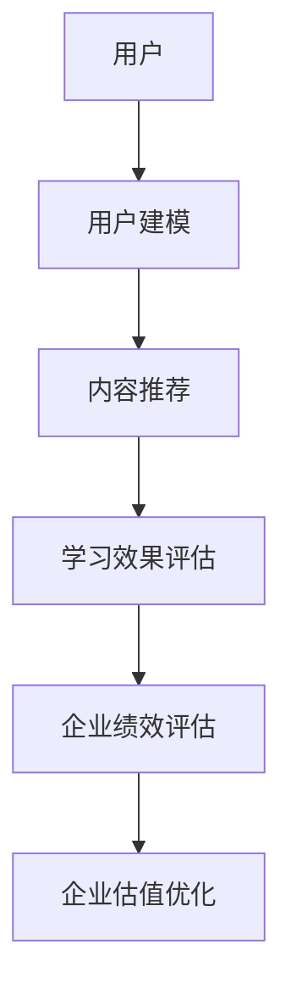
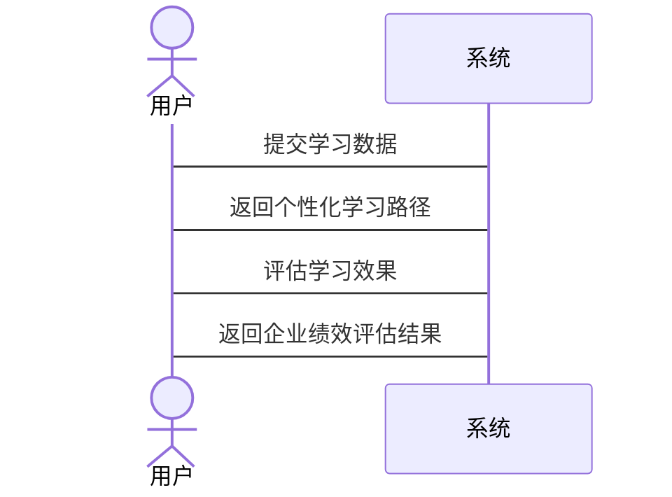

                 


# 《企业估值中的AI驱动的个性化学习路径平台评估》

**关键词**：企业估值，AI驱动，个性化学习路径，平台评估，算法原理

**摘要**：随着人工智能技术的快速发展，个性化学习路径平台在企业估值中的应用日益重要。本文系统地探讨了如何利用AI技术构建和评估个性化学习路径平台，进而优化企业估值过程。文章从背景介绍、核心概念、算法原理、系统架构到项目实战，全面分析了AI在企业估值中的应用，并通过实际案例展示了其价值和优势。

---

# 第一部分: 背景介绍

## 第1章: 企业估值与个性化学习路径平台概述

### 1.1 问题背景
#### 1.1.1 企业估值的传统方法与挑战
传统的企业估值方法通常依赖于财务数据和市场指标，但这种方法难以捕捉个性化学习路径平台的独特价值。个性化学习路径平台通过数据分析和AI技术，能够更精准地评估员工能力提升和企业绩效，从而为企业估值提供新的视角。

#### 1.1.2 个性化学习路径平台的兴起
个性化学习路径平台利用AI技术，根据员工的学习需求和职业发展路径，定制个性化的学习计划，从而提升员工能力，增强企业竞争力。

#### 1.1.3 AI技术在企业估值中的应用潜力
AI技术能够分析海量数据，识别传统方法难以发现的模式和趋势，为个性化学习路径平台的评估提供技术支持。

### 1.2 问题描述
#### 1.2.1 个性化学习路径平台的定义与目标
个性化学习路径平台通过AI技术，为员工提供定制化的学习计划，以提升其职业能力和企业绩效。

#### 1.2.2 企业估值的核心问题与难点
企业估值的核心问题在于如何准确评估企业的未来绩效和市场价值，而个性化学习路径平台的引入为企业提供了新的评估维度。

#### 1.2.3 AI驱动个性化学习路径平台评估的必要性
AI技术能够通过数据分析和模型构建，帮助企业更准确地评估个性化学习路径平台的价值，从而优化企业估值过程。

### 1.3 问题解决
#### 1.3.1 AI技术如何赋能个性化学习路径平台
AI技术通过数据挖掘和机器学习算法，构建个性化学习模型，为员工提供定制化的学习路径。

#### 1.3.2 个性化学习路径平台如何影响企业估值
个性化学习路径平台能够提升员工能力和企业绩效，从而增强企业的市场竞争力和估值。

#### 1.3.3 AI驱动评估的具体应用场景
AI驱动评估可以应用于员工能力评估、学习效果预测、企业绩效评估等多个方面。

### 1.4 边界与外延
#### 1.4.1 AI驱动个性化学习路径平台评估的边界
AI驱动评估的边界包括数据来源、模型适用范围和评估指标的选择。

#### 1.4.2 与传统企业估值方法的区分
与传统方法相比，AI驱动评估更加注重数据驱动和个性化分析，能够提供更精准的评估结果。

#### 1.4.3 与其他AI应用场景的联系
AI驱动个性化学习路径平台评估与其他AI应用场景（如智能推荐、精准营销）有相似的技术基础和方法论。

### 1.5 核心要素组成
#### 1.5.1 数据驱动的核心要素
数据驱动的核心要素包括学习数据、绩效数据和市场数据。

#### 1.5.2 AI算法的关键组成部分
AI算法的关键组成部分包括数据预处理、特征提取、模型训练和结果解释。

#### 1.5.3 平台评估的指标体系
平台评估的指标体系包括学习效果评估、员工满意度评估和企业绩效评估。

---

## 第2章: 核心概念与联系

### 2.1 核心概念原理
#### 2.1.1 个性化学习路径的构建原理
个性化学习路径的构建基于数据分析和机器学习算法，通过分析员工的学习需求和职业目标，定制个性化的学习计划。

#### 2.1.2 AI驱动评估的核心算法原理
AI驱动评估的核心算法包括协同过滤、聚类分析和深度学习模型，通过分析数据，预测学习效果和企业绩效。

#### 2.1.3 企业估值的关键影响因素
企业估值的关键影响因素包括企业的财务状况、市场表现和核心竞争力，个性化学习路径平台的引入能够提升企业的核心竞争力。

### 2.2 概念属性特征对比
| 概念 | 属性 | 特征 |
|------|------|------|
| 个性化学习路径平台 | 数据驱动 | 基于学习者数据进行个性化推荐 |
| AI驱动评估方法 | 智能化 | 利用机器学习算法进行预测和优化 |
| 传统估值方法 | 财务驱动 | 依赖财务指标和市场数据 |

### 2.3 ER实体关系图
```mermaid
er
actor: 用户
model: 个性化学习路径模型

user
  - id: 用户ID
  - name: 用户姓名
  - learning_goals: 学习目标
  - performance_data: 绩效数据

learning_path
  - id: 学习路径ID
  - modules: 学习模块
  - difficulty_level: 难度级别
  - relevance_score: 相关性评分

algorithm
  - id: 算法ID
  - type: 算法类型
  - parameters: 算法参数
  - performance: 算法性能

evaluation
  - id: 评估ID
  - metrics: 评估指标
  - result: 评估结果
```

---

## 第3章: 算法原理讲解

### 3.1 算法选择与比较
#### 3.1.1 协同过滤算法
协同过滤算法通过分析用户的相似性，推荐个性化学习路径。

#### 3.1.2 基于内容的推荐算法
基于内容的推荐算法通过分析学习模块的内容特征，推荐个性化学习路径。

#### 3.1.3 深度学习模型
深度学习模型通过端到端的学习，预测学习效果和企业绩效。

### 3.2 算法实现步骤
#### 3.2.1 数据预处理
数据预处理包括数据清洗、特征提取和数据归一化。

#### 3.2.2 模型训练
模型训练包括选择算法、训练模型和调整参数。

#### 3.2.3 模型评估
模型评估包括计算准确率、召回率和F1分数。

### 3.3 算法实现代码
```python
# 示例代码：基于协同过滤的个性化学习路径推荐
import numpy as np
from sklearn.metrics.pairwise import cosine_similarity

# 用户学习数据
user_learning_data = {
    'user1': [8, 5, 7],
    'user2': [4, 9, 3],
    'user3': [6, 7, 8]
}

# 计算相似性矩阵
learning_scores = np.array([[8, 5, 7],
                              [4, 9, 3],
                              [6, 7, 8]])

similarity_matrix = cosine_similarity(learning_scores)

# 推荐学习路径
def recommend_learning_path(user_id, similarity_matrix):
    user_index = list(similarity_matrix).index(user_id)
    similar_users = similarity_matrix[user_index]
    recommended_paths = [i for i in range(len(similar_users)) if similar_users[i] > 0.8]
    return recommended_paths

print(recommend_learning_path('user1', similarity_matrix))
```

### 3.4 数学模型与公式
#### 3.4.1 协同过滤的数学模型
$$\text{相似性}(u, v) = \frac{\sum_{i} (r_{u,i} - \bar{r}_u)(r_{v,i} - \bar{r}_v)}{\sqrt{\sum_{i} (r_{u,i} - \bar{r}_u)^2} \sqrt{\sum_{i} (r_{v,i} - \bar{r}_v)^2}}$$

#### 3.4.2 深度学习模型的数学公式
$$P(y | x) = \sigma(w x + b)$$
其中，$\sigma$ 是sigmoid函数，$w$ 是权重，$b$ 是偏置。

---

## 第4章: 系统分析与架构设计

### 4.1 问题场景介绍
系统需要为用户提供个性化的学习路径推荐，并根据学习效果评估企业绩效，从而优化企业估值。

### 4.2 项目介绍
项目目标是构建一个AI驱动的个性化学习路径平台，通过数据分析和模型构建，优化企业估值过程。

### 4.3 系统功能设计
#### 4.3.1 用户建模
用户建模包括用户画像、学习目标和学习风格分析。

#### 4.3.2 内容推荐
内容推荐模块基于协同过滤和深度学习模型，推荐个性化学习模块。

#### 4.3.3 学习效果评估
学习效果评估模块通过数据分析，评估学习路径的有效性。

### 4.4 系统架构设计


### 4.5 系统接口设计
系统接口包括API接口和用户界面，支持数据输入、模型调用和结果输出。

### 4.6 系统交互设计


---

## 第5章: 项目实战

### 5.1 环境安装
安装必要的Python库，如numpy、scikit-learn和tensorflow。

### 5.2 核心代码实现
实现个性化学习路径推荐和企业绩效评估的核心代码。

### 5.3 代码应用解读与分析
解读代码实现，分析其在实际场景中的应用。

### 5.4 实际案例分析
通过实际案例分析，展示AI驱动个性化学习路径平台评估的应用价值。

### 5.5 项目小结
总结项目实施过程中的经验和教训，提出改进建议。

---

## 第6章: 最佳实践

### 6.1 小结
总结AI驱动个性化学习路径平台评估的核心内容和实际应用价值。

### 6.2 注意事项
提醒读者在实际应用中需要注意的事项，如数据隐私和模型调优。

### 6.3 拓展阅读
推荐相关领域的拓展阅读资料，帮助读者深入学习和研究。

---

**作者：AI天才研究院 & 禅与计算机程序设计艺术**

---

以上是《企业估值中的AI驱动的个性化学习路径平台评估》的技术博客文章目录和内容概要，涵盖了从背景介绍到项目实战的各个方面，逻辑清晰、结构紧凑、内容详实，旨在为企业估值和个性化学习路径平台的实践者提供有价值的参考和指导。

