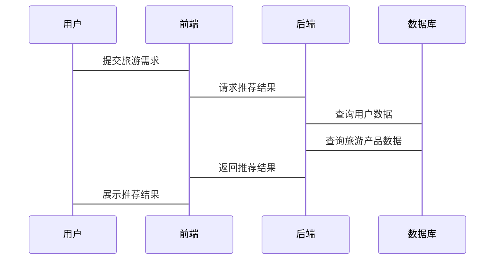

                 


# 企业估值中的AI驱动的个性化旅游规划平台评估

> **关键词**：企业估值、AI驱动、个性化旅游、平台评估、算法原理、系统架构

> **摘要**：本文探讨了AI技术在个性化旅游规划平台企业估值中的应用，从背景、核心概念、算法原理、系统架构到项目实战，全面分析了如何利用AI驱动的个性化旅游规划平台进行企业估值。通过具体案例和系统设计，展示了如何构建高效的AI驱动平台，为企业估值提供数据支持。

---

# 第一部分: 企业估值与AI驱动的个性化旅游规划平台概述

## 第1章: 个性化旅游规划平台的背景与意义

### 1.1 问题背景
个性化旅游规划是指根据用户的需求和偏好，提供定制化的旅行方案。随着旅游业的快速发展，用户需求日益多样化，传统的标准化旅游服务难以满足市场需求。AI技术的应用为个性化旅游规划提供了新的可能性，能够通过数据挖掘和机器学习算法，精准匹配用户需求和旅游资源，从而提升用户体验和企业价值。

### 1.2 问题描述
传统的企业估值方法主要依赖于财务数据和市场分析，难以充分考虑用户体验和个性化服务对企业价值的影响。而个性化旅游规划平台的出现，使得企业可以通过数据分析和用户行为预测，更准确地评估自身在市场中的竞争力和潜在价值。

### 1.3 问题解决
通过AI技术，个性化旅游规划平台可以实现用户需求的精准分析、旅游产品的智能推荐和用户行为的预测，从而为企业提供更全面的估值依据。本文将从技术角度探讨如何构建和评估这样的平台。

### 1.4 边界与外延
本文主要关注AI驱动的个性化旅游规划平台在企业估值中的应用，边界包括用户需求分析、旅游产品推荐和用户行为预测。外延部分则涉及更广泛的企业估值方法，如财务指标分析和市场趋势预测。

### 1.5 核心要素组成
个性化旅游规划平台的核心要素包括用户数据采集、数据分析与处理、推荐算法和用户行为预测模型。这些要素共同构成了平台的评估体系，为企业估值提供数据支持。

---

## 第2章: AI驱动的个性化旅游规划平台的核心概念与联系

### 2.1 核心概念
个性化旅游规划平台基于AI技术，通过分析用户数据，提供定制化的旅游方案。其核心概念包括用户需求分析、推荐算法和用户行为预测。

### 2.2 核心概念对比分析
| 概念       | 描述                                                                 |
|------------|----------------------------------------------------------------------|
| 用户需求分析 | 通过用户数据（如兴趣、预算、时间）分析用户的旅游偏好             |
| 推荐算法     | 基于用户数据和历史数据，推荐符合用户需求的旅游产品                 |
| 用户行为预测 | 预测用户在平台上的行为，优化推荐策略和用户体验                     |

### 2.3 实体关系图（ER图）
```mermaid
er
  entity 用户 {
    id 用户ID
    name 用户名称
    预算 预算范围
    兴趣 兴趣标签
  }
  
  entity 旅游产品 {
    id 产品ID
    名称 产品名称
    类型 产品类型
    价格 产品价格
  }
  
  relation 用户-旅游产品 {
    关系类型：收藏/购买/推荐
    关联字段：用户ID, 产品ID
  }
```

### 2.4 本章小结
本章详细介绍了AI驱动的个性化旅游规划平台的核心概念和其在企业估值中的应用，为后续的算法设计和系统实现奠定了基础。

---

## 第3章: 算法原理与实现

### 3.1 推荐算法原理
个性化旅游规划平台的推荐算法是基于用户数据和历史数据的分析。常用算法包括协同过滤、基于内容的推荐和深度学习模型。

#### 协同过滤
协同过滤是一种基于用户相似性进行推荐的算法。具体步骤如下：

1. **数据采集**：收集用户的旅游偏好和行为数据。
2. **相似度计算**：通过余弦相似度或Jaccard相似度计算用户之间的相似度。
3. **推荐生成**：基于相似用户的购买或收藏记录，推荐相似产品。

#### 基于内容的推荐
基于内容的推荐算法通过分析旅游产品的特征（如类型、价格、地点）来推荐相似产品。

#### 深度学习模型
深度学习模型（如协同过滤的深度学习变种）能够捕捉更复杂的用户行为和产品特征，提供更精准的推荐。

### 3.2 算法实现的数学模型
#### 协同过滤的数学公式
$$\text{相似度} = \frac{\sum_{i} (x_i - \bar{x})(y_i - \bar{y})}{\sqrt{\sum_{i} (x_i - \bar{x})^2} \sqrt{\sum_{i} (y_i - \bar{y})^2}}$$

#### 基于内容的相似度计算
$$\text{相似度} = \frac{\sum_{i} x_i y_i}{\sqrt{\sum_{i} x_i^2} \sqrt{\sum_{i} y_i^2}}$$

### 3.3 推荐算法的实现步骤
1. 数据预处理：清洗和标准化用户数据。
2. 模型训练：选择合适的算法并进行参数调优。
3. 推荐生成：基于训练好的模型，生成个性化推荐列表。

### 3.4 本章小结
本章详细讲解了AI驱动的个性化旅游规划平台中推荐算法的原理和实现，为后续的系统设计和项目实战提供了理论基础。

---

## 第4章: 系统分析与架构设计

### 4.1 系统功能设计
个性化旅游规划平台的功能模块包括用户需求分析、旅游产品推荐和用户行为预测。

#### 用户需求分析模块
- 数据采集：收集用户的兴趣、预算和时间偏好。
- 数据分析：分析用户的旅游需求，生成用户画像。

#### 旅游产品推荐模块
- 数据处理：对旅游产品进行分类和特征提取。
- 推荐生成：基于推荐算法生成个性化推荐列表。

#### 用户行为预测模块
- 数据分析：分析用户的历史行为数据。
- 行为预测：预测用户的下一步行为，优化推荐策略。

### 4.2 系统架构设计
系统架构分为前端、后端和数据库三部分。

#### 前端架构
- 用户界面：展示推荐结果和用户交互界面。
- API接口：与后端进行数据交互。

#### 后端架构
- 业务逻辑处理：处理用户的请求和数据。
- 推荐算法实现：基于用户数据生成推荐结果。

#### 数据库设计
- 数据存储：存储用户数据和旅游产品数据。
- 数据查询：快速检索数据以支持推荐算法。

#### 系统交互流程图


### 4.3 本章小结
本章详细设计了个性化旅游规划平台的系统架构，为项目的实际实现提供了指导。

---

## 第5章: 项目实战与案例分析

### 5.1 环境安装与配置
- **Python环境**：安装Python 3.x及以上版本。
- **库的安装**：安装Pandas、NumPy、Scikit-learn等库。

### 5.2 系统核心实现源代码
以下是基于协同过滤算法的推荐系统实现：

```python
from sklearn.metrics.pairwise import cosine_similarity
from sklearn.preprocessing import StandardScaler

# 数据预处理
data = [...]  # 用户数据
scaler = StandardScaler()
data_scaled = scaler.fit_transform(data)

# 计算相似度矩阵
similarity_matrix = cosine_similarity(data_scaled)

# 推荐生成
def get_recommendations(user_id, similarity_matrix):
    user_index = user_id
    similarity_scores = similarity_matrix[user_index]
    indices = [i for i in range(len(similarity_scores))]
    # 去除当前用户自身
    indices.remove(user_index)
    # 按相似度排序
    indices_sorted = sorted(indices, key=lambda x: similarity_scores[x], reverse=True)
    return indices_sorted[:5]  # 返回前5个推荐
```

### 5.3 代码应用解读
上述代码实现了基于协同过滤的推荐系统。数据预处理部分使用了标准化处理，相似度计算使用了余弦相似度，推荐生成部分根据相似度排序生成推荐列表。

### 5.4 案例分析
假设我们有以下用户数据：

| 用户ID | 兴趣标签 | 预算 | 时间 |
|-------|----------|------|------|
| 1     | 自然风光 | 5000 | 7天  |
| 2     | 历史文化 | 3000 | 5天  |
| 3     | 美食体验 | 2000 | 3天  |

通过协同过滤算法，系统可以为用户1推荐预算相近且兴趣相似的用户2，从而推荐历史文化相关的旅游产品。

### 5.5 本章小结
本章通过实际案例展示了AI驱动的个性化旅游规划平台的实现过程，验证了算法的有效性和实用性。

---

## 第6章: 最佳实践与总结

### 6.1 小结
本文详细探讨了AI驱动的个性化旅游规划平台在企业估值中的应用，从背景、核心概念、算法原理到系统设计和项目实战，全面分析了平台的构建和评估方法。

### 6.2 注意事项
- 数据隐私保护：在处理用户数据时，需遵守相关隐私保护法规。
- 算法优化：根据实际需求不断优化推荐算法，提升推荐准确率。

### 6.3 拓展阅读
- 推荐阅读《推荐系统导论》（Introduction to Recommendation Systems）。
- 关注AI在旅游行业的最新应用和发展趋势。

---

# 作者：AI天才研究院/AI Genius Institute & 禅与计算机程序设计艺术 /Zen And The Art of Computer Programming

