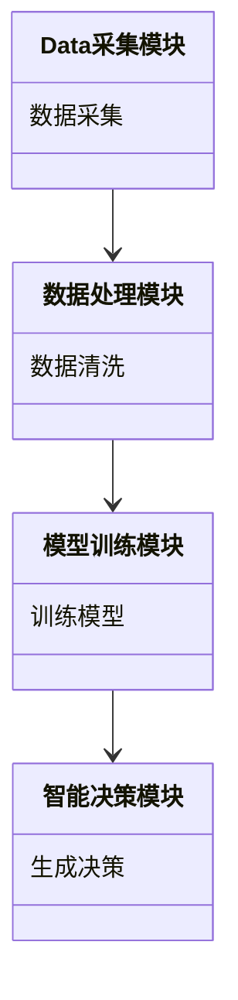
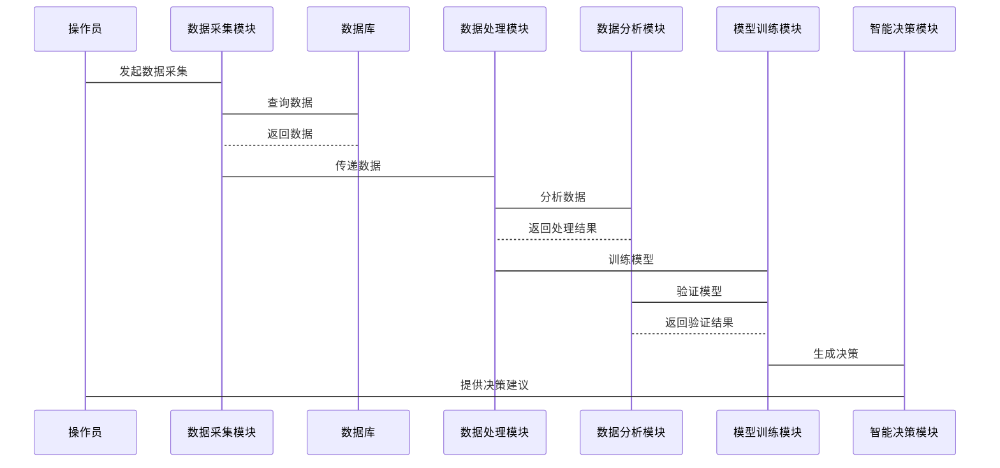

                 


# 《企业估值中的AI驱动的供应链优化平台评估》

**关键词**：企业估值，供应链优化，人工智能，算法设计，系统架构

**摘要**：本文深入探讨了AI驱动的供应链优化平台在企业估值中的应用。通过分析供应链优化的核心概念、算法原理、系统架构及实际案例，本文为读者提供了一套完整的评估方法。从背景介绍到算法实现，从系统设计到项目实战，本文旨在帮助企业理解和应用AI技术提升供应链效率，从而优化企业估值。

---

## 第1章: 企业估值与供应链优化概述

### 1.1 供应链优化的重要性

#### 1.1.1 供应链在企业运营中的核心地位
供应链是企业的生命线，贯穿从原材料采购到产品交付的整个流程。高效的供应链管理能够显著降低运营成本、提高产品交付速度，并增强企业的市场竞争力。供应链优化是企业提升效率、降低成本的关键手段。

#### 1.1.2 供应链优化对企业估值的影响
供应链效率直接影响企业的运营成本和盈利能力，进而影响企业估值。优化的供应链能够缩短交付周期、降低库存成本，并提高客户满意度，从而为企业创造更大的价值。

#### 1.1.3 传统供应链管理的局限性
传统供应链管理依赖人工操作，存在信息孤岛、反应迟缓、决策滞后等问题。这些问题导致供应链效率低下，难以应对市场变化和客户需求。

### 1.2 AI驱动的供应链优化平台的背景

#### 1.2.1 AI技术在供应链管理中的应用现状
AI技术在供应链管理中的应用日益广泛，包括需求预测、供应商选择、库存优化、路径规划等领域。AI能够通过数据驱动的决策显著提高供应链效率。

#### 1.2.2 供应链优化平台的核心价值
AI驱动的供应链优化平台通过实时数据分析和智能决策，帮助企业实现供应链各环节的协同优化，降低运营成本，提高响应速度。

#### 1.2.3 企业估值与供应链优化的关联性
高效的供应链优化能够显著提升企业的运营效率和盈利能力，从而增强企业的市场竞争力和估值。

### 1.3 本书的目标与结构

#### 1.3.1 本书的核心目标
本书旨在为企业提供一套基于AI技术的供应链优化方法论，帮助企业通过优化供应链提升企业估值。

#### 1.3.2 目录结构概览
本书分为六章，涵盖供应链优化的核心概念、AI算法原理、系统架构设计、项目实战等内容，帮助读者全面掌握AI驱动的供应链优化技术。

#### 1.3.3 预期读者与学习方法
本书适合企业管理人员、供应链优化工程师以及对AI技术感兴趣的读者阅读。读者可以通过理论学习与实践操作相结合的方式，掌握供应链优化的核心技术。

---

## 第2章: 供应链优化的核心概念与模型

### 2.1 供应链优化的基本原理

#### 2.1.1 供应链的基本构成要素
供应链包括供应商、制造商、分销商、零售商和客户等环节。每个环节都需要高效协同，才能实现整体优化。

#### 2.1.2 供应链优化的目标与约束条件
供应链优化的目标是最大化效率、降低成本、提高客户满意度。约束条件包括资源限制、时间限制、需求波动等。

#### 2.1.3 供应链优化的数学模型
供应链优化的数学模型通常包括线性规划、整数规划等。例如，线性规划模型可以用于库存优化和运输路径规划。

### 2.2 AI驱动的供应链优化算法

#### 2.2.1 机器学习在供应链优化中的应用
机器学习可以用于需求预测、供应商选择等场景。例如，回归算法可以预测市场需求，分类算法可以识别优质供应商。

#### 2.2.2 深度学习模型在供应链预测中的作用
深度学习模型如LSTM可以用于时间序列预测，帮助企业在需求波动中做出更准确的决策。

#### 2.2.3 强化学习在供应链决策中的应用
强化学习可以通过模拟不同决策场景，找到最优策略。例如，强化学习可以用于库存控制和供应链网络优化。

### 2.3 供应链优化平台的评估指标

#### 2.3.1 平台性能评估指标
包括响应时间、准确率、处理能力等。这些指标可以帮助企业评估供应链优化平台的性能。

#### 2.3.2 企业估值相关性分析
评估供应链优化对企业的整体价值提升，包括成本降低、效率提升、客户满意度等。

#### 2.3.3 评估指标的权重分配与计算
通过层次分析法等方法，确定各评估指标的权重，并进行综合评分。

---

## 第3章: 供应链优化算法的数学模型

### 3.1 线性规划模型在供应链优化中的应用

#### 3.1.1 线性规划的基本原理
线性规划是一种优化方法，适用于目标函数和约束条件均为线性的情况。例如，用于运输路径优化和库存管理。

#### 3.1.2 供应链优化的线性规划模型构建
以某制造企业为例，构建一个包含供应商选择、生产计划、运输路径的线性规划模型。

#### 3.1.3 示例案例分析与求解
通过案例分析，展示如何利用线性规划模型优化供应链成本。

### 3.2 机器学习模型在供应链预测中的应用

#### 3.2.1 回归模型在需求预测中的应用
线性回归模型可以预测产品需求量，帮助企业合理安排生产计划。

#### 3.2.2 分类模型在供应商选择中的应用
逻辑回归模型可以用于供应商信用评估和质量评价。

#### 3.2.3 聚类分析在供应链网络优化中的应用
聚类分析可以用于供应商分组和市场区域划分。

### 3.3 强化学习算法在供应链决策中的应用

#### 3.3.1 强化学习的基本原理
强化学习通过试错和奖励机制，找到最优策略。

#### 3.3.2 供应链决策问题的强化学习建模
以库存控制为例，构建强化学习模型，模拟不同决策场景。

#### 3.3.3 实际案例分析与算法实现
通过具体案例，展示如何利用强化学习优化供应链决策。

---

## 第4章: 供应链优化平台的系统架构设计

### 4.1 系统功能模块设计

#### 4.1.1 数据采集模块
负责采集供应链各环节的数据，包括供应商信息、生产数据、销售数据等。

#### 4.1.2 数据处理模块
对采集到的数据进行清洗、转换和预处理，为后续分析提供支持。

#### 4.1.3 模型训练模块
基于数据训练AI模型，包括回归模型、分类模型和强化学习模型。

#### 4.1.4 智能决策模块
根据模型预测结果，生成优化决策，例如供应商选择和库存补货。

#### 4.1.5 反馈优化模块
根据实际执行结果，优化模型和决策策略。

### 4.2 系统架构设计

#### 4.2.1 领域模型设计（Mermaid类图）


#### 4.2.2 系统架构图（Mermaid架构图）


#### 4.2.3 系统接口设计
包括数据接口、模型接口和决策接口的设计。

#### 4.2.4 系统交互流程（Mermaid序列图）


---

## 第5章: 项目实战

### 5.1 环境搭建

#### 5.1.1 Python环境安装
安装Python和必要的库，例如numpy、pandas、scikit-learn等。

#### 5.1.2 数据集准备
获取或构建供应链相关的数据集，例如供应商信息、销售数据、库存数据等。

### 5.2 核心代码实现

#### 5.2.1 数据预处理代码
```python
import pandas as pd

data = pd.read_csv('supply_chain_data.csv')
data = data.dropna()
data = pd.get_dummies(data)
```

#### 5.2.2 机器学习模型实现
```python
from sklearn.linear_model import LinearRegression

model = LinearRegression()
model.fit(X_train, y_train)
predictions = model.predict(X_test)
```

#### 5.2.3 强化学习算法实现
```python
import numpy as np

class Agent:
    def __init__(self, state_space, action_space):
        self.state_space = state_space
        self.action_space = action_space
        self.Q = np.zeros((state_space, action_space))
    
    def act(self, state):
        return np.argmax(self.Q[state, :])
    
    def learn(self, state, action, reward, next_state):
        self.Q[state, action] += reward
```

#### 5.2.4 模型评估与优化
通过交叉验证和网格搜索优化模型参数，例如调整学习率、正则化系数等。

### 5.3 案例分析与详细解读

#### 5.3.1 案例背景
以某制造企业为例，分析如何通过AI驱动的供应链优化平台提升企业估值。

#### 5.3.2 实施步骤
包括数据采集、模型训练、决策生成和效果评估。

#### 5.3.3 实际效果展示
通过具体数据展示供应链优化后的成本降低、效率提升等效果。

### 5.4 项目小结

#### 5.4.1 项目总结
总结项目实施过程中的关键点和经验教训。

#### 5.4.2 项目成果
展示项目成果，例如优化后的供应链成本和效率提升的具体数据。

#### 5.4.3 项目意义
说明项目对企业估值的提升作用，以及对行业发展的借鉴意义。

---

## 第6章: 最佳实践与小结

### 6.1 最佳实践 tips

#### 6.1.1 数据质量的重要性
确保数据的完整性和准确性，才能保证模型的准确性。

#### 6.1.2 模型选择的策略
根据具体场景选择合适的模型，例如回归模型适用于需求预测，分类模型适用于供应商选择。

#### 6.1.3 模型部署的注意事项
确保模型在实际环境中的稳定性和可扩展性。

### 6.2 小结

#### 6.2.1 本书内容回顾
回顾本书的核心内容，包括供应链优化的核心概念、AI算法原理、系统架构设计和项目实战。

#### 6.2.2 实际应用中的注意事项
在实际应用中，需要结合企业的具体需求和实际情况，灵活调整优化策略。

#### 6.2.3 未来发展趋势
随着AI技术的不断发展，供应链优化将更加智能化和自动化，为企业创造更大的价值。

### 6.3 拓展阅读

#### 6.3.1 推荐书籍
推荐几本关于供应链管理和人工智能的经典书籍。

#### 6.3.2 推荐博客与资源
推荐一些优秀的技术博客和在线资源，供读者深入学习。

---

## 作者信息

作者：AI天才研究院/AI Genius Institute & 禅与计算机程序设计艺术/Zen And The Art of Computer Programming

