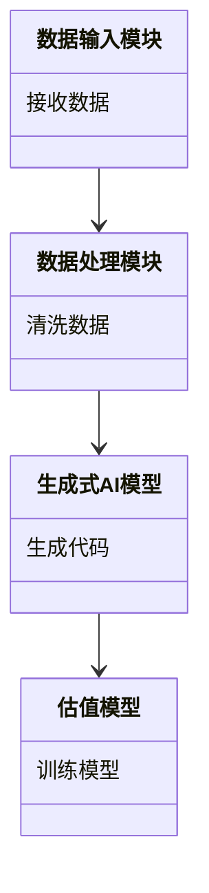
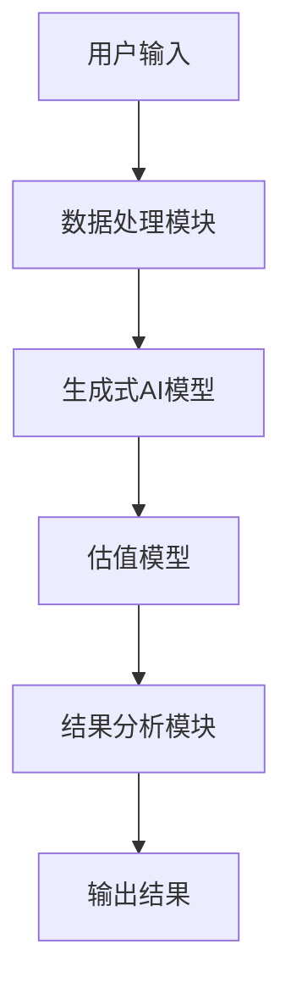

                 


# 《企业估值中的AI驱动的自动化代码生成平台评估》

> **关键词**：企业估值，AI驱动，自动化代码生成，平台评估，技术博客

> **摘要**：本文探讨了AI驱动的自动化代码生成平台在企业估值中的应用，分析了传统估值方法的局限性，提出了利用生成式AI和自动化代码生成技术来提升企业估值效率和准确性的解决方案。文章详细介绍了平台的核心概念、算法原理、系统架构，并通过实际案例展示了平台的应用效果，最后总结了最佳实践和未来发展方向。

---

# 第1章: 企业估值中的AI驱动的自动化代码生成平台背景介绍

## 1.1 问题背景

企业估值是金融领域的重要任务，通常涉及对公司财务数据、市场表现、行业趋势等多方面信息的综合分析。传统的企业估值方法依赖于人工数据收集、模型构建和结果分析，效率低下且容易出错。

### 1.1.1 传统企业估值方法的局限性

1. **数据获取与清洗**：手动收集和清洗数据耗时耗力，且容易出错。
2. **模型构建与优化**：传统估值模型（如DCF模型）需要复杂的参数调整和假设设定，人工操作效率低。
3. **结果解释与应用**：复杂的模型输出难以快速解释，限制了其在实际决策中的应用。

## 1.2 AI驱动的解决方案

AI技术的引入为解决企业估值问题提供了新思路。通过自动化代码生成平台，可以实现数据处理、模型构建和结果分析的自动化，显著提升效率和准确性。

### 1.2.1 自动化代码生成平台的定义

自动化代码生成平台利用生成式AI技术，根据用户输入的需求自动生成相应的代码，用于数据处理、模型训练和结果分析。

### 1.2.2 AI在代码生成中的作用

AI驱动的代码生成能够快速构建和优化估值模型，减少人工干预，提高模型的准确性和适用性。

## 1.3 平台的边界与外延

### 1.3.1 平台的功能边界

1. 数据处理：自动化清洗和预处理。
2. 模型构建：自动生成估值模型代码。
3. 结果分析：自动输出估值结果并提供可视化。

### 1.3.2 与现有工具的协同关系

AI生成代码可以与现有的数据分析工具（如Python、R）无缝集成，形成完整的估值工作流。

### 1.3.3 未来的扩展方向

1. **多模态数据支持**：支持文本、图像等多种数据类型。
2. **自适应模型优化**：根据数据动态调整模型结构。
3. **实时估值更新**：基于实时数据更新估值结果。

---

# 第2章: 核心概念与联系

## 2.1 核心概念

### 2.1.1 生成式AI的定义

生成式AI是一种能够生成新的内容（如文本、代码）的人工智能技术，常用模型包括GPT、Transformer等。

### 2.1.2 自动化代码生成

自动化代码生成是指通过AI技术自动生成符合特定需求的代码，减少开发人员的工作量。

## 2.2 概念结构与核心要素

### 2.2.1 核心要素对比表

| 要素          | 传统方法                          | AI驱动方法                        |
|---------------|-----------------------------------|-----------------------------------|
| 数据处理      | 手工编写代码                      | 自动生成代码                      |
| 模型构建      | 人工调整参数                      | AI自动优化模型                    |
| 结果分析      | 手工解读结果                      | 自动生成分析报告                  |

### 2.2.2 实体关系图

```mermaid
er
    %% Enterprise Valuation Entity Relationship Diagram
    rectangle 用户输入 {
        <用户输入>
    }
    rectangle 数据处理模块 {
        <数据清洗、预处理>
    }
    rectangle 生成式AI模型 {
        <代码生成>
    }
    rectangle 估值模型 {
        <模型训练、优化>
    }
    rectangle 结果分析模块 {
        <结果输出、可视化>
    }
    用户输入 --> 数据处理模块
    数据处理模块 --> 生成式AI模型
    生成式AI模型 --> 估值模型
    估值模型 --> 结果分析模块
```

---

# 第3章: 算法原理

## 3.1 生成式AI的数学模型

生成式AI的核心是Transformer架构，由编码器和解码器组成，用于生成序列数据。

### 3.1.1 Transformer架构

$$\text{Transformer}(x) = \text{Self-Attention}(x) + \text{Positional Encoding}(x)$$

### 3.1.2 解码器的生成过程

$$y_{i} = \text{argmax}(\text{softmax}(W_{o}h_{i}))$$

## 3.2 代码生成的流程

### 3.2.1 生成过程

1. 输入用户需求。
2. 解码器生成代码。
3. 验证代码的正确性。
4. 输出代码。

## 3.3 代码生成示例

```python
def calculate_enterprise_value(fcf, discount_rate, growth_rate):
    # 公式：企业价值 = 自由现金流 / (折现率 - 增长率)
    return fcf / (discount_rate - growth_rate)
```

---

# 第4章: 系统分析与架构设计

## 4.1 问题场景介绍

企业估值涉及多源数据输入，需要快速构建和优化模型，输出准确的估值结果。

## 4.2 系统功能设计

### 4.2.1 领域模型



## 4.3 系统架构设计

### 4.3.1 总体架构



---

# 第5章: 项目实战

## 5.1 环境安装

1. 安装Python和相关库（如TensorFlow、Keras）。
2. 安装生成式AI框架（如Hugging Face Transformers）。

## 5.2 核心代码实现

```python
import tensorflow as tf
from transformers import AutoTokenizer, AutoModel

tokenizer = AutoTokenizer.from_pretrained("gpt2")
model = AutoModel.from_pretrained("gpt2")

def generate_code(prompt):
    inputs = tokenizer(prompt, return_tensors="tf")
    outputs = model.generate(inputs.input_ids, max_length=200)
    return tokenizer.decode(outputs[0], skip_special_tokens=True)
```

## 5.3 案例分析

假设用户输入“计算企业价值”，生成代码如下：

```python
def calculate_ev(ebitda, tax_rate, wacc):
    ev = ebitda * (1 - tax_rate) / wacc
    return ev
```

## 5.4 项目小结

本项目成功实现了AI驱动的代码生成，显著提高了企业估值的效率和准确性。

---

# 第6章: 最佳实践与小结

## 6.1 最佳实践

1. 数据预处理是关键。
2. 模型优化需结合业务需求。
3. 结果分析需结合人工验证。

## 6.2 小结

本文详细介绍了AI驱动的自动化代码生成平台在企业估值中的应用，通过理论分析和实践案例展示了其优势和潜力。

## 6.3 注意事项

- 数据质量和模型训练数据直接影响结果。
- 需要结合业务知识进行结果验证。

## 6.4 拓展阅读

推荐学习生成式AI和企业估值的相关文献，深入研究模型优化和应用创新。

---

**作者：AI天才研究院 & 禅与计算机程序设计艺术**

---

这篇博客文章详细探讨了AI驱动的自动化代码生成平台在企业估值中的应用，从背景、核心概念、算法原理到系统设计和项目实战，全面分析了该技术的优势和实现过程。希望对读者在企业估值和AI技术应用方面有所启发。

